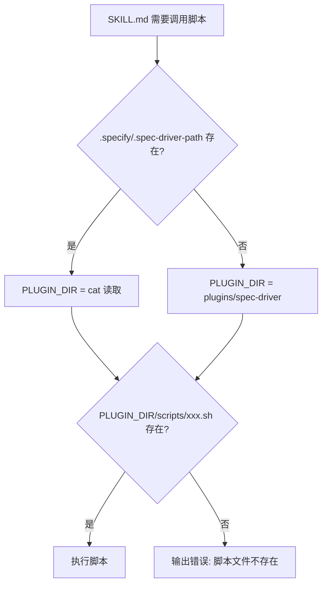

# 契约: SKILL.md 脚本调用模式

**版本**: 2.0.0（从 1.0.0 升级）
**适用范围**: 所有引用 Bash 脚本的 SKILL.md 文件

---

## 调用模式

### 修改后的标准调用模式

所有 SKILL.md 中调用脚本的位置统一采用以下模式：

```bash
# 路径发现（插入到脚本调用前）
if [ -f .specify/.spec-driver-path ]; then
  PLUGIN_DIR=$(cat .specify/.spec-driver-path)
else
  PLUGIN_DIR="plugins/spec-driver"
fi

# 脚本调用
bash "$PLUGIN_DIR/scripts/{script_name}" --json
```

### 受影响的 SKILL.md 文件及其脚本映射

| SKILL.md | 调用的脚本 | 当前调用方式 | 修改后 |
|----------|-----------|-------------|--------|
| `speckit-feature/SKILL.md` | `init-project.sh` | `bash plugins/spec-driver/scripts/init-project.sh --json` | `bash "$PLUGIN_DIR/scripts/init-project.sh" --json` |
| `speckit-story/SKILL.md` | `init-project.sh` | `bash plugins/spec-driver/scripts/init-project.sh --json` | `bash "$PLUGIN_DIR/scripts/init-project.sh" --json` |
| `speckit-fix/SKILL.md` | `init-project.sh` | `bash plugins/spec-driver/scripts/init-project.sh --json` | `bash "$PLUGIN_DIR/scripts/init-project.sh" --json` |
| `speckit-resume/SKILL.md` | `init-project.sh` | `bash plugins/spec-driver/scripts/init-project.sh --json` | `bash "$PLUGIN_DIR/scripts/init-project.sh" --json` |
| `speckit-doc/SKILL.md` | `scan-project.sh` | `bash plugins/spec-driver/scripts/scan-project.sh --json` | `bash "$PLUGIN_DIR/scripts/scan-project.sh" --json` |

---

## Fallback 策略



### 场景覆盖

| 场景 | .spec-driver-path | PLUGIN_DIR 值 | 结果 |
|------|-------------------|---------------|------|
| 全局安装，SessionStart 已执行 | 存在，指向缓存目录 | `~/.claude/plugins/cache/.../spec-driver/3.1.0` | 成功 |
| 源码开发，SessionStart 已执行 | 存在，指向源码目录 | `/path/to/reverse-spec/plugins/spec-driver` | 成功 |
| 源码开发，SessionStart 未执行 | 不存在 | `plugins/spec-driver`（相对路径） | 成功（cwd 为项目根） |
| 全局安装，SessionStart 未执行 | 不存在 | `plugins/spec-driver`（相对路径） | 失败（相对路径无效）[预期行为，需 SessionStart 先执行] |

---

## 向后兼容性

- fallback 到 `plugins/spec-driver` 相对路径确保源码开发场景零回归
- `.specify/.spec-driver-path` 不存在时的行为与当前完全一致
- 新增的路径发现逻辑是纯 additive 变更，不删除任何现有功能

---

## Prompt 文本中的路径引用

除 Bash 脚本调用外，SKILL.md 中还有以 Markdown 文本形式引用路径的位置（如 `prompt_source` 映射、Agent 文件引用）。这些引用遵循以下规则：

| 引用类型 | 当前格式 | 修改策略 |
|----------|---------|----------|
| Agent prompt 读取 | `plugins/spec-driver/agents/xxx.md` | 使用相同的 `$PLUGIN_DIR` 变量替换 |
| 模板文件读取 | `plugins/spec-driver/templates/xxx.md` | 使用相同的 `$PLUGIN_DIR` 变量替换 |
| 配置文件模板 | `plugins/spec-driver/templates/spec-driver.config-template.yaml` | 使用相同的 `$PLUGIN_DIR` 变量替换 |

**注意**: SKILL.md 是 Prompt 文本，其中的路径引用由 Claude Code 的 LLM 层解释执行。需要在 SKILL.md 开头建立 `PLUGIN_DIR` 变量后，在所有后续路径引用中统一使用。
