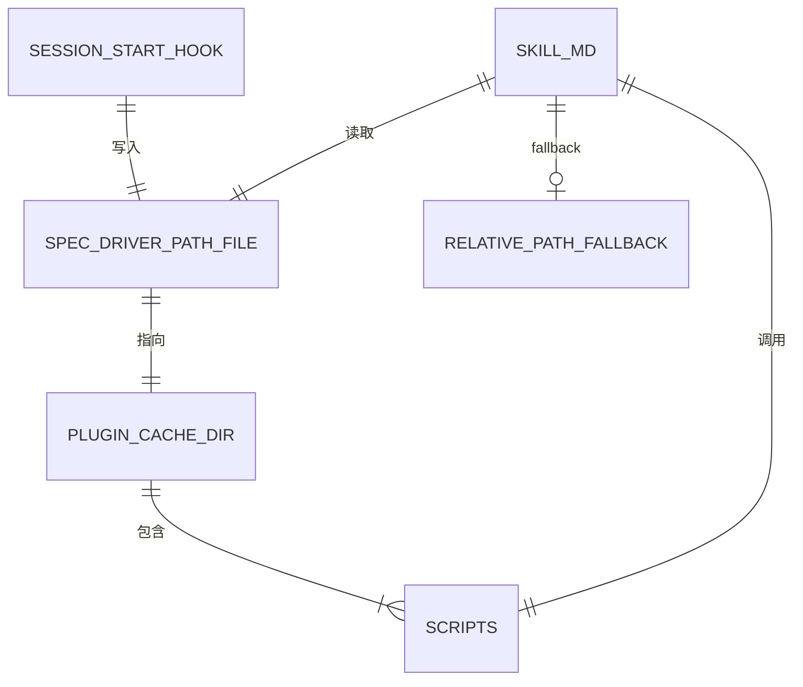
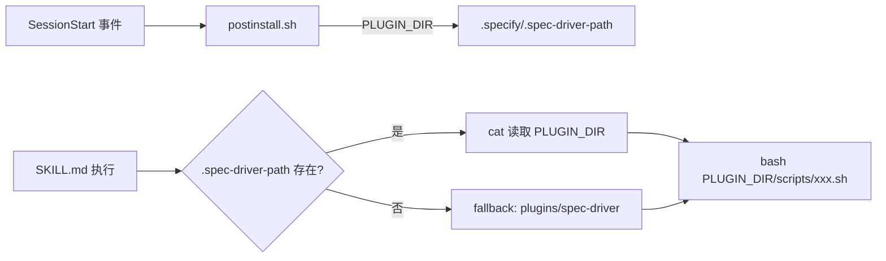

# 数据模型: 插件脚本路径发现机制修复

**Feature Branch**: `020-fix-plugin-script-path`
**Created**: 2026-03-02

---

## 实体定义

### 1. 插件路径文件 (`.specify/.spec-driver-path`)

**新增实体**。由 SessionStart Hook 自动创建和维护，被 SKILL.md 脚本引用逻辑读取。

| 属性 | 类型 | 约束 | 说明 |
|------|------|------|------|
| 内容 | 纯文本字符串 | 单行，无尾部换行符 | 插件根目录的绝对路径 |
| 文件路径 | 文件系统路径 | 固定为 `{PROJECT_ROOT}/.specify/.spec-driver-path` | 相对于用户项目根 |
| 生命周期 | 持久化 | 每次 SessionStart 幂等覆盖 | 随会话启动自动更新 |

**内容格式示例**:

```text
/Users/xxx/.claude/plugins/cache/cc-plugin-market/spec-driver/3.1.0
```

或源码开发场景：

```text
/Users/xxx/projects/reverse-spec/plugins/spec-driver
```

**约束**:
- 必须为绝对路径
- 不含尾部换行符（使用 `echo -n` 写入）
- 不含额外元数据（版本、时间戳等从路径本身解析）
- 指向的目录必须包含 `scripts/` 子目录

---

### 2. 安装标记文件 (`~/.claude/.spec-driver-installed`)

**已有实体**，无变更。用于控制首次安装提示的一次性显示。

| 属性 | 类型 | 约束 | 说明 |
|------|------|------|------|
| 文件路径 | 文件系统路径 | 固定为 `$HOME/.claude/.spec-driver-installed` | 用户级，跨项目共享 |
| 内容 | 空文件 | 无内容 | 仅通过文件存在性判断 |
| 生命周期 | 持久化 | 首次安装后创建，不自动清理 | 跨会话保持 |

---

### 3. 插件缓存目录结构

**已有实体**，无变更。Plugin Marketplace 安装后的标准目录结构。

```text
~/.claude/plugins/cache/{marketplace}/{plugin-name}/{version}/
├── .claude-plugin/
│   └── plugin.json
├── hooks/
│   └── hooks.json
├── skills/
│   ├── speckit-feature/SKILL.md
│   ├── speckit-story/SKILL.md
│   ├── speckit-fix/SKILL.md
│   ├── speckit-resume/SKILL.md
│   ├── speckit-sync/SKILL.md
│   └── speckit-doc/SKILL.md
├── scripts/
│   ├── postinstall.sh
│   ├── init-project.sh
│   ├── scan-project.sh
│   └── codex-skills.sh
├── agents/
├── templates/
└── README.md
```

---

### 4. 项目级 .specify 目录结构（相关部分）

**已有实体**，新增 `.spec-driver-path` 文件。

```text
{PROJECT_ROOT}/
└── .specify/
    ├── .spec-driver-path         # [新增] 插件路径指针
    ├── memory/
    │   └── constitution.md
    ├── templates/
    │   └── ...
    └── scripts/
        └── bash/
            └── create-new-feature.sh
```

---

## 实体关系



---

## 数据流


