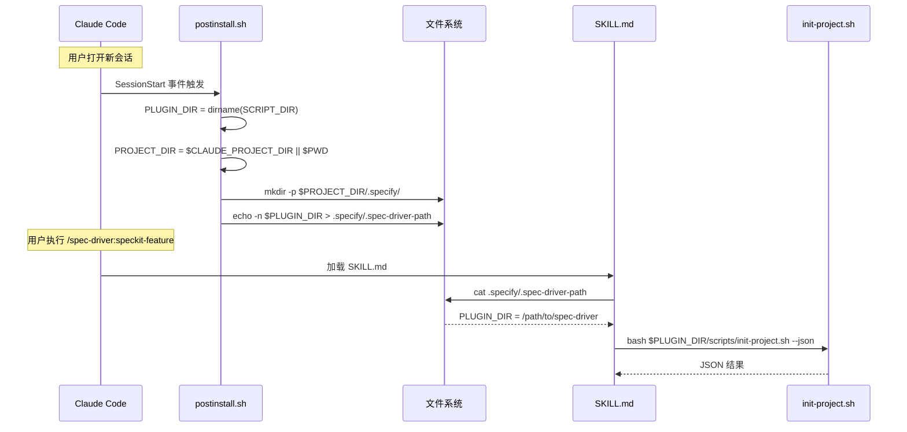
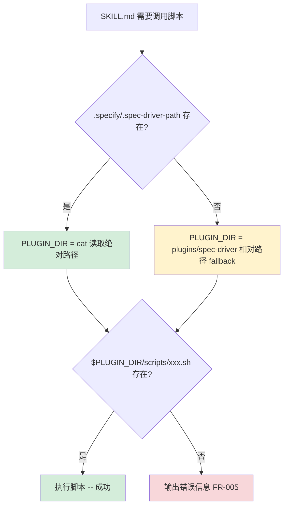
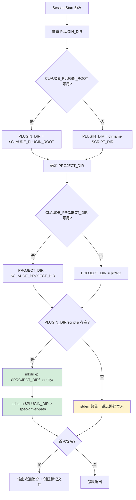

# Implementation Plan: 插件脚本路径发现机制修复

**Branch**: `020-fix-plugin-script-path` | **Date**: 2026-03-02 | **Spec**: [spec.md](./spec.md)
**Input**: Feature specification from `specs/020-fix-plugin-script-path/spec.md`

## Summary

修复 Spec Driver 插件在全局安装（通过 Plugin Marketplace）场景下脚本路径发现失败的问题。核心方案为：(1) 扩展 `postinstall.sh`，在每次 SessionStart 时将插件绝对路径写入项目级路径指针文件 `.specify/.spec-driver-path`；(2) 改写所有 SKILL.md 中的脚本引用，从硬编码相对路径改为"读取路径指针 + 相对路径 fallback"的双路径模式；(3) 修复 `codex-skills.sh` 和 `hooks.json` 中的路径/格式问题。

## Technical Context

**Language/Version**: Bash 5.x（脚本）、Markdown（Skill prompt 和模板）
**Primary Dependencies**: 无运行时依赖。全部由 Markdown prompt、Bash 脚本和静态文本文件构成，运行在 Claude Code 沙箱中
**Storage**: 文件系统（`.specify/.spec-driver-path` 路径指针文件，项目级）
**Testing**: 手动验证（全局安装 + 源码开发两种场景）
**Target Platform**: Claude Code 沙箱 + macOS/Linux 终端
**Project Type**: Plugin（Markdown prompt + Bash 脚本）
**Performance Goals**: SessionStart Hook 执行完成时间不超过 2 秒（SC-003）
**Constraints**: 零运行时依赖（Constitution 原则 IX）、向后兼容（Constitution 原则 XII）
**Scale/Scope**: 9 个文件修改，0 个新文件创建（`.spec-driver-path` 由脚本运行时生成）

## Constitution Check

*GATE: Must pass before Phase 0 research. Re-check after Phase 1 design.*

### 项目级原则

| 原则 | 适用性 | 评估 | 说明 |
|------|--------|------|------|
| I. 双语文档规范 | 适用 | PASS | 设计文档中文正文 + 英文代码标识符；SKILL.md 和 Bash 脚本中注释使用中文 |
| II. Spec-Driven Development | 适用 | PASS | 通过标准 spec → plan → tasks → implement → verify 流程执行 |
| III. 诚实标注不确定性 | 适用 | PASS | 关键假设（SessionStart cwd、环境变量可用性）已在 research.md 中验证并标注结论 |

### Plugin: spec-driver 约束

| 原则 | 适用性 | 评估 | 说明 |
|------|--------|------|------|
| VIII. Prompt 工程优先 | 适用 | PASS | SKILL.md 中路径发现逻辑通过 Bash 内联代码片段实现，不引入编程逻辑依赖 |
| IX. 零运行时依赖 | 适用 | PASS | 方案仅使用 `cat`、`echo`、`mkdir` 等 Bash 内置/标准命令，不引入 npm 包或外部运行时 |
| X. 质量门控不可绕过 | 适用 | PASS | 不涉及编排流程变更，仅修复脚本路径发现的基础设施 |
| XI. 验证铁律 | 适用 | PASS | 验证阶段将实际在全局安装和源码开发两种场景中执行 Skill 命令 |
| XII. 向后兼容 | **重点检查** | PASS | 通过 fallback 到 `plugins/spec-driver` 相对路径确保源码开发场景零回归 |

### Plugin: reverse-spec 约束

| 原则 | 适用性 | 评估 | 说明 |
|------|--------|------|------|
| IV. AST 精确性优先 | 不适用 | N/A | 本功能不涉及 AST 分析 |
| V. 混合分析流水线 | 不适用 | N/A | 本功能不涉及代码分析 |
| VI. 只读安全性 | 不适用 | N/A | 本功能修改的是插件自身文件，非目标源代码 |
| VII. 纯 Node.js 生态 | 不适用 | N/A | 本功能属于 spec-driver 插件（Bash + Markdown） |

**Constitution Check 结果: PASS（无 VIOLATION）**

---

## 关键假设验证结论

### 假设 1: SessionStart Hook 的工作目录

**spec.md 原假设**: "SessionStart 事件中的工作目录（cwd）为插件安装目录"

**验证结论: 假设需要修正。**

- Hook **输入 JSON** 中的 `cwd` 字段指向**用户项目路径**，而非插件安装目录
- Claude Code 通过 `${CLAUDE_PLUGIN_ROOT}` 环境变量提供插件安装路径
- `hooks.json` 中的 `./scripts/postinstall.sh` 相对路径不可靠，应改用 `${CLAUDE_PLUGIN_ROOT}/scripts/postinstall.sh`

**对方案的影响**:
- `postinstall.sh` 通过 `SCRIPT_DIR` + `dirname` 或 `${CLAUDE_PLUGIN_ROOT}` 获取 PLUGIN_DIR，而非依赖 cwd
- `PROJECT_DIR` 通过 `${CLAUDE_PROJECT_DIR}` 环境变量或 `$(pwd)` 获取
- 方案设计**不受此修正影响**——原方案已使用 `SCRIPT_DIR` 推算 `PLUGIN_DIR`，与实际行为一致

### 假设 2: 用户项目路径的传递机制

**spec.md 原假设**: "通过环境变量（如 `$CLAUDE_PROJECT_DIR`）或等价机制将用户项目根目录传递给 Hook 脚本"

**验证结论: 假设成立，有多重保障。**

- `$CLAUDE_PROJECT_DIR`: Claude Code 会设置此环境变量，指向用户项目根目录
- stdin JSON 的 `cwd` 字段: 包含项目路径（但解析需要 JSON parser，受零依赖约束）
- `$(pwd)`: SessionStart 时工作目录通常为项目根（作为最终 fallback）

**采用策略**: `PROJECT_DIR="${CLAUDE_PROJECT_DIR:-$(pwd)}"`，简单可靠，零依赖。

---

## Project Structure

### Documentation (this feature)

```text
specs/020-fix-plugin-script-path/
├── spec.md              # 需求规范
├── plan.md              # 本文件
├── research.md          # Phase 0 技术决策研究
├── data-model.md        # 数据模型
├── quickstart.md        # 快速上手指南
├── contracts/
│   ├── postinstall-contract.md      # postinstall.sh 扩展契约
│   ├── skill-script-invocation.md   # SKILL.md 脚本调用模式契约
│   └── hooks-json-contract.md       # hooks.json 格式升级契约
└── checklists/
    └── requirements.md  # 质量检查表（前序制品）
```

### Source Code (affected files)

```text
plugins/spec-driver/
├── hooks/
│   └── hooks.json                    # [修改] 格式升级 + ${CLAUDE_PLUGIN_ROOT}
├── scripts/
│   ├── postinstall.sh                # [修改] 扩展路径写入逻辑
│   ├── codex-skills.sh               # [修改] REPO_ROOT → PLUGIN_DIR
│   ├── init-project.sh               # [不变]
│   └── scan-project.sh               # [不变]
├── skills/
│   ├── speckit-feature/SKILL.md      # [修改] 添加 PLUGIN_DIR 路径发现
│   ├── speckit-story/SKILL.md        # [修改] 同上
│   ├── speckit-fix/SKILL.md          # [修改] 同上
│   ├── speckit-resume/SKILL.md       # [修改] 同上
│   ├── speckit-sync/SKILL.md         # [不变] 不引用脚本
│   └── speckit-doc/SKILL.md          # [修改] 添加 PLUGIN_DIR 路径发现
├── agents/                           # [不变]
└── templates/                        # [不变]

README.md                             # [修改] 更新 codex-skills.sh 调用示例
```

**Structure Decision**: 不新增任何文件或目录。所有变更在现有文件结构内完成。`.specify/.spec-driver-path` 由脚本运行时动态生成于用户项目中。

---

## Architecture

### 路径发现机制概览



### 路径发现 Fallback 层级



### postinstall.sh 扩展流程



---

## 变更详情

### 变更 1: `postinstall.sh` 功能扩展

**文件**: `plugins/spec-driver/scripts/postinstall.sh`
**变更类型**: 功能扩展（在现有首次安装提示前插入路径写入逻辑）

**新增逻辑**:

```bash
# 在 main() 函数开头插入
SCRIPT_DIR="$(cd "$(dirname "${BASH_SOURCE[0]}")" && pwd)"

# 推算 PLUGIN_DIR
if [[ -n "${CLAUDE_PLUGIN_ROOT:-}" ]]; then
  PLUGIN_DIR="$CLAUDE_PLUGIN_ROOT"
else
  PLUGIN_DIR="$(dirname "$SCRIPT_DIR")"
fi

# 确定项目目录
PROJECT_DIR="${CLAUDE_PROJECT_DIR:-$(pwd)}"

# 验证 PLUGIN_DIR 有效性
if [[ ! -d "$PLUGIN_DIR/scripts" ]]; then
  echo "[警告] spec-driver 插件目录无效: $PLUGIN_DIR，跳过路径写入" >&2
else
  # 确保 .specify/ 目录存在
  mkdir -p "$PROJECT_DIR/.specify" 2>/dev/null || true

  # 幂等写入路径文件
  if [[ -d "$PROJECT_DIR/.specify" ]]; then
    echo -n "$PLUGIN_DIR" > "$PROJECT_DIR/.specify/.spec-driver-path"
  else
    echo "[警告] 无法创建 $PROJECT_DIR/.specify/ 目录，跳过路径写入" >&2
  fi
fi
```

**向后兼容**: 新增逻辑在首次安装提示之前执行。即使路径写入失败（通过 `|| true` 和条件判断），后续的安装提示逻辑不受影响。

---

### 变更 2: `hooks.json` 格式升级

**文件**: `plugins/spec-driver/hooks/hooks.json`
**变更类型**: 格式升级 + 路径修复

**当前**:
```json
{
  "hooks": [
    {
      "event": "SessionStart",
      "commands": [
        { "type": "shell", "command": "./scripts/postinstall.sh" }
      ]
    }
  ]
}
```

**修改后**:
```json
{
  "hooks": {
    "SessionStart": [
      {
        "matcher": "",
        "hooks": [
          {
            "type": "command",
            "command": "${CLAUDE_PLUGIN_ROOT}/scripts/postinstall.sh"
          }
        ]
      }
    ]
  }
}
```

---

### 变更 3: `codex-skills.sh` 路径修复

**文件**: `plugins/spec-driver/scripts/codex-skills.sh`
**变更类型**: Bug 修复

**当前** (第 9 行):
```bash
REPO_ROOT="$(cd "$SCRIPT_DIR/../../.." && pwd)"
```

**修改后**:
```bash
PLUGIN_DIR="$(cd "$SCRIPT_DIR/.." && pwd)"
```

后续所有引用 `$REPO_ROOT/plugins/spec-driver/` 的路径替换为 `$PLUGIN_DIR/`。

**影响范围**: `install_all()` 函数中的 `source_feature`、`source_story` 等变量路径，以及 `ensure_source_exists()` 校验路径。

---

### 变更 4: SKILL.md 路径发现逻辑（5 个文件）

**受影响文件**:
- `speckit-feature/SKILL.md`
- `speckit-story/SKILL.md`
- `speckit-fix/SKILL.md`
- `speckit-resume/SKILL.md`
- `speckit-doc/SKILL.md`

**变更模式**: 在每个 SKILL.md 的"初始化阶段"章节开头（脚本调用之前）插入路径发现逻辑块。

**对于引用 `init-project.sh` 的 4 个 SKILL.md (feature/story/fix/resume)**:

将：
```text
运行 `bash plugins/spec-driver/scripts/init-project.sh --json`
```

改为：
```text
### 0. 插件路径发现

在执行任何脚本前，确定插件根目录：

```bash
if [ -f .specify/.spec-driver-path ]; then
  PLUGIN_DIR=$(cat .specify/.spec-driver-path)
else
  PLUGIN_DIR="plugins/spec-driver"
fi
```

后续所有对 `plugins/spec-driver/` 的引用统一替换为 `$PLUGIN_DIR/`。

### 1. 项目环境检查

运行 `bash "$PLUGIN_DIR/scripts/init-project.sh" --json`
```

**对于 `speckit-doc/SKILL.md`（引用 `scan-project.sh`）**:

同样插入路径发现逻辑块，并将 `bash plugins/spec-driver/scripts/scan-project.sh --json` 替换为 `bash "$PLUGIN_DIR/scripts/scan-project.sh" --json`。

**SKILL.md 中其他路径引用的统一替换**:

每个 SKILL.md 中还有以下路径需要统一使用 `$PLUGIN_DIR`:
- Agent prompt 读取: `plugins/spec-driver/agents/*.md` → `$PLUGIN_DIR/agents/*.md`
- 模板文件读取: `plugins/spec-driver/templates/*.md` → `$PLUGIN_DIR/templates/*.md`
- 配置模板引用: `plugins/spec-driver/templates/spec-driver.config-template.yaml` → `$PLUGIN_DIR/templates/spec-driver.config-template.yaml`

---

### 变更 5: `README.md` 文档更新

**文件**: `README.md`（项目根目录）
**变更类型**: 文档更新

将 `codex-skills.sh` 的调用示例从固定相对路径更新为说明全局安装场景的使用方式。

---

## FR-SC 追溯矩阵

| 功能需求 | 实现变更 | 验证标准 |
|---------|---------|---------|
| FR-001: SessionStart 写入路径文件 | 变更 1 (postinstall.sh) + 变更 2 (hooks.json) | SC-001, SC-003, SC-004 |
| FR-002: SKILL.md 使用路径指针调用脚本 | 变更 4 (SKILL.md x 5) | SC-001 |
| FR-003: 保留相对路径 fallback | 变更 4 (SKILL.md fallback 逻辑) | SC-002 |
| FR-004: 幂等写入 | 变更 1 (echo -n 覆盖写入) | SC-004 |
| FR-005: 错误信息明确 | 变更 1 (stderr 警告) + 变更 4 (脚本不存在检查) | SC-001 |
| FR-006: SessionStart 执行项目初始化 | 变更 1 (mkdir -p .specify/) | SC-001, SC-003 |

---

## Complexity Tracking

| 决策点 | 选择 | 更简单的替代方案 | 拒绝理由 |
|--------|------|-----------------|---------|
| 路径写入时机选择 SessionStart Hook | SessionStart 每次触发写入 | 仅首次安装写入（通过标记文件控制） | 版本升级后需自动更新路径（SC-004），首次写入无法满足 |
| 双路径 fallback 机制 | `.spec-driver-path` + 相对路径 | 仅使用 `.spec-driver-path`（无 fallback） | 源码开发场景可能无 SessionStart（直接手动调用），需相对路径兜底（SC-002） |
| hooks.json 格式同时升级 | 旧格式 → 新格式 | 仅修改命令路径，保留旧格式 | reverse-spec 已用新格式，保持一致性降低维护成本；旧格式未来可能弃用 |
| PLUGIN_DIR 推算双重来源 | CLAUDE_PLUGIN_ROOT + SCRIPT_DIR fallback | 仅使用 SCRIPT_DIR | CLAUDE_PLUGIN_ROOT 是官方机制，SCRIPT_DIR 作为 fallback 增强健壮性 |
