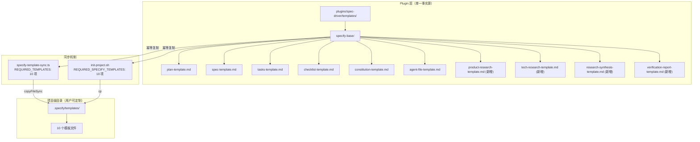
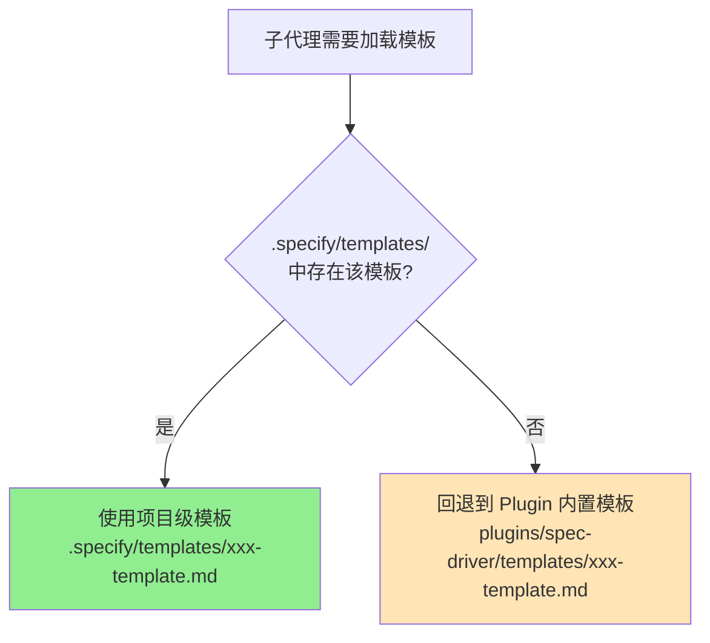

# Implementation Plan: 调研模板纳入 specify-base 同步体系

**Branch**: `021-add-research-templates` | **Date**: 2026-03-02 | **Spec**: [spec.md](./spec.md)
**Input**: Feature specification from `specs/021-add-research-templates/spec.md`

## Summary

将 4 个调研模板（`product-research-template.md`、`tech-research-template.md`、`research-synthesis-template.md`、`verification-report-template.md`）纳入 specify-base 同步体系，使用户可通过项目级 `.specify/templates/` 目录定制调研报告格式。技术方案涉及三类变更：(1) 在 `specify-base/` 新增 4 个基准模板文件；(2) 在 TypeScript 同步器和 Bash 初始化脚本中扩展模板列表；(3) 在子代理 Markdown prompt 和编排器中添加"项目级优先、plugin 回退"的条件加载指令。

## Technical Context

**Language/Version**: TypeScript 5.7.3（`specify-template-sync.ts`）、Bash 5.x（`init-project.sh`）、Markdown（子代理 prompt）
**Primary Dependencies**: Node.js 内置模块（`fs`, `path`, `os`, `url`）——无新增依赖
**Storage**: 文件系统（`.specify/templates/` 目录写入、`plugins/spec-driver/templates/specify-base/` 新增文件）
**Testing**: 手动验证（模板同步幂等性 + 子代理条件加载）
**Target Platform**: Claude Code 沙箱 / 本地 Node.js LTS (>=20.x)
**Project Type**: Plugin（spec-driver）+ 核心库（src/utils/）
**Constraints**: 零新增运行时依赖；向后兼容——未配置项目级模板时行为不变

## Constitution Check

*GATE: Must pass before Phase 0 research. Re-check after Phase 1 design.*

| 原则 | 适用性 | 评估 | 说明 |
|------|--------|------|------|
| I. 双语文档规范 | 适用 | PASS | 所有新增/修改的 Markdown 文件遵循中文散文 + 英文标识符规范 |
| II. Spec-Driven Development | 适用 | PASS | 本功能通过完整的 spec → plan → tasks → implement → verify 流程执行 |
| III. 诚实标注不确定性 | 低适用 | PASS | 无推断性内容 |
| IV. AST 精确性优先 | 不适用 | N/A | 本功能不涉及 AST 分析 |
| V. 混合分析流水线 | 不适用 | N/A | 本功能不涉及代码分析 |
| VI. 只读安全性 | 不适用 | N/A | 本功能不涉及 reverse-spec 工具 |
| VII. 纯 Node.js 生态 | 适用 | PASS | TypeScript 变更仅使用 Node.js 内置模块，无新增依赖 |
| VIII. Prompt 工程优先 | 适用 | PASS | 子代理行为变更通过修改 Markdown prompt 文本实现，不引入运行时代码 |
| IX. 零运行时依赖 | 适用 | PASS | spec-driver 插件侧的变更仅涉及 Markdown 和 Bash，无 npm 依赖 |
| X. 质量门控不可绕过 | 低适用 | PASS | 不影响门控机制 |
| XI. 验证铁律 | 低适用 | PASS | 不影响验证流程 |
| XII. 向后兼容 | **关键** | PASS | 未配置项目级模板时，子代理回退到 plugin 内置路径，行为与变更前完全一致 |

**结论**: 所有适用原则均 PASS，无 VIOLATION，计划有效。

## Project Structure

### Documentation (this feature)

```text
specs/021-add-research-templates/
├── spec.md              # 需求规范（已完成）
├── plan.md              # 本文件
├── quickstart.md        # 快速上手指南
└── tasks.md             # 任务分解（由 /speckit.tasks 生成）
```

### Source Code (repository root)

```text
# 变更文件清单

# 类型 A: 新增文件（4 个模板复制到 specify-base）
plugins/spec-driver/templates/specify-base/
├── plan-template.md                    # (已有)
├── spec-template.md                    # (已有)
├── tasks-template.md                   # (已有)
├── checklist-template.md               # (已有)
├── constitution-template.md            # (已有)
├── agent-file-template.md              # (已有)
├── product-research-template.md        # (新增) 从 templates/ 根复制
├── tech-research-template.md           # (新增) 从 templates/ 根复制
├── research-synthesis-template.md      # (新增) 从 templates/ 根复制
└── verification-report-template.md     # (新增) 从 templates/ 根复制

# 类型 B: TypeScript 源代码修改（1 文件）
src/utils/specify-template-sync.ts      # 修改 REQUIRED_TEMPLATES 常量

# 类型 C: Bash 脚本修改（1 文件）
plugins/spec-driver/scripts/init-project.sh  # 修改 REQUIRED_SPECIFY_TEMPLATES 数组

# 类型 D: Markdown prompt 修改（4 文件）
plugins/spec-driver/agents/product-research.md  # 添加条件模板加载指令
plugins/spec-driver/agents/tech-research.md     # 添加条件模板加载指令
plugins/spec-driver/agents/verify.md            # 添加条件模板加载指令
plugins/spec-driver/skills/speckit-feature/SKILL.md  # Phase 1c 添加条件模板加载
```

**Structure Decision**: 本功能不引入新的目录结构，仅在现有目录中新增文件和修改现有文件。变更分布在 plugin 层（Markdown/Bash）和核心库层（TypeScript），共计 10 个文件（4 个新增 + 6 个修改）。

## Architecture

### 模板同步链路（变更后）



### 子代理模板加载优先级（变更后）



### 变更详细设计

#### 变更 1: 新增 specify-base 基准模板（FR-002）

将以下 4 个文件从 `plugins/spec-driver/templates/` 复制到 `plugins/spec-driver/templates/specify-base/`：

| 源文件 | 目标文件 |
|--------|----------|
| `templates/product-research-template.md` | `templates/specify-base/product-research-template.md` |
| `templates/tech-research-template.md` | `templates/specify-base/tech-research-template.md` |
| `templates/research-synthesis-template.md` | `templates/specify-base/research-synthesis-template.md` |
| `templates/verification-report-template.md` | `templates/specify-base/verification-report-template.md` |

**注意**: 直接使用文件复制（`cp`），确保 specify-base 中的基准版本与 plugin 根目录下的模板内容完全一致。plugin 根目录下的原文件保留不删除，作为子代理的最终回退源。

#### 变更 2: 扩展 TypeScript REQUIRED_TEMPLATES（FR-001, FR-009）

**文件**: `src/utils/specify-template-sync.ts`

**当前代码**（第 10-17 行）:

```typescript
const REQUIRED_TEMPLATES = [
  'plan-template.md',
  'spec-template.md',
  'tasks-template.md',
  'checklist-template.md',
  'constitution-template.md',
  'agent-file-template.md',
] as const;
```

**修改为**:

```typescript
const REQUIRED_TEMPLATES = [
  'plan-template.md',
  'spec-template.md',
  'tasks-template.md',
  'checklist-template.md',
  'constitution-template.md',
  'agent-file-template.md',
  // 调研模板（FR-001: 纳入同步体系）
  'product-research-template.md',
  'tech-research-template.md',
  'research-synthesis-template.md',
  'verification-report-template.md',
] as const;
```

**影响分析**: `ensureSpecifyTemplates()` 函数的循环逻辑不需要修改，它会自动遍历扩展后的数组。`EnsureSpecifyTemplatesResult` 接口也不需要修改，`copied` 和 `missing` 数组会自然包含新增模板的同步状态（FR-009）。

#### 变更 3: 扩展 Bash REQUIRED_SPECIFY_TEMPLATES（FR-001）

**文件**: `plugins/spec-driver/scripts/init-project.sh`

**当前代码**（第 46-53 行）:

```bash
REQUIRED_SPECIFY_TEMPLATES=(
  "plan-template.md"
  "spec-template.md"
  "tasks-template.md"
  "checklist-template.md"
  "constitution-template.md"
  "agent-file-template.md"
)
```

**修改为**:

```bash
REQUIRED_SPECIFY_TEMPLATES=(
  "plan-template.md"
  "spec-template.md"
  "tasks-template.md"
  "checklist-template.md"
  "constitution-template.md"
  "agent-file-template.md"
  # 调研模板（纳入同步体系）
  "product-research-template.md"
  "tech-research-template.md"
  "research-synthesis-template.md"
  "verification-report-template.md"
)
```

**影响分析**: `sync_specify_templates()` 函数的循环逻辑不需要修改，与 TypeScript 侧一致。

#### 变更 4: 修改 product-research 子代理 prompt（FR-004, FR-008）

**文件**: `plugins/spec-driver/agents/product-research.md`

**当前代码**（第 10 行）:

```markdown
- 使用模板：`plugins/spec-driver/templates/product-research-template.md`
```

**修改为**:

```markdown
- 使用模板：优先读取 `.specify/templates/product-research-template.md`（项目级），若不存在则回退到 `plugins/spec-driver/templates/product-research-template.md`（plugin 内置）
```

同时在"执行流程"的第 6 步"生成报告"之前，新增模板加载步骤说明：

```markdown
5.5 **加载报告模板**
   - 检查 `.specify/templates/product-research-template.md` 是否存在
   - 如存在，读取项目级模板作为报告结构模板
   - 如不存在，读取 `plugins/spec-driver/templates/product-research-template.md` 作为报告结构模板
```

#### 变更 5: 修改 tech-research 子代理 prompt（FR-005, FR-008）

**文件**: `plugins/spec-driver/agents/tech-research.md`

**当前代码**（第 11 行）:

```markdown
- 使用模板：`plugins/spec-driver/templates/tech-research-template.md`
```

**修改为**:

```markdown
- 使用模板：优先读取 `.specify/templates/tech-research-template.md`（项目级），若不存在则回退到 `plugins/spec-driver/templates/tech-research-template.md`（plugin 内置）
```

同时在"执行流程"的第 7 步"生成报告"之前，新增模板加载步骤说明：

```markdown
6.5 **加载报告模板**
   - 检查 `.specify/templates/tech-research-template.md` 是否存在
   - 如存在，读取项目级模板作为报告结构模板
   - 如不存在，读取 `plugins/spec-driver/templates/tech-research-template.md` 作为报告结构模板
```

#### 变更 6: 修改 verify 子代理 prompt（FR-007, FR-008）

**文件**: `plugins/spec-driver/agents/verify.md`

**当前代码**（第 14 行）:

```markdown
- 使用模板：`plugins/spec-driver/templates/verification-report-template.md`
```

**修改为**:

```markdown
- 使用模板：优先读取 `.specify/templates/verification-report-template.md`（项目级），若不存在则回退到 `plugins/spec-driver/templates/verification-report-template.md`（plugin 内置）
```

同时在"执行流程"的第 7 步"生成验证报告"处追加条件加载说明：

```markdown
7. **生成验证报告**
   - 确保 `{feature_dir}/verification/` 目录存在
   - **加载报告模板**: 检查 `.specify/templates/verification-report-template.md` 是否存在，如存在则使用项目级模板，否则使用 `plugins/spec-driver/templates/verification-report-template.md`
   - 按模板写入 `{feature_dir}/verification/verification-report.md`
```

#### 变更 7: 修改编排器 Phase 1c 模板引用（FR-006, FR-008）

**文件**: `plugins/spec-driver/skills/speckit-feature/SKILL.md`

**当前代码**（Phase 1c, 第 374 行）:

```markdown
**此阶段由编排器亲自执行，不委派子代理。** 读取 product-research.md + tech-research.md + `plugins/spec-driver/templates/research-synthesis-template.md`，生成交叉分析...
```

**修改为**:

```markdown
**此阶段由编排器亲自执行，不委派子代理。** 读取 product-research.md + tech-research.md，加载产研汇总模板（优先读取 `.specify/templates/research-synthesis-template.md`，若不存在则回退到 `plugins/spec-driver/templates/research-synthesis-template.md`），生成交叉分析...
```

### 一致性设计说明（FR-010）

所有 4 个调研模板的同步和加载机制与现有 6 个基础模板保持一致的行为模式：

| 行为 | 基础模板（现有） | 调研模板（新增） | 一致性 |
|------|------------------|------------------|--------|
| specify-base 存放基准版本 | 是 | 是 | 一致 |
| REQUIRED_TEMPLATES 包含 | 是 | 是 | 一致 |
| 同步函数幂等复制 | 是 | 是 | 一致 |
| 已有文件不覆盖 | 是 | 是 | 一致 |
| 子代理优先使用项目级 | 是（specify/plan/tasks） | 是（product-research/tech-research/verify/编排器） | 一致 |
| 项目级不存在时回退 | 是（回退到内置默认结构） | 是（回退到 plugin 内置模板） | 一致 |
| 同步结果返回 copied/missing | 是 | 是 | 一致 |

### 向后兼容保证

1. **未升级的项目**: `.specify/templates/` 中无调研模板 → 同步函数下次运行时自动补齐
2. **已有自定义模板的项目**: 同步函数检测到文件已存在 → 跳过，不覆盖
3. **未修改子代理行为**: 项目级模板不存在时回退到 plugin 内置路径 → 行为与变更前完全一致
4. **并发安全**: 同步操作为幂等的文件复制（目标存在则跳过），并发场景下不会产生数据损坏

## Complexity Tracking

> 本计划无 Constitution Check 违规项，此表为空。

| Violation | Why Needed | Simpler Alternative Rejected Because |
|-----------|------------|-------------------------------------|
| (无) | — | — |
