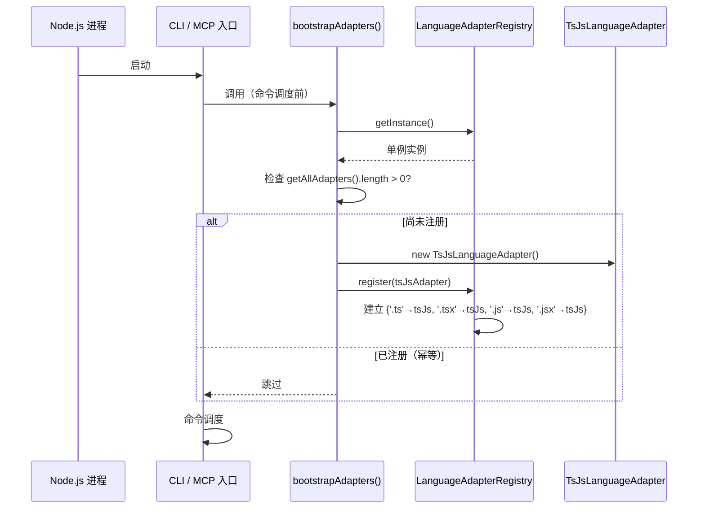
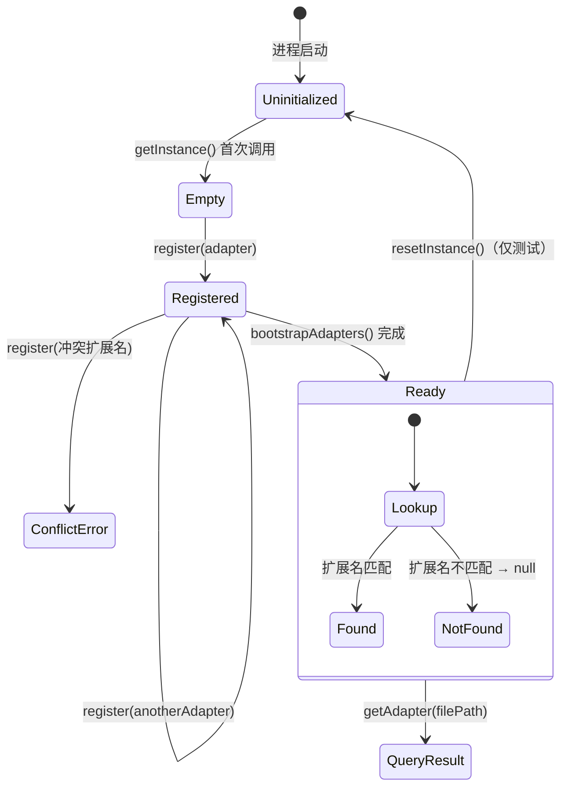

# Registry 生命周期契约

## 1. 初始化时序



## 2. 运行时查找

```
file-scanner.scanFiles()
  → LanguageAdapterRegistry.getInstance().getSupportedExtensions()
  → Set{'.ts', '.tsx', '.js', '.jsx'}

ast-analyzer.analyzeFile(filePath)
  → LanguageAdapterRegistry.getInstance().getAdapter(filePath)
  → TsJsLanguageAdapter (如果 extname 匹配)
  → null (如果不匹配 → 抛 UnsupportedFileError)
```

## 3. 测试生命周期

```
beforeEach():
  LanguageAdapterRegistry.resetInstance()  // 清空所有注册
  // 按需注册测试所需的 adapter

test():
  const registry = LanguageAdapterRegistry.getInstance()
  registry.register(mockAdapter)  // 或 new TsJsLanguageAdapter()
  // 执行测试逻辑

afterEach():
  LanguageAdapterRegistry.resetInstance()  // 确保无状态泄露
```

## 4. 状态图



## 5. 单例保证

| 场景 | 预期行为 |
|------|---------|
| `getInstance()` 连续调用 2 次 | 返回 `===` 相同引用 |
| `resetInstance()` 后 `getInstance()` | 返回新实例（`!==` 旧引用） |
| 新实例的 `getAllAdapters()` | 返回空数组 |
| 新实例的 `getSupportedExtensions()` | 返回空 Set |
| 新实例的 `getAdapter(anyFile)` | 返回 null |

## 6. 并发安全

Node.js 单线程模型下，Registry 的所有操作（register、getAdapter 等）天然线程安全。

异步场景下的保证：
- `register()` 是同步操作，不存在 race condition
- `getAdapter()` 是同步的 Map.get()，不存在 race condition
- `bootstrapAdapters()` 的幂等检查是同步的，不存在 TOCTOU 问题
