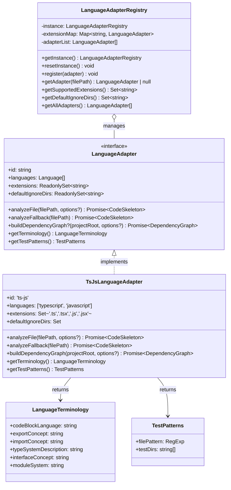
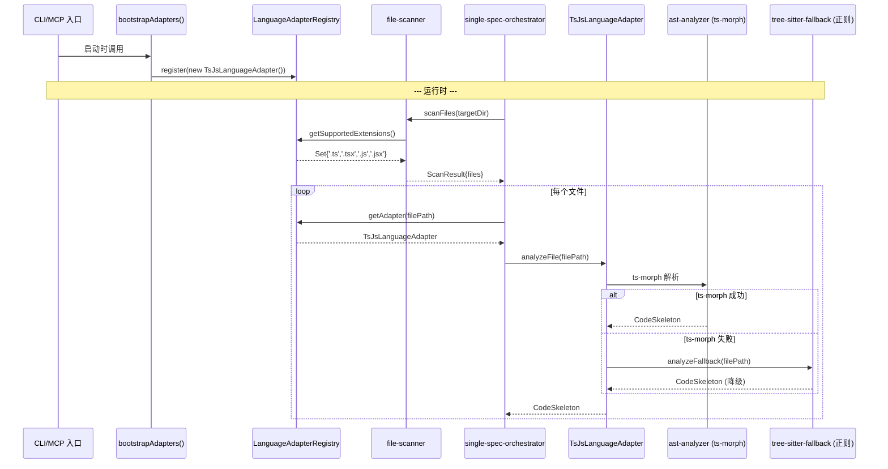
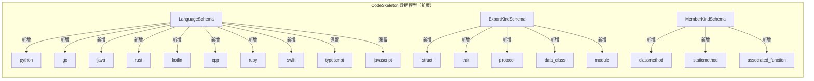

# 技术实现计划: 语言适配器抽象层（LanguageAdapter）

## 1. Summary

本计划为 reverse-spec 引入 LanguageAdapter 抽象层，采用**策略模式 + Registry** 架构（tech-research.md 方案 A）。核心工作包括：

1. 定义 `LanguageAdapter` 接口及 `LanguageAdapterRegistry` 单例
2. 将现有 TS/JS 专用逻辑封装为 `TsJsLanguageAdapter`
3. 扩展 `CodeSkeleton` 数据模型支持多语言枚举值和文件扩展名
4. 参数化 `file-scanner` 和两个编排器的语言依赖逻辑
5. 在 CLI / MCP 入口完成自动注册

**核心约束**：零行为变更、零新增运行时依赖、现有 42 个测试文件全部通过。

---

## 2. Technical Context

### 2.1 现有架构概述

当前流水线为线性三阶段结构：

```
scanFiles() → analyzeFile()/analyzeFiles() → assembleContext() → callLLM() → renderSpec()
```

TS/JS 专用逻辑分散在 6 个核心文件中（tech-research.md §1.1 识别 22 个耦合点）：

| 文件 | 耦合类型 | 影响程度 |
|------|---------|---------|
| `src/models/code-skeleton.ts` | 枚举硬编码、正则硬编码 | 数据模型层 |
| `src/core/ast-analyzer.ts` | 常量硬编码、函数硬编码、依赖硬编码 | AST 解析层 |
| `src/core/tree-sitter-fallback.ts` | 正则硬编码、函数硬编码 | 降级解析层 |
| `src/utils/file-scanner.ts` | 常量硬编码 | 文件发现层 |
| `src/graph/dependency-graph.ts` | 依赖硬编码、模式硬编码 | 依赖图层 |
| `src/core/single-spec-orchestrator.ts` | 消息硬编码 | 编排层 |

### 2.2 关键依赖

| 依赖 | 用途 | 本 Feature 影响 |
|------|------|----------------|
| `ts-morph` ^24.0.0 | TS/JS AST 解析 | 封装进 TsJsLanguageAdapter，不移除 |
| `dependency-cruiser` ^16.8.0 | JS/TS 依赖图 | 封装进 TsJsLanguageAdapter，不移除 |
| `zod` ^3.24.1 | 数据模型验证 | 扩展枚举值，无 API 变更 |
| `tree-sitter` ^0.21.1 | **未使用**（死代码） | 不在本 Feature 范围处理 |

### 2.3 澄清问题决策

基于 `clarify-results.md` 中 4 个澄清问题的决策：

| 问题 | 决策 | 理由 |
|------|------|------|
| Q1: context-assembler 等消费端硬编码 | **选项 C**（最小改造） | 将硬编码改为从 adapter 获取，但 TS/JS 返回与当前完全一致的值，满足 FR-035 零行为变更 |
| Q2: filePath 正则 vs Registry 动态 | **选项 B**（保持静态正则 + 已知限制） | 避免 Zod schema 依赖运行时状态的复杂度；新增语言时需同步更新正则，在 SC-003 中排除 `code-skeleton.ts` |
| Q3: 跳过提示输出规格 | `warn` 级别、stderr、按扩展名聚合 | 聚合格式减少噪声，stderr 不影响管道，warn 级别在默认 verbosity 下可见 |
| Q4: 大小写/复合扩展名 | `getAdapter()` 统一转小写匹配；复合扩展名取 `path.extname` 默认行为 | Windows 兼容性；`.test.ts` → `.ts` 是正确行为 |

---

## 3. Constitution Check

| 原则 | 合规性 | 说明 |
|------|:------:|------|
| I. 双语文档规范 | PASS | 所有文档中文，代码标识符英文 |
| II. Spec-Driven Development | PASS | 完整制品链：spec → research → clarify → plan → tasks |
| III. 诚实标注不确定性 | PASS | 不影响 `[推断]` 标记机制 |
| IV. AST 精确性优先 | PASS | `LanguageAdapter.analyzeFile` 仍从 AST 提取结构化数据 |
| V. 混合分析流水线 | PASS | 三阶段流水线结构不变，仅路由层变更 |
| VI. 只读安全性 | PASS | 不新增任何写操作 |
| VII. 纯 Node.js 生态 | **PASS** | 零新增运行时依赖，全部使用 TypeScript 内置能力 |

---

## 4. Project Structure 变更

### 4.1 新增文件

```
src/
  adapters/                          ← 新增目录
    language-adapter.ts              ← LanguageAdapter 接口 + LanguageTerminology + TestPatterns 类型
    language-adapter-registry.ts     ← LanguageAdapterRegistry 单例实现
    ts-js-adapter.ts                 ← TsJsLanguageAdapter 实现
    index.ts                         ← 导出 + bootstrapAdapters() 注册入口
tests/
  adapters/                          ← 新增目录
    language-adapter-registry.test.ts
    ts-js-adapter.test.ts
    ts-js-adapter-equivalence.test.ts ← golden-master 等价性测试
  models/
    code-skeleton-compat.test.ts     ← 旧 baseline 兼容性测试
```

### 4.2 修改文件

| 文件 | 变更类型 | 变更概述 |
|------|---------|---------|
| `src/models/code-skeleton.ts` | 扩展 | LanguageSchema、ExportKindSchema、MemberKindSchema 枚举值扩展；filePath 正则放宽 |
| `src/core/ast-analyzer.ts` | 重构 | 保留公共 API（`analyzeFile`、`analyzeFiles`），内部通过 Registry 路由 |
| `src/core/tree-sitter-fallback.ts` | 重构 | 逻辑移入 TsJsLanguageAdapter，原文件改为 Registry 路由的薄包装 |
| `src/utils/file-scanner.ts` | 参数化 | `SUPPORTED_EXTENSIONS` 和 `DEFAULT_IGNORE_DIRS` 从 Registry 动态获取；`ScanOptions` 新增 `extensions` 字段 |
| `src/graph/dependency-graph.ts` | 重构 | `buildGraph` 改为通过 Registry 路由到适配器的 `buildDependencyGraph` |
| `src/core/single-spec-orchestrator.ts` | 参数化 | 错误消息改为语言无关表述 |
| `src/batch/batch-orchestrator.ts` | 参数化 | 依赖图构建通过 Registry 路由 |
| `src/core/context-assembler.ts` | 参数化 | 代码块标记从 `'typescript'` 改为从 skeleton.language 动态获取 |
| `src/core/secret-redactor.ts` | 参数化 | `isTestFile` 从 Registry 获取 TestPatterns |
| `src/diff/noise-filter.ts` | 参数化 | import 检测正则从 adapter 获取 |
| `src/diff/semantic-diff.ts` | 参数化 | 代码块标记动态化 |
| `src/cli/index.ts` | 初始化 | 在 `main()` 顶部调用 `bootstrapAdapters()` |
| `src/mcp/server.ts` | 初始化 | 在 `createMcpServer()` 顶部调用 `bootstrapAdapters()` |

### 4.3 不变文件

以下文件**不需要修改**（验证 SC-003 的核心流水线无需变更）：

- `src/generator/spec-renderer.ts`
- `src/generator/frontmatter.ts`
- `src/generator/mermaid-class-diagram.ts`
- `src/generator/index-generator.ts`
- `src/graph/topological-sort.ts`
- `src/core/llm-client.ts`（本 Feature 不改造 prompt，留给 026）

---

## 5. Architecture

### 5.1 核心架构图



### 5.2 运行时路由流程



### 5.3 数据模型扩展架构



---

## 6. Implementation Steps

按 tech-research.md §9 的 5 步增量实施顺序设计。每个步骤独立可测试、可回滚。

### Step 1: 新增接口层（纯新增，零改动现有代码）

**目标**：创建 `src/adapters/` 目录，定义所有接口和类型，实现 Registry。

**新增文件**：

| 文件 | 职责 |
|------|------|
| `src/adapters/language-adapter.ts` | `LanguageAdapter` 接口、`LanguageTerminology` 类型、`TestPatterns` 类型、`AnalyzeOptions` 类型（从 ast-analyzer 复制） |
| `src/adapters/language-adapter-registry.ts` | `LanguageAdapterRegistry` 单例实现，含 `register()`、`getAdapter()`、`getSupportedExtensions()`、`getDefaultIgnoreDirs()`、`getAllAdapters()`、`resetInstance()` |
| `src/adapters/index.ts` | re-export + `bootstrapAdapters()` 启动注册函数 |

**关键实现细节**：

- `getAdapter(filePath)` 使用 `path.extname(filePath).toLowerCase()` 提取扩展名后查 Map，保证 O(1) 且大小写不敏感
- `register()` 对每个扩展名检查冲突，冲突时抛出 `Error`，含冲突扩展名和占用适配器 id
- `resetInstance()` 将静态 `instance` 设为 `null`，下次 `getInstance()` 创建新空白实例

**修改文件**：无（纯新增）

**测试**：

| 测试文件 | 覆盖内容 | 预估用例数 |
|---------|---------|:---------:|
| `tests/adapters/language-adapter-registry.test.ts` | 单例保证、注册、查找、冲突检测、重置、空 Registry 报错、无扩展名文件返回 null、大小写不敏感 | ~10 |

**验证门**：`npm test` 新增测试全部通过；现有 42 个测试文件不受影响。

**预估改动量**：~250 行新增代码 + ~150 行测试代码

---

### Step 2: 封装 TsJsLanguageAdapter（提取现有逻辑，零行为变更）

**目标**：将 `ast-analyzer.ts`、`tree-sitter-fallback.ts`、`dependency-graph.ts` 中的 TS/JS 专用逻辑提取到 `TsJsLanguageAdapter`。

**新增文件**：

| 文件 | 职责 |
|------|------|
| `src/adapters/ts-js-adapter.ts` | `TsJsLanguageAdapter` 类，实现 `LanguageAdapter` 接口 |

**TsJsLanguageAdapter 内部委托关系**：

```
TsJsLanguageAdapter
  ├── analyzeFile()      → 委托 ast-analyzer.ts 中现有的 analyzeFile()
  ├── analyzeFallback()  → 委托 tree-sitter-fallback.ts 中现有的 analyzeFallback()
  ├── buildDependencyGraph() → 委托 dependency-graph.ts 中现有的 buildGraph()
  ├── getTerminology()   → 返回静态 TS/JS 术语对象
  ├── getTestPatterns()  → 返回 TS/JS 测试文件匹配模式
  └── defaultIgnoreDirs  → 与 file-scanner.ts 的 DEFAULT_IGNORE_DIRS 一致（去掉通用的 .git）
```

**关键策略**：在本步骤中，`TsJsLanguageAdapter` **仅做委托包装**，不修改 `ast-analyzer.ts`、`tree-sitter-fallback.ts`、`dependency-graph.ts` 的内部实现。这保证了零行为变更。

**修改文件**：

| 文件 | 变更 |
|------|------|
| `src/adapters/index.ts` | 在 `bootstrapAdapters()` 中注册 `TsJsLanguageAdapter` |

**测试**：

| 测试文件 | 覆盖内容 | 预估用例数 |
|---------|---------|:---------:|
| `tests/adapters/ts-js-adapter.test.ts` | extensions 集合验证、getTerminology 返回值验证、getTestPatterns 正则验证、defaultIgnoreDirs 验证 | ~6 |
| `tests/adapters/ts-js-adapter-equivalence.test.ts` | 对比 TsJsLanguageAdapter.analyzeFile 与直接调用 ast-analyzer.analyzeFile 的输出完全一致 | ~4 |

**验证门**：`npm test` 全量通过；等价性测试确认新旧路径输出一致。

**预估改动量**：~200 行新增代码 + ~200 行测试代码

---

### Step 3: 扩展 CodeSkeleton 数据模型（纯扩展，前向兼容）

**目标**：扩展 `LanguageSchema`、`ExportKindSchema`、`MemberKindSchema` 枚举值，放宽 `filePath` 正则。

**修改文件**：

| 文件 | 变更详情 |
|------|---------|
| `src/models/code-skeleton.ts` | `LanguageSchema` 新增 8 个语言值；`ExportKindSchema` 新增 5 个值；`MemberKindSchema` 新增 3 个值；`filePath` 正则扩展为支持 20 种扩展名 |

**具体变更**：

```typescript
// LanguageSchema: 2 → 10 值
z.enum(['typescript', 'javascript', 'python', 'go', 'java', 'rust', 'kotlin', 'cpp', 'ruby', 'swift'])

// ExportKindSchema: 7 → 12 值
z.enum([..existing, 'struct', 'trait', 'protocol', 'data_class', 'module'])

// MemberKindSchema: 5 → 8 值
z.enum([..existing, 'classmethod', 'staticmethod', 'associated_function'])

// filePath: 4 扩展名 → 20 扩展名
z.string().regex(/\.(ts|tsx|js|jsx|py|pyi|go|java|kt|kts|rs|cpp|cc|cxx|c|h|hpp|rb|swift)$/)
```

**向后兼容性保证**：

- 所有现有值（`'typescript'`、`'javascript'`、`'function'`、`'class'` 等）仍在新枚举中
- 旧 baseline JSON 中 `language: 'typescript'` 和 `filePath: 'foo.ts'` 仍通过新 schema 验证
- 新增值仅在后续 Feature 的新适配器中使用，本 Feature 中 TsJsLanguageAdapter 不产出新值

**测试**：

| 测试文件 | 覆盖内容 | 预估用例数 |
|---------|---------|:---------:|
| `tests/models/code-skeleton-compat.test.ts` | 旧值 parse 成功、新值 parse 成功、非法值 parse 失败、旧 baseline JSON 兼容性 | ~8 |

**验证门**：`npm test` 全量通过；特别关注 `tests/models/code-skeleton.test.ts` 现有测试。

**预估改动量**：~30 行修改 + ~100 行测试代码

---

### Step 4: 接入 Registry 路由（编排器层改造）

**目标**：将 `ast-analyzer`、`file-scanner`、`single-spec-orchestrator`、`batch-orchestrator`、`context-assembler`、`secret-redactor`、`noise-filter`、`semantic-diff` 改为通过 Registry 路由。

本步骤是改动量最大的一步，按子步骤分解：

#### Step 4a: file-scanner 参数化

**修改文件**：`src/utils/file-scanner.ts`

**变更**：
- `SUPPORTED_EXTENSIONS` 改为从 `LanguageAdapterRegistry.getInstance().getSupportedExtensions()` 动态获取
- `DEFAULT_IGNORE_DIRS` 改为从 Registry 聚合 + 通用目录（`.git`、`coverage`）
- `ScanOptions` 新增可选 `extensions?: Set<string>` 字段
- 当扫描到不支持扩展名的文件时，按扩展名聚合后输出 `warn` 级日志到 stderr
- 新增 `UnsupportedFileSummary` 统计信息到 `ScanResult`

#### Step 4b: ast-analyzer 路由改造

**修改文件**：`src/core/ast-analyzer.ts`

**变更**：
- `analyzeFile()` 保留公共 API 签名不变
- 内部逻辑改为：先通过 `Registry.getAdapter(filePath)` 获取适配器，再调用 `adapter.analyzeFile()`
- 如果 Registry 返回 null，抛出 `UnsupportedFileError`
- 移除内部 `SUPPORTED_EXTENSIONS`、`getLanguage()`、`isSupportedFile()` 常量/函数（逻辑已在 adapter 中）
- `analyzeFiles()` 不变，仍循环调用 `analyzeFile()`

#### Step 4c: dependency-graph 路由改造

**修改文件**：`src/graph/dependency-graph.ts`

**变更**：
- `buildGraph()` 保留公共 API 签名不变
- 内部改为通过 Registry 获取支持 `buildDependencyGraph` 的适配器列表
- 当前仅 TsJsLanguageAdapter 提供此方法，行为不变
- 测试文件排除模式从适配器 `getTestPatterns()` 获取

#### Step 4d: 编排器参数化

**修改文件**：

| 文件 | 变更 |
|------|------|
| `src/core/single-spec-orchestrator.ts` | 错误消息从"TS/JS 文件"改为"支持的源文件"；`prepareContext()` 无功能性变更 |
| `src/batch/batch-orchestrator.ts` | `buildGraph()` 调用保持不变（因 dependency-graph.ts 内部已路由） |

#### Step 4e: 消费端最小改造（Q1 选项 C）

**修改文件**：

| 文件 | 变更 |
|------|------|
| `src/core/context-assembler.ts` | `formatSkeleton()` 中 `` ```typescript `` 改为 `` ```${skeleton.language} ``；`formatSnippets()` 同理 |
| `src/core/secret-redactor.ts` | `isTestFile()` 改为从 Registry 获取所有适配器的 `TestPatterns`，合并后匹配 |
| `src/diff/noise-filter.ts` | import 检测不变（当前仅影响 TS/JS，后续 Feature 扩展） |
| `src/diff/semantic-diff.ts` | 代码块标记改为从 `skeleton.language` 动态获取 |

**关键保证**：对 TS/JS 文件，所有改造后的代码路径返回与改造前完全一致的值。`TsJsLanguageAdapter.getTerminology().codeBlockLanguage` 返回 `'typescript'`，与原硬编码值一致。

#### Step 4f: CLI / MCP 启动注册

**修改文件**：

| 文件 | 变更 |
|------|------|
| `src/cli/index.ts` | 在 `main()` 函数顶部、命令调度前调用 `bootstrapAdapters()` |
| `src/mcp/server.ts` | 在 `createMcpServer()` 顶部调用 `bootstrapAdapters()` |

**测试**：

| 测试文件 | 覆盖内容 | 预估用例数 |
|---------|---------|:---------:|
| 现有 42 个测试文件 | 全量回归 | 42 文件 |
| `tests/adapters/ts-js-adapter-equivalence.test.ts`（扩展） | 通过 Registry 路由后的输出与直接调用对比 | ~4 |

**验证门**：`npm test` 全量通过；零差异。

**预估改动量**：~300 行修改 + ~50 行新增测试

---

### Step 5: 端到端验证 + Golden-Master 测试

**目标**：最终验证零行为变更约束，建立 golden-master 基线。

**测试活动**：

1. **Golden-Master 比对**：
   - 对 reverse-spec 自身（self-hosting）运行 `generate` 和 `batch`
   - 将产出 spec 与 Feature 实施前的快照逐字节比对
   - 确认零差异

2. **Mock 适配器验证**（SC-003）：
   - 编写 `MockLanguageAdapter` 声明支持 `.mock` 扩展名
   - 注册到 Registry
   - 验证 `registry.getAdapter('test.mock')` 返回正确适配器
   - 验证 `file-scanner` 扫描 `.mock` 文件
   - 验证编排器路由到 mock 适配器的 `analyzeFile`

3. **旧 Baseline 兼容性**（SC-004）：
   - 加载 Feature 实施前生成的 CodeSkeleton baseline JSON
   - 验证新版 Zod schema `parse()` 不抛 ZodError

4. **依赖审计**（SC-005）：
   - `package.json` 的 `dependencies` 字段前后 diff 比对

5. **测试数量审计**（SC-007）：
   - 确认新增单元测试 >= 20 个

**验证门**：所有 SC-001 ~ SC-007 成功标准通过。

**预估改动量**：~150 行测试代码

---

## 7. Complexity Tracking

### 7.1 总体复杂度评估

| 维度 | 评估 | 理由 |
|------|:----:|------|
| 范围 | 大 | 涉及 13 个源文件修改 + 4 个新增文件 |
| 风险 | 中 | 核心风险为重构引入隐式行为变更（R2），但有 golden-master 测试缓解 |
| 技术复杂度 | 低-中 | 策略模式 + Registry 是成熟模式，无新技术引入 |
| 测试复杂度 | 中 | 需要新增 ~28 个测试用例 + 全量回归 |

### 7.2 各步骤工作量估算

| Step | 描述 | 新增/修改代码行 | 测试代码行 | 风险 |
|:----:|------|:--------------:|:---------:|:----:|
| 1 | 接口层 | ~250 新增 | ~150 | 低 |
| 2 | TsJsLanguageAdapter | ~200 新增 | ~200 | 低 |
| 3 | CodeSkeleton 扩展 | ~30 修改 | ~100 | 低 |
| 4 | Registry 路由接入 | ~300 修改 | ~50 | **中** |
| 5 | 端到端验证 | ~0 | ~150 | 低 |
| **合计** | | **~780** | **~650** | |

### 7.3 风险矩阵

| # | 风险 | 概率 | 影响 | 缓解措施 | 归属步骤 |
|---|------|:----:|:----:|---------|:--------:|
| R1 | CodeSkeleton schema 变更导致旧 baseline 反序列化失败 | 低 | 高 | 枚举为前向兼容；Step 3 增加兼容性测试 | Step 3 |
| R2 | 提取 TsJsLanguageAdapter 时引入隐式行为变更 | 中 | 高 | 委托模式 + golden-master 比对 | Step 2, 5 |
| R3 | Registry 单例在测试中的状态泄露 | 中 | 中 | `resetInstance()` + 每个测试前后重置 | Step 1 |
| R4 | file-scanner 参数化后破坏 .gitignore 交互 | 低 | 中 | 通用目录（`.git`）独立于 Registry 聚合 | Step 4a |
| R5 | dependency-graph 重构引入 circular import | 低 | 中 | adapter 通过延迟调用避免循环依赖 | Step 4c |
| R6 | 多语言 filePath 正则过于宽松 | 低 | 低 | 仅扩展到已知编程语言扩展名 | Step 3 |
| R7 | 改动量大导致 PR 过大 | 中 | 中 | 按 5 步增量提交，每步独立 PR 或独立 commit | 全部 |

### 7.4 不在本 Feature 范围内的事项

以下事项有意识地推迟到后续 Feature：

| 事项 | 推迟到 | 理由 |
|------|-------|------|
| `llm-client.ts` 的 prompt 术语参数化 | Feature 026 | 涉及 LLM prompt 工程，变更面大且需独立验证 |
| 引入 `web-tree-sitter` 作为多语言解析后端 | Feature 027 | 新增运行时依赖，与零依赖约束冲突 |
| 移除未使用的 `tree-sitter` + `tree-sitter-typescript` | Feature 027 | 依赖清理应与后端替换同步进行 |
| `noise-filter.ts` 的 import 正则多语言化 | Feature 026 | 当前仅影响 TS/JS，低优先级 |
