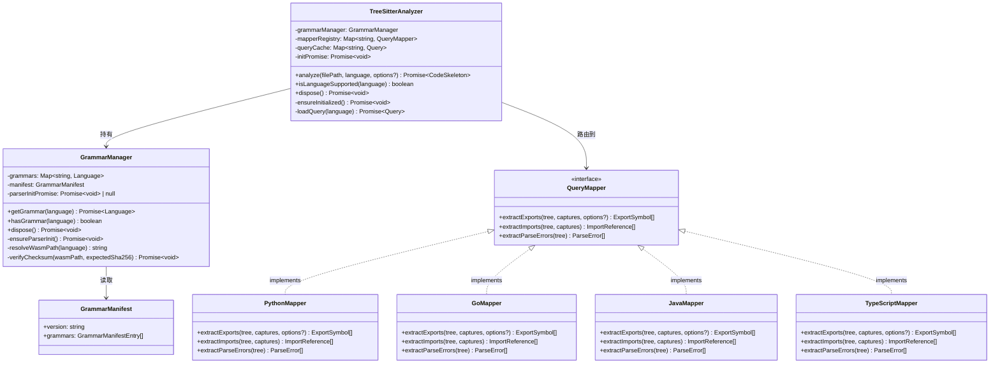
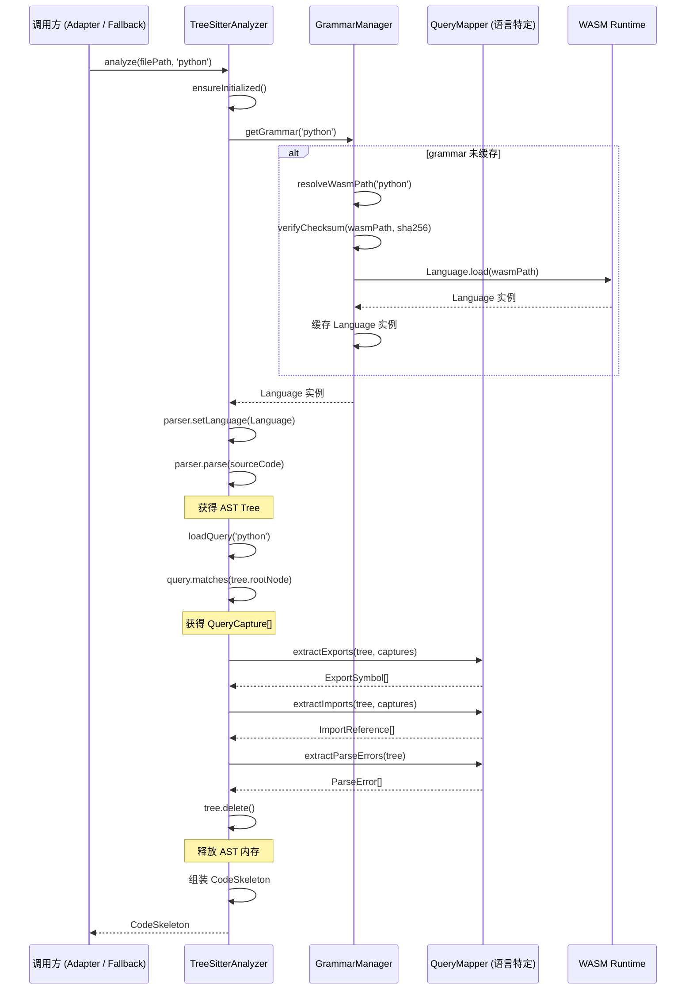
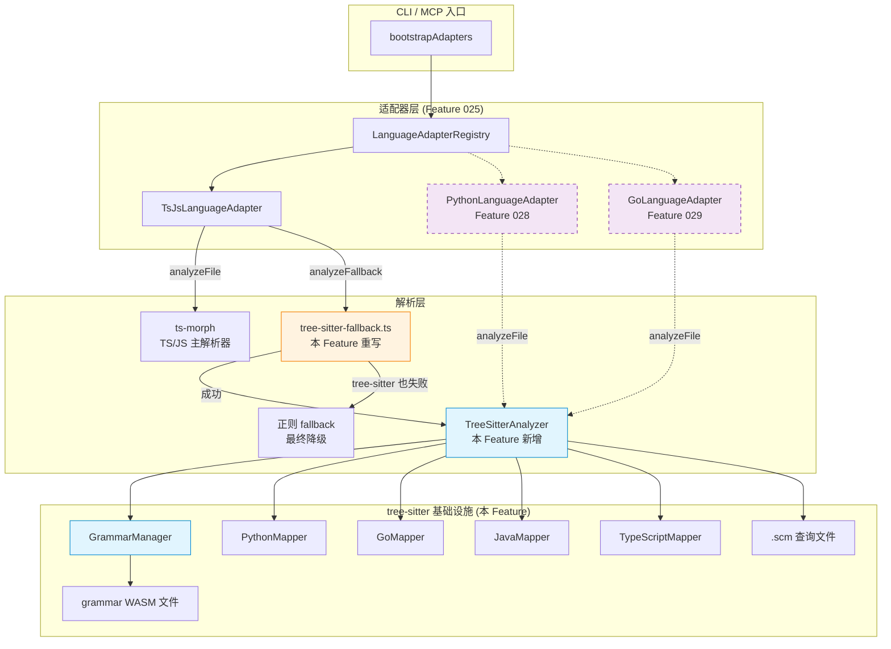

# 技术实现计划: 引入 tree-sitter 作为多语言解析后端

## 1. 技术方案概述

本计划为 reverse-spec 引入 `web-tree-sitter`（WASM 版）作为统一的多语言 AST 解析后端，替换当前名不副实的正则 fallback。核心工作包括：

1. 引入 `web-tree-sitter` 运行时依赖，移除未使用的原生 `tree-sitter` + `tree-sitter-typescript`
2. 实现 `GrammarManager`：grammar WASM 按需加载、单例缓存、SHA256 完整性校验
3. 为 Python、Go、Java、TypeScript/JavaScript 编写 `.scm` 查询文件
4. 实现 `QueryMapper` 映射层：将 tree-sitter query captures 转换为 `CodeSkeleton` 结构化数据
5. 实现 `TreeSitterAnalyzer` 主类：统一入口，编排 grammar 加载、AST 解析、query 映射
6. 重写 `tree-sitter-fallback.ts`：从纯正则升级为真正的 tree-sitter 解析，保留正则作为最终降级
7. Grammar WASM 文件随 npm 包分发，零安装摩擦

**核心约束**：TS/JS 主解析器仍为 ts-morph，tree-sitter 仅作为降级解析器（TS/JS）和主解析器（Python/Go/Java）。现有测试套件 100% 通过。

---

## 2. 技术上下文

### 2.1 现有架构

Feature 025 已建立 `LanguageAdapter` 接口层和 `LanguageAdapterRegistry`，当前解析路径为：

```
CLI/MCP → bootstrapAdapters() → Registry
  └── TsJsLanguageAdapter
        ├── analyzeFile()     → ast-analyzer.ts (ts-morph)
        └── analyzeFallback() → tree-sitter-fallback.ts (纯正则，名不副实)
```

降级链现状：`ts-morph → 正则`（标记为 `parserUsed: 'tree-sitter'`，但实际不是）

### 2.2 依赖现状

| 依赖 | 版本 | 状态 | 本 Feature 操作 |
|------|------|------|----------------|
| `tree-sitter` | ^0.21.1 | 已声明但未使用 | **移除** |
| `tree-sitter-typescript` | ^0.23.2 | 已声明但未使用 | **移除** |
| `web-tree-sitter` | ^0.24.x | 不存在 | **新增** |
| `ts-morph` | ^24.0.0 | TS/JS 主解析器 | 不变 |
| `zod` | ^3.24.1 | 数据模型验证 | 不变 |

### 2.3 WASM 文件尺寸实测

现有 npm 包中的 WASM 文件大小（来自 `node_modules/`）：

| 文件 | 大小 |
|------|------|
| `tree-sitter-typescript.wasm` | ~1.35 MB |
| `tree-sitter-tsx.wasm` | ~1.38 MB |
| `tree-sitter-javascript.wasm` | ~0.34 MB |
| `tree-sitter-python.wasm`（预估） | ~0.8 MB |
| `tree-sitter-go.wasm`（预估） | ~0.6 MB |
| `tree-sitter-java.wasm`（预估） | ~0.8 MB |
| **预估总计** | **~5.3 MB** |

低于 NFR-006 的 10MB 限制。

### 2.4 Node.js WASM 支持

`web-tree-sitter` 使用 Emscripten 编译的 WASM，通过 `WebAssembly.instantiate()` 加载。Node.js 20.x+ 已原生支持 WASM（V8 引擎内置），无需额外 polyfill。

`web-tree-sitter` 的初始化流程：

```typescript
import Parser from 'web-tree-sitter';

// 1. 全局初始化（仅一次，加载 tree-sitter.wasm 运行时）
await Parser.init();

// 2. 加载语言 grammar（每种语言一次）
const Python = await Parser.Language.load('/path/to/tree-sitter-python.wasm');

// 3. 创建 parser 并设置语言
const parser = new Parser();
parser.setLanguage(Python);

// 4. 解析源码
const tree = parser.parse(sourceCode);

// 5. 执行 query
const query = Python.query('(function_definition name: (identifier) @name)');
const matches = query.matches(tree.rootNode);
```

**关键点**：`Parser.init()` 和 `Language.load()` 均为异步操作，需在模块设计中妥善处理。

---

## 3. 架构设计

### 3.1 模块关系图



### 3.2 数据流



### 3.3 与现有系统的集成架构



### 3.4 降级链设计

重写后的 `tree-sitter-fallback.ts` 实现三级降级链：

```
ts-morph 解析成功 → CodeSkeleton (parserUsed: 'ts-morph')
  │ 失败
  ▼
tree-sitter 解析成功 → CodeSkeleton (parserUsed: 'tree-sitter')
  │ 失败（WASM 加载失败等）
  ▼
正则 fallback → CodeSkeleton (parserUsed: 'tree-sitter', parseErrors 含降级信息)
```

正则 fallback 保留现有的 `extractExportsFromText()` 和 `extractImportsFromText()` 逻辑，作为 `tree-sitter-fallback.ts` 的内部最终降级，不对外暴露。

---

## 4. 关键技术决策

### 4.1 web-tree-sitter 版本选择

**决策**: 使用 `web-tree-sitter ^0.24.x`

**理由**:

- 0.24.x 是当前最新稳定版，ABI 版本为 14，与最新的语言 grammar WASM 文件兼容
- 0.24.x 改进了 WASM 加载性能和内存管理（相比 0.22.x）
- 0.24.x 完整支持 Node.js 20.x+ 的 WASM 运行时
- 使用 `^` 范围锁定：允许 patch 升级（安全补丁），但 minor 版本升级可能变更 ABI，需手动验证

**ABI 兼容性验证策略**: 在 `grammars/manifest.json` 中记录 `web-tree-sitter` 版本和每个 grammar 的 ABI 版本号。`GrammarManager` 在加载 WASM 时，如果检测到 ABI 不匹配，抛出明确错误并给出升级建议。

### 4.2 WASM 文件管理策略

**决策**: Grammar WASM 文件作为静态资产随 npm 包分发，存放在 `grammars/` 目录

**备选方案与取舍**:

| 方案 | 优点 | 缺点 | 结论 |
|------|------|------|------|
| A. WASM 随包分发（`grammars/`） | 零网络依赖、离线可用、版本锁定 | 增加包体积 ~5MB | **采用** |
| B. 首次使用时从 CDN 下载 | 包体积小 | 网络依赖、企业防火墙阻断、版本漂移 | 否决 |
| C. 运行时从 npm 依赖包中解析 | 不增加包体积 | 依赖路径不稳定、peer dependency 管理复杂 | 否决 |

**WASM 文件获取流程（构建时）**:

```bash
# 构建时脚本（scripts/fetch-grammars.sh）
# 从 npm registry 下载各语言 grammar 包，提取 WASM 文件
# 计算 SHA256 校验和，写入 manifest.json
npm pack tree-sitter-python --pack-destination /tmp
tar -xzf /tmp/tree-sitter-python-*.tgz -C /tmp
cp /tmp/package/tree-sitter-python.wasm grammars/
sha256sum grammars/tree-sitter-python.wasm >> grammars/manifest.json
```

**manifest.json 结构**:

```json
{
  "abiVersion": 14,
  "webTreeSitterVersion": "0.24.x",
  "grammars": {
    "python": {
      "wasmFile": "tree-sitter-python.wasm",
      "sourcePackage": "tree-sitter-python@0.23.x",
      "sha256": "abc123..."
    },
    "go": {
      "wasmFile": "tree-sitter-go.wasm",
      "sourcePackage": "tree-sitter-go@0.23.x",
      "sha256": "def456..."
    },
    "java": {
      "wasmFile": "tree-sitter-java.wasm",
      "sourcePackage": "tree-sitter-java@0.23.x",
      "sha256": "789ghi..."
    },
    "typescript": {
      "wasmFile": "tree-sitter-typescript.wasm",
      "sourcePackage": "tree-sitter-typescript@0.23.x",
      "sha256": "jkl012..."
    },
    "javascript": {
      "wasmFile": "tree-sitter-javascript.wasm",
      "sourcePackage": "tree-sitter-javascript@0.23.x",
      "sha256": "mno345..."
    }
  }
}
```

### 4.3 .scm 查询文件设计策略

**决策**: 每种语言一个统一的 `.scm` 查询文件，使用 `@tag` 命名约定区分不同提取目标

**查询设计原则**:

1. **capture 命名约定**: 使用统一前缀区分提取目标
   - `@export.name` — 导出符号名称
   - `@export.kind` — 导出符号类型节点
   - `@export.signature` — 完整签名文本
   - `@import.module` — 导入模块路径
   - `@import.name` — 导入的具体名称
   - `@member.name` — 成员名称
   - `@member.kind` — 成员类型标识

2. **每个查询 pattern 配有注释**: 说明目标 AST 节点类型和预期匹配场景

3. **查询粒度**: 细粒度 pattern，一个 pattern 匹配一种语法结构，由 `QueryMapper` 负责聚合

**示例 — `queries/python.scm`（核心 pattern 摘录）**:

```scheme
;; 函数定义（顶层）
(function_definition
  name: (identifier) @export.name
  parameters: (parameters) @export.params
  return_type: (type)? @export.return_type
) @export.function

;; 异步函数定义
(function_definition
  "async" @export.async_marker
  name: (identifier) @export.name
  parameters: (parameters) @export.params
  return_type: (type)? @export.return_type
) @export.async_function

;; 类定义
(class_definition
  name: (identifier) @export.name
  superclasses: (argument_list)? @export.bases
  body: (block) @export.body
) @export.class

;; 装饰器
(decorated_definition
  (decorator
    (identifier) @decorator.name)
  definition: (_) @decorator.target
) @export.decorated

;; import 语句
(import_statement
  name: (dotted_name) @import.module
) @import.simple

;; from...import 语句
(import_from_statement
  module_name: (dotted_name) @import.module
  name: (dotted_name) @import.name
) @import.from
```

### 4.4 ESM 兼容性处理

**问题**: `web-tree-sitter` 分发为 CommonJS 模块，项目使用 ESM（`"type": "module"`）。

**解决方案**: 使用动态 `import()` 或 TypeScript 的 `import ... from 'web-tree-sitter'` 配合 `esModuleInterop: true`（已在 `tsconfig.json` 中启用）。`web-tree-sitter` 0.24.x 提供 `tree-sitter.js`（UMD）和 `tree-sitter.wasm`（运行时 WASM）两个文件，UMD 格式在 ESM 环境下通过 Node.js 的 CJS-ESM 互操作正常加载。

**验证点**: 在 Step 1 实施时，先验证 `import Parser from 'web-tree-sitter'` 在 ESM 环境下可正常工作。如果存在兼容性问题，降级为 `const { default: Parser } = await import('web-tree-sitter')` 动态导入。

### 4.5 `web-tree-sitter` 运行时 WASM 定位

**问题**: `web-tree-sitter` 自身需要加载一个 `tree-sitter.wasm` 运行时文件。`Parser.init()` 默认会尝试从当前工作目录或模块相对路径寻找此文件。

**解决方案**: 使用 `Parser.init({ locateFile: (file) => path.join(wasmDir, file) })` 显式指定 WASM 运行时路径。`wasmDir` 通过 `import.meta.url` 或 `__dirname` 等效手段解析到 `node_modules/web-tree-sitter/` 目录。

```typescript
import { fileURLToPath } from 'node:url';
import path from 'node:path';

// ESM 环境下获取 web-tree-sitter 包的 WASM 路径
const webTreeSitterDir = path.dirname(
  fileURLToPath(import.meta.resolve('web-tree-sitter'))
);

await Parser.init({
  locateFile: (file: string) => path.join(webTreeSitterDir, file),
});
```

### 4.6 并发安全与资源管理

**Parser 实例管理**:

- `web-tree-sitter` 的 `Parser` 对象非线程安全，但 Node.js 单线程模型下无此问题
- `GrammarManager` 为每种语言维护一个 `Language` 单例，但 `Parser` 实例可复用
- 在并发 `Promise.all` 场景下，多个 `analyze()` 调用可能同时请求同一语言的 grammar。使用 Promise 去重（dedup）避免重复加载：

```typescript
// GrammarManager 内部
private loadingPromises = new Map<string, Promise<Language>>();

async getGrammar(language: Language): Promise<Language> {
  const cached = this.grammars.get(language);
  if (cached) return cached;

  // 如果正在加载中，返回同一个 Promise（去重）
  const loading = this.loadingPromises.get(language);
  if (loading) return loading;

  const promise = this._loadGrammar(language);
  this.loadingPromises.set(language, promise);

  try {
    const grammar = await promise;
    this.grammars.set(language, grammar);
    return grammar;
  } finally {
    this.loadingPromises.delete(language);
  }
}
```

**AST Tree 生命周期**: 每次 `parser.parse()` 产生的 `Tree` 对象需在 `CodeSkeleton` 组装完成后立即调用 `tree.delete()` 释放 WASM 内存，避免批量分析场景下的内存泄漏（NFR-004）。

---

## 5. 接口契约

### 5.1 TreeSitterAnalyzer

```typescript
// src/core/tree-sitter-analyzer.ts

import type { CodeSkeleton, Language } from '../models/code-skeleton.js';

/**
 * tree-sitter 解析选项
 */
export interface TreeSitterAnalyzeOptions {
  /** 包含非导出/私有符号（默认 false） */
  includePrivate?: boolean;
}

/**
 * 基于 web-tree-sitter 的统一多语言 AST 解析器
 *
 * 职责：
 * - 编排 grammar 加载（GrammarManager）、AST 解析、query 执行、结果映射（QueryMapper）
 * - 提供统一的 analyze() API，供 LanguageAdapter.analyzeFile() 和 analyzeFallback() 调用
 * - 管理 Parser 实例生命周期
 *
 * 使用方式：
 * - 单例使用（推荐）: const analyzer = TreeSitterAnalyzer.getInstance()
 * - 或手动实例化: const analyzer = new TreeSitterAnalyzer()
 *
 * 资源释放：
 * - 调用 dispose() 释放所有 grammar 和 parser 资源
 * - 每次 analyze() 调用后自动释放该次解析的 AST Tree
 */
export class TreeSitterAnalyzer {
  private static instance: TreeSitterAnalyzer | null = null;

  /**
   * 获取或创建单例实例
   */
  static getInstance(): TreeSitterAnalyzer;

  /**
   * 重置单例（仅限测试使用）
   */
  static resetInstance(): void;

  /**
   * 解析单个源文件，返回结构化的 CodeSkeleton
   *
   * @param filePath - 源文件绝对路径
   * @param language - 目标语言标识（如 'python', 'go', 'java', 'typescript'）
   * @param options - 解析选项
   * @returns CodeSkeleton，parserUsed 为 'tree-sitter'
   * @throws Error 文件不存在（I/O 错误）
   * @throws Error 语言不支持（无对应 grammar）
   * @note 解析失败（语法错误等）不抛异常，记录到 parseErrors
   */
  async analyze(
    filePath: string,
    language: Language,
    options?: TreeSitterAnalyzeOptions,
  ): Promise<CodeSkeleton>;

  /**
   * 检查指定语言是否有可用的 grammar 和 query
   */
  isLanguageSupported(language: Language): boolean;

  /**
   * 获取所有已支持的语言列表
   */
  getSupportedLanguages(): Language[];

  /**
   * 释放已加载的 grammar、parser 和 query 缓存
   * 调用后实例不可再使用（需创建新实例或调用 resetInstance）
   */
  async dispose(): Promise<void>;
}
```

### 5.2 GrammarManager

```typescript
// src/core/grammar-manager.ts

import type { Language } from '../models/code-skeleton.js';

/**
 * grammar manifest 条目
 */
export interface GrammarManifestEntry {
  /** WASM 文件名 */
  wasmFile: string;
  /** 来源 npm 包及版本 */
  sourcePackage: string;
  /** WASM 文件 SHA256 校验和 */
  sha256: string;
}

/**
 * grammar manifest 根结构
 */
export interface GrammarManifest {
  /** tree-sitter ABI 版本号 */
  abiVersion: number;
  /** 对应的 web-tree-sitter 版本范围 */
  webTreeSitterVersion: string;
  /** 各语言 grammar 条目 */
  grammars: Record<string, GrammarManifestEntry>;
}

/**
 * Grammar WASM 文件加载与缓存管理器
 *
 * 职责：
 * - 按需加载 grammar WASM 文件（首次请求时加载，后续从缓存返回）
 * - 每种语言维护单例 Language 实例（进程生命周期内只加载一次）
 * - 校验 WASM 文件完整性（SHA256 校验和对比 manifest）
 * - 管理 web-tree-sitter Parser 运行时初始化
 *
 * 并发安全：
 * - 同一语言的多个并发 getGrammar() 调用共享同一个加载 Promise（去重）
 * - Parser.init() 仅执行一次，后续调用返回已完成的 Promise
 */
export class GrammarManager {
  /**
   * 获取指定语言的 grammar（按需加载 + 单例缓存）
   *
   * @param language - 语言标识
   * @returns tree-sitter Language 实例
   * @throws Error WASM 文件缺失（含预期路径）
   * @throws Error SHA256 校验失败（含语言名和校验详情）
   * @throws Error ABI 不兼容
   */
  async getGrammar(language: Language): Promise</* Parser.Language */ any>;

  /**
   * 检查指定语言是否在 manifest 中有对应的 grammar WASM
   */
  hasGrammar(language: Language): boolean;

  /**
   * 获取 manifest 中所有已声明的语言列表
   */
  getAvailableLanguages(): string[];

  /**
   * 释放所有已加载的 grammar 实例
   */
  async dispose(): Promise<void>;
}
```

### 5.3 QueryMapper 接口

```typescript
// src/core/query-mappers/base-mapper.ts

import type {
  ExportSymbol,
  ImportReference,
  ParseError,
} from '../../models/code-skeleton.js';

/**
 * tree-sitter query match 类型（简化）
 * 对应 web-tree-sitter 的 QueryMatch
 */
export interface QueryMatch {
  pattern: number;
  captures: QueryCapture[];
}

export interface QueryCapture {
  name: string;
  node: {
    text: string;
    type: string;
    startPosition: { row: number; column: number };
    endPosition: { row: number; column: number };
    parent: any | null;
    children: any[];
  };
}

/**
 * 映射选项
 */
export interface MapperOptions {
  /** 包含非导出/私有符号 */
  includePrivate?: boolean;
}

/**
 * 语言特定的 query 结果到 CodeSkeleton 映射器
 *
 * 职责：
 * - 将 tree-sitter query captures 转换为 ExportSymbol、ImportReference
 * - 处理语言特有的 AST 节点类型和语义约定
 * - 提取语法错误节点（ERROR / MISSING）
 *
 * 扩展指南：
 * 新增语言支持时，实现此接口并注册到 TreeSitterAnalyzer 的 mapperRegistry。
 * 参考 PythonMapper、GoMapper、JavaMapper 的实现。
 */
export interface QueryMapper {
  /** 映射器对应的语言标识 */
  readonly language: string;

  /**
   * 从 query matches 中提取导出符号
   *
   * @param rootNode - AST 根节点
   * @param matches - query.matches() 返回的匹配结果
   * @param sourceCode - 原始源码文本（用于签名提取）
   * @param options - 映射选项
   * @returns ExportSymbol 数组
   */
  extractExports(
    rootNode: any,
    matches: QueryMatch[],
    sourceCode: string,
    options?: MapperOptions,
  ): ExportSymbol[];

  /**
   * 从 query matches 中提取导入引用
   *
   * @param rootNode - AST 根节点
   * @param matches - query.matches() 返回的匹配结果
   * @param sourceCode - 原始源码文本
   * @returns ImportReference 数组
   */
  extractImports(
    rootNode: any,
    matches: QueryMatch[],
    sourceCode: string,
  ): ImportReference[];

  /**
   * 从 AST 中提取语法错误节点
   * tree-sitter 对语法错误的文件仍能部分解析，错误节点标记为 ERROR 类型
   *
   * @param rootNode - AST 根节点
   * @returns ParseError 数组
   */
  extractParseErrors(rootNode: any): ParseError[];
}
```

### 5.4 各语言 QueryMapper 关键映射规则

#### PythonMapper (`src/core/query-mappers/python-mapper.ts`)

| Python AST 节点 | CodeSkeleton 映射 | 特殊处理 |
|-----------------|-------------------|---------|
| `function_definition` | `ExportSymbol(kind: 'function')` | 提取 `parameters`、`return_type` 到 `signature` |
| `function_definition` + `async` | `ExportSymbol(kind: 'function')` | `signature` 含 `async` 前缀 |
| `class_definition` | `ExportSymbol(kind: 'class')` | 提取 `superclasses` 到 `signature` |
| `@staticmethod` + `function_definition` | `MemberInfo(kind: 'staticmethod')` | 通过父节点 `decorated_definition` 关联 |
| `@classmethod` + `function_definition` | `MemberInfo(kind: 'classmethod')` | 同上 |
| `@property` + `function_definition` | `MemberInfo(kind: 'getter')` | 同上 |
| `import_statement` | `ImportReference(isRelative: false)` | `moduleSpecifier` 为 dotted name |
| `import_from_statement` | `ImportReference` | 检查 `.` 前缀判断 `isRelative` |
| `type_alias_statement` | `ExportSymbol(kind: 'type')` | Python 3.12+ `type` 语句 |
| 类型注解 (`type` 节点) | 写入 `signature` | 参数类型、返回类型 |

**Python 导出判定**: Python 无显式 `export` 关键字。默认策略——顶层 `def`/`class` 均视为导出（`includePrivate: false` 时排除 `_` 前缀的符号）。检测 `__all__` 列表若存在，则仅 `__all__` 中列出的符号为导出。

#### GoMapper (`src/core/query-mappers/go-mapper.ts`)

| Go AST 节点 | CodeSkeleton 映射 | 特殊处理 |
|-------------|-------------------|---------|
| `function_declaration` | `ExportSymbol(kind: 'function')` | 首字母大写 = `visibility: 'public'` |
| `method_declaration` | `MemberInfo(kind: 'method')` | 通过 `receiver` 关联到对应 `struct` |
| `type_declaration` + `struct_type` | `ExportSymbol(kind: 'struct')` | 提取字段到 `members` |
| `type_declaration` + `interface_type` | `ExportSymbol(kind: 'interface')` | 提取方法签名到 `members` |
| `type_declaration` + 其他 | `ExportSymbol(kind: 'type')` | 类型别名 |
| `import_declaration` | `ImportReference` | 处理单 import 和分组 import |
| `const_declaration` | `ExportSymbol(kind: 'const')` | 首字母大写判定 |

**Go 导出判定**: Go 的导出规则基于标识符首字母大小写。`GoMapper` 使用 `/^[A-Z]/` 判断公开性。`includePrivate: false` 时仅返回首字母大写的符号。`isDefault` 始终为 `false`（Go 无 default export 概念）。

**method receiver 关联**: Go 的 `func (r *Receiver) Method()` 语法中，`receiver` 类型用于将方法关联到对应的 struct。`GoMapper` 维护一个临时的 `structName → MemberInfo[]` 映射，在提取完成后将 methods 合并到对应 struct 的 `members`。

#### JavaMapper (`src/core/query-mappers/java-mapper.ts`)

| Java AST 节点 | CodeSkeleton 映射 | 特殊处理 |
|---------------|-------------------|---------|
| `class_declaration` | `ExportSymbol(kind: 'class')` | 提取 `modifiers` 到 `visibility` |
| `interface_declaration` | `ExportSymbol(kind: 'interface')` | 同上 |
| `enum_declaration` | `ExportSymbol(kind: 'enum')` | 同上 |
| `record_declaration` | `ExportSymbol(kind: 'data_class')` | Java 16+ record |
| `method_declaration` | `MemberInfo(kind: 'method')` | 提取访问修饰符 |
| `field_declaration` | `MemberInfo(kind: 'property')` | 提取类型和修饰符 |
| `constructor_declaration` | `MemberInfo(kind: 'constructor')` | 参数签名 |
| `import_declaration` | `ImportReference` | `isRelative: false`（Java 无相对 import） |
| `type_parameters` | 写入 `typeParameters` | `<T extends Bar>` |
| `annotation` | 写入 `signature` 或特殊处理 | `@Override` 等 |

**Java 访问修饰符映射**:
- `public` → `visibility: 'public'`
- `protected` → `visibility: 'protected'`
- `private` → `visibility: 'private'`
- 无修饰符（package-private）→ `visibility` 省略（CodeSkeleton 的 `visibility` 为 optional）

**Java 导出判定**: Java 中 `public` 类视为导出。`includePrivate: false` 时仅返回 `public` 顶层类型声明。

#### TypeScriptMapper (`src/core/query-mappers/typescript-mapper.ts`)

| TS/JS AST 节点 | CodeSkeleton 映射 | 特殊处理 |
|----------------|-------------------|---------|
| `export_statement` + `function_declaration` | `ExportSymbol(kind: 'function')` | 匹配 `export function` |
| `export_statement` + `class_declaration` | `ExportSymbol(kind: 'class')` | 匹配 `export class` |
| `export_statement` + `interface_declaration` | `ExportSymbol(kind: 'interface')` | TS 特有 |
| `export_statement` + `type_alias_declaration` | `ExportSymbol(kind: 'type')` | TS 特有 |
| `export_statement` + `enum_declaration` | `ExportSymbol(kind: 'enum')` | TS 特有 |
| `export_statement` + `lexical_declaration` | `ExportSymbol(kind: 'const'/'variable')` | `const`/`let`/`var` |
| `import_statement` | `ImportReference` | 完整 ES Module import |

**与正则 fallback 的对比**: TypeScriptMapper 的主要优势在于能正确处理嵌套导出（`export { name } from`）、re-export、命名空间导出、装饰器类等正则无法可靠匹配的场景。

### 5.5 重写后的 tree-sitter-fallback.ts 接口

```typescript
// src/core/tree-sitter-fallback.ts（重写）

import type { CodeSkeleton } from '../models/code-skeleton.js';

/**
 * 容错降级解析
 *
 * 三级降级链：
 * 1. 尝试使用 TreeSitterAnalyzer 进行真正的 tree-sitter 解析
 * 2. 如果 tree-sitter 也失败（WASM 加载失败等），降级到正则提取
 *
 * 函数签名与现有版本完全一致，保持调用方兼容。
 *
 * @param filePath - 文件绝对路径
 * @returns CodeSkeleton
 * @throws Error 仅在文件不存在等 I/O 错误时抛出
 */
export async function analyzeFallback(filePath: string): Promise<CodeSkeleton>;
```

---

## 6. 实施策略

### 6.1 实施步骤总览

按**依赖顺序**分为 6 个步骤，每步独立可测试、可回滚。

```
Step 1: 依赖变更 + web-tree-sitter 可用性验证
  │
  ▼
Step 2: GrammarManager 实现
  │
  ▼
Step 3: .scm 查询文件编写 + QueryMapper 接口 + 基础映射器
  │
  ├──▶ Step 3a: QueryMapper 接口 + TypeScriptMapper
  ├──▶ Step 3b: PythonMapper
  ├──▶ Step 3c: GoMapper
  └──▶ Step 3d: JavaMapper
  │
  ▼
Step 4: TreeSitterAnalyzer 主类实现
  │
  ▼
Step 5: tree-sitter-fallback.ts 重写 + 集成
  │
  ▼
Step 6: 端到端验证 + 性能基准测试
```

### 6.2 Step 1: 依赖变更 + web-tree-sitter 可用性验证

**目标**: 完成 `package.json` 依赖替换，验证 `web-tree-sitter` 在 ESM 环境下的基本可用性。

**操作**:

1. `package.json` 移除 `tree-sitter` 和 `tree-sitter-typescript`
2. `package.json` 新增 `web-tree-sitter: ^0.24.x`
3. 更新 `package.json` 的 `files` 字段，新增 `grammars/` 和 `queries/`
4. 运行 `npm install`，验证无 C++ 编译步骤
5. 编写冒烟测试：验证 `import Parser from 'web-tree-sitter'` + `Parser.init()` 在 ESM 环境正常工作
6. 创建 `grammars/` 和 `queries/` 目录结构
7. 编写 `scripts/fetch-grammars.sh` 脚本，从 npm 包中提取 WASM 文件并生成 `manifest.json`
8. 执行脚本，获取 Python/Go/Java/TypeScript/JavaScript 的 WASM 文件

**验证门**: `npm test` 现有测试全部通过（移除未使用依赖无影响）；冒烟测试通过。

**风险**: `web-tree-sitter` 的 ESM 兼容性。**缓解**: 提前在冒烟测试中验证，若失败则使用动态 `import()` 方案。

**预估改动量**: ~50 行配置变更 + ~100 行脚本 + ~30 行冒烟测试

---

### 6.3 Step 2: GrammarManager 实现

**目标**: 实现 grammar WASM 的按需加载、单例缓存、完整性校验。

**新增文件**:

| 文件 | 职责 |
|------|------|
| `src/core/grammar-manager.ts` | GrammarManager 类实现 |

**关键实现细节**:

1. **Parser.init() 全局去重**: 使用 `Promise` 锁保证 `Parser.init()` 仅执行一次
2. **Language.load() 去重**: 使用 `Map<string, Promise<Language>>` 保证同一语言不重复加载
3. **SHA256 校验**: 加载 WASM 前读取文件计算 SHA256，与 `manifest.json` 对比
4. **路径解析**: WASM 文件路径通过 `import.meta.url` 相对定位到 `grammars/` 目录
5. **错误信息**: 缺失/校验失败时，错误消息包含：语言名、预期路径、实际/预期 SHA256

**测试**:

| 测试文件 | 覆盖内容 | 预估用例数 |
|---------|---------|:---------:|
| `tests/unit/grammar-manager.test.ts` | 按需加载、单例缓存、SHA256 校验、WASM 缺失报错、并发加载去重、dispose 释放、ABI 不匹配报错 | ~10 |

**验证门**: `npm test` 全部通过；GrammarManager 可成功加载所有 5 种语言的 grammar。

**预估改动量**: ~250 行新增代码 + ~200 行测试代码

---

### 6.4 Step 3: .scm 查询文件 + QueryMapper 实现

分为 4 个并行子步骤。

#### Step 3a: QueryMapper 接口 + TypeScriptMapper

**新增文件**:

| 文件 | 职责 |
|------|------|
| `src/core/query-mappers/base-mapper.ts` | QueryMapper 接口定义 |
| `src/core/query-mappers/typescript-mapper.ts` | TS/JS 映射器 |
| `queries/typescript.scm` | TypeScript 查询规则 |
| `queries/javascript.scm` | JavaScript 查询规则 |

**为什么 TypeScript 优先**: TypeScriptMapper 可以与现有正则 fallback 进行直接对比测试（AC-015），验证 tree-sitter 提取质量不低于正则。

**测试**: ~12 个用例（函数、类、接口、类型、枚举、const、import、re-export、装饰器、default export、嵌套泛型、条件类型）

#### Step 3b: PythonMapper

**新增文件**:

| 文件 | 职责 |
|------|------|
| `src/core/query-mappers/python-mapper.ts` | Python 映射器 |
| `queries/python.scm` | Python 查询规则 |

**测试**: ~12 个用例（def、async def、class、import、from import、装饰器 @staticmethod/@classmethod/@property、类型注解、\_\_all\_\_、嵌套类、空文件、语法错误文件）

#### Step 3c: GoMapper

**新增文件**:

| 文件 | 职责 |
|------|------|
| `src/core/query-mappers/go-mapper.ts` | Go 映射器 |
| `queries/go.scm` | Go 查询规则 |

**测试**: ~12 个用例（func、method receiver、struct、interface、type alias、import 单/分组、多返回值、首字母大写判定、const/var、空文件、语法错误文件）

#### Step 3d: JavaMapper

**新增文件**:

| 文件 | 职责 |
|------|------|
| `src/core/query-mappers/java-mapper.ts` | Java 映射器 |
| `queries/java.scm` | Java 查询规则 |

**测试**: ~12 个用例（class、interface、enum、record、访问修饰符、泛型参数、import、注解、static 方法、构造器、空文件、语法错误文件）

**Step 3 总验证门**: 每种语言 >= 10 个测试用例（NFR-012）。

**Step 3 预估改动量**: ~800 行 mapper 代码 + ~400 行 .scm 查询 + ~600 行测试代码

---

### 6.5 Step 4: TreeSitterAnalyzer 主类实现

**目标**: 实现统一入口，编排 GrammarManager + Parser + Query + QueryMapper 的完整流程。

**新增文件**:

| 文件 | 职责 |
|------|------|
| `src/core/tree-sitter-analyzer.ts` | TreeSitterAnalyzer 主类 |

**关键实现细节**:

1. **延迟初始化**: `analyze()` 首次调用时触发 `ensureInitialized()`，完成 `Parser.init()` 和 mapper 注册
2. **query 缓存**: `.scm` 文件在首次加载后编译为 `Query` 对象并缓存（按语言键）
3. **query 加载时校验**: `Language.query(scmContent)` 若语法无效会抛出异常，在加载阶段即可捕获（FR-018）
4. **AST Tree 生命周期**: `parse()` 后在 `try/finally` 中确保 `tree.delete()` 调用
5. **空文件处理**: 0 字节文件直接返回空 `CodeSkeleton`，不进入 tree-sitter 解析
6. **BOM 处理**: 读取文件后检查并移除 UTF-8 BOM（`\xEF\xBB\xBF`）
7. **编码检测**: 使用 `fs.readFileSync(filePath, 'utf-8')` 读取，非 UTF-8 编码会触发替换字符，检测到后记入 `parseErrors`

**测试**:

| 测试文件 | 覆盖内容 | 预估用例数 |
|---------|---------|:---------:|
| `tests/unit/tree-sitter-analyzer.test.ts` | 多语言解析端到端、空文件、BOM 文件、语法错误文件、不支持语言报错、并发解析、dispose 后行为 | ~15 |

**验证门**: 所有已支持语言（Python/Go/Java/TS/JS）的解析测试通过；CodeSkeleton 通过 Zod schema 验证。

**预估改动量**: ~300 行新增代码 + ~250 行测试代码

---

### 6.6 Step 5: tree-sitter-fallback.ts 重写 + 集成

**目标**: 重写降级解析器，将三级降级链完整接入现有调用方。

**修改文件**:

| 文件 | 变更 |
|------|------|
| `src/core/tree-sitter-fallback.ts` | 重写：tree-sitter 优先 → 正则降级 |

**重写策略**:

1. 保留 `analyzeFallback(filePath: string): Promise<CodeSkeleton>` 函数签名不变
2. 内部逻辑改为：
   - 检测文件语言（通过扩展名，支持 TS/JS/Python/Go/Java）
   - 尝试调用 `TreeSitterAnalyzer.getInstance().analyze(filePath, language)`
   - 如果 tree-sitter 解析成功，返回 `CodeSkeleton`（`parserUsed: 'tree-sitter'`）
   - 如果 tree-sitter 失败（WASM 加载失败等），降级到原有正则提取
3. 原有正则代码（`extractExportsFromText`、`extractImportsFromText`）移入私有函数，作为最终降级
4. `getLanguage()` 函数扩展为支持所有 5 种语言的扩展名检测

**调用方影响**:

| 调用方 | 调用路径 | 影响 |
|--------|---------|------|
| `TsJsLanguageAdapter.analyzeFallback()` | 直接委托 | 签名不变，内部升级为 tree-sitter |
| `ast-analyzer.ts` catch 路径 | 通过 `analyzeFallback()` | 行为链不变 |

**测试**:

| 测试文件 | 覆盖内容 | 预估用例数 |
|---------|---------|:---------:|
| `tests/unit/tree-sitter-fallback.test.ts`（更新） | 现有 3 个测试保持通过 + 新增 tree-sitter 解析验证 | ~8 |
| `tests/unit/tree-sitter-fallback-comparison.test.ts` | tree-sitter vs 正则的对比测试（NFR-013），验证 exports 数量不少于正则 | ~5 |

**验证门**: 现有测试不变通过；对比测试确认质量不降级。

**预估改动量**: ~150 行修改 + ~200 行测试代码

---

### 6.7 Step 6: 端到端验证 + 性能基准测试

**目标**: 全面验证零回归、性能达标、包体积合规。

**测试活动**:

1. **零回归验证**:
   - 全量 `npm test` 通过（AC-009）
   - 对纯 TS/JS 项目运行 `reverse-spec generate`，验证产出一致（AC-010）
   - ts-morph 仍为 TS/JS 首选解析器，tree-sitter 仅在降级时触发

2. **多语言解析验证**:
   - 准备 Python/Go/Java 标准测试文件（含 spec 中所有 Acceptance Scenario）
   - 验证 `CodeSkeletonSchema.parse()` 成功（AC-001 ~ AC-003）

3. **性能基准测试**:
   - 单文件（1000 行）解析时间 < 200ms（AC-013）
   - Grammar 首次加载时间 < 500ms（NFR-002）
   - 批量 100 文件解析无内存泄漏（NFR-004）

4. **包体积审计**:
   - `grammars/` 目录总大小 < 10MB（AC-014）
   - 运行 `npm pack --dry-run`，确认最终包体积可接受

5. **安装摩擦验证**:
   - 在无 C/C++ 编译器环境中 `npm install` 成功（AC-008）

6. **架构可扩展性验证**（AC-011）:
   - 模拟添加新语言：仅需 WASM 文件 + .scm 文件 + QueryMapper，无需修改 TreeSitterAnalyzer

**预估改动量**: ~100 行测试/基准代码

---

## 7. 新增文件结构总览

```
src/core/
  tree-sitter-analyzer.ts          # [新增] TreeSitterAnalyzer 主类
  grammar-manager.ts                # [新增] WASM grammar 加载与缓存
  tree-sitter-fallback.ts           # [重写] 真正的 tree-sitter 降级（保留正则最终 fallback）
  query-mappers/                    # [新增目录]
    base-mapper.ts                  # QueryMapper 接口定义
    python-mapper.ts                # Python AST → CodeSkeleton 映射
    go-mapper.ts                    # Go AST → CodeSkeleton 映射
    java-mapper.ts                  # Java AST → CodeSkeleton 映射
    typescript-mapper.ts            # TypeScript/JavaScript AST → CodeSkeleton 映射

grammars/                           # [新增目录] 随 npm 包分发
  manifest.json                     # grammar 版本和 SHA256 校验清单
  tree-sitter-python.wasm
  tree-sitter-go.wasm
  tree-sitter-java.wasm
  tree-sitter-typescript.wasm
  tree-sitter-javascript.wasm

queries/                            # [新增目录] 随 npm 包分发
  python.scm
  go.scm
  java.scm
  typescript.scm
  javascript.scm

scripts/
  fetch-grammars.sh                 # [新增] WASM 文件获取 + manifest 生成脚本

tests/unit/
  grammar-manager.test.ts           # [新增]
  tree-sitter-analyzer.test.ts      # [新增]
  tree-sitter-fallback.test.ts      # [更新] 扩展为验证真正的 tree-sitter 降级
  tree-sitter-fallback-comparison.test.ts  # [新增] tree-sitter vs 正则对比
  query-mappers/                    # [新增目录]
    python-mapper.test.ts
    go-mapper.test.ts
    java-mapper.test.ts
    typescript-mapper.test.ts
```

---

## 8. 测试策略

### 8.1 测试层次

| 层次 | 目标 | 工具 | 文件数 |
|------|------|------|:------:|
| 单元测试 | 各 QueryMapper 的映射正确性 | vitest | 4 |
| 单元测试 | GrammarManager 的加载/缓存/校验 | vitest | 1 |
| 单元测试 | TreeSitterAnalyzer 的端到端解析 | vitest | 1 |
| 单元测试 | tree-sitter-fallback 的降级链 | vitest | 2 |
| 回归测试 | 现有全部测试零失败 | vitest | 全量 |
| 对比测试 | tree-sitter vs 正则的输出对比 | vitest | 1 |
| 性能测试 | 解析时间和内存 | vitest + perf hooks | 1 |

### 8.2 测试夹具（Fixture）设计

为每种语言准备标准测试 fixture 文件，存放在 `tests/fixtures/multilang/`：

```
tests/fixtures/multilang/
  python/
    basic.py          # 函数、类、import、类型注解
    decorators.py     # @staticmethod, @classmethod, @property
    syntax-error.py   # 缩进错误（验证部分解析）
    empty.py          # 空文件
    dunder-all.py     # __all__ 列表
  go/
    basic.go          # func, struct, interface, import
    methods.go        # method receiver, 多返回值
    visibility.go     # 大小写导出判定
    empty.go          # 空文件
    syntax-error.go   # 语法错误
  java/
    Basic.java        # class, interface, enum, import
    Generics.java     # 泛型参数
    Record.java       # Java 16+ record
    Modifiers.java    # 访问修饰符组合
    empty.java        # 空文件
  typescript/
    complex.ts        # 嵌套泛型、装饰器、条件类型
    reexport.ts       # re-export、namespace export
    basic.ts          # 基本导出（与正则 fallback 对比基线）
```

### 8.3 对比测试策略（NFR-013）

```typescript
// tests/unit/tree-sitter-fallback-comparison.test.ts

describe('tree-sitter vs regex fallback comparison', () => {
  // 对相同的 TS/JS fixture 文件：
  // 1. 使用旧正则方式提取 exports（extractExportsFromText）
  // 2. 使用新 tree-sitter 方式提取 exports（TreeSitterAnalyzer）
  // 3. 断言 tree-sitter 提取数量 >= 正则提取数量
  // 4. 断言 tree-sitter 的 signature 不含 [SYNTAX ERROR] 前缀
});
```

### 8.4 性能基准测试

```typescript
// tests/unit/tree-sitter-performance.test.ts

describe('tree-sitter performance', () => {
  it('单文件解析不超过 200ms（不含首次 grammar 加载）', async () => {
    // 预热：先加载 grammar
    await analyzer.analyze(warmupFile, 'python');

    // 计时
    const start = performance.now();
    await analyzer.analyze(fixture1000Lines, 'python');
    const elapsed = performance.now() - start;

    expect(elapsed).toBeLessThan(200);
  });

  it('grammar 首次加载不超过 500ms', async () => {
    // 冷启动加载
    const start = performance.now();
    await grammarManager.getGrammar('python');
    const elapsed = performance.now() - start;

    expect(elapsed).toBeLessThan(500);
  });

  it('批量 100 文件解析无显著内存泄漏', async () => {
    const baseline = process.memoryUsage().heapUsed;
    for (let i = 0; i < 100; i++) {
      await analyzer.analyze(fixtureFile, 'python');
    }
    const after = process.memoryUsage().heapUsed;
    // 允许 50MB 增量（包含 grammar 缓存等固定开销）
    expect(after - baseline).toBeLessThan(50 * 1024 * 1024);
  });
});
```

### 8.5 测试数量审计

| 模块 | 预估测试用例数 | 对应需求 |
|------|:------------:|---------|
| PythonMapper | 12 | NFR-012 (>=10) |
| GoMapper | 12 | NFR-012 (>=10) |
| JavaMapper | 12 | NFR-012 (>=10) |
| TypeScriptMapper | 12 | NFR-012 (>=10) |
| GrammarManager | 10 | FR-007~013 |
| TreeSitterAnalyzer | 15 | FR-001~006 |
| tree-sitter-fallback (更新) | 8 | FR-028~031 |
| 对比测试 | 5 | NFR-013 |
| 性能测试 | 3 | NFR-001~004 |
| **总计** | **~89** | |

---

## 9. 复杂度跟踪

### 9.1 总体复杂度评估

| 维度 | 评估 | 理由 |
|------|:----:|------|
| 范围 | 大 | 新增 10+ 文件、5 种语言 .scm 查询、WASM 管理基础设施 |
| 风险 | 中-高 | web-tree-sitter WASM 在 ESM 中的兼容性、ABI 版本锁定、.scm 查询覆盖度 |
| 技术复杂度 | 中 | WASM 加载机制、tree-sitter query 语法、多语言 AST 差异 |
| 测试复杂度 | 高 | 5 种语言各需 10+ 测试用例、fixture 文件、对比测试、性能测试 |

### 9.2 各步骤工作量估算

| Step | 描述 | 新增/修改代码行 | 测试代码行 | 风险 |
|:----:|------|:--------------:|:---------:|:----:|
| 1 | 依赖变更 + 可用性验证 | ~50 配置 + ~100 脚本 | ~30 | **高**（ESM 兼容性） |
| 2 | GrammarManager | ~250 新增 | ~200 | 中 |
| 3 | .scm 查询 + QueryMapper | ~800 新增 + ~400 scm | ~600 | 中（查询覆盖度） |
| 4 | TreeSitterAnalyzer | ~300 新增 | ~250 | 低 |
| 5 | fallback 重写 + 集成 | ~150 修改 | ~200 | 中（兼容性） |
| 6 | 端到端验证 + 性能 | ~0 | ~100 | 低 |
| **合计** | | **~1650 + ~400 scm** | **~1380** | |

### 9.3 风险矩阵

| # | 风险 | 概率 | 影响 | 缓解措施 | 归属步骤 |
|---|------|:----:|:----:|---------|:--------:|
| R1 | `web-tree-sitter` 在 ESM + Node.js 20 环境下初始化失败 | 中 | **阻塞** | Step 1 优先验证；准备动态 import() 降级方案 | Step 1 |
| R2 | grammar WASM 的 ABI 版本与 `web-tree-sitter` 不兼容 | 中 | 高 | manifest.json 记录 ABI 版本；fetch-grammars.sh 脚本验证兼容性 | Step 1, 2 |
| R3 | .scm 查询遗漏某些语法结构（如 Python 3.12 新语法） | 中 | 中 | 每种语言编写 comprehensive fixture；迭代补充 query pattern | Step 3 |
| R4 | tree-sitter 解析含语法错误文件时返回不完整 AST | 低 | 中 | 利用 tree-sitter 的错误恢复特性；补充 error recovery 测试 | Step 3, 4 |
| R5 | WASM 文件加载导致 vitest 测试超时 | 中 | 低 | vitest testTimeout 已设 30s；grammar 预加载优化 | Step 2 |
| R6 | 包体积超过 10MB 限制 | 低 | 中 | 实测 WASM 大小 ~5MB；监控 npm pack 输出 | Step 1 |
| R7 | tree-sitter-fallback 重写破坏现有 TS/JS 降级路径 | 中 | 高 | 保留正则作为最终降级；对比测试确保不降级 | Step 5 |
| R8 | `web-tree-sitter` WASM 运行时文件（`tree-sitter.wasm`）定位失败 | 中 | **阻塞** | 使用 `locateFile` 回调显式指定路径；Step 1 验证 | Step 1 |
| R9 | 并发 analyze() 调用触发重复 grammar 加载 | 低 | 低 | Promise 去重机制（§4.6） | Step 2 |

### 9.4 不在本 Feature 范围内的事项

| 事项 | 推迟到 | 理由 |
|------|-------|------|
| PythonLanguageAdapter 实现 | Feature 028 | 需要完整的 Python 项目结构识别、依赖图支持 |
| GoLanguageAdapter 实现 | Feature 029 | 同上，Go 生态特有的 module 系统 |
| JavaLanguageAdapter 实现 | Feature 030 | 同上，Java 的 package 和 classpath |
| .scm 查询覆盖 Rust/Kotlin/Ruby/Swift/C++ | 后续 Feature | 当前仅覆盖 P0 语言 |
| grammar WASM 自动更新机制 | 后续 Feature | 当前手动通过 fetch-grammars.sh 管理 |
| tree-sitter 增量解析（`tree.edit()` + re-parse） | 后续优化 | 当前每次全量解析，性能已满足 NFR-001 |

---

## 10. Constitution Check

| 原则 | 合规性 | 说明 |
|------|:------:|------|
| I. 双语文档规范 | PASS | 文档中文，代码标识符英文 |
| II. Spec-Driven Development | PASS | 完整制品链：spec → plan → tasks |
| III. 诚实标注不确定性 | PASS | 不影响现有 `[推断]` 标记机制 |
| IV. AST 精确性优先 | **PASS** | tree-sitter 提供真正的 AST 解析，比正则 fallback 更精确 |
| V. 混合分析流水线 | PASS | 三阶段流水线不变，仅降级解析器内部实现升级 |
| VI. 只读安全性 | PASS | 不新增任何写操作 |
| VII. 纯 Node.js 生态 | **PASS** | `web-tree-sitter` 是纯 WASM 方案，无 C++ 编译依赖，符合 Node.js 生态 |
