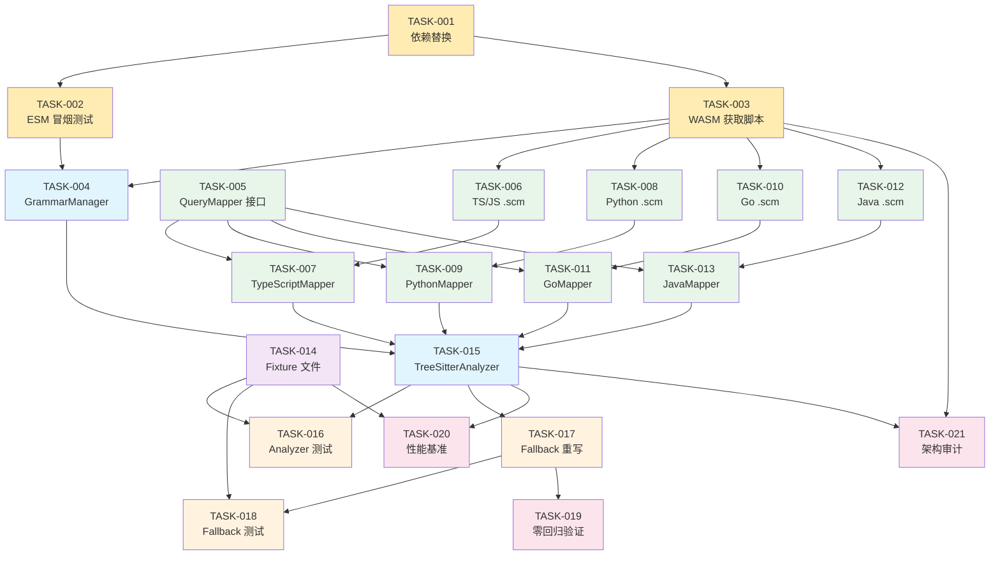

# 任务分解: 引入 tree-sitter 作为多语言解析后端

> 按依赖顺序排列。每个 task 可独立验证、可回滚。

---

## TASK-001: 依赖替换 — 移除原生 tree-sitter，新增 web-tree-sitter

**depends_on**: 无
**对应 Plan 步骤**: Step 1
**对应需求**: FR-024, FR-025, FR-026, AC-006, AC-007, AC-008

### 描述

在 `package.json` 中完成依赖替换：移除从未使用的 `tree-sitter` 和 `tree-sitter-typescript`（原生 C++ 绑定），新增 `web-tree-sitter ^0.24.x`（WASM 版）。同时更新 `files` 字段，新增 `grammars/` 和 `queries/` 目录。运行 `npm install` 验证无 C++ 编译步骤。

### 修改/创建文件

| 文件 | 操作 |
|------|------|
| `package.json` | 修改：移除 `tree-sitter`、`tree-sitter-typescript`；新增 `web-tree-sitter`；`files` 新增 `grammars/`、`queries/` |
| `package-lock.json` | 自动更新（`npm install`） |

### 验证标准

- [ ] `package.json` 中不再包含 `tree-sitter` 和 `tree-sitter-typescript` 依赖
- [ ] `package.json` 中包含 `web-tree-sitter: ^0.24.x`
- [ ] `npm install` 成功，无原生编译输出
- [ ] `npm test` 现有测试全部通过（移除未使用依赖无影响）

---

## TASK-002: web-tree-sitter ESM 可用性冒烟测试

**depends_on**: TASK-001
**对应 Plan 步骤**: Step 1
**对应需求**: FR-002, NFR-008

### 描述

编写冒烟测试，验证 `web-tree-sitter` 在项目的 ESM 环境（`"type": "module"` + TypeScript）下可正常初始化。验证 `import Parser from 'web-tree-sitter'` + `Parser.init()` + `Parser.Language.load()` 的基本流程。如果默认导入方式不兼容，切换为动态 `import()` 方案。

### 修改/创建文件

| 文件 | 操作 |
|------|------|
| `tests/unit/web-tree-sitter-smoke.test.ts` | 新增：冒烟测试 |

### 验证标准

- [ ] `Parser.init()` 在 Node.js 20.x+ ESM 环境下成功执行
- [ ] `Parser.Language.load(wasmPath)` 可加载一个 WASM grammar 文件
- [ ] `parser.parse('function foo() {}')` 返回有效的 AST Tree 对象
- [ ] 冒烟测试在 `npm test` 中通过

---

## TASK-003: Grammar WASM 获取脚本与 manifest.json

**depends_on**: TASK-001
**对应 Plan 步骤**: Step 1
**对应需求**: FR-010, FR-011, FR-012, FR-027, NFR-005, NFR-006, NFR-007, AC-005, AC-014

### 描述

创建 `grammars/` 和 `queries/` 目录结构。编写 `scripts/fetch-grammars.sh` 脚本，从 npm registry 下载各语言 grammar 包（`tree-sitter-python`、`tree-sitter-go`、`tree-sitter-java`、`tree-sitter-typescript`、`tree-sitter-javascript`），提取 WASM 文件到 `grammars/` 目录，计算 SHA256 校验和并生成 `grammars/manifest.json`。执行脚本获取所有 WASM 文件。

### 修改/创建文件

| 文件 | 操作 |
|------|------|
| `scripts/fetch-grammars.sh` | 新增：WASM 文件获取 + manifest 生成脚本 |
| `grammars/manifest.json` | 新增：grammar 版本和 SHA256 校验清单 |
| `grammars/tree-sitter-python.wasm` | 新增：Python grammar |
| `grammars/tree-sitter-go.wasm` | 新增：Go grammar |
| `grammars/tree-sitter-java.wasm` | 新增：Java grammar |
| `grammars/tree-sitter-typescript.wasm` | 新增：TypeScript grammar |
| `grammars/tree-sitter-javascript.wasm` | 新增：JavaScript grammar |
| `.gitignore` | 修改：如需排除大型 WASM 文件，配合 LFS 或确认纳入 git 追踪 |

### 验证标准

- [ ] `scripts/fetch-grammars.sh` 可在干净环境执行成功
- [ ] `grammars/` 目录包含 5 个 WASM 文件
- [ ] `grammars/manifest.json` 包含 `abiVersion`、`webTreeSitterVersion` 和每种语言的 `wasmFile`、`sourcePackage`、`sha256`
- [ ] 每个 WASM 文件大小不超过 2MB（NFR-005）
- [ ] 所有 WASM 文件总大小不超过 10MB（NFR-006）

---

## TASK-004: GrammarManager 实现 — WASM 按需加载与单例缓存

**depends_on**: TASK-002, TASK-003
**对应 Plan 步骤**: Step 2
**对应需求**: FR-007, FR-008, FR-009, FR-011, FR-012, FR-013, NFR-003, NFR-007

### 描述

实现 `GrammarManager` 类，负责 grammar WASM 文件的按需加载、单例缓存、SHA256 完整性校验。核心要点：

1. `Parser.init()` 全局去重（仅执行一次），使用 `locateFile` 回调指定 `tree-sitter.wasm` 路径
2. `Language.load()` 并发去重（同一语言不重复加载），使用 `Map<string, Promise<Language>>`
3. 加载前读取 WASM 文件计算 SHA256，与 `manifest.json` 对比
4. WASM 文件路径通过 `import.meta.url` 相对定位到 `grammars/` 目录
5. 缺失/校验失败时，错误消息包含语言名、预期路径、实际/预期 SHA256

### 修改/创建文件

| 文件 | 操作 |
|------|------|
| `src/core/grammar-manager.ts` | 新增：GrammarManager 类 |
| `tests/unit/grammar-manager.test.ts` | 新增：加载、缓存、校验、并发、dispose 测试 |

### 验证标准

- [ ] `getGrammar('python')` 首次调用成功加载 WASM，返回 Language 实例
- [ ] 第二次 `getGrammar('python')` 返回缓存实例（内存地址相同）
- [ ] 并发 `Promise.all([getGrammar('python'), getGrammar('python')])` 只触发一次 WASM 加载
- [ ] `hasGrammar('python')` 返回 `true`，`hasGrammar('ruby')` 返回 `false`
- [ ] WASM 文件缺失时抛出错误，包含语言名和预期路径
- [ ] SHA256 校验失败时抛出错误，包含实际/预期校验和
- [ ] `dispose()` 后 grammar 缓存被清空
- [ ] 所有 5 种语言（python/go/java/typescript/javascript）grammar 均可加载
- [ ] 测试用例 >= 10

---

## TASK-005: QueryMapper 接口定义

**depends_on**: 无（纯类型定义，无运行时依赖）
**对应 Plan 步骤**: Step 3a
**对应需求**: FR-019, FR-020, NFR-010

### 描述

定义 `QueryMapper` 接口和相关类型（`QueryMatch`、`QueryCapture`、`MapperOptions`）。此文件为纯类型定义，无运行时逻辑依赖，可与其他 task 并行。

### 修改/创建文件

| 文件 | 操作 |
|------|------|
| `src/core/query-mappers/base-mapper.ts` | 新增：QueryMapper 接口、QueryMatch、QueryCapture、MapperOptions 类型定义 |

### 验证标准

- [ ] `QueryMapper` 接口包含 `language`、`extractExports()`、`extractImports()`、`extractParseErrors()` 成员
- [ ] 类型定义可被 TypeScript 编译器正确解析（`npm run build` 通过）
- [ ] 接口签名与 plan.md §5.3 一致

---

## TASK-006: TypeScript/JavaScript .scm 查询文件编写

**depends_on**: TASK-003（需要 WASM 文件验证查询语法）
**对应 Plan 步骤**: Step 3a
**对应需求**: FR-014, FR-015, FR-016, FR-018, NFR-011

### 描述

为 TypeScript 和 JavaScript 编写 `.scm` 查询文件。查询须覆盖：`export function`、`export class`、`export interface`、`export type`、`export enum`、`export const/let/var`、`export default`、re-export（`export { } from`）、`import` 语句。每个 pattern 配有内联注释说明用途。

### 修改/创建文件

| 文件 | 操作 |
|------|------|
| `queries/typescript.scm` | 新增：TypeScript 查询规则 |
| `queries/javascript.scm` | 新增：JavaScript 查询规则 |

### 验证标准

- [ ] 查询文件包含函数、类、接口、类型别名、枚举、const、import、re-export 的 pattern
- [ ] 每个 pattern 有 `;; ` 前缀的注释说明
- [ ] 查询使用统一的 capture 命名约定（`@export.name`、`@export.kind`、`@import.module` 等）
- [ ] 查询语法可被 `Language.query()` 正确编译（无语法错误）

---

## TASK-007: TypeScriptMapper 实现

**depends_on**: TASK-005, TASK-006
**对应 Plan 步骤**: Step 3a
**对应需求**: FR-019, FR-020

### 描述

实现 `TypeScriptMapper`，将 tree-sitter TypeScript/JavaScript query captures 转换为 `ExportSymbol` 和 `ImportReference`。处理 `export` 语句、`import` 语句、re-export、default export、装饰器类等 TS/JS 特有语法。此 mapper 同时服务 `typescript.scm` 和 `javascript.scm` 查询结果。

### 修改/创建文件

| 文件 | 操作 |
|------|------|
| `src/core/query-mappers/typescript-mapper.ts` | 新增：TypeScript/JavaScript 映射器 |
| `tests/fixtures/multilang/typescript/basic.ts` | 新增：基本导出 fixture |
| `tests/fixtures/multilang/typescript/complex.ts` | 新增：嵌套泛型、装饰器、条件类型 fixture |
| `tests/fixtures/multilang/typescript/reexport.ts` | 新增：re-export、namespace export fixture |
| `tests/unit/query-mappers/typescript-mapper.test.ts` | 新增：>= 12 个测试用例 |

### 验证标准

- [ ] 正确提取 `export function`、`export class`、`export interface`、`export type`、`export enum`、`export const` 为对应 `kind` 的 `ExportSymbol`
- [ ] 正确提取 `export default` 符号（`isDefault: true`）
- [ ] 正确提取 `import` 语句为 `ImportReference`（含 `moduleSpecifier`、`isRelative`、`namedImports`、`defaultImport`）
- [ ] 正确提取 re-export（`export { } from`）
- [ ] `extractParseErrors()` 可检测 ERROR 节点
- [ ] 测试用例 >= 12

---

## TASK-008: Python .scm 查询文件编写

**depends_on**: TASK-003
**对应 Plan 步骤**: Step 3b
**对应需求**: FR-014, FR-015, FR-016, FR-017, FR-018, NFR-011

### 描述

为 Python 编写 `.scm` 查询文件。查询须覆盖：`def`/`async def` 函数定义、`class` 类定义、`import`/`from...import` 语句、装饰器（`@staticmethod`、`@classmethod`、`@property`）、类型注解（参数类型、返回类型）、`type` 语句（Python 3.12+）、`__all__` 列表。

### 修改/创建文件

| 文件 | 操作 |
|------|------|
| `queries/python.scm` | 新增：Python 查询规则 |

### 验证标准

- [ ] 查询覆盖 `function_definition`、`class_definition`、`import_statement`、`import_from_statement`、`decorated_definition`、类型注解节点
- [ ] 每个 pattern 有内联注释
- [ ] 查询语法可被 Python grammar 的 `Language.query()` 正确编译

---

## TASK-009: PythonMapper 实现

**depends_on**: TASK-005, TASK-008
**对应 Plan 步骤**: Step 3b
**对应需求**: FR-019, FR-020, FR-021, AC-001

### 描述

实现 `PythonMapper`，将 tree-sitter Python query captures 转换为 `CodeSkeleton` 结构化数据。核心映射规则：

- `def` / `async def` → `ExportSymbol(kind: 'function')`，提取参数签名和返回类型
- `class` → `ExportSymbol(kind: 'class')`，提取基类
- `@staticmethod` → `MemberInfo(kind: 'staticmethod')`
- `@classmethod` → `MemberInfo(kind: 'classmethod')`
- `@property` → `MemberInfo(kind: 'getter')`
- `import` / `from...import` → `ImportReference`
- 导出判定：顶层 `def`/`class` 均为导出；`_` 前缀在 `includePrivate: false` 时排除；存在 `__all__` 时仅列表中的符号为导出

### 修改/创建文件

| 文件 | 操作 |
|------|------|
| `src/core/query-mappers/python-mapper.ts` | 新增：Python 映射器 |
| `tests/fixtures/multilang/python/basic.py` | 新增：函数、类、import、类型注解 |
| `tests/fixtures/multilang/python/decorators.py` | 新增：@staticmethod, @classmethod, @property |
| `tests/fixtures/multilang/python/dunder-all.py` | 新增：__all__ 列表 |
| `tests/fixtures/multilang/python/syntax-error.py` | 新增：缩进错误文件 |
| `tests/fixtures/multilang/python/empty.py` | 新增：空文件 |
| `tests/unit/query-mappers/python-mapper.test.ts` | 新增：>= 12 个测试用例 |

### 验证标准

- [ ] `def foo(x: int) -> str` 提取为 `ExportSymbol(kind: 'function')`，`signature` 包含参数类型和返回类型
- [ ] `class Foo(Bar)` 提取为 `ExportSymbol(kind: 'class')`，`signature` 包含基类
- [ ] `@staticmethod` / `@classmethod` / `@property` 正确映射到对应 `MemberInfo.kind`
- [ ] `import os` 和 `from os.path import join` 正确提取为 `ImportReference`
- [ ] `from .module import Foo` 的 `isRelative` 为 `true`
- [ ] `includePrivate: false` 时排除 `_` 前缀符号
- [ ] 存在 `__all__` 时仅导出列表中的符号
- [ ] 语法错误文件可部分解析，错误记录到 `parseErrors`
- [ ] 空文件返回空 exports/imports
- [ ] 测试用例 >= 12

---

## TASK-010: Go .scm 查询文件编写

**depends_on**: TASK-003
**对应 Plan 步骤**: Step 3c
**对应需求**: FR-014, FR-015, FR-016, FR-017, FR-018, NFR-011

### 描述

为 Go 编写 `.scm` 查询文件。查询须覆盖：`func` 函数声明、method declaration（含 receiver）、`type ... struct {}`、`type ... interface {}`、类型别名、`import` 语句（单行和分组）、`const`/`var` 声明。

### 修改/创建文件

| 文件 | 操作 |
|------|------|
| `queries/go.scm` | 新增：Go 查询规则 |

### 验证标准

- [ ] 查询覆盖 `function_declaration`、`method_declaration`、`type_declaration`（struct/interface/alias）、`import_declaration`、`const_declaration`、`var_declaration`
- [ ] 每个 pattern 有内联注释
- [ ] 查询语法可被 Go grammar 的 `Language.query()` 正确编译

---

## TASK-011: GoMapper 实现

**depends_on**: TASK-005, TASK-010
**对应 Plan 步骤**: Step 3c
**对应需求**: FR-019, FR-020, FR-022, AC-002

### 描述

实现 `GoMapper`，将 tree-sitter Go query captures 转换为 `CodeSkeleton` 结构化数据。核心映射规则：

- `func Foo()` → `ExportSymbol(kind: 'function')`，首字母大写 = `visibility: 'public'`
- `type Foo struct {}` → `ExportSymbol(kind: 'struct')`
- `type Foo interface {}` → `ExportSymbol(kind: 'interface')`
- `func (f *Foo) Method()` → struct `Foo` 的 `MemberInfo(kind: 'method')`（通过 receiver 关联）
- `import "path"` / `import ( ... )` → `ImportReference`
- 多返回值签名完整保留在 `signature` 中
- `includePrivate: false` 时仅返回首字母大写的符号

### 修改/创建文件

| 文件 | 操作 |
|------|------|
| `src/core/query-mappers/go-mapper.ts` | 新增：Go 映射器 |
| `tests/fixtures/multilang/go/basic.go` | 新增：func, struct, interface, import |
| `tests/fixtures/multilang/go/methods.go` | 新增：method receiver, 多返回值 |
| `tests/fixtures/multilang/go/visibility.go` | 新增：大小写导出判定 |
| `tests/fixtures/multilang/go/empty.go` | 新增：空文件 |
| `tests/fixtures/multilang/go/syntax-error.go` | 新增：语法错误文件 |
| `tests/unit/query-mappers/go-mapper.test.ts` | 新增：>= 12 个测试用例 |

### 验证标准

- [ ] `func Foo()` 提取为 `ExportSymbol(kind: 'function', visibility: 'public')`
- [ ] `func bar()` 在 `includePrivate: false` 时不出现在 exports 中
- [ ] `type Foo struct {}` 提取为 `ExportSymbol(kind: 'struct')`
- [ ] `type Foo interface {}` 提取为 `ExportSymbol(kind: 'interface')`
- [ ] method receiver `func (f *Foo) Method()` 关联到 struct `Foo` 的 `members`
- [ ] 单行 `import "fmt"` 和分组 `import ( ... )` 均正确提取
- [ ] 多返回值 `func Foo() (int, error)` 的 `signature` 包含完整返回值
- [ ] 语法错误文件可部分解析
- [ ] 空文件返回空 exports/imports
- [ ] 测试用例 >= 12

---

## TASK-012: Java .scm 查询文件编写

**depends_on**: TASK-003
**对应 Plan 步骤**: Step 3d
**对应需求**: FR-014, FR-015, FR-016, FR-017, FR-018, NFR-011

### 描述

为 Java 编写 `.scm` 查询文件。查询须覆盖：`class`、`interface`、`enum`、`record` 声明、方法声明、字段声明、构造器、`import` 语句、访问修饰符（`public`/`protected`/`private`）、泛型参数（`type_parameters`）、注解。

### 修改/创建文件

| 文件 | 操作 |
|------|------|
| `queries/java.scm` | 新增：Java 查询规则 |

### 验证标准

- [ ] 查询覆盖 `class_declaration`、`interface_declaration`、`enum_declaration`、`record_declaration`、`method_declaration`、`field_declaration`、`constructor_declaration`、`import_declaration`、`annotation`
- [ ] 每个 pattern 有内联注释
- [ ] 查询语法可被 Java grammar 的 `Language.query()` 正确编译

---

## TASK-013: JavaMapper 实现

**depends_on**: TASK-005, TASK-012
**对应 Plan 步骤**: Step 3d
**对应需求**: FR-019, FR-020, FR-023, AC-003

### 描述

实现 `JavaMapper`，将 tree-sitter Java query captures 转换为 `CodeSkeleton` 结构化数据。核心映射规则：

- `public class Foo` → `ExportSymbol(kind: 'class', visibility: 'public')`
- `interface Foo` → `ExportSymbol(kind: 'interface')`
- `enum Foo` → `ExportSymbol(kind: 'enum')`
- `record Foo(...)` → `ExportSymbol(kind: 'data_class')`
- 访问修饰符映射到 `visibility`（public/protected/private，无修饰符省略）
- 泛型参数 `<T extends Bar>` 映射到 `typeParameters`
- `import java.util.List` → `ImportReference(moduleSpecifier: 'java.util.List', isRelative: false)`
- `includePrivate: false` 时仅返回 `public` 顶层类型

### 修改/创建文件

| 文件 | 操作 |
|------|------|
| `src/core/query-mappers/java-mapper.ts` | 新增：Java 映射器 |
| `tests/fixtures/multilang/java/Basic.java` | 新增：class, interface, enum, import |
| `tests/fixtures/multilang/java/Generics.java` | 新增：泛型参数 |
| `tests/fixtures/multilang/java/Record.java` | 新增：Java 16+ record |
| `tests/fixtures/multilang/java/Modifiers.java` | 新增：访问修饰符组合 |
| `tests/fixtures/multilang/java/empty.java` | 新增：空文件 |
| `tests/unit/query-mappers/java-mapper.test.ts` | 新增：>= 12 个测试用例 |

### 验证标准

- [ ] `public class Foo` 提取为 `ExportSymbol(kind: 'class', visibility: 'public')`
- [ ] `interface Foo` 提取为 `ExportSymbol(kind: 'interface')`
- [ ] `enum Foo` 提取为 `ExportSymbol(kind: 'enum')`
- [ ] `record Foo(int x, String y)` 提取为 `ExportSymbol(kind: 'data_class')`
- [ ] 访问修饰符正确映射到 `visibility`
- [ ] `class Foo<T extends Bar>` 的 `typeParameters` 包含泛型信息
- [ ] `import java.util.List` 提取为 `ImportReference(moduleSpecifier: 'java.util.List', isRelative: false)`
- [ ] 方法、字段、构造器正确提取为 `MemberInfo`
- [ ] `includePrivate: false` 时仅返回 `public` 顶层类型
- [ ] 空文件返回空 exports/imports
- [ ] 测试用例 >= 12

---

## TASK-014: 测试 fixture 文件集创建

**depends_on**: 无（纯静态文件，可并行）
**对应 Plan 步骤**: Step 3（测试夹具）
**对应需求**: NFR-012

### 描述

为所有语言创建标准测试 fixture 文件。这些文件供 TASK-007/009/011/013 的 mapper 测试和 TASK-016 的 TreeSitterAnalyzer 端到端测试使用。独立为一个 task 以便并行准备。

### 修改/创建文件

| 文件 | 操作 |
|------|------|
| `tests/fixtures/multilang/python/basic.py` | 新增 |
| `tests/fixtures/multilang/python/decorators.py` | 新增 |
| `tests/fixtures/multilang/python/dunder-all.py` | 新增 |
| `tests/fixtures/multilang/python/syntax-error.py` | 新增 |
| `tests/fixtures/multilang/python/empty.py` | 新增 |
| `tests/fixtures/multilang/go/basic.go` | 新增 |
| `tests/fixtures/multilang/go/methods.go` | 新增 |
| `tests/fixtures/multilang/go/visibility.go` | 新增 |
| `tests/fixtures/multilang/go/empty.go` | 新增 |
| `tests/fixtures/multilang/go/syntax-error.go` | 新增 |
| `tests/fixtures/multilang/java/Basic.java` | 新增 |
| `tests/fixtures/multilang/java/Generics.java` | 新增 |
| `tests/fixtures/multilang/java/Record.java` | 新增 |
| `tests/fixtures/multilang/java/Modifiers.java` | 新增 |
| `tests/fixtures/multilang/java/empty.java` | 新增 |
| `tests/fixtures/multilang/typescript/basic.ts` | 新增 |
| `tests/fixtures/multilang/typescript/complex.ts` | 新增 |
| `tests/fixtures/multilang/typescript/reexport.ts` | 新增 |

### 验证标准

- [ ] 每种语言有 >= 3 个 fixture 文件（基本、边界、空文件）
- [ ] Python fixture 覆盖：函数、类、import、类型注解、装饰器、__all__、缩进错误
- [ ] Go fixture 覆盖：func、struct、interface、method receiver、大小写导出、分组 import
- [ ] Java fixture 覆盖：class、interface、enum、record、泛型、访问修饰符
- [ ] TypeScript fixture 覆盖：基本导出、复杂泛型/装饰器、re-export
- [ ] 所有 fixture 文件语法正确（除 syntax-error 文件外）

---

## TASK-015: TreeSitterAnalyzer 主类实现

**depends_on**: TASK-004, TASK-007, TASK-009, TASK-011, TASK-013
**对应 Plan 步骤**: Step 4
**对应需求**: FR-001, FR-002, FR-003, FR-004, FR-005, FR-006, FR-031

### 描述

实现 `TreeSitterAnalyzer` 主类，作为统一的多语言 tree-sitter 解析入口。编排 `GrammarManager`（grammar 加载）+ `Parser`（AST 解析）+ `.scm` 查询（query 执行）+ `QueryMapper`（结果映射）的完整流程。

核心实现要点：
1. **延迟初始化**: `analyze()` 首次调用时触发 `ensureInitialized()`
2. **mapper 注册表**: `Map<string, QueryMapper>`，注册 Python/Go/Java/TypeScript mapper
3. **query 缓存**: `.scm` 文件首次加载后编译为 `Query` 对象并缓存
4. **query 加载时校验**: `Language.query(scmContent)` 语法无效时在加载阶段报错（FR-018）
5. **AST Tree 生命周期**: `try/finally` 确保 `tree.delete()` 调用（NFR-004）
6. **空文件处理**: 0 字节文件直接返回空 `CodeSkeleton`
7. **BOM 处理**: 检查并移除 UTF-8 BOM
8. **编码检测**: 非 UTF-8 编码记入 `parseErrors`
9. **单例模式**: `getInstance()` / `resetInstance()`
10. **语言检测**: 通过文件扩展名判断语言（`getLanguageFromPath()`）

### 修改/创建文件

| 文件 | 操作 |
|------|------|
| `src/core/tree-sitter-analyzer.ts` | 新增：TreeSitterAnalyzer 主类 |

### 验证标准

- [ ] `analyze(filePath, 'python')` 返回通过 `CodeSkeletonSchema.parse()` 验证的 `CodeSkeleton`
- [ ] `analyze(filePath, 'go')` 返回有效 `CodeSkeleton`
- [ ] `analyze(filePath, 'java')` 返回有效 `CodeSkeleton`
- [ ] `analyze(filePath, 'typescript')` 返回有效 `CodeSkeleton`
- [ ] 返回的 `parserUsed` 为 `'tree-sitter'`
- [ ] `isLanguageSupported('python')` 返回 `true`，`isLanguageSupported('ruby')` 返回 `false`
- [ ] 空文件返回 `exports: [], imports: []`
- [ ] BOM 文件正常解析
- [ ] 语法错误文件部分解析，错误记录到 `parseErrors`
- [ ] 不支持的语言抛出明确错误
- [ ] `dispose()` 后实例不可再使用

---

## TASK-016: TreeSitterAnalyzer 单元测试

**depends_on**: TASK-015, TASK-014
**对应 Plan 步骤**: Step 4
**对应需求**: FR-001~006, NFR-012

### 描述

为 `TreeSitterAnalyzer` 编写全面的单元测试，覆盖多语言解析端到端、边界情况、错误处理。

### 修改/创建文件

| 文件 | 操作 |
|------|------|
| `tests/unit/tree-sitter-analyzer.test.ts` | 新增：>= 15 个测试用例 |

### 验证标准

- [ ] 测试覆盖 Python/Go/Java/TypeScript/JavaScript 五种语言的基本解析
- [ ] 测试覆盖空文件处理
- [ ] 测试覆盖含 BOM 的文件处理
- [ ] 测试覆盖语法错误文件的部分解析
- [ ] 测试覆盖不支持的语言报错
- [ ] 测试覆盖并发解析（`Promise.all`）
- [ ] 测试覆盖 `dispose()` 后行为
- [ ] 测试覆盖 `isLanguageSupported()` 和 `getSupportedLanguages()`
- [ ] 所有返回的 `CodeSkeleton` 通过 `CodeSkeletonSchema.parse()` 验证
- [ ] 测试用例 >= 15

---

## TASK-017: tree-sitter-fallback.ts 重写 — 三级降级链

**depends_on**: TASK-015
**对应 Plan 步骤**: Step 5
**对应需求**: FR-028, FR-029, FR-030, FR-031, FR-032, FR-033, AC-004

### 描述

重写 `src/core/tree-sitter-fallback.ts`，将其从纯正则实现升级为真正的 tree-sitter 解析，同时保留正则作为最终降级。实现三级降级链：`ts-morph → tree-sitter → regex`。

核心改动：
1. `analyzeFallback()` 函数签名保持不变（`(filePath: string) => Promise<CodeSkeleton>`）
2. 内部逻辑改为：先尝试 `TreeSitterAnalyzer.getInstance().analyze(filePath, language)`
3. tree-sitter 失败时降级到原有正则提取（`extractExportsFromText` + `extractImportsFromText`）
4. `getLanguage()` 扩展为支持 `.py`、`.go`、`.java` 等多语言扩展名
5. 原有正则代码（`extractExportsFromText`、`extractImportsFromText`）保留为私有函数

### 修改/创建文件

| 文件 | 操作 |
|------|------|
| `src/core/tree-sitter-fallback.ts` | 重写：tree-sitter 优先 + 正则降级 |

### 验证标准

- [ ] `analyzeFallback(tsFile)` 对 TS/JS 文件使用 tree-sitter 解析，`parserUsed` 为 `'tree-sitter'`
- [ ] `analyzeFallback(pyFile)` 对 Python 文件使用 tree-sitter 解析
- [ ] tree-sitter 失败时自动降级到正则，不抛异常
- [ ] 函数签名与现有版本完全一致，调用方（`TsJsLanguageAdapter`、`ast-analyzer.ts`）无需修改
- [ ] `getLanguage()` 支持 `.ts`/`.tsx`/`.js`/`.jsx`/`.py`/`.go`/`.java` 扩展名

---

## TASK-018: tree-sitter-fallback 测试更新 + 对比测试

**depends_on**: TASK-017, TASK-014
**对应 Plan 步骤**: Step 5
**对应需求**: FR-028~031, NFR-013, AC-004, AC-015

### 描述

更新现有 `tree-sitter-fallback.test.ts` 测试，确保现有 3 个测试用例继续通过。新增验证 tree-sitter 降级路径的测试用例。创建 `tree-sitter-fallback-comparison.test.ts` 对比测试文件，对相同 TS/JS fixture 文件，对比 tree-sitter 和正则的提取结果，验证 tree-sitter 提取的 exports 数量不少于正则（AC-015）。

### 修改/创建文件

| 文件 | 操作 |
|------|------|
| `tests/unit/tree-sitter-fallback.test.ts` | 修改：扩展验证 tree-sitter 降级路径 |
| `tests/unit/tree-sitter-fallback-comparison.test.ts` | 新增：tree-sitter vs 正则对比测试 |

### 验证标准

- [ ] 现有 3 个 tree-sitter-fallback 测试用例继续通过
- [ ] 新增测试验证 tree-sitter 降级成功路径
- [ ] 新增测试验证 tree-sitter 失败后正则降级路径
- [ ] 对比测试：tree-sitter 提取的 exports 数量 >= 正则提取数量
- [ ] 对比测试：tree-sitter 的 signature 不含 `[SYNTAX ERROR]` 前缀
- [ ] fallback 测试用例总数 >= 8
- [ ] 对比测试用例 >= 5

---

## TASK-019: 端到端零回归验证

**depends_on**: TASK-017
**对应 Plan 步骤**: Step 6
**对应需求**: AC-009, AC-010

### 描述

运行全量 `npm test`，确保所有现有测试套件零失败、零跳过。重点验证 TS/JS 项目的 `reverse-spec generate` 和 `reverse-spec batch` 产出与实施前一致——ts-morph 仍为首选解析器，tree-sitter 仅在降级时触发。

### 修改/创建文件

| 文件 | 操作 |
|------|------|
| 无新增文件 | 仅运行验证 |

### 验证标准

- [ ] `npm test` 全部通过，零失败、零跳过
- [ ] `npm run build` 编译成功
- [ ] `npm run lint` 通过
- [ ] 纯 TS/JS 项目的正常解析路径仍使用 ts-morph（`parserUsed: 'ts-morph'`）
- [ ] tree-sitter 仅在 ts-morph 失败时作为降级触发

---

## TASK-020: 性能基准测试

**depends_on**: TASK-015, TASK-014
**对应 Plan 步骤**: Step 6
**对应需求**: NFR-001, NFR-002, NFR-003, NFR-004, AC-013

### 描述

编写性能基准测试，验证解析时间和内存使用符合非功能需求。

### 修改/创建文件

| 文件 | 操作 |
|------|------|
| `tests/unit/tree-sitter-performance.test.ts` | 新增：性能基准测试 |

### 验证标准

- [ ] 单文件（1000 行以内）tree-sitter 解析时间不超过 200ms（不含 grammar 首次加载）
- [ ] Grammar 首次加载时间不超过 500ms
- [ ] 批量 100 文件解析后，堆内存增量不超过 50MB（验证无显著内存泄漏）
- [ ] Grammar 实例在首次加载后被缓存复用（第二次加载时间接近 0）
- [ ] 测试用例 >= 3

---

## TASK-021: 架构可扩展性验证 + 包体积审计

**depends_on**: TASK-015, TASK-003
**对应 Plan 步骤**: Step 6
**对应需求**: AC-011, AC-014, NFR-005, NFR-006, NFR-010

### 描述

验证新增一种语言仅需三步（WASM 文件 + .scm 查询 + QueryMapper），无需修改 `TreeSitterAnalyzer` 核心代码。审计 `grammars/` 目录总大小和 `npm pack --dry-run` 输出。

### 修改/创建文件

| 文件 | 操作 |
|------|------|
| 无新增文件 | 仅运行验证 |

### 验证标准

- [ ] `TreeSitterAnalyzer` 核心代码无语言硬编码（通过 mapper 注册表动态扩展）
- [ ] 模拟新增语言的流程文档化（或在测试中演示）
- [ ] `grammars/` 目录总大小 < 10MB
- [ ] 每个 WASM 文件 < 2MB
- [ ] `npm pack --dry-run` 输出确认 `grammars/` 和 `queries/` 被包含

---

## 任务依赖关系图



**图例**:
- 黄色: Step 1（基础设施）
- 浅蓝: Step 2/4（核心模块）
- 绿色: Step 3（.scm 查询 + QueryMapper）
- 紫色: 测试夹具（可并行）
- 橙色: Step 5（集成）
- 粉色: Step 6（验证）

---

## 关键路径

最长依赖链（决定最短交付时间）：

```
TASK-001 → TASK-002 → TASK-004 → TASK-015 → TASK-017 → TASK-019
TASK-001 → TASK-003 → TASK-004 → TASK-015 → TASK-017 → TASK-019
```

**并行化建议**:
- TASK-005（QueryMapper 接口）可与 TASK-001~003 完全并行
- TASK-014（Fixture 文件）可与所有开发 task 并行
- TASK-006/008/010/012（四种语言的 .scm 文件）可相互并行
- TASK-007/009/011/013（四种语言的 Mapper）可相互并行（在各自 .scm 完成后）
- TASK-020/021（性能/架构审计）可与 TASK-018/019 并行

---

## 工作量总结

| Task | 描述 | 预估代码行（含测试） |
|:----:|------|:-------------------:|
| 001 | 依赖替换 | ~20 |
| 002 | ESM 冒烟测试 | ~30 |
| 003 | WASM 获取脚本 | ~150 |
| 004 | GrammarManager | ~450 |
| 005 | QueryMapper 接口 | ~80 |
| 006 | TS/JS .scm | ~150 |
| 007 | TypeScriptMapper | ~350 |
| 008 | Python .scm | ~120 |
| 009 | PythonMapper | ~350 |
| 010 | Go .scm | ~100 |
| 011 | GoMapper | ~350 |
| 012 | Java .scm | ~120 |
| 013 | JavaMapper | ~350 |
| 014 | Fixture 文件 | ~300 |
| 015 | TreeSitterAnalyzer | ~300 |
| 016 | Analyzer 测试 | ~250 |
| 017 | Fallback 重写 | ~150 |
| 018 | Fallback 测试 | ~200 |
| 019 | 零回归验证 | ~0 |
| 020 | 性能基准 | ~100 |
| 021 | 架构审计 | ~0 |
| **合计** | | **~3,920** |
