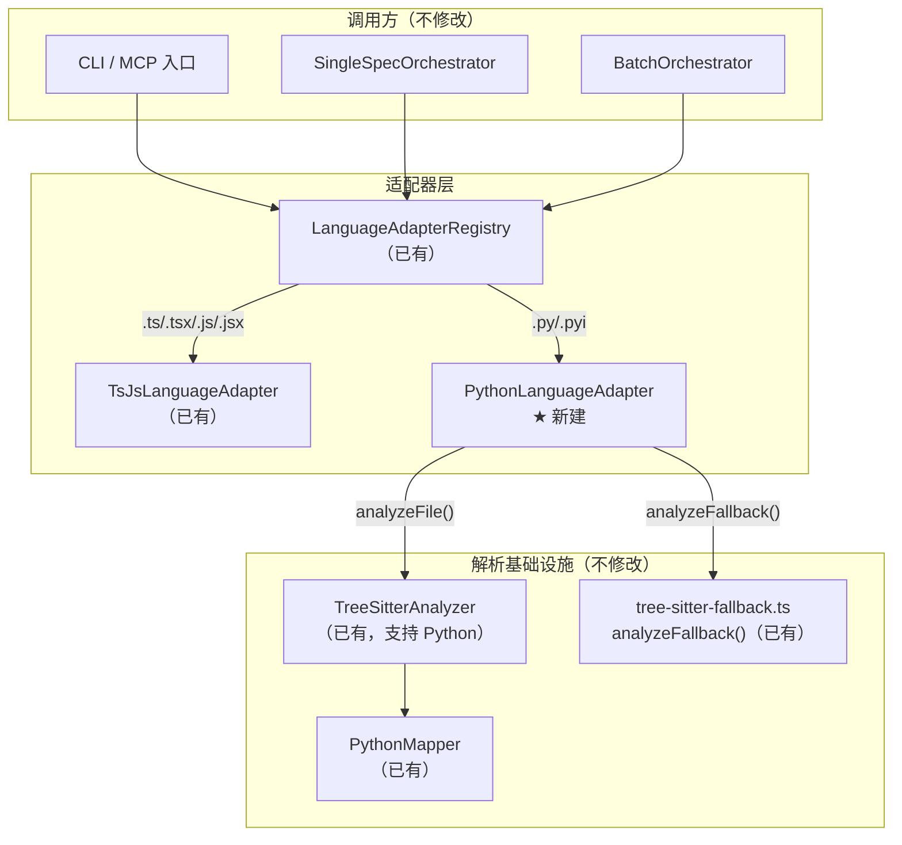

# Implementation Plan: Python LanguageAdapter 实现

**Branch**: `028-python-language-adapter` | **Date**: 2026-03-17 | **Spec**: [spec.md](./spec.md)
**Input**: Feature specification from `specs/028-python-language-adapter/spec.md`

---

## Summary

实现 `PythonLanguageAdapter` 类——一个轻量"胶水层"，将 Feature 025 定义的 `LanguageAdapter` 接口与 Feature 027 已实现的 `TreeSitterAnalyzer` + `PythonMapper` 基础设施连接起来。整体改动仅涉及 **1 个新建文件**（适配器实现）和 **1 个修改文件**（注册入口），不引入任何新运行时依赖。这是 Blueprint 024 规划的第一种非 TS/JS 语言适配器，同时验证 LanguageAdapter 架构的可扩展性。

---

## Technical Context

**Language/Version**: TypeScript 5.x, Node.js LTS (20.x+)
**Primary Dependencies**: web-tree-sitter（已有）、zod（已有）——无新增运行时依赖
**Storage**: N/A
**Testing**: vitest（项目已有配置）
**Target Platform**: Node.js CLI / MCP Server
**Project Type**: Single project（npm package）
**Performance Goals**: 500 个 Python 文件的 AST 解析 < 10s（沿用 Constitution VII 约束）
**Constraints**: 纯 Node.js 生态，不调用 Python 运行时；不修改核心流水线文件
**Scale/Scope**: 1 个新源文件 + 1 行注册代码修改 + 1 个测试文件

---

## Constitution Check

| 原则 | 适用性 | 评估 | 说明 |
|------|--------|------|------|
| I. 双语文档规范 | 适用 | PASS | 本计划及代码注释使用中文，代码标识符使用英文 |
| II. Spec-Driven Development | 适用 | PASS | 遵循 spec.md -> plan.md -> tasks.md -> 实现流程 |
| III. 诚实标注不确定性 | 适用 | PASS | 无不确定项——所有基础设施已就绪并验证 |
| IV. AST 精确性优先 | 适用 | PASS | Python 结构化数据完全由 tree-sitter AST + PythonMapper 提取 |
| V. 混合分析流水线 | 适用 | PASS | analyzeFile 委托 TreeSitterAnalyzer（AST 扫描），LLM 仅做文本增强 |
| VI. 只读安全性 | 适用 | PASS | PythonLanguageAdapter 仅读取 Python 源文件，写操作限于 specs/ 目录 |
| VII. 纯 Node.js 生态 | 适用 | PASS | 不引入 Python 运行时，使用 web-tree-sitter（WASM）解析 Python AST |
| VIII-XII. spec-driver 约束 | 不适用 | N/A | 本 Feature 属于 Plugin: reverse-spec |

**结论**: 全部通过，无 VIOLATION。

---

## Architecture

### Mermaid 架构图



### 数据流

```
.py 文件 → Registry.getAdapter() → PythonLanguageAdapter
  ├── analyzeFile()
  │   └── TreeSitterAnalyzer.analyze(filePath, 'python')
  │       └── PythonMapper.extractExports/extractImports/extractParseErrors
  │           └── CodeSkeleton { language: 'python', parserUsed: 'tree-sitter' }
  └── analyzeFallback()
      └── tree-sitter-fallback.analyzeFallback(filePath)
          ├── 优先: TreeSitterAnalyzer.analyze() → CodeSkeleton
          └── 兜底: regexFallback() → CodeSkeleton（正则提取）
```

---

## Project Structure

### 文档（本 Feature）

```text
specs/028-python-language-adapter/
├── spec.md              # 需求规范（已完成）
├── plan.md              # 本文件
└── tasks.md             # 实现任务（后续生成）
```

### 源代码变更

```text
src/adapters/
├── language-adapter.ts            # 不修改（接口定义）
├── language-adapter-registry.ts   # 不修改（Registry 实现）
├── ts-js-adapter.ts               # 不修改（参考实现）
├── python-adapter.ts              # ★ 新建（PythonLanguageAdapter 实现）
└── index.ts                       # ✏️ 修改（取消注释注册代码 + 新增 import/export）

tests/adapters/
├── ts-js-adapter.test.ts          # 不修改（参考测试）
├── python-adapter.test.ts         # ★ 新建（PythonLanguageAdapter 单元测试）
└── language-adapter-registry.test.ts  # 不修改（已有 Registry 测试）
```

---

## 实现策略

### 文件 1: `src/adapters/python-adapter.ts`（新建）

PythonLanguageAdapter 是一个约 90-100 行的"胶水层"类，结构与 `TsJsLanguageAdapter` 高度对称：

**静态属性：**
- `id`: `'python'`
- `languages`: `['python']`
- `extensions`: `Set(['.py', '.pyi'])`
- `defaultIgnoreDirs`: `Set(['__pycache__', '.venv', 'venv', '.tox', '.mypy_cache', '.pytest_cache', '.eggs'])`

**方法实现：**

| 方法 | 委托目标 | 说明 |
|------|----------|------|
| `analyzeFile(filePath, options?)` | `TreeSitterAnalyzer.getInstance().analyze(filePath, 'python', options)` | 传递 `includePrivate` 选项 |
| `analyzeFallback(filePath)` | `analyzeFallback(filePath)` from `tree-sitter-fallback.ts` | 已内置 Python 正则降级支持 |
| `getTerminology()` | 直接返回静态对象 | Python 特有术语映射 |
| `getTestPatterns()` | 直接返回静态对象 | `test_*.py`, `*_test.py`, `conftest.py` |
| `buildDependencyGraph` | **不实现**（MAY，FR-026） | 初始版本不提供，接口定义为可选方法 |

**`getTerminology()` 返回值：**

```typescript
{
  codeBlockLanguage: 'python',
  exportConcept: '公开符号（非 _ 前缀的模块级定义 + __all__ 机制）',
  importConcept: 'import / from...import 导入',
  typeSystemDescription: '可选类型注解（PEP 484 type hints）',
  interfaceConcept: 'Protocol（PEP 544）/ ABC（Abstract Base Class）',
  moduleSystem: 'Python package/module（__init__.py + import 机制）',
}
```

**`getTestPatterns()` 返回值：**

```typescript
{
  filePattern: /(?:^test_.*\.py$|_test\.py$|^conftest\.py$)/,
  testDirs: ['tests', 'test'],
}
```

### 文件 2: `src/adapters/index.ts`（修改）

三处改动：

1. **新增导出声明**: `export { PythonLanguageAdapter } from './python-adapter.js';`
2. **新增 import**: `import { PythonLanguageAdapter } from './python-adapter.js';`
3. **取消注释注册**: 将 `// registry.register(new PythonLanguageAdapter());` 改为 `registry.register(new PythonLanguageAdapter());`

### 不需要修改的文件

以下文件**不需要任何修改**（验证 SC-005: LanguageAdapter 架构的可扩展性）：

- `src/core/tree-sitter-analyzer.ts` — PythonMapper 已在构造函数中注册
- `src/core/query-mappers/python-mapper.ts` — 已完整实现
- `src/core/tree-sitter-fallback.ts` — 已支持 `.py`/`.pyi` 文件
- `src/core/file-scanner.ts` — 通过 Registry.getSupportedExtensions() 动态获取
- `src/core/single-spec-orchestrator.ts` — 通过 Registry.getAdapter() 路由
- `src/core/batch-orchestrator.ts` — 通过 Registry.getAdapter() 路由

---

## 测试策略

### 测试文件: `tests/adapters/python-adapter.test.ts`（新建）

参照 `tests/adapters/ts-js-adapter.test.ts` 的结构，覆盖以下测试组：

#### Group 1: 静态属性测试（6 个 test case）

| # | 测试用例 | 覆盖 FR |
|---|----------|---------|
| 1 | `id` 为 `'python'` | FR-002 |
| 2 | `languages` 包含且仅包含 `['python']` | FR-003 |
| 3 | `extensions` 包含 `.py` 和 `.pyi` | FR-004 |
| 4 | `defaultIgnoreDirs` 包含 `__pycache__`, `.venv`, `venv`, `.tox`, `.mypy_cache` | FR-021 |
| 5 | `defaultIgnoreDirs` 额外包含 `.pytest_cache`, `.eggs` | FR-022 |
| 6 | `LanguageAdapter` 接口实现检查（方法签名完整性） | FR-001 |

#### Group 2: getTerminology() 测试（3 个 test case）

| # | 测试用例 | 覆盖 FR |
|---|----------|---------|
| 7 | `codeBlockLanguage` 为 `'python'` | FR-019 |
| 8 | `exportConcept` 包含 `__all__` 关键词 | FR-019 |
| 9 | `interfaceConcept` 包含 `Protocol` 和 `ABC` | FR-019 |

#### Group 3: getTestPatterns() 测试（4 个 test case）

| # | 测试用例 | 覆盖 FR |
|---|----------|---------|
| 10 | `filePattern` 匹配 `test_example.py` | FR-020, SC-007 |
| 11 | `filePattern` 匹配 `example_test.py` 和 `conftest.py` | FR-020, SC-007 |
| 12 | `filePattern` 不匹配 `main.py`、`utils.py` | FR-020, SC-007 |
| 13 | `testDirs` 包含 `tests` 和 `test` | FR-020 |

#### Group 4: analyzeFile() 集成测试（5 个 test case）

需要 Python fixture 文件（`tests/fixtures/python/`）：

| # | 测试用例 | 覆盖 FR | Fixture |
|---|----------|---------|---------|
| 14 | 提取公开函数定义（含 async def） | FR-007, FR-006 | `basic.py` |
| 15 | 提取类定义和成员方法（含装饰器识别） | FR-008, FR-009 | `classes.py` |
| 16 | 尊重 `__all__` 列表过滤导出 | FR-010 | `with_all.py` |
| 17 | 正确解析多种 import 形式 | FR-012~FR-016 | `imports.py` |
| 18 | 空文件返回空 CodeSkeleton | Edge Case | `empty.py` |

#### Group 5: Registry 集成测试（3 个 test case）

| # | 测试用例 | 覆盖 FR |
|---|----------|---------|
| 19 | `registry.getAdapter('example.py')` 返回 PythonLanguageAdapter | FR-023, FR-024 |
| 20 | `registry.getAdapter('example.pyi')` 返回 PythonLanguageAdapter | FR-023 |
| 21 | `registry.getDefaultIgnoreDirs()` 包含 Python + TS/JS 忽略目录合集 | FR-025 |

**总计**: 21 个 test case（超过 SC-006 要求的 15 个下限）

### Fixture 文件

```text
tests/fixtures/python/
├── basic.py          # 公开函数、async def、类型注解、私有函数（_helper）
├── classes.py        # 类定义、@staticmethod、@classmethod、@property、继承
├── with_all.py       # 定义 __all__，部分名称不在 __all__ 中
├── imports.py        # import os / from os.path import join / from . import utils / from module import *
└── empty.py          # 空文件（0 字节）
```

---

## Complexity Tracking

本 Feature 无需任何 Constitution 豁免。实现方案是最简单的"胶水层"委托模式——与 TsJsLanguageAdapter 结构完全对称，没有偏离简单方案的决策。

| 决策 | 复杂度评估 | 理由 |
|------|-----------|------|
| 不实现 `buildDependencyGraph` | 降低复杂度 | FR-026 为 MAY 级别；Python 的 import 解析到依赖图需要额外处理 `__init__.py` 包结构，初始版本复杂度不值得 |
| 正则降级复用 `tree-sitter-fallback.ts` | 维持现状 | 该文件已内置 Python 支持（`getLanguage()` 已映射 `.py`/`.pyi`），无需新增正则规则 |
| `getTestPatterns().filePattern` 使用单一正则 | 最简方案 | `/(?:^test_.*\.py$\|_test\.py$\|^conftest\.py$)/` 用一条正则覆盖三种命名约定，避免多正则匹配逻辑 |
