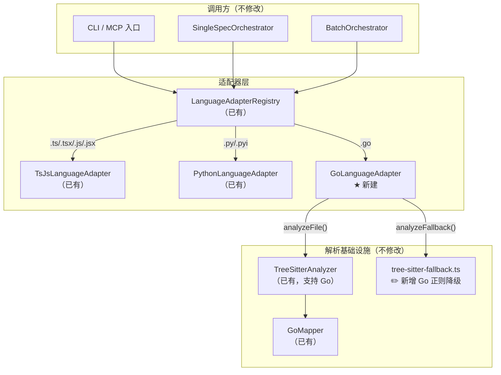

# Implementation Plan: Go LanguageAdapter 实现

**Branch**: `029-go-language-adapter` | **Date**: 2026-03-17 | **Spec**: [spec.md](./spec.md)
**Input**: Feature specification from `specs/029-go-language-adapter/spec.md`

---

## Summary

实现 `GoLanguageAdapter` 类——一个轻量"胶水层"，将 Feature 025 定义的 `LanguageAdapter` 接口与 Feature 027 已实现的 `TreeSitterAnalyzer` + `GoMapper` 基础设施连接起来。整体改动涉及 **1 个新建文件**（适配器实现）、**1 个修改文件**（注册入口）和 **1 个修改文件**（Go 正则降级），不引入任何新运行时依赖。实现模式与 PythonLanguageAdapter（Feature 028）完全对称。

---

## Technical Context

**Language/Version**: TypeScript 5.x, Node.js LTS (20.x+)
**Primary Dependencies**: web-tree-sitter（已有）、zod（已有）——无新增运行时依赖
**Storage**: N/A
**Testing**: vitest（项目已有配置）
**Target Platform**: Node.js CLI / MCP Server
**Project Type**: Single project（npm package）
**Performance Goals**: 500 个 Go 文件的 AST 解析 < 10s（沿用 Constitution VII 约束）
**Constraints**: 纯 Node.js 生态，不调用 Go 运行时；不修改核心流水线文件
**Scale/Scope**: 1 个新源文件 + 2 个修改文件 + 1 个测试文件

---

## Constitution Check

| 原则 | 适用性 | 评估 | 说明 |
|------|--------|------|------|
| I. 双语文档规范 | 适用 | PASS | 本计划及代码注释使用中文，代码标识符使用英文 |
| II. Spec-Driven Development | 适用 | PASS | 遵循 spec.md -> plan.md -> tasks.md -> 实现流程 |
| III. 诚实标注不确定性 | 适用 | PASS | 无不确定项——所有基础设施已就绪并验证 |
| IV. AST 精确性优先 | 适用 | PASS | Go 结构化数据完全由 tree-sitter AST + GoMapper 提取 |
| V. 混合分析流水线 | 适用 | PASS | analyzeFile 委托 TreeSitterAnalyzer（AST 扫描），LLM 仅做文本增强 |
| VI. 只读安全性 | 适用 | PASS | GoLanguageAdapter 仅读取 Go 源文件，写操作限于 specs/ 目录 |
| VII. 纯 Node.js 生态 | 适用 | PASS | 不引入 Go 运行时，使用 web-tree-sitter（WASM）解析 Go AST |
| VIII-XII. spec-driver 约束 | 不适用 | N/A | 本 Feature 属于 Plugin: reverse-spec |

**结论**: 全部通过，无 VIOLATION。

---

## Architecture

### Mermaid 架构图



### 数据流

```
.go 文件 --> Registry.getAdapter() --> GoLanguageAdapter
  |-- analyzeFile()
  |   \-- TreeSitterAnalyzer.analyze(filePath, 'go')
  |       \-- GoMapper.extractExports/extractImports/extractParseErrors
  |           \-- CodeSkeleton { language: 'go', parserUsed: 'tree-sitter' }
  \-- analyzeFallback()
      \-- tree-sitter-fallback.analyzeFallback(filePath)
          |-- 优先: TreeSitterAnalyzer.analyze() --> CodeSkeleton
          \-- 兜底: regexFallback() --> CodeSkeleton（Go 正则提取）
```

---

## Project Structure

### 文档（本 Feature）

```text
specs/029-go-language-adapter/
├── spec.md              # 需求规范（已完成）
├── plan.md              # 本文件
└── tasks.md             # 实现任务（后续生成）
```

### 源代码变更

```text
src/adapters/
├── language-adapter.ts            # 不修改（接口定义）
├── language-adapter-registry.ts   # 不修改（Registry 实现）
├── ts-js-adapter.ts               # 不修改
├── python-adapter.ts              # 不修改
├── go-adapter.ts                  # ★ 新建（GoLanguageAdapter 实现）
└── index.ts                       # ✏️ 修改（新增 import/export + 注册）

src/core/
└── tree-sitter-fallback.ts        # ✏️ 修改（新增 Go 正则降级函数）

tests/adapters/
├── python-adapter.test.ts         # 不修改（参考测试）
├── go-adapter.test.ts             # ★ 新建（GoLanguageAdapter 单元测试）
└── language-adapter-registry.test.ts  # 不修改
```

---

## 实现策略

### 文件 1: `src/adapters/go-adapter.ts`（新建）

GoLanguageAdapter 是一个约 80-100 行的"胶水层"类，结构与 `PythonLanguageAdapter` 高度对称：

**静态属性：**
- `id`: `'go'`
- `languages`: `['go']`
- `extensions`: `Set(['.go'])`
- `defaultIgnoreDirs`: `Set(['vendor'])`

**方法实现：**

| 方法 | 委托目标 | 说明 |
|------|----------|------|
| `analyzeFile(filePath, options?)` | `TreeSitterAnalyzer.getInstance().analyze(filePath, 'go', options)` | 传递 `includePrivate` 选项 |
| `analyzeFallback(filePath)` | `analyzeFallback(filePath)` from `tree-sitter-fallback.ts` | tree-sitter-fallback.ts 需新增 Go 正则降级支持 |
| `getTerminology()` | 直接返回静态对象 | Go 特有术语映射 |
| `getTestPatterns()` | 直接返回静态对象 | `*_test.go` |
| `buildDependencyGraph` | **不实现**（MAY，FR-025） | 初始版本不提供，后续可调用 `go list -json` |

**`getTerminology()` 返回值：**

```typescript
{
  codeBlockLanguage: 'go',
  exportConcept: '导出标识符（首字母大写即为公开，无需 export 关键字）',
  importConcept: 'import 包路径导入（支持单行和分组导入）',
  typeSystemDescription: '静态强类型系统（编译期类型检查，无泛型继承）',
  interfaceConcept: 'interface 隐式实现（任何实现了 interface 方法集的类型自动满足该接口，无需 implements 声明）',
  moduleSystem: 'Go Modules（go.mod + 包路径导入）',
}
```

**`getTestPatterns()` 返回值：**

```typescript
{
  filePattern: /_test\.go$/,
  testDirs: [],
}
```

### 文件 2: `src/adapters/index.ts`（修改）

三处改动：

1. **新增导出声明**: `export { GoLanguageAdapter } from './go-adapter.js';`
2. **新增 import**: `import { GoLanguageAdapter } from './go-adapter.js';`
3. **新增注册**: `registry.register(new GoLanguageAdapter());`（替换现有注释行 `// registry.register(new GoLanguageAdapter());`）

### 文件 3: `src/core/tree-sitter-fallback.ts`（修改）

新增 Go 正则降级函数（约 50-60 行），与现有的 `extractPythonExportsFromText` / `extractPythonImportsFromText` 对称：

**`extractGoExportsFromText(content: string): ExportSymbol[]`**
- 正则模式：
  - `^func\s+([A-Z]\w*)\s*\(` -- 顶层导出函数
  - `^type\s+([A-Z]\w*)\s+struct\b` -- 导出 struct
  - `^type\s+([A-Z]\w*)\s+interface\b` -- 导出 interface
  - `^type\s+([A-Z]\w*)` -- 其他导出 type
  - `^const\s+([A-Z]\w*)` -- 导出常量
  - `^var\s+([A-Z]\w*)` -- 导出变量
- 仅匹配首字母大写的标识符（Go 可见性规则）

**`extractGoImportsFromText(content: string): ImportReference[]`**
- 正则模式：
  - `import\s+"([^"]+)"` -- 单行导入
  - `"([^"]+)"` in import block -- 分组导入内的每一行

**修改 `regexFallback()` 函数**:
- 在 `language === 'python'` 分支后新增 `language === 'go'` 分支，调用 Go 正则提取器

### 不需要修改的文件

以下文件**不需要任何修改**（验证 SC-005: LanguageAdapter 架构的可扩展性）：

- `src/core/tree-sitter-analyzer.ts` -- GoMapper 已在构造函数中注册
- `src/core/query-mappers/go-mapper.ts` -- 已完整实现
- `src/core/file-scanner.ts` -- 通过 Registry.getSupportedExtensions() 动态获取
- `src/core/single-spec-orchestrator.ts` -- 通过 Registry.getAdapter() 路由
- `src/core/batch-orchestrator.ts` -- 通过 Registry.getAdapter() 路由

---

## 测试策略

### 测试文件: `tests/adapters/go-adapter.test.ts`（新建）

参照 `tests/adapters/python-adapter.test.ts` 的结构，覆盖以下测试组：

#### Group 1: 静态属性测试（6 个 test case）

| # | 测试用例 | 覆盖 FR |
|---|----------|---------|
| 1 | `id` 为 `'go'` | FR-002 |
| 2 | `languages` 包含且仅包含 `['go']` | FR-003 |
| 3 | `extensions` 包含 `.go` | FR-004 |
| 4 | `defaultIgnoreDirs` 包含 `vendor` | FR-021 |
| 5 | `extensions` 仅包含 `.go`（size 为 1） | FR-004 |
| 6 | `LanguageAdapter` 接口实现检查（方法签名完整性） | FR-001 |

#### Group 2: analyzeFile() 集成测试（5 个 test case）

使用已有 Go fixture 文件（`tests/fixtures/multilang/go/`）：

| # | 测试用例 | 覆盖 FR | Fixture |
|---|----------|---------|---------|
| 7 | 提取导出函数、struct、interface、const、var | FR-007~FR-009, FR-012, FR-006 | `basic.go` |
| 8 | 首字母大小写可见性正确处理 | FR-011 | `visibility.go` |
| 9 | method receiver 正确关联到 struct | FR-010 | `methods.go` |
| 10 | 空文件（仅 package 声明）返回空导出 | Edge Case | `empty.go` |
| 11 | 语法错误文件仍可部分解析 | Edge Case | `syntax-error.go` |

#### Group 3: import 解析测试（1 个 test case，含多项断言）

| # | 测试用例 | 覆盖 FR | Fixture |
|---|----------|---------|---------|
| 12 | 正确解析单行导入、分组导入、`isTypeOnly` 为 false | FR-013~FR-016 | `basic.go` |

#### Group 4: getTerminology() 测试（3 个 test case）

| # | 测试用例 | 覆盖 FR |
|---|----------|---------|
| 13 | `codeBlockLanguage` 为 `'go'` | FR-019 |
| 14 | `exportConcept` 描述首字母大写导出规则 | FR-019 |
| 15 | `interfaceConcept` 描述隐式接口实现 | FR-019 |

#### Group 5: getTestPatterns() 测试（4 个 test case）

| # | 测试用例 | 覆盖 FR |
|---|----------|---------|
| 16 | `filePattern` 匹配 `server_test.go` 和 `main_test.go` | FR-020, SC-007 |
| 17 | `filePattern` 不匹配 `server.go` 和 `main.go` | FR-020, SC-007 |
| 18 | `testDirs` 为空数组 | FR-020 |
| 19 | `filePattern` 不匹配 `test.go`（无 `_test` 后缀） | FR-020 |

#### Group 6: Registry 集成测试（3 个 test case）

| # | 测试用例 | 覆盖 FR |
|---|----------|---------|
| 20 | `registry.getAdapter('example.go')` 返回 GoLanguageAdapter | FR-022, FR-023 |
| 21 | 不与 TsJsLanguageAdapter 和 PythonLanguageAdapter 冲突 | FR-023 |
| 22 | `registry.getDefaultIgnoreDirs()` 包含 Go + Python + TS/JS 忽略目录合集 | FR-024 |

#### Group 7: analyzeFallback() 测试（1 个 test case）

| # | 测试用例 | 覆盖 FR |
|---|----------|---------|
| 23 | 对 Go 文件返回有效的 CodeSkeleton | FR-017 |

**总计**: 23 个 test case（超过 SC-006 要求的 15 个下限）

### Fixture 文件

已有的 Go fixture 文件（`tests/fixtures/multilang/go/`）已足够覆盖所有测试场景：

```text
tests/fixtures/multilang/go/
├── basic.go          # 函数、struct、interface、const、var、多种 import
├── visibility.go     # 首字母大小写可见性测试
├── methods.go        # method receiver、值接收者/指针接收者
├── empty.go          # 仅 package 声明的空文件
└── syntax-error.go   # 包含语法错误的文件
```

**注意**: 无需像 Feature 028 一样新建 fixture 文件，因为 Feature 027 在实现 GoMapper 时已创建了完整的 Go fixture 集合。

---

## Complexity Tracking

本 Feature 无需任何 Constitution 豁免。实现方案是最简单的"胶水层"委托模式——与 PythonLanguageAdapter 结构完全对称，没有偏离简单方案的决策。

| 决策 | 复杂度评估 | 理由 |
|------|-----------|------|
| 不实现 `buildDependencyGraph` | 降低复杂度 | FR-025 为 MAY 级别；调用 `go list -json` 需要系统安装 Go 运行时，与 Constitution VII（纯 Node.js 生态）冲突，后续版本再考虑 |
| 新增 Go 正则降级到 `tree-sitter-fallback.ts` | 适度增加 | 与 Python 正则降级结构对称，约 50 行代码。必须实现以满足 FR-017/FR-018 |
| `getTestPatterns().testDirs` 为空数组 | 最简方案 | Go 测试文件与源文件共存于同一目录，不使用独立测试目录，这是 Go 的设计哲学 |
| 复用已有 Go fixture | 降低复杂度 | Feature 027 已创建完整的 Go fixture，无需重复创建 |
