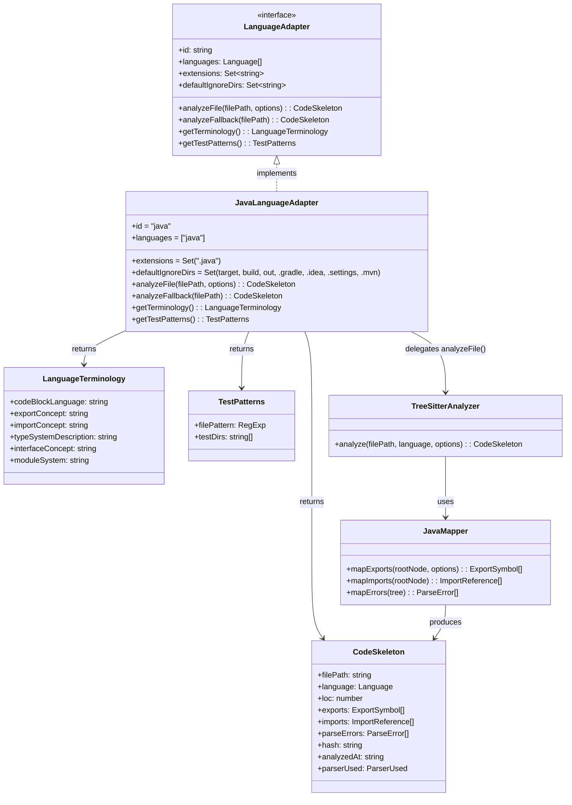

# Data Model: Java LanguageAdapter

**Feature**: 030-java-language-adapter
**Date**: 2026-03-17

---

## 核心实体

本 Feature 不引入新的数据模型。`JavaLanguageAdapter` 完全复用现有的 `CodeSkeleton`、`ExportSymbol`、`ImportReference` 等模型（定义于 `src/models/code-skeleton.ts`）。`'java'` 已在 `LanguageSchema` 的枚举值中。

### 实体关系

### 复用的数据类型

| 类型 | 文件 | 说明 |
|------|------|------|
| `CodeSkeleton` | `src/models/code-skeleton.ts` | AST 提取的文件结构中间表示 |
| `ExportSymbol` | `src/models/code-skeleton.ts` | 导出符号（class/interface/enum/record/method/field） |
| `ImportReference` | `src/models/code-skeleton.ts` | 导入引用（`import java.util.List` 等） |
| `ParseError` | `src/models/code-skeleton.ts` | 解析错误信息 |
| `Language` | `src/models/code-skeleton.ts` | 语言枚举，已含 `'java'` |
| `LanguageAdapter` | `src/adapters/language-adapter.ts` | 适配器接口定义 |
| `AnalyzeFileOptions` | `src/adapters/language-adapter.ts` | 分析选项（`includePrivate`, `maxDepth`） |
| `LanguageTerminology` | `src/adapters/language-adapter.ts` | 语言术语映射 |
| `TestPatterns` | `src/adapters/language-adapter.ts` | 测试文件匹配模式 |

### Java 特有的字段值映射

当 `JavaLanguageAdapter.analyzeFile()` 返回 `CodeSkeleton` 时：

| 字段 | Java 特有取值 | 说明 |
|------|--------------|------|
| `language` | `'java'` | Language 枚举值 |
| `parserUsed` | `'tree-sitter'` | 正常解析和正则降级均标记为 `'tree-sitter'`（与现有约定一致） |
| `exports[].kind` | `'class'`, `'interface'`, `'enum'`, `'data_class'`(record), `'function'`(method) | ExportKind 枚举的子集 |
| `exports[].visibility` | `'public'`, `'protected'`, `'private'`, `undefined`(package-private) | Java 四级可见性 |
| `exports[].isDefault` | 始终 `false` | Java 无 default export 概念 |
| `imports[].isRelative` | 始终 `false` | Java import 均为绝对包路径 |
| `imports[].isTypeOnly` | 始终 `false` | Java 不区分类型导入和值导入 |
