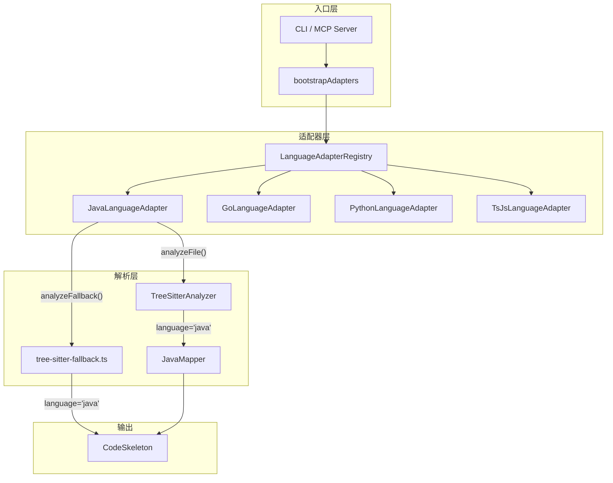

# Implementation Plan: Java LanguageAdapter 实现

**Branch**: `030-java-language-adapter` | **Date**: 2026-03-17 | **Spec**: [spec.md](./spec.md)
**Input**: Feature specification from `specs/030-java-language-adapter/spec.md`

## Summary

实现 `JavaLanguageAdapter` 类（实现 `LanguageAdapter` 接口），为 reverse-spec 工具提供 Java 语言的完整支持。采用与 GoLanguageAdapter（73 行）和 PythonLanguageAdapter（80 行）完全同构的委托模式：`analyzeFile()` 委托 `TreeSitterAnalyzer.analyze()`，`analyzeFallback()` 委托 `tree-sitter-fallback.ts` 的 `analyzeFallback()`。JavaMapper（482 行）已在 Feature 027 中完整实现，本 Feature 主要是"胶水层"——新增适配器文件、注册到 `bootstrapAdapters()`、并在 `tree-sitter-fallback.ts` 中补充 Java 专用正则降级提取器。

## Technical Context

**Language/Version**: TypeScript 5.x, Node.js LTS (20.x+)
**Primary Dependencies**: 无新增。复用现有 `web-tree-sitter`、`tree-sitter-java`（WASM grammar）、`zod`
**Storage**: N/A
**Testing**: Vitest（现有测试框架）
**Target Platform**: Node.js CLI + MCP Server
**Project Type**: single
**Performance Goals**: 500 个文件的 AST 解析 10 秒内完成（Constitution VII 约束，Java 适配器不改变此指标）
**Constraints**: 零新增运行时依赖（FR-028）；不修改核心流水线文件（SC-005）
**Scale/Scope**: 新增 1 个适配器源文件（约 90 行）+ 修改 2 个现有文件（`index.ts` 注册 + `tree-sitter-fallback.ts` 正则降级）+ 新增 1 个测试文件（约 300 行，15+ 测试用例）

## Constitution Check

*GATE: Must pass before Phase 0 research. Re-check after Phase 1 design.*

| # | 原则 | 适用性 | 评估 | 说明 |
|---|------|--------|------|------|
| I | 双语文档规范 | 适用 | PASS | 所有文档中文撰写，代码标识符英文 |
| II | Spec-Driven Development | 适用 | PASS | 遵循标准流程：spec.md -> plan.md -> tasks.md -> 实现 -> 验证 |
| III | 诚实标注不确定性 | 适用 | PASS | 无推断性内容，所有技术决策基于已有代码实现 |
| IV | AST 精确性优先 | 适用 | PASS | `analyzeFile()` 委托 `TreeSitterAnalyzer`（AST 解析），`analyzeFallback()` 为正则降级兜底，与混合流水线完全一致 |
| V | 混合分析流水线 | 适用 | PASS | Java 适配器遵循三阶段流水线：预处理（TreeSitterAnalyzer + JavaMapper AST 提取）-> 上下文组装 -> 生成与增强 |
| VI | 只读安全性 | 适用 | PASS | Java 适配器仅读取 `.java` 源文件进行分析，写入仅限 `specs/` 目录 |
| VII | 纯 Node.js 生态 | 适用 | PASS | 无新增运行时依赖（FR-028），复用 Feature 027 已引入的 `web-tree-sitter` + `tree-sitter-java` WASM grammar |
| VIII-XII | spec-driver 约束 | 不适用 | N/A | 本 Feature 属于 Plugin: reverse-spec 范畴，不涉及 spec-driver |

**Constitution Check 结论**: 全部 PASS，无 VIOLATION。

## Project Structure

### Documentation (this feature)

```text
specs/030-java-language-adapter/
├── spec.md              # 需求规范（已有）
├── plan.md              # 本文件
├── research.md          # 技术决策研究
├── data-model.md        # 数据模型（复用现有 CodeSkeleton）
├── quickstart.md        # 快速上手指南
├── contracts/           # API 契约
│   └── java-adapter-api.md
└── tasks.md             # 任务分解（由 /speckit.tasks 生成）
```

### Source Code (repository root)

```text
src/
├── adapters/
│   ├── language-adapter.ts           # LanguageAdapter 接口定义（不修改）
│   ├── language-adapter-registry.ts  # 注册中心（不修改）
│   ├── ts-js-adapter.ts             # TS/JS 适配器（不修改）
│   ├── python-adapter.ts            # Python 适配器（不修改）
│   ├── go-adapter.ts                # Go 适配器（不修改）
│   ├── java-adapter.ts              # [新增] Java 适配器
│   └── index.ts                     # [修改] bootstrapAdapters() 注册 JavaLanguageAdapter
├── core/
│   ├── tree-sitter-analyzer.ts      # TreeSitterAnalyzer（不修改，已注册 JavaMapper）
│   ├── tree-sitter-fallback.ts      # [修改] regexFallback() 新增 Java 正则降级分支
│   └── query-mappers/
│       └── java-mapper.ts           # JavaMapper（不修改，Feature 027 已完成）
└── models/
    └── code-skeleton.ts             # CodeSkeleton 模型（不修改，'java' 已在 LanguageSchema）

tests/
├── adapters/
│   ├── go-adapter.test.ts           # Go 适配器测试（参考模板）
│   ├── python-adapter.test.ts       # Python 适配器测试（参考模板）
│   └── java-adapter.test.ts         # [新增] Java 适配器测试
└── fixtures/
    └── multilang/
        └── java/                    # Java 测试 fixture（已有，Feature 027 创建）
            ├── Basic.java           # class + interface + enum + import + 构造器 + 方法 + 字段
            ├── Generics.java        # 泛型类 + 泛型接口 + 泛型方法
            ├── Modifiers.java       # abstract class + final class + 各可见性修饰符
            ├── Record.java          # Java 16+ record 类型
            └── empty.java           # 空文件（边界用例）
```

**Structure Decision**: 单一项目结构。Java 适配器代码放在 `src/adapters/java-adapter.ts`，与 Go/Python 适配器同目录同模式。测试放在 `tests/adapters/java-adapter.test.ts`，复用现有 `tests/fixtures/multilang/java/` fixture 文件。

## Architecture

### 委托模式架构



### 数据流

1. **用户执行** `reverse-spec generate <target.java>`
2. **CLI/MCP** 调用 `bootstrapAdapters()` 完成适配器注册
3. **file-scanner** 扫描到 `.java` 文件，通过 `registry.getAdapter('Example.java')` 路由到 `JavaLanguageAdapter`
4. **JavaLanguageAdapter.analyzeFile()** 委托 `TreeSitterAnalyzer.analyze(filePath, 'java')`
5. **TreeSitterAnalyzer** 加载 Java WASM grammar，调用 `JavaMapper` 将 AST 映射为 `CodeSkeleton`
6. 若 tree-sitter 失败，`analyzeFallback()` 委托 `tree-sitter-fallback.ts`，走正则降级路径
7. **输出** `CodeSkeleton`（language='java', parserUsed='tree-sitter'）

### 新增/修改文件清单

| 文件 | 操作 | 行数估计 | 说明 |
|------|------|---------|------|
| `src/adapters/java-adapter.ts` | 新增 | ~90 行 | JavaLanguageAdapter 实现 |
| `src/adapters/index.ts` | 修改 | +4 行 | 导入 + 注册 + 导出 |
| `src/core/tree-sitter-fallback.ts` | 修改 | +80 行 | Java 正则降级提取（导出 + 导入） |
| `tests/adapters/java-adapter.test.ts` | 新增 | ~300 行 | 15+ 测试用例 |
| **总计** | | ~474 行 | |

### 不修改的文件（零回归保证）

以下文件 **不需要修改**，满足 SC-005 的约束：

- `src/utils/file-scanner.ts` — 通过 `registry.getDefaultIgnoreDirs()` 自动获取 Java 忽略目录
- `src/core/single-spec-orchestrator.ts` — 通过 `registry.getAdapter()` 自动路由到 Java 适配器
- `src/core/batch-orchestrator.ts` — 同上
- `src/core/tree-sitter-analyzer.ts` — JavaMapper 已注册（Feature 027）
- `src/core/query-mappers/java-mapper.ts` — 已完成（Feature 027，482 行）
- `src/models/code-skeleton.ts` — `'java'` 已在 `LanguageSchema`

## Complexity Tracking

> 本计划无 Constitution Check violation，无需豁免。

| 决策 | 选择 | 更简单的替代方案 | 拒绝理由 |
|------|------|-----------------|---------|
| Java 正则降级提取器 | 新增 `extractJavaExportsFromText()` + `extractJavaImportsFromText()` | 复用 TS/JS 默认正则 | Java 语法与 TS/JS 差异大（无 `export` 关键字，使用 `public class` 声明），TS/JS 正则无法提取任何有效 Java 结构 |
| `defaultIgnoreDirs` 包含 7 个目录 | `target`, `build`, `out`, `.gradle`, `.idea`, `.settings`, `.mvn` | 仅 MUST 级别的 4 个 | FR-022 SHOULD 级别推荐额外 3 个，成本为零（仅是 Set 初始值），收益为减少用户配置负担 |
| `filePattern` 使用 `^.*` 前缀 | `/^(.*Test\|Test.*\|.*Tests\|.*IT)\.java$/` | 仅匹配文件名 `/^(Test.*\|.*Test\|.*Tests\|.*IT)\.java$/` | CL-002 决策要求兼容纯文件名和含路径字符串输入，与 Go 适配器 `^.*_test\.go$` 一致 |
