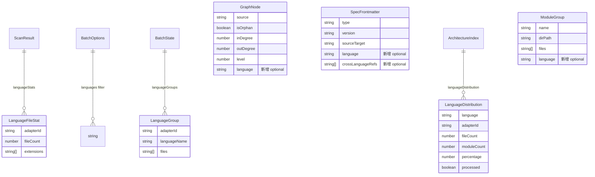

# 数据模型变更: 多语言混合项目支持（Feature 031）

**Feature Branch**: `031-multilang-mixed-project`
**日期**: 2026-03-18

## 变更概览

本特性仅扩展现有数据模型（新增 optional 字段），不修改任何现有字段的类型或语义。所有变更严格向后兼容。

| 模型 | 变更类型 | 新增字段数 |
|------|---------|:---------:|
| `ScanResult` | 扩展 | 1 |
| `GraphNode` | 扩展 | 1 |
| `SpecFrontmatter` | 扩展 | 2 |
| `ArchitectureIndex` | 扩展 | 1 |
| `BatchState` | 扩展 | 2 |
| `StageId` | 扩展 | 2 |
| `LanguageFileStat` | **新增** | — |
| `LanguageDistribution` | **新增** | — |
| `LanguageGroup` | **新增** | — |

---

## 1. 新增实体

### 1.1 LanguageFileStat

**位置**: `src/utils/file-scanner.ts`
**用途**: 描述单种语言在项目中的文件分布统计

```typescript
export interface LanguageFileStat {
  /** 适配器 ID（如 'ts-js', 'python', 'go', 'java'） */
  adapterId: string;
  /** 该语言的文件数量 */
  fileCount: number;
  /** 该语言涉及的文件扩展名列表（如 ['.ts', '.tsx']） */
  extensions: string[];
}
```

**生命周期**: 由 `scanFiles()` 在扫描阶段产出，供 `batch-orchestrator` 和 `index-generator` 消费。

### 1.2 LanguageDistribution

**位置**: `src/models/module-spec.ts`
**用途**: 架构索引中展示的语言分布汇总信息

```typescript
export const LanguageDistributionSchema = z.object({
  /** 语言显示名称（如 'TypeScript'） */
  language: z.string().min(1),
  /** 适配器 ID（如 'ts-js'） */
  adapterId: z.string().min(1),
  /** 文件数 */
  fileCount: z.number().int().nonnegative(),
  /** 模块数 */
  moduleCount: z.number().int().nonnegative(),
  /** 文件占比（%，保留一位小数） */
  percentage: z.number().nonnegative(),
  /** 本次批量生成是否处理了该语言 */
  processed: z.boolean(),
});
export type LanguageDistribution = z.infer<typeof LanguageDistributionSchema>;
```

**Zod 验证**: 所有字段均为必填（在 `ArchitectureIndex` 中该数组本身为 optional）。

### 1.3 LanguageGroup

**位置**: `src/batch/language-grouper.ts`（新增文件）
**用途**: 按语言分组后的文件集合

```typescript
export interface LanguageGroup {
  /** 语言标识（即 adapter.id） */
  adapterId: string;
  /** 语言显示名称 */
  languageName: string;
  /** 该语言的文件路径列表（相对于项目根目录） */
  files: string[];
}
```

**生命周期**: 由 `groupFilesByLanguage()` 在 `batch-orchestrator` 中产出，用于驱动分组依赖图构建。

---

## 2. 扩展的现有实体

### 2.1 ScanResult

**位置**: `src/utils/file-scanner.ts`

```diff
 export interface ScanResult {
   files: string[];
   totalScanned: number;
   ignored: number;
   unsupportedExtensions?: Map<string, number>;
+  /** 各已支持语言的文件统计（key 为 adapter.id） */
+  languageStats?: Map<string, LanguageFileStat>;
 }
```

**向后兼容**: `languageStats` 为 optional，现有调用方不受影响。当 Registry 中有注册适配器时始终填充。

### 2.2 GraphNode

**位置**: `src/models/dependency-graph.ts`

```diff
 export const GraphNodeSchema = z.object({
   source: z.string().min(1),
   isOrphan: z.boolean(),
   inDegree: z.number().int().nonnegative(),
   outDegree: z.number().int().nonnegative(),
   level: z.number().int().nonnegative(),
+  /** 节点所属的编程语言（多语言图合并时使用） */
+  language: z.string().optional(),
 });
```

**向后兼容**: `language` 为 optional。现有的 dependency-cruiser 产出的 `GraphNode` 不设置此字段（保持 undefined）。`buildDirectoryGraph` 产出的节点设置为对应 adapter.id。

### 2.3 SpecFrontmatter

**位置**: `src/models/module-spec.ts`

```diff
 export const SpecFrontmatterSchema = z.object({
   type: z.literal('module-spec'),
   version: z.string().regex(/^v\d+$/),
   generatedBy: z.string().min(1),
   sourceTarget: z.string().min(1),
   relatedFiles: z.array(z.string()),
   lastUpdated: z.string().datetime(),
   confidence: z.enum(['high', 'medium', 'low']),
   skeletonHash: z.string().regex(/^[0-9a-f]{64}$/),
+  /** 模块主要编程语言（多语言项目时设置） */
+  language: z.string().optional(),
+  /** 跨语言引用（如 ['go:services/auth', 'python:scripts/deploy']） */
+  crossLanguageRefs: z.array(z.string()).optional(),
 });
```

**向后兼容**: 两个新字段均为 optional。纯单语言项目不设置这些字段，现有 Spec 解析逻辑不受影响。

**crossLanguageRefs 格式约定**: `"{adapterId}:{modulePath}"`，其中 modulePath 为相对于项目根的路径。

### 2.4 ArchitectureIndex

**位置**: `src/models/module-spec.ts`

```diff
 export const ArchitectureIndexSchema = z.object({
   frontmatter: IndexFrontmatterSchema,
   systemPurpose: z.string().min(1),
   architecturePattern: z.string().min(1),
   moduleMap: z.array(ModuleMapEntrySchema),
   crossCuttingConcerns: z.array(z.string()),
   technologyStack: z.array(TechStackEntrySchema),
   dependencyDiagram: z.string().min(1),
   outputPath: z.string().min(1),
+  /** 语言分布（多语言项目时填充，单语言或 undefined） */
+  languageDistribution: z.array(LanguageDistributionSchema).optional(),
 });
```

**渲染规则**:
- `languageDistribution === undefined` 或长度为 0 → 不渲染"语言分布"section（FR-008）
- `languageDistribution.length === 1` → 不渲染（单语言项目）
- `languageDistribution.length >= 2` → 渲染表格

### 2.5 BatchState

**位置**: `src/models/module-spec.ts`

```diff
 export const BatchStateSchema = z.object({
   batchId: z.string().min(1),
   projectRoot: z.string().min(1),
   startedAt: z.string().datetime(),
   lastUpdatedAt: z.string().datetime(),
   totalModules: z.number().int().nonnegative(),
   processingOrder: z.array(z.string()),
   completedModules: z.array(CompletedModuleSchema),
   failedModules: z.array(FailedModuleSchema),
   currentModule: z.string().nullable().optional(),
   forceRegenerate: z.boolean(),
+  /** 语言分组信息（key: adapterId, value: 文件路径列表） */
+  languageGroups: z.record(z.string(), z.array(z.string())).optional(),
+  /** 过滤语言列表（用于断点恢复时还原过滤条件） */
+  filterLanguages: z.array(z.string()).optional(),
 });
```

**断点恢复兼容性**:
- 旧检查点文件不包含 `languageGroups` 和 `filterLanguages` → Zod parse 忽略（optional 字段），按单语言模式处理
- 新检查点文件包含完整的分组信息 → 恢复时直接使用，无需重新扫描和分组

### 2.6 StageId

**位置**: `src/models/module-spec.ts`

```diff
-export type StageId = 'scan' | 'ast' | 'context' | 'llm' | 'parse' | 'render';
+export type StageId = 'scan' | 'ast' | 'context' | 'llm' | 'parse' | 'render'
+  | 'lang-detect'   // 语言检测阶段（scanFiles 后的语言统计分析）
+  | 'lang-graph';   // 语言级依赖图构建阶段
```

### 2.7 ModuleGroup

**位置**: `src/batch/module-grouper.ts`

```diff
 export interface ModuleGroup {
   name: string;
   dirPath: string;
   files: string[];
+  /** 该模块的主要语言（仅语言感知分组模式下设置） */
+  language?: string;
 }

 export interface GroupingOptions {
   basePrefix?: string;
   depth?: number;
   rootModuleName?: string;
+  /** 启用语言感知分组（同目录不同语言拆分为子模块） */
+  languageAware?: boolean;
 }
```

### 2.8 BatchOptions

**位置**: `src/batch/batch-orchestrator.ts`

```diff
 export interface BatchOptions {
   force?: boolean;
   outputDir?: string;
   onProgress?: (completed: number, total: number) => void;
   maxRetries?: number;
   checkpointPath?: string;
   grouping?: GroupingOptions;
+  /** 语言过滤（如 ['typescript', 'python']），仅处理指定语言的模块 */
+  languages?: string[];
 }
```

### 2.9 BatchResult

**位置**: `src/batch/batch-orchestrator.ts`

```diff
 export interface BatchResult {
   totalModules: number;
   successful: string[];
   failed: FailedModule[];
   skipped: string[];
   degraded: string[];
   duration: number;
   indexGenerated: boolean;
   summaryLogPath: string;
+  /** 检测到的语言列表 */
+  detectedLanguages?: string[];
+  /** 语言统计信息 */
+  languageStats?: Map<string, LanguageFileStat>;
 }
```

---

## 3. 数据流关系图



---

## 4. 序列化格式

### 4.1 languageStats（ScanResult 中的 Map）

`languageStats` 使用 `Map<string, LanguageFileStat>`，在 JSON 序列化时（如检查点持久化）转换为普通对象：

```json
{
  "languageStats": {
    "ts-js": { "adapterId": "ts-js", "fileCount": 30, "extensions": [".ts", ".tsx"] },
    "python": { "adapterId": "python", "fileCount": 15, "extensions": [".py"] },
    "go": { "adapterId": "go", "fileCount": 10, "extensions": [".go"] }
  }
}
```

### 4.2 BatchState 检查点序列化

```json
{
  "batchId": "batch-1710720000000",
  "projectRoot": "/path/to/project",
  "startedAt": "2026-03-18T00:00:00.000Z",
  "lastUpdatedAt": "2026-03-18T00:05:00.000Z",
  "totalModules": 15,
  "processingOrder": ["utils", "models", "services--ts", "services--py", "api"],
  "completedModules": [],
  "failedModules": [],
  "currentModule": "models",
  "forceRegenerate": false,
  "languageGroups": {
    "ts-js": ["src/utils/helpers.ts", "src/api/routes.ts"],
    "python": ["src/services/auth.py", "scripts/deploy.py"]
  },
  "filterLanguages": ["typescript", "python"]
}
```

### 4.3 SpecFrontmatter YAML 输出

```yaml
---
type: module-spec
version: v1
generatedBy: reverse-spec v2.0
sourceTarget: src/services
relatedFiles:
  - src/services/auth.ts
  - src/services/middleware.ts
lastUpdated: 2026-03-18T00:00:00.000Z
confidence: high
skeletonHash: abc123...
language: typescript
crossLanguageRefs:
  - python:src/scripts/deploy
  - go:src/services/auth
---
```

### 4.4 ArchitectureIndex 语言分布 section

```markdown
## 语言分布

| 语言 | 文件数 | 模块数 | 占比 | 本次处理 |
|------|--------|--------|------|---------|
| TypeScript | 30 | 8 | 54.5% | 是 |
| Python | 15 | 4 | 27.3% | 否 |
| Go | 10 | 3 | 18.2% | 否 |
```
