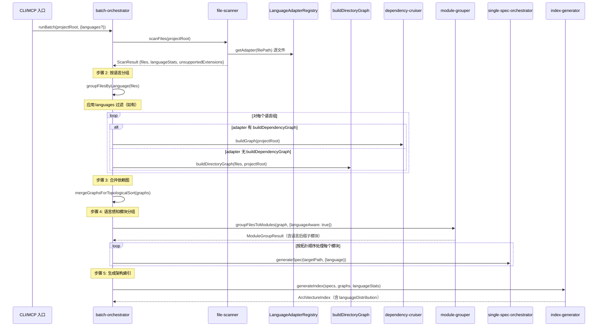
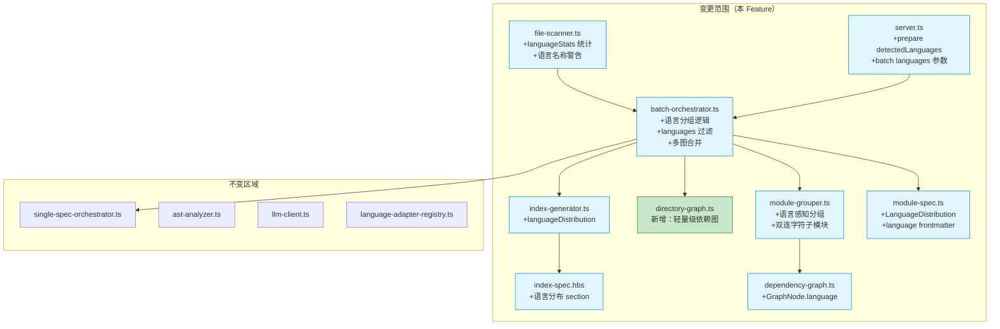

# 技术实现计划: 多语言混合项目支持

## 1. 技术方案概述

本计划让 reverse-spec 能够在批量 Spec 生成流程中自动检测、分组并独立处理多语言混合项目中的各语言模块。核心工作包括：

1. **`scanFiles` 轻量增强**: 在现有 `ScanResult` 中新增 `languageStats` 字段，统计各已支持语言的文件分布；增强不支持语言警告，输出语言名称而非仅扩展名
2. **`batch-orchestrator` 语言分组**: 扫描后按 `LanguageAdapterRegistry.getAdapter()` 对文件进行语言分组，对每组调用对应 adapter 的 `buildDependencyGraph`（如有）或新增的 `buildDirectoryGraph` 兜底方案
3. **`module-grouper` 语言感知**: 同目录下不同语言文件拆分为不同子模块（双连字符命名：`services--ts`、`services--py`）
4. **`CompositeDependencyGraph` 合并**: 多语言依赖图合并仅用于全局拓扑排序，SCC/Mermaid 按语言独立保留
5. **架构索引增加语言分布**: `ArchitectureIndex` 新增 `languageDistribution` 字段和 Handlebars 模板 section
6. **MCP 工具增强**: `prepare` 返回 `detectedLanguages`，`batch` 新增 `languages` 过滤参数
7. **跨语言边界标注**: Spec frontmatter 新增 `language` 和 `crossLanguageRefs` 字段
8. **断点恢复多语言扩展**: `BatchState` 新增 `languageGroups` 字段以支持恢复时正确还原语言分组

**核心约束**: 向后兼容——对纯 TypeScript 项目的行为和输出格式不产生任何破坏性变更。方案 B（Post-Scan Grouping）的影响面集中在 `batch-orchestrator` 和 `index-generator`，`scanFiles` 返回类型不变。

---

## 2. 技术上下文

### 2.1 现有架构

当前批量 Spec 生成的完整流程：

```
runBatch(projectRoot)
  ├── buildGraph(projectRoot)           → DependencyGraph (dependency-cruiser, 仅 JS/TS)
  ├── groupFilesToModules(graph)        → ModuleGroupResult (按目录分组)
  ├── for each module in processingOrder:
  │     ├── generateSpec(targetPath)    → single-spec-orchestrator 三阶段流水线
  │     └── saveCheckpoint(state)       → 断点保存
  ├── generateIndex(specs, graph)       → ArchitectureIndex
  └── writeSummaryLog(summary)
```

**关键限制**:
- `buildGraph()` 内部调用 `dependency-cruiser`，仅支持 JS/TS 生态
- `groupFilesToModules()` 无语言感知——同目录混合语言文件会归入同一模块
- `ScanResult` 不包含语言统计，仅有 `unsupportedExtensions`
- `ArchitectureIndex` 无语言分布信息
- MCP `prepare` 不返回语言列表，`batch` 不支持语言过滤

### 2.2 依赖现状

| 依赖 | 版本 | 本 Feature 操作 |
|------|------|----------------|
| `dependency-cruiser` | ^16.8.0 | 不变（继续用于 JS/TS） |
| `web-tree-sitter` | ^0.24.7 | 不变（用于非 JS/TS 语言的 import 解析） |
| `ts-morph` | ^24.0.0 | 不变 |
| `@modelcontextprotocol/sdk` | ^1.26.0 | 不变（MCP 参数扩展向后兼容） |
| `handlebars` | ^4.7.8 | 不变（模板增加 section） |
| `zod` | ^3.24.1 | 不变（新增 Schema 定义） |

**无新增运行时依赖。**

### 2.3 已注册的语言适配器

| 适配器 | ID | 扩展名 | `buildDependencyGraph` |
|--------|-----|--------|:---------------------:|
| `TsJsLanguageAdapter` | `ts-js` | `.ts/.tsx/.js/.jsx` | 有（通过 `buildGraph` 委托 dependency-cruiser） |
| `PythonLanguageAdapter` | `python` | `.py/.pyi` | **无**（需用 `buildDirectoryGraph` 兜底） |
| `GoLanguageAdapter` | `go` | `.go` | **无**（需用 `buildDirectoryGraph` 兜底） |
| `JavaLanguageAdapter` | `java` | `.java` | **无**（需用 `buildDirectoryGraph` 兜底） |

---

## 3. 架构设计

### 3.1 整体数据流



### 3.2 与现有系统的集成点



### 3.3 CQ-004 合并策略实现

```
各语言独立的 DependencyGraph:
  ├── ts-js-graph   (modules, edges, sccs, mermaidSource)
  ├── python-graph  (modules, edges, sccs, mermaidSource)
  └── go-graph      (modules, edges, sccs, mermaidSource)
          │
          ▼  mergeGraphsForTopologicalSort()
合并后的 processingOrder（仅用于全局拓扑排序）:
  [go-module-a, python-module-b, ts-module-c, ...]
          │
          ▼  索引生成时
各语言的 sccs / mermaidSource 独立保留，按语言分别展示
```

### 3.4 CQ-005 双连字符子模块命名

仅在同目录下检测到多种语言时触发。示例：

```
src/services/
  ├── auth.ts          → 归入模块 "services--ts"
  ├── auth.py          → 归入模块 "services--py"
  └── helpers.go       → 归入模块 "services--go"

src/api/               → 纯 TS 目录
  ├── routes.ts        → 归入模块 "api"（无后缀）
  └── middleware.ts
```

---

## 4. 关键技术决策

### 4.1 方案 B: Post-Scan Grouping

**决策**: 采用方案 B——统一扫描 + 后置语言分组。

**理由**:
1. `scanFiles` 返回类型不变（`ScanResult.files` 仍为 `string[]`），仅新增可选的 `languageStats` 字段
2. `single-spec-orchestrator` 和现有 MCP 工具的 `scanFiles` 调用点无需修改
3. 分组逻辑内聚在 `batch-orchestrator` 中，影响面极小
4. 二次分组遍历 O(n) 对实际项目规模（<5000 文件）可忽略

### 4.2 CQ-004: 依赖图合并策略

**决策**: 选项 C——合并 modules/edges 仅用于全局拓扑排序，SCC/Mermaid 按语言独立保留。

**理由**:
- 跨语言间没有 import 边，合并 SCC 无意义
- 语言独立的 Mermaid 图更清晰易读
- 对现有 `module-grouper` 改动最小——拓扑排序输入只需 `modules + edges`，不需要 SCC

### 4.3 CQ-005: 双连字符子模块命名

**决策**: 选项 B——`services--ts`、`services--py` 格式。

**理由**:
- 双连字符在文件系统中无特殊含义
- 视觉上与普通连字符模块名（如 `auth-service`）易区分
- 仅在同目录下检测到多种语言时才追加后缀，单语言目录保持不变

### 4.4 轻量级依赖图策略

**决策**: 为无 `buildDependencyGraph` 的适配器提供 `buildDirectoryGraph()` 兜底。

**实现原理**:
1. 从 `CodeSkeleton.imports` 中提取 `isRelative: true` 的 import，推断本地依赖边
2. 对于 `isRelative: false` 的 import（第三方包），忽略
3. 无法解析的 import 路径不产生边（宽容策略）
4. 拓扑排序仅基于可识别的本地依赖

**精度评估**: 中等。能正确处理 Python 的相对 import (`from .utils import helper`)，Go 的本地 package import，但无法处理 Python 的绝对 import 路径映射（需要 `pyproject.toml` 解析）。在 Spec 中标注 `confidence: 'medium'` 表明依赖图精度有限。

### 4.5 跨语言边界检测策略

**决策**: MVP 阶段仅做标注，不尝试精确检测跨语言调用。

**策略**:
1. **import 路径推断**: 扫描模块的 import 路径中是否引用了属于其他语言组的路径
2. **通用提示**: 当项目为多语言时，在每个 Spec 的 `constraints` section 末尾追加标准化提示文本
3. **不覆盖隐式调用**: REST/gRPC/FFI/subprocess 等不通过 import 的调用方式，不尝试检测

---

## 5. 接口契约

### 5.1 ScanResult 扩展

```typescript
// src/utils/file-scanner.ts

/** 语言统计信息 */
export interface LanguageFileStat {
  /** 适配器 ID（如 'ts-js', 'python', 'go', 'java'） */
  adapterId: string;
  /** 该语言的文件数量 */
  fileCount: number;
  /** 该语言涉及的文件扩展名列表 */
  extensions: string[];
}

export interface ScanResult {
  files: string[];
  totalScanned: number;
  ignored: number;
  unsupportedExtensions?: Map<string, number>;
  /** 新增：各已支持语言的文件统计 */
  languageStats?: Map<string, LanguageFileStat>;
}
```

### 5.2 BatchOptions 扩展

```typescript
// src/batch/batch-orchestrator.ts

export interface BatchOptions {
  force?: boolean;
  outputDir?: string;
  onProgress?: (completed: number, total: number) => void;
  maxRetries?: number;
  checkpointPath?: string;
  grouping?: GroupingOptions;
  /** 新增：语言过滤（如 ['typescript', 'python']），仅处理指定语言的模块 */
  languages?: string[];
}

export interface BatchResult {
  totalModules: number;
  successful: string[];
  failed: FailedModule[];
  skipped: string[];
  degraded: string[];
  duration: number;
  indexGenerated: boolean;
  summaryLogPath: string;
  /** 新增：检测到的语言列表 */
  detectedLanguages?: string[];
  /** 新增：语言统计信息 */
  languageStats?: Map<string, LanguageFileStat>;
}
```

### 5.3 buildDirectoryGraph

```typescript
// src/graph/directory-graph.ts（新增文件）

import type { DependencyGraph } from '../models/dependency-graph.js';
import type { CodeSkeleton } from '../models/code-skeleton.js';

/**
 * 基于目录结构和 import 推断构建轻量级依赖图
 * 用于无 dependency-cruiser 支持的语言（Python/Go/Java）
 *
 * @param files - 该语言的文件路径列表（相对于 projectRoot）
 * @param projectRoot - 项目根目录
 * @param skeletons - 各文件的 CodeSkeleton（提供 imports 信息）
 * @returns DependencyGraph（无 SCC，拓扑排序基于目录层级 + import 推断）
 */
export async function buildDirectoryGraph(
  files: string[],
  projectRoot: string,
  skeletons: CodeSkeleton[],
): Promise<DependencyGraph>;
```

### 5.4 语言分组函数

```typescript
// src/batch/language-grouper.ts（新增文件）

import type { LanguageFileStat } from '../utils/file-scanner.js';

/** 语言分组结果 */
export interface LanguageGroup {
  /** 语言标识（即 adapter.id，如 'ts-js', 'python'） */
  adapterId: string;
  /** 语言显示名称（如 'TypeScript', 'Python'） */
  languageName: string;
  /** 该语言的文件路径列表 */
  files: string[];
}

/**
 * 将扫描到的文件按语言分组
 *
 * @param files - scanFiles 返回的文件列表
 * @param filterLanguages - 可选的语言过滤（仅保留指定语言）
 * @returns 语言分组结果
 */
export function groupFilesByLanguage(
  files: string[],
  filterLanguages?: string[],
): LanguageGroup[];
```

### 5.5 ModuleGroup 扩展

```typescript
// src/batch/module-grouper.ts

export interface ModuleGroup {
  name: string;
  dirPath: string;
  files: string[];
  /** 新增：该模块的主要语言（仅多语言分组时设置） */
  language?: string;
}

export interface GroupingOptions {
  basePrefix?: string;
  depth?: number;
  rootModuleName?: string;
  /** 新增：启用语言感知分组（同目录不同语言拆分为子模块） */
  languageAware?: boolean;
}
```

### 5.6 SpecFrontmatter 扩展

```typescript
// src/models/module-spec.ts

export const SpecFrontmatterSchema = z.object({
  type: z.literal('module-spec'),
  version: z.string().regex(/^v\d+$/),
  generatedBy: z.string().min(1),
  sourceTarget: z.string().min(1),
  relatedFiles: z.array(z.string()),
  lastUpdated: z.string().datetime(),
  confidence: z.enum(['high', 'medium', 'low']),
  skeletonHash: z.string().regex(/^[0-9a-f]{64}$/),
  /** 新增：模块主要编程语言 */
  language: z.string().optional(),
  /** 新增：跨语言引用（如 ['go:services/auth', 'python:scripts/deploy']） */
  crossLanguageRefs: z.array(z.string()).optional(),
});
```

### 5.7 ArchitectureIndex 扩展

```typescript
// src/models/module-spec.ts

/** 语言分布信息 */
export const LanguageDistributionSchema = z.object({
  /** 语言标识（如 'typescript'） */
  language: z.string().min(1),
  /** 适配器 ID */
  adapterId: z.string().min(1),
  /** 文件数 */
  fileCount: z.number().int().nonnegative(),
  /** 模块数 */
  moduleCount: z.number().int().nonnegative(),
  /** 文件占比（%） */
  percentage: z.number().nonnegative(),
  /** 本次批量生成是否处理了该语言 */
  processed: z.boolean(),
});
export type LanguageDistribution = z.infer<typeof LanguageDistributionSchema>;

export const ArchitectureIndexSchema = z.object({
  frontmatter: IndexFrontmatterSchema,
  systemPurpose: z.string().min(1),
  architecturePattern: z.string().min(1),
  moduleMap: z.array(ModuleMapEntrySchema),
  crossCuttingConcerns: z.array(z.string()),
  technologyStack: z.array(TechStackEntrySchema),
  dependencyDiagram: z.string().min(1),
  outputPath: z.string().min(1),
  /** 新增：语言分布（多语言项目时填充，单语言时为 undefined） */
  languageDistribution: z.array(LanguageDistributionSchema).optional(),
});
```

### 5.8 GraphNode 扩展

```typescript
// src/models/dependency-graph.ts

export const GraphNodeSchema = z.object({
  source: z.string().min(1),
  isOrphan: z.boolean(),
  inDegree: z.number().int().nonnegative(),
  outDegree: z.number().int().nonnegative(),
  level: z.number().int().nonnegative(),
  /** 新增：节点所属的编程语言（多语言图中使用） */
  language: z.string().optional(),
});
```

### 5.9 BatchState 扩展

```typescript
// src/models/module-spec.ts

export const BatchStateSchema = z.object({
  batchId: z.string().min(1),
  projectRoot: z.string().min(1),
  startedAt: z.string().datetime(),
  lastUpdatedAt: z.string().datetime(),
  totalModules: z.number().int().nonnegative(),
  processingOrder: z.array(z.string()),
  completedModules: z.array(CompletedModuleSchema),
  failedModules: z.array(FailedModuleSchema),
  currentModule: z.string().nullable().optional(),
  forceRegenerate: z.boolean(),
  /** 新增：语言分组信息（用于断点恢复时还原语言分组状态） */
  languageGroups: z.record(z.string(), z.array(z.string())).optional(),
  /** 新增：过滤语言列表（用于断点恢复时还原过滤条件） */
  filterLanguages: z.array(z.string()).optional(),
});
```

### 5.10 MCP prepare 增强

```typescript
// src/mcp/server.ts — prepare 工具返回增强

{
  skeletons: [...],
  mergedSkeleton: {...},
  context: {...},
  filePaths: [...],
  /** 新增：检测到的已支持语言列表 */
  detectedLanguages: ['typescript', 'python', 'go']
}
```

### 5.11 MCP batch 增强

```typescript
// src/mcp/server.ts — batch 工具参数增强

server.tool('batch', '批量 Spec 生成', {
  projectRoot: z.string().optional(),
  force: z.boolean().default(false),
  /** 新增：仅处理指定语言 */
  languages: z.array(z.string()).optional()
    .describe('仅处理指定语言（如 ["typescript", "python"]）'),
}, async ({ projectRoot, force, languages }) => { ... });
```

### 5.12 StageId 扩展

```typescript
// src/models/module-spec.ts

/** 新增阶段标识 */
export type StageId = 'scan' | 'ast' | 'context' | 'llm' | 'parse' | 'render'
  | 'lang-detect'   // 语言检测阶段
  | 'lang-graph';   // 语言级依赖图构建阶段
```

---

## 6. 实施策略

### 6.1 实施步骤总览

按**依赖顺序**分为 7 个步骤，每步独立可测试、可回滚。

```
Step 1: 数据模型扩展（Schema 定义）
  │
  ▼
Step 2: scanFiles 增强（languageStats + 语言名称警告）
  │
  ▼
Step 3: buildDirectoryGraph 实现（轻量级依赖图）
  │
  ├──▶ Step 3 可与 Step 4 部分并行
  │
  ▼
Step 4: module-grouper 语言感知分组
  │
  ▼
Step 5: batch-orchestrator 多语言编排核心
  │
  ▼
Step 6: MCP 工具增强 + 索引模板增强
  │
  ▼
Step 7: 端到端集成验证
```

### 6.2 Step 1: 数据模型扩展

**目标**: 扩展所有 Zod Schema 和 TypeScript 类型定义，为后续步骤提供类型基础。

**修改文件**:

| 文件 | 变更 |
|------|------|
| `src/models/module-spec.ts` | 新增 `LanguageDistributionSchema`；扩展 `SpecFrontmatterSchema`（+`language`、`crossLanguageRefs`）；扩展 `ArchitectureIndexSchema`（+`languageDistribution`）；扩展 `BatchStateSchema`（+`languageGroups`、`filterLanguages`）；扩展 `StageId` |
| `src/models/dependency-graph.ts` | 扩展 `GraphNodeSchema`（+`language`） |
| `src/utils/file-scanner.ts` | 新增 `LanguageFileStat` 接口；扩展 `ScanResult`（+`languageStats`） |

**验证门**: `npm run build` 编译通过；现有测试全部通过（新增字段均为 optional，向后兼容）。

**预估改动量**: ~80 行新增/修改

---

### 6.3 Step 2: scanFiles 增强

**目标**: 在文件扫描过程中统计各语言文件分布，增强不支持语言的警告信息。

**修改文件**:

| 文件 | 变更 |
|------|------|
| `src/utils/file-scanner.ts` | `walkDir` 中对支持文件累加 `languageStats`；重构 `unsupportedExtensions` 警告，使用扩展名→语言名映射表 |

**关键实现细节**:

1. 在 `walkDir` 中，当文件扩展名匹配到 Registry 适配器时，累加到 `languageStats` Map
2. `languageStats` 的 key 为适配器 `id`（如 `'ts-js'`、`'python'`），value 为 `LanguageFileStat`
3. 不支持的扩展名使用硬编码的扩展名→语言名映射表输出友好名称（如 `.rs` → `Rust`、`.cpp` → `C++`）
4. 当项目为单语言时，`languageStats` 仍会填充（仅一个条目），向后兼容

**扩展名→语言名映射表**（新增常量）:

```typescript
const KNOWN_LANGUAGE_NAMES: Map<string, string> = new Map([
  ['.rs', 'Rust'], ['.rb', 'Ruby'], ['.swift', 'Swift'],
  ['.kt', 'Kotlin'], ['.cpp', 'C++'], ['.c', 'C'],
  ['.cs', 'C#'], ['.php', 'PHP'], ['.r', 'R'],
  ['.scala', 'Scala'], ['.lua', 'Lua'], ['.dart', 'Dart'],
  ['.zig', 'Zig'], ['.nim', 'Nim'], ['.ex', 'Elixir'],
  ['.erl', 'Erlang'], ['.hs', 'Haskell'], ['.ml', 'OCaml'],
  ['.pl', 'Perl'], ['.sh', 'Shell'], ['.bash', 'Bash'],
]);
```

**测试**:

| 测试文件 | 覆盖内容 | 预估用例数 |
|---------|---------|:---------:|
| `tests/unit/file-scanner.test.ts`（扩展） | languageStats 统计准确性、不支持语言名称警告、纯单语言项目行为 | ~6 |

**验证门**: 现有测试不变通过；新增测试覆盖多语言统计和警告格式。

**预估改动量**: ~100 行修改 + ~80 行测试

---

### 6.4 Step 3: buildDirectoryGraph 实现

**目标**: 为无 dependency-cruiser 支持的语言提供基于目录结构 + import 推断的轻量级依赖图。

**新增文件**:

| 文件 | 职责 |
|------|------|
| `src/graph/directory-graph.ts` | `buildDirectoryGraph()` 函数 |

**关键实现细节**:

1. **输入**: 文件路径列表 + 各文件的 `CodeSkeleton`（其中 `imports` 包含 `isRelative` 和 `moduleSpecifier` 信息）
2. **节点构建**: 每个文件创建一个 `GraphNode`，`source` 为相对路径
3. **边推断**: 遍历 `CodeSkeleton.imports`：
   - `isRelative: true` 的 import → 尝试解析到同组文件，若命中则创建 `DependencyEdge`
   - `isRelative: false` → 忽略（第三方包或无法解析的绝对路径）
4. **路径解析**: 使用 `path.resolve(path.dirname(sourceFile), importSpecifier)` 后匹配文件列表
5. **拓扑排序**: 复用现有的 `topologicalSort()` 函数
6. **SCC 检测**: 复用现有的 `detectSCCs()` 函数
7. **Mermaid**: 复用现有的 `renderDependencyGraph()` 函数
8. **节点 `language` 标注**: 所有节点设置 `language` 为对应的适配器 ID

**Python import 路径解析规则**:
- `from .utils import helper` → 解析为同目录下的 `utils.py`
- `from ..models import User` → 解析为上级目录的 `models.py` 或 `models/__init__.py`
- `import requests` → 忽略（第三方包）

**Go import 路径解析规则**:
- `"./internal/utils"` → 解析为 `internal/utils/` 目录下的 Go 文件
- `"github.com/user/repo"` → 忽略（第三方包）

**测试**:

| 测试文件 | 覆盖内容 | 预估用例数 |
|---------|---------|:---------:|
| `tests/unit/directory-graph.test.ts`（新增） | 相对 import 边推断、绝对 import 忽略、空文件列表、循环依赖检测、Python/Go import 格式 | ~10 |

**验证门**: 新增测试全部通过；对纯 Python 小项目能生成有意义的依赖拓扑。

**预估改动量**: ~200 行新增 + ~150 行测试

---

### 6.5 Step 4: module-grouper 语言感知分组

**目标**: 扩展 `module-grouper.ts` 使其在同目录下检测到多种语言文件时，拆分为带语言后缀的子模块。

**修改文件**:

| 文件 | 变更 |
|------|------|
| `src/batch/module-grouper.ts` | 新增 `languageAware` 分组逻辑；`ModuleGroup` 增加 `language` 字段 |

**关键实现细节**:

1. 在 `resolveModuleName()` 中增加语言感知参数
2. 当 `languageAware: true` 时，将 `(directory, language)` 元组作为分组键
3. 统计每个目录下出现的语言种类数。若 >1，为模块名追加 `--{adapterId}` 后缀
4. 若目录下仅一种语言，模块名保持不变（向后兼容）
5. `ModuleGroup.language` 在语言感知分组模式下设置为适配器 ID

**分组算法伪代码**:

```
for each file in graph.modules:
  moduleName = resolveModuleName(file.source, ...)
  language = getAdapterId(file.source)  // 通过 Registry
  key = languageAware ? `${moduleName}:${language}` : moduleName

  groupMap[key].files.push(file.source)
  groupMap[key].language = language

after grouping:
  for each (key, group) in groupMap:
    languagesInDir = Set(同目录下所有 group 的 language)
    if languagesInDir.size > 1:
      group.name = `${baseName}--${group.language}`
    else:
      group.name = baseName  // 保持不变
```

**测试**:

| 测试文件 | 覆盖内容 | 预估用例数 |
|---------|---------|:---------:|
| `tests/unit/module-grouper.test.ts`（扩展） | 同目录多语言拆分、纯单语言不变、root 模块多语言、双连字符命名正确性 | ~8 |

**验证门**: 现有测试不变通过；新增测试覆盖多语言分组场景。

**预估改动量**: ~120 行修改 + ~100 行测试

---

### 6.6 Step 5: batch-orchestrator 多语言编排核心

**目标**: 重构 `runBatch()` 核心流程，支持语言分组 → 分组依赖图构建 → 合并 → 语言感知模块分组。

**修改文件**:

| 文件 | 变更 |
|------|------|
| `src/batch/batch-orchestrator.ts` | 核心重构：新增语言分组逻辑、分组依赖图构建、合并逻辑、languages 过滤、BatchState 扩展 |
| `src/batch/language-grouper.ts` | 新增文件：`groupFilesByLanguage()` 函数 |

**关键实现细节**:

新的 `runBatch()` 流程：

```
1. scanFiles(projectRoot)  → ScanResult {files, languageStats}

2. groupFilesByLanguage(files, options.languages)
   → Map<adapterId, string[]>

3. 对每个语言组构建依赖图:
   for (adapterId, langFiles) of languageGroups:
     adapter = Registry.getAdapter(langFiles[0])
     if adapter.buildDependencyGraph:
       graph = await adapter.buildDependencyGraph(projectRoot)
     else:
       // 需要先对该语言文件做 AST 分析获取 imports
       skeletons = await analyzeFiles(langFiles)
       graph = await buildDirectoryGraph(langFiles, projectRoot, skeletons)
     graphs.set(adapterId, graph)

4. 合并依赖图用于拓扑排序:
   mergedModules = flatMap(graphs.values(), g => g.modules)
   mergedEdges = flatMap(graphs.values(), g => g.edges)
   // 注意：跨语言无边，合并仅是 concat

5. 语言感知模块分组:
   groupResult = groupFilesToModules(mergedGraph, {languageAware: true})

6. 按拓扑顺序逐模块生成 spec（保持现有逻辑）
   // 为每个模块的 frontmatter 注入 language 字段

7. 检测跨语言引用:
   for each module spec:
     检查 imports 是否引用了其他语言组的路径
     如果是多语言项目，在 constraints section 追加通用提示

8. 生成架构索引（增强）:
   generateIndex(specs, graphs, languageStats, processedLanguages)
```

**languages 过滤逻辑**:
- 在步骤 2 之后应用：仅保留 `options.languages` 指定的语言组
- 如果指定的语言在项目中不存在，收集到警告列表
- `languageStats` 始终基于完整扫描结果（不受过滤影响），用于架构索引的全量语言分布
- 过滤后的语言组用于实际的依赖图构建和 Spec 生成

**断点恢复兼容**:
- `BatchState` 新增 `languageGroups` 和 `filterLanguages` 字段
- 恢复时从检查点还原分组信息，无需重新扫描和分组
- 旧格式检查点（无 `languageGroups`）按单语言模式处理（向后兼容）

**`ts-js` 适配器特殊处理**:
- `TsJsLanguageAdapter` 已实现 `buildDependencyGraph`（委托 `buildGraph()`），继续使用 dependency-cruiser 构建精确依赖图
- 但 `buildGraph()` 当前会扫描所有文件。需要在调用时传入 `includeOnly` 参数限定为 TS/JS 文件

**测试**:

| 测试文件 | 覆盖内容 | 预估用例数 |
|---------|---------|:---------:|
| `tests/unit/batch-orchestrator.test.ts`（扩展） | 多语言分组正确性、languages 过滤、断点恢复多语言状态、单语言向后兼容、检测到不存在语言的警告 | ~10 |
| `tests/unit/language-grouper.test.ts`（新增） | 分组准确性、过滤逻辑、空文件列表、未注册扩展名 | ~6 |

**验证门**: 现有测试不变通过；多语言编排流程端到端可执行。

**预估改动量**: ~350 行修改/新增 + ~200 行测试

---

### 6.7 Step 6: MCP 工具增强 + 索引模板增强

**目标**: 增强 MCP `prepare`/`batch` 工具参数和返回值；更新架构索引模板和生成器。

**修改文件**:

| 文件 | 变更 |
|------|------|
| `src/mcp/server.ts` | `prepare` 返回增加 `detectedLanguages`；`batch` 参数增加 `languages` |
| `src/generator/index-generator.ts` | `generateIndex` 增加 `languageDistribution` 参数；条件渲染逻辑 |
| `templates/index-spec.hbs` | 新增"语言分布"section（条件渲染） |
| `src/generator/frontmatter.ts` | `FrontmatterInput` 增加 `language` 字段 |
| `templates/module-spec.hbs` | frontmatter 增加 `language` 和 `crossLanguageRefs` 字段 |
| `src/core/single-spec-orchestrator.ts` | `generateSpec` 将 `language` 传入 frontmatter 生成 |

**index-spec.hbs 新增 section**:

```handlebars
{{#if languageDistribution}}

## 语言分布

| 语言 | 文件数 | 模块数 | 占比 | 本次处理 |
|------|--------|--------|------|---------|
{{#each languageDistribution}}
| {{language}} | {{fileCount}} | {{moduleCount}} | {{percentage}}% | {{#if processed}}是{{else}}否{{/if}} |
{{/each}}

{{/if}}
```

**`prepare` 增强实现**:
- 在 `prepareContext()` 返回后，执行一次 `scanFiles()` 获取 `languageStats`
- 从 `languageStats` 的 keys 提取 `detectedLanguages` 数组
- 注意：`prepareContext()` 内部已调用 `scanFiles()`，需避免重复调用。方案：在 `prepareContext()` 返回值中透传 `languageStats`

**`generateIndex` 增强**:
- 接收 `languageStats` 和 `processedLanguages` 参数
- 计算 `LanguageDistribution[]`：fileCount 来自 languageStats，moduleCount 来自 specs 的 language 分组统计
- 单语言项目不填充 `languageDistribution`（FR-008）

**测试**:

| 测试文件 | 覆盖内容 | 预估用例数 |
|---------|---------|:---------:|
| `tests/unit/index-generator.test.ts`（扩展） | 多语言索引包含语言分布、单语言索引不包含语言分布、语言过滤后索引展示全量 | ~5 |
| `tests/unit/mcp-server.test.ts`（如有，扩展） | prepare 返回 detectedLanguages、batch 支持 languages 参数 | ~4 |

**预估改动量**: ~200 行修改 + ~120 行测试

---

### 6.8 Step 7: 端到端集成验证

**目标**: 全面验证多语言支持的完整流程，确保向后兼容。

**测试活动**:

1. **向后兼容验证（SC-003）**:
   - 对纯 TypeScript 项目运行 `runBatch()`，验证输出格式和内容与增强前完全一致
   - 架构索引不包含"语言分布"章节
   - Spec frontmatter 不包含 `language` 字段（可选字段未设置）

2. **多语言 Spec 生成验证（SC-001）**:
   - 准备包含 TS + Python + Go 的测试项目
   - 运行 `runBatch()`，验证三种语言的模块均产出独立的 Spec
   - 各 Spec 的 frontmatter 包含正确的 `language` 字段

3. **语言分布验证（SC-002）**:
   - 架构索引包含正确的 `languageDistribution` 表格
   - 文件数、模块数与实际一致

4. **语言过滤验证（SC-005）**:
   - 使用 `--languages typescript` 参数运行
   - 仅 TypeScript 模块被处理
   - 架构索引仍展示全部语言，但标注处理状态

5. **同目录多语言验证（SC-007）**:
   - `services/` 目录下放置 `.ts` 和 `.py` 文件
   - 验证拆分为 `services--ts` 和 `services--py` 两个模块

6. **不支持语言警告验证（SC-004）**:
   - 项目中放置 `.rs` 和 `.cpp` 文件
   - 验证警告包含语言名称（"Rust"、"C++"）而非仅扩展名

7. **MCP prepare 验证（SC-006）**:
   - 调用 `prepare` 工具，验证返回 `detectedLanguages`

8. **断点恢复验证（FR-013）**:
   - 中断多语言批量生成
   - 恢复后验证正确继续处理

**测试 fixture 结构**:

```
tests/fixtures/multilang-project/
  src/
    api/
      routes.ts
      middleware.ts
    services/
      auth.ts          # 同目录多语言
      auth.py
      helpers.go
    scripts/
      deploy.py
      cleanup.py
  go-services/
    auth/
      handler.go
      middleware.go
  unsupported/
    lib.rs             # 不支持的语言
    main.cpp
```

**预估改动量**: ~50 行 fixture 文件 + ~150 行测试

---

## 7. 新增/修改文件结构总览

```
src/batch/
  batch-orchestrator.ts        # [修改] 多语言编排核心逻辑
  language-grouper.ts          # [新增] groupFilesByLanguage()
  module-grouper.ts            # [修改] 语言感知分组 + 双连字符命名
  checkpoint.ts                # [不变]

src/utils/
  file-scanner.ts              # [修改] languageStats 统计 + 语言名称警告

src/graph/
  dependency-graph.ts          # [不变]
  directory-graph.ts           # [新增] buildDirectoryGraph()
  topological-sort.ts          # [不变]
  mermaid-renderer.ts          # [不变]

src/models/
  module-spec.ts               # [修改] Schema 扩展
  dependency-graph.ts          # [修改] GraphNode +language

src/generator/
  index-generator.ts           # [修改] languageDistribution
  frontmatter.ts               # [修改] +language 字段
  spec-renderer.ts             # [不变]

src/core/
  single-spec-orchestrator.ts  # [修改] language 传入 frontmatter
  context-assembler.ts         # [不变]
  ast-analyzer.ts              # [不变]

src/mcp/
  server.ts                    # [修改] prepare/batch 增强

src/adapters/
  language-adapter-registry.ts # [不变]
  language-adapter.ts          # [不变]

templates/
  index-spec.hbs               # [修改] 语言分布 section
  module-spec.hbs              # [修改] language/crossLanguageRefs frontmatter

tests/
  unit/
    file-scanner.test.ts       # [扩展]
    directory-graph.test.ts    # [新增]
    module-grouper.test.ts     # [扩展]
    batch-orchestrator.test.ts # [扩展]
    language-grouper.test.ts   # [新增]
    index-generator.test.ts    # [扩展]
  fixtures/
    multilang-project/         # [新增] 多语言测试项目
```

---

## 8. 测试策略

### 8.1 测试层次

| 层次 | 目标 | 工具 | 文件数 |
|------|------|------|:------:|
| 单元测试 | scanFiles languageStats | vitest | 1（扩展） |
| 单元测试 | buildDirectoryGraph | vitest | 1（新增） |
| 单元测试 | module-grouper 语言感知 | vitest | 1（扩展） |
| 单元测试 | language-grouper | vitest | 1（新增） |
| 单元测试 | batch-orchestrator 多语言编排 | vitest | 1（扩展） |
| 单元测试 | index-generator 语言分布 | vitest | 1（扩展） |
| 回归测试 | 现有全部测试零失败 | vitest | 全量 |
| 集成测试 | 端到端多语言 Spec 生成 | vitest | 1（新增） |

### 8.2 测试数量审计

| 模块 | 预估测试用例数 | 对应需求 |
|------|:------------:|---------|
| scanFiles languageStats | 6 | FR-001, FR-011 |
| buildDirectoryGraph | 10 | FR-003 |
| module-grouper 语言感知 | 8 | FR-005, CQ-005 |
| language-grouper | 6 | FR-002, FR-010 |
| batch-orchestrator 多语言 | 10 | FR-002, FR-004, FR-013, FR-014 |
| index-generator 语言分布 | 5 | FR-007, FR-008, FR-015 |
| MCP 工具 | 4 | FR-009, FR-010 |
| 端到端集成 | 8 | SC-001 ~ SC-007 |
| **总计** | **~57** | |

### 8.3 关键测试场景

**场景 1: 多语言项目批量生成**（SC-001）
```
输入: TS(30 文件) + Python(15 文件) + Go(10 文件) 的混合项目
期望: 三种语言的模块均产出独立 spec，各 spec 标注正确 language
```

**场景 2: 纯单语言向后兼容**（SC-003）
```
输入: 纯 TypeScript 项目
期望: 行为与增强前完全一致，无额外开销，架构索引不含语言分布
```

**场景 3: 同目录多语言拆分**（SC-007）
```
输入: src/services/ 下有 auth.ts + auth.py + helpers.go
期望: 拆分为 services--ts, services--py, services--go 三个模块
```

**场景 4: 语言过滤**（SC-005）
```
输入: TS+Python+Go 项目，--languages typescript
期望: 仅 TS 模块生成 spec；索引展示全部语言但标注处理状态
```

---

## 9. 复杂度跟踪

### 9.1 总体复杂度评估

| 维度 | 评估 | 理由 |
|------|:----:|------|
| 范围 | 中-大 | 影响 10+ 文件，新增 2 个文件，但变更分布在现有模块上 |
| 风险 | 中 | 核心变更在 batch-orchestrator，向后兼容是主要风险 |
| 技术复杂度 | 中 | 依赖图合并、语言感知分组、断点恢复状态扩展 |
| 测试复杂度 | 中 | 需要多语言测试 fixture 和端到端集成测试 |

### 9.2 各步骤工作量估算

| Step | 描述 | 新增/修改代码行 | 测试代码行 | 风险 |
|:----:|------|:--------------:|:---------:|:----:|
| 1 | 数据模型扩展 | ~80 | ~0 | 低 |
| 2 | scanFiles 增强 | ~100 | ~80 | 低 |
| 3 | buildDirectoryGraph | ~200 | ~150 | 中 |
| 4 | module-grouper 语言感知 | ~120 | ~100 | 中（同目录分组边界） |
| 5 | batch-orchestrator 核心 | ~350 | ~200 | **高**（编排复杂度） |
| 6 | MCP + 索引增强 | ~200 | ~120 | 低 |
| 7 | 端到端验证 | ~50 fixture | ~150 | 低 |
| **合计** | | **~1100** | **~800** | |

### 9.3 风险矩阵

| # | 风险 | 概率 | 影响 | 缓解措施 | 归属步骤 |
|---|------|:----:|:----:|---------|:--------:|
| R1 | `buildGraph()` 与语言过滤的交互——dependency-cruiser 会扫描所有文件 | 高 | 中 | 通过 `includeOnly` 参数限定 TS/JS 文件；或在 buildGraph 返回后过滤非目标语言文件 | Step 5 |
| R2 | 同目录多语言分组的边界判定不准确 | 中 | 中 | 充分的单元测试覆盖各种目录结构；`module-grouper` 的 `resolveModuleName` 函数保持纯函数设计便于测试 | Step 4 |
| R3 | `buildDirectoryGraph` 的 import 路径解析不准确（Python 绝对 import 等） | 高 | 中 | 宽容策略——无法解析的 import 不产生边，不影响拓扑排序；在 Spec 中标注 `confidence: 'medium'` | Step 3 |
| R4 | 断点恢复时旧格式检查点与新字段不兼容 | 中 | 中 | 所有新增 BatchState 字段均为 optional，Zod parse 时旧格式自动忽略新字段 | Step 5 |
| R5 | 多语言图合并后拓扑排序结果不确定性（跨语言无边） | 低 | 低 | 各语言组内有正确的拓扑顺序，语言间无依赖，合并后的相对顺序不重要 | Step 5 |
| R6 | `single-spec-orchestrator` 中 `language` 注入影响现有 frontmatter 格式 | 低 | 中 | `language` 为 optional 字段，Handlebars 模板使用 `{{#if language}}` 条件渲染 | Step 6 |
| R7 | 大型多语言项目（>5000 文件）的二次分组遍历性能 | 低 | 低 | O(n) 遍历对 5000 文件耗时 <10ms，可忽略。后续可优化为 walkDir 内置分流 | Step 2, 5 |

### 9.4 不在本 Feature 范围内的事项

| 事项 | 推迟到 | 理由 |
|------|-------|------|
| 各语言适配器实现 `buildDependencyGraph` | 后续 Feature | 需要 Python/Go/Java 的专用依赖分析工具集成 |
| 精确的跨语言调用检测（REST/gRPC/FFI） | 后续 Feature | AST 层面无法检测，需要配置文件或 LLM 辅助 |
| 多语言 Mermaid 合并视图 | 后续优化 | 当前按语言独立展示，合并视图需要 subgraph 支持 |
| `scanFiles` 内置分流（方案 A 优化） | 后续优化 | 当前方案 B 性能已满足需求 |
| 不支持语言的降级 Spec 生成 | 后续 Feature | 当前不支持的语言直接跳过 |

---

## 10. Constitution Check

| 原则 | 合规性 | 说明 |
|------|:------:|------|
| I. 双语文档规范 | PASS | 文档中文，代码标识符英文 |
| II. Spec-Driven Development | PASS | 完整制品链：spec → plan → tasks |
| III. 诚实标注不确定性 | PASS | 非 JS/TS 语言的依赖图标注 `confidence: 'medium'` |
| IV. AST 精确性优先 | PASS | 各语言使用各自的 AST 解析器，轻量级依赖图基于 AST import 推断 |
| V. 混合分析流水线 | PASS | 三阶段流水线不变，多语言在批量编排层处理 |
| VI. 只读安全性 | PASS | 不新增任何写操作（除 specs/ 和 drift-logs/ 目录） |
| VII. 纯 Node.js 生态 | PASS | 无新增运行时依赖 |
| XII. 向后兼容 | **PASS** | 所有新增字段均为 optional；纯 TS 项目行为不变；旧检查点兼容 |

## Project Structure

### Documentation (this feature)

```text
specs/031-multilang-mixed-project/
├── plan.md              # 本文件
├── research.md          # 技术决策记录
├── data-model.md        # 数据模型变更说明
├── contracts/           # API 契约
│   ├── scan-result.md
│   ├── batch-orchestrator.md
│   └── index-generator.md
└── spec.md              # 需求规范
```

### Source Code (repository root)

```text
src/
├── batch/
│   ├── batch-orchestrator.ts    # [修改] 多语言编排
│   ├── language-grouper.ts      # [新增] 语言分组
│   └── module-grouper.ts        # [修改] 语言感知分组
├── graph/
│   └── directory-graph.ts       # [新增] 轻量级依赖图
├── models/
│   ├── module-spec.ts           # [修改] Schema 扩展
│   └── dependency-graph.ts      # [修改] GraphNode.language
├── utils/
│   └── file-scanner.ts          # [修改] languageStats
├── generator/
│   ├── index-generator.ts       # [修改] 语言分布
│   └── frontmatter.ts           # [修改] +language
├── core/
│   └── single-spec-orchestrator.ts  # [修改] language 注入
├── mcp/
│   └── server.ts                # [修改] prepare/batch 增强
templates/
├── index-spec.hbs               # [修改] 语言分布 section
└── module-spec.hbs              # [修改] frontmatter

tests/
├── unit/
│   ├── file-scanner.test.ts     # [扩展]
│   ├── directory-graph.test.ts  # [新增]
│   ├── module-grouper.test.ts   # [扩展]
│   ├── language-grouper.test.ts # [新增]
│   ├── batch-orchestrator.test.ts # [扩展]
│   └── index-generator.test.ts  # [扩展]
└── fixtures/
    └── multilang-project/       # [新增]
```

**Structure Decision**: 单项目结构（Single project），所有变更在现有目录布局内完成，仅新增 2 个源文件和 1 个测试 fixture 目录。
