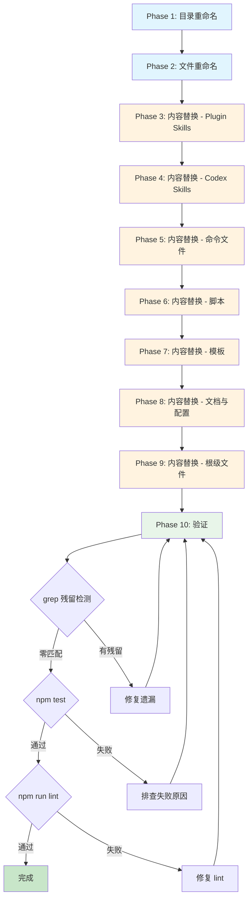

# Implementation Plan: 命名规范化 -- speckit 统一重命名为 spec-driver

**Branch**: `032-rename-speckit-to-spec-driver` | **Date**: 2026-03-18 | **Spec**: [spec.md](./spec.md)
**Input**: Feature specification from `specs/032-rename-speckit-to-spec-driver/spec.md`

**Note**: This template is filled in by the `/spec-driver.plan` command.

## Summary

将项目中所有 `speckit` 前缀统一重命名为 `spec-driver`，消除命名不一致。变更范围涵盖 6 个 Skill 目录重命名、9 个命令文件重命名、约 45 个文件的内容替换（共 310+ 处引用）。这是一个纯 rename-only Feature，不涉及任何代码逻辑变更、不新增源代码文件、不修改 TypeScript 编译输出、不修改测试用例逻辑。技术方案核心是 `git mv` 目录/文件重命名 + `sed` 文本批量替换 + `grep` 全量验证。

## Technical Context

**Language/Version**: Bash 5.x（脚本执行）、Markdown（文档和 Prompt）、YAML（配置）、JSON（元数据）
**Primary Dependencies**: 无新增依赖。仅使用 git、sed、grep 等标准 CLI 工具
**Storage**: 文件系统（`plugins/spec-driver/`、`.claude/commands/`、`.codex/skills/`、`.specify/` 等目录的读写）
**Testing**: `npm test`（现有测试套件，验证重命名无副作用）、`npm run lint`（代码风格）、`grep -r`（遗漏检测）
**Target Platform**: 跨平台（macOS / Linux，Claude Code 沙箱环境）
**Project Type**: Markdown/Bash Plugin（非编译型项目）
**Performance Goals**: N/A（一次性操作，无性能指标）
**Constraints**: 历史 spec 目录不可修改、变更必须为 rename-only（不引入行为变化）、所有操作可通过 git revert 回滚
**Scale/Scope**: 6 目录重命名 + 9 文件重命名 + 约 45 文件内容修改 + 310+ 处文本替换

## Constitution Check

*GATE: Must pass before Phase 0 research. Re-check after Phase 1 design.*

| 原则 | 适用性 | 评估 | 说明 |
|------|--------|------|------|
| **I. 双语文档规范** | 适用 | PASS | 本 Feature 不生成新文档，仅做文本替换。替换内容保持中文散文 + 英文标识符的规范 |
| **II. Spec-Driven Development** | 适用 | PASS | 已通过完整的 spec -> plan -> tasks 流程执行 |
| **III. 诚实标注不确定性** | 适用 | PASS | 所有变更为确定性文本替换，无推断内容 |
| **IV. AST 精确性优先** | 不适用 | N/A | 本 Feature 不涉及代码分析或 AST 操作 |
| **V. 混合分析流水线** | 不适用 | N/A | 本 Feature 不涉及代码分析流水线 |
| **VI. 只读安全性** | 不适用 | N/A | 本 Feature 不涉及 reverse-spec 工具操作 |
| **VII. 纯 Node.js 生态** | 不适用 | N/A | 本 Feature 不引入任何运行时依赖 |
| **VIII. Prompt 工程优先** | 适用 | PASS | 重命名不改变 Prompt 编排逻辑，仅更新标识符 |
| **IX. 零运行时依赖** | 适用 | PASS | 不引入任何新依赖 |
| **X. 质量门控不可绕过** | 适用 | PASS | 完成后通过 npm test + npm run lint + grep 验证 |
| **XI. 验证铁律** | 适用 | PASS | 验证方案包含实际命令执行输出（grep、test、lint） |
| **XII. 向后兼容** | 适用 | WARN | 命令名从 `/speckit.*` 变为 `/spec-driver.*` 是破坏性变更。通过迁移文档（FR-019）缓解，但无法提供运行时兼容层。详见 Complexity Tracking |

**总评**: 11 PASS, 4 N/A, 1 WARN。无 VIOLATION。WARN 项已在 Complexity Tracking 中记录并给出缓解方案。

## Architecture

本 Feature 不涉及软件架构变更。以下 Mermaid 图展示的是**变更操作流程**，而非系统架构。



## Project Structure

### Documentation (this feature)

```text
specs/032-rename-speckit-to-spec-driver/
├── spec.md              # 需求规范
├── plan.md              # 本文件（/spec-driver.plan 命令输出）
├── research.md          # 技术决策研究
├── data-model.md        # 命名映射与受影响文件清单
├── quickstart.md        # 快速上手指南
├── contracts/
│   └── rename-mapping.md  # 重命名映射契约
├── checklists/          # 需求检查清单
├── research/            # 调研制品
├── verification/        # 验证报告
└── tasks.md             # 任务分解（由 /spec-driver.tasks 生成）
```

### Source Code (repository root)

本 Feature 不新增源代码文件。变更仅涉及以下现有文件的重命名和内容修改：

```text
plugins/spec-driver/
├── skills/
│   ├── speckit-feature/  -> spec-driver-feature/   # git mv
│   ├── speckit-story/    -> spec-driver-story/      # git mv
│   ├── speckit-fix/      -> spec-driver-fix/        # git mv
│   ├── speckit-resume/   -> spec-driver-resume/     # git mv
│   ├── speckit-sync/     -> spec-driver-sync/       # git mv
│   └── speckit-doc/      -> spec-driver-doc/        # git mv
├── scripts/
│   ├── init-project.sh       # 内容修改（11 处）
│   ├── codex-skills.sh       # 内容修改（12 处）
│   ├── postinstall.sh        # 内容修改（6 处）
│   └── scan-project.sh       # 内容修改（1 处）
├── templates/
│   └── specify-base/
│       ├── plan-template.md      # 内容修改（7 处）
│       ├── tasks-template.md     # 内容修改（1 处）
│       └── checklist-template.md # 内容修改（2 处）
├── agents/
│   ├── sync.md            # 内容修改（6 处）
│   └── constitution.md    # 内容修改（1 处）
├── contracts/
│   └── scan-project-output.md  # 内容修改（2 处）
├── templates/
│   └── product-spec-template.md  # 内容修改（3 处）
├── README.md              # 内容修改（35 处）
└── .claude-plugin/
    └── plugin.json        # 内容修改（1 处）

.claude/commands/
├── speckit.analyze.md      -> spec-driver.analyze.md      # git mv + 内容修改
├── speckit.checklist.md    -> spec-driver.checklist.md     # git mv + 内容修改
├── speckit.clarify.md      -> spec-driver.clarify.md       # git mv + 内容修改
├── speckit.constitution.md -> spec-driver.constitution.md  # git mv + 内容修改
├── speckit.implement.md    -> spec-driver.implement.md     # git mv + 内容修改
├── speckit.plan.md         -> spec-driver.plan.md          # git mv + 内容修改
├── speckit.specify.md      -> spec-driver.specify.md       # git mv + 内容修改
├── speckit.tasks.md        -> spec-driver.tasks.md         # git mv + 内容修改
└── speckit.taskstoissues.md -> spec-driver.taskstoissues.md # git mv + 内容修改

.codex/skills/
├── spec-driver-feature/SKILL.md  # 内容修改（6 处）
├── spec-driver-story/SKILL.md    # 内容修改（5 处）
├── spec-driver-fix/SKILL.md      # 内容修改（2 处）
├── spec-driver-resume/SKILL.md   # 内容修改（6 处）
├── spec-driver-sync/SKILL.md     # 内容修改（6 处）
└── spec-driver-doc/SKILL.md      # 内容修改（27 处）

.specify/
├── templates/
│   ├── plan-template.md      # 内容修改（7 处）
│   ├── tasks-template.md     # 内容修改（1 处）
│   └── checklist-template.md # 内容修改（2 处）
└── scripts/bash/
    └── check-prerequisites.sh  # 内容修改（3 处）

# 根级文件
README.md                    # 内容修改（56 处）
CLAUDE.md                    # 内容修改（6 处，保留历史 spec 路径）
.claude-plugin/marketplace.json  # 内容修改（2 处）
.claude/settings.local.json      # 内容修改（1 处 -- 过时路径修正）

# 产品活文档
specs/products/spec-driver/current-spec.md  # 内容修改（约 64 处，保留历史 ID）
specs/products/product-mapping.yaml         # 内容修改（2 处描述，保留 2 处历史 ID）
```

**Structure Decision**: 无结构变更。保持现有目录布局，仅对上述文件执行重命名和文本替换。

## 任务分区策略

基于文件分布和依赖关系，建议将实现分为以下独立任务组：

### Task Group 1: 目录与文件重命名（git mv 操作）
- **范围**: 6 个 Skill 目录 + 9 个命令文件
- **依赖**: 无前置依赖
- **风险**: 低（git mv 操作可通过 git reset 回滚）
- **建议**: 先执行所有 git mv，一次性 commit，保持 git 对重命名的识别

### Task Group 2: Plugin Skills 内容替换
- **范围**: 6 个 Plugin SKILL.md + 6 个 Codex SKILL.md
- **依赖**: Task Group 1 完成后执行（目录名已变更）
- **风险**: 中（SKILL.md 是功能入口，替换错误会导致 Skill 无法触发）
- **验证**: 逐个检查 SKILL.md 的 `name` 字段和内部引用

### Task Group 3: 命令文件内容替换
- **范围**: 9 个命令文件的内部引用
- **依赖**: Task Group 1 完成后执行（文件名已变更）
- **风险**: 低（命令文件为纯 Markdown，替换确定性高）

### Task Group 4: 脚本文件替换
- **范围**: 4 个 Bash 脚本（init-project.sh、codex-skills.sh、postinstall.sh、scan-project.sh）+ 1 个 .specify 脚本
- **依赖**: 无前置依赖（与其他 Group 并行）
- **风险**: 中（脚本涉及变量名和函数名替换，需确保所有引用点一致）
- **验证**: `bash -n` 语法检查 + 输出键名检查

### Task Group 5: 模板与配置替换
- **范围**: Plugin 模板（3 个）+ .specify 模板（3 个）+ 配置文件（marketplace.json、plugin.json）+ agents（2 个）+ contracts（2 个）
- **依赖**: 无前置依赖
- **风险**: 低

### Task Group 6: 文档替换
- **范围**: README.md（根级 + Plugin 级）+ CLAUDE.md + current-spec.md + product-mapping.yaml + settings.local.json
- **依赖**: 无前置依赖
- **风险**: 中（README.md 含 HTML 锚点，替换需格外小心）
- **特殊处理**: CLAUDE.md 需保留历史 spec 路径、product-mapping.yaml 需保留历史 ID

### Task Group 7: 全量验证
- **范围**: 所有变更完成后的端到端验证
- **依赖**: Task Group 1-6 全部完成
- **验证步骤**:
  1. `grep -r "speckit"` 排除检测（零匹配）
  2. `npm test`（全部通过）
  3. `npm run lint`（无错误）
  4. 历史 spec 目录完整性检查
  5. 新旧文件存在性检查

## 关键风险与缓解

| 风险 | 影响 | 概率 | 缓解措施 |
|------|------|------|----------|
| 部分重命名导致引用断裂 | 高 | 低 | 原子性执行所有 git mv，一次 commit |
| 替换误伤历史 spec 目录 | 高 | 低 | 排除规则 `specs/[0-9][0-9][0-9]-*/` + 事前备份哈希值 |
| init-project.sh JSON 输出键名变更导致下游解析失败 | 中 | 中 | 同步更新所有 SKILL.md 中的解析引用 |
| 用户已有自定义 `speckit.*` 命令未迁移 | 中 | 中 | 迁移文档明确说明（FR-019） |
| macOS 大小写不敏感导致 git mv 异常 | 低 | 低 | 本次变更不涉及大小写变化，无此风险 |

## Complexity Tracking

| 偏离项 | 为何需要 | 被拒绝的更简单方案 |
|--------|----------|-------------------|
| 命令名破坏性变更（`/speckit.*` -> `/spec-driver.*`）不提供兼容层 | Claude Code 无命令别名/重定向机制，保留旧文件会延续命名不一致问题 | 保留旧命令文件作为 wrapper -- 被拒绝因 Claude Code 无 redirect 机制，且双命名使问题恶化 |
| init-project.sh JSON 输出键名同步变更 | 键名与变量名保持一致，减少维护认知负担 | 保留旧 JSON 键名 -- 被拒绝因与 `HAS_SPEC_DRIVER_SKILLS` 命名不一致 |
| 排除范围从 "2 个目录" 扩展为 "所有 `specs/NNN-*/`" | 历史 Feature spec 目录远不止 011 和 015，约有 20+ 个包含 speckit 引用 | 仅排除 011 和 015 -- 被拒绝因不完整，会遗漏大量历史产物 |
