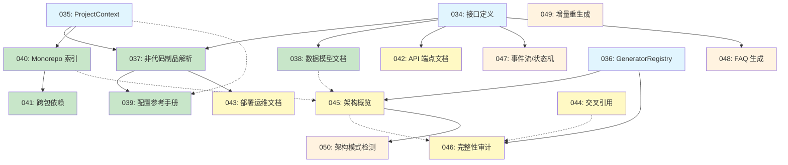

# 全景文档化 Milestone 蓝图

**版本**: 1.0.0
**创建日期**: 2026-03-18
**最后更新**: 2026-03-18
**状态**: Draft

---

## 1. 概览与目标

### 愿景

为 Reverse Spec 和 Spec Driver 增加**全景文档化**能力——从项目源代码、非代码制品、配置文件和架构模式中自动提取信息并生成多种类型的技术文档，使任何不了解项目背景的开发者都能快速理解项目的架构、数据模型、配置、部署和依赖关系。

### 范围

本 Milestone 规划 **17 个 Feature**（specs 编号 034-050），划分为 **4 个 Phase**：

| Phase | 名称 | Feature 数量 | 定位 |
|-------|------|-------------|------|
| Phase 0 | 基础设施层 | 3 | 定义核心抽象接口，为后续所有 Generator / Parser 提供扩展基础 |
| Phase 1 | 核心能力层 | 5 | 实现高验证价值的文档生成能力，覆盖非代码制品、数据模型、配置、Monorepo 等 |
| Phase 2 | 增强能力层 | 5 | 扩展 API 文档、部署文档、交叉引用、架构概览和完整性审计 |
| Phase 3 | 高级能力层（实验性） | 4 | 探索事件流/状态机、FAQ、增量重生成和架构模式检测等高级能力 |

### 目标陈述

1. **全景可见性**: 蓝图文档使维护者和利益相关者能够全景了解 17 个 Feature 的划分、排期和依赖关系，作为后续所有 Feature 开发的基准参照
2. **技术依赖清晰化**: 通过依赖关系有向图和依赖矩阵，确保每个 Feature 的前置条件和可并行分组一目了然
3. **验证标准前置**: 在蓝图阶段为每个 Feature 定义可观测的验证标准，使后续 spec 编写和测试设计有明确依据
4. **风险前瞻管理**: 识别关键技术风险并预设缓解策略，降低大规模 Milestone 的执行风险
5. **OctoAgent 验证驱动**: 以 OctoAgent 项目（Python + TS 多语言 Monorepo）作为端到端验证目标，确保功能设计有实际价值

---

## 2. 编号映射表

本蓝图正文统一使用 **specs 目录编号（034-050）** 作为 Feature 的主标识符。以下映射表将 specs 编号与技术调研报告中的内部编号（F-000~F-016）对照，仅供溯源参考，正文其他章节不再使用调研编号。

| specs 编号 | 调研编号 | Feature 名称 | 所属 Phase |
|-----------|---------|-------------|-----------|
| 034 | F-000 | DocumentGenerator + ArtifactParser 接口定义 | Phase 0 |
| 035 | F-001 | ProjectContext 统一上下文 | Phase 0 |
| 036 | F-002 | GeneratorRegistry 注册中心 | Phase 0 |
| 037 | F-003 | 非代码制品解析 | Phase 1 |
| 038 | F-004 | 通用数据模型文档 | Phase 1 |
| 039 | F-005 | 配置参考手册生成 | Phase 1 |
| 040 | F-006 | Monorepo 层级架构索引 | Phase 1 |
| 041 | F-007 | 跨包依赖分析 | Phase 1 |
| 042 | F-008 | API 端点文档生成 | Phase 2 |
| 043 | F-009 | 部署/运维文档 | Phase 2 |
| 044 | F-010 | 设计文档交叉引用 | Phase 2 |
| 045 | F-011 | 反向架构概览模式 | Phase 2 |
| 046 | F-012 | 文档完整性审计 | Phase 2 |
| 047 | F-013 | 事件流/状态机文档 | Phase 3 |
| 048 | F-014 | FAQ 生成 | Phase 3 |
| 049 | F-015 | 增量差量 Spec 重生成 | Phase 3 |
| 050 | F-016 | 架构模式检测 | Phase 3 |

---

## 3. MVP 范围定义

### MVP 边界

**MVP = Phase 0 + Phase 1**，共计 **8 个 Feature**（034-041）。

| Phase | Feature 编号 | Feature 名称 |
|-------|-------------|-------------|
| Phase 0 | 034 | DocumentGenerator + ArtifactParser 接口定义 |
| Phase 0 | 035 | ProjectContext 统一上下文 |
| Phase 0 | 036 | GeneratorRegistry 注册中心 |
| Phase 1 | 037 | 非代码制品解析 |
| Phase 1 | 038 | 通用数据模型文档 |
| Phase 1 | 039 | 配置参考手册生成 |
| Phase 1 | 040 | Monorepo 层级架构索引 |
| Phase 1 | 041 | 跨包依赖分析 |

### MVP 选择理由

MVP 范围基于**技术依赖**和 **OctoAgent 验证价值**双维度评估确定：

**技术依赖维度**:
- Phase 0 的 3 个基础设施 Feature（034-036）定义了 DocumentGenerator / ArtifactParser / ProjectContext / GeneratorRegistry 四个核心抽象接口，是 Phase 1-3 所有 Generator 和 Parser 的扩展基础，必须先行
- Phase 1 的 5 个 Feature（037-041）是核心抽象的首批实现，验证接口设计的合理性和通用性

**OctoAgent 验证价值维度**:
- OctoAgent 项目具备 Python + TypeScript 多语言、Monorepo 结构（packages/ + apps/）、丰富的非代码制品（10+ SKILL.md、behavior YAML、octoagent.yaml、docker-compose）等特征
- Phase 1 的 5 个 Feature 覆盖 OctoAgent 验证价值评分最高的 6 项改进方向中的 5 项：非代码制品解析、数据模型文档、Monorepo 索引、跨包依赖分析、配置参考手册
- MVP 完成后即可在 OctoAgent 上执行端到端验证（`reverse-spec batch`），收集真实反馈再启动 Phase 2

### MVP 预估工作量

Phase 0 + Phase 1 合计预估 **6.5-11 天**，其中 Phase 0 约 1.5-3 天、Phase 1 约 5-8 天。

---

## 4. Phase 分解与 Feature 详情

### 4.1 Phase 0: 基础设施层

**阶段目标**: 定义全景文档化能力的核心抽象接口（DocumentGenerator、ArtifactParser、ProjectContext、GeneratorRegistry），为后续所有 Phase 的 Generator 和 Parser 提供统一的扩展基础和注册机制。

**预估工作量**: 1.5-3 天

#### Feature 034: DocumentGenerator + ArtifactParser 接口定义

**描述**: 定义 DocumentGenerator 和 ArtifactParser 两个核心接口及其 Zod Schema
**所属 Phase**: Phase 0（基础设施层）
**预估工作量**: 0.5-1 天
**前置依赖**: 无

**交付物**:
- `src/panoramic/interfaces.ts`（DocumentGenerator + ArtifactParser 接口定义）
- 对应的 Zod Schema 验证定义
- 至少一个 Mock Generator 用于验证接口可用性

**验证标准**:
1. 接口定义通过 TypeScript 编译且有对应 Zod Schema，`npm run build` 零错误
2. 至少编写一个 Mock Generator 实现 DocumentGenerator 接口的全部方法（isApplicable / extract / generate / render），单元测试通过

#### Feature 035: ProjectContext 统一上下文

**描述**: 统一项目元信息为 ProjectContext 接口，替代散落的 projectRoot 参数
**所属 Phase**: Phase 0（基础设施层）
**预估工作量**: 0.5-1 天
**前置依赖**: 无

**交付物**:
- `src/panoramic/project-context.ts`（ProjectContext 接口 + 构建函数）
- 单元测试覆盖多语言检测和 workspace 识别

**验证标准**:
1. 对 OctoAgent 项目运行 ProjectContext 构建，正确检测 Python + TypeScript 多语言，workspaceType 为 "monorepo"
2. 对非 monorepo 项目运行 ProjectContext 构建，workspaceType 为 "single"，configFiles 包含 package.json 等已有配置

#### Feature 036: GeneratorRegistry 注册中心

**描述**: 实现 Generator 的注册、发现和启用/禁用管理的中心化注册机制
**所属 Phase**: Phase 0（基础设施层）
**预估工作量**: 0.5-1 天
**前置依赖**: 无

**交付物**:
- `src/panoramic/generator-registry.ts`（GeneratorRegistry 实现 + bootstrapGenerators 函数）
- 单元测试覆盖注册、查询、过滤功能

**验证标准**:
1. 注册 3 个以上 Mock Generator，通过 Registry 按 ProjectContext 过滤出适用的 Generator，返回结果正确
2. Registry 支持按 id 查询单个 Generator 和全量列出所有已注册 Generator，且支持启用/禁用切换

### 4.2 Phase 1: 核心能力层

**阶段目标**: 基于 Phase 0 定义的核心抽象，实现首批高验证价值的 Generator 和 Parser，覆盖非代码制品解析、数据模型文档、配置参考手册、Monorepo 索引和跨包依赖分析。

**预估工作量**: 5-8 天

#### Feature 037: 非代码制品解析

**描述**: 实现 ArtifactParser 的首批具体实现，支持 SKILL.md、behavior YAML 和 Dockerfile 解析
**所属 Phase**: Phase 1（核心能力层）
**预估工作量**: 1.5-2 天
**前置依赖**: Feature 034（强）、Feature 035（强）

**交付物**:
- SkillMdParser（解析 SKILL.md 文件，提取 trigger、description、constraints）
- BehaviorYamlParser（解析 behavior YAML，提取状态-行为映射）
- DockerfileParser（解析 Dockerfile，提取指令和阶段信息）
- 各 Parser 的单元测试

**验证标准**:
1. 解析 OctoAgent 的 SKILL.md 文件，正确提取 trigger、description、constraints 等字段，输出结构化数据与源文件内容一致
2. 解析 OctoAgent 的 behavior YAML 文件，正确提取状态-行为映射关系，输出可被后续 Generator 消费

#### Feature 038: 通用数据模型文档

**描述**: 实现 DataModelGenerator，从 Python dataclass / Pydantic model 等提取字段定义并生成文档
**所属 Phase**: Phase 1（核心能力层）
**预估工作量**: 1-1.5 天
**前置依赖**: Feature 034（强）

**交付物**:
- DataModelGenerator（实现 DocumentGenerator 接口）
- Mermaid ER 图渲染逻辑
- data-model.hbs 模板

**验证标准**:
1. 对 Python dataclass / Pydantic model 提取字段定义（名称、类型、默认值、描述），生成结构化数据模型文档
2. 生成的 Mermaid ER 图正确反映实体间关系（继承、组合、引用），在 GitHub 渲染为可读图表

#### Feature 039: 配置参考手册生成

**描述**: 实现 ConfigReferenceGenerator，从 YAML/TOML/env 配置文件生成配置参考手册
**所属 Phase**: Phase 1（核心能力层）
**预估工作量**: 1-1.5 天
**前置依赖**: Feature 037（强）、Feature 035（弱）

**交付物**:
- ConfigReferenceGenerator（实现 DocumentGenerator 接口）
- config-reference.hbs 模板
- 支持 YAML、TOML、.env 三种配置格式

**验证标准**:
1. 解析 OctoAgent 的 octoagent.yaml，生成完整的配置参考手册，包含每个配置项的名称、类型、默认值、说明
2. 对不存在说明注释的配置项，通过 LLM 推断生成合理的描述文本，并标注 `[推断]`

#### Feature 040: Monorepo 层级架构索引

**描述**: 实现 WorkspaceAnalyzer，为 Monorepo 项目生成 packages/apps 层级索引文档
**所属 Phase**: Phase 1（核心能力层）
**预估工作量**: 1-1.5 天
**前置依赖**: Feature 035（强）

**交付物**:
- WorkspaceAnalyzer（检测 workspace 结构、解析各子包元信息）
- batch-orchestrator 扩展（支持 workspace 级别编排）
- workspace-index.hbs 模板

**验证标准**:
1. 对 OctoAgent 项目生成 packages/ + apps/ 层级索引文档，正确列出每个子包的名称、职责描述和技术栈
2. 索引文档反映子包间的层级关系（如 packages/core 是基础包、apps/gateway 是入口应用）

#### Feature 041: 跨包依赖分析

**描述**: 实现 CrossPackageAnalyzer，分析 Monorepo 子包间的依赖关系并检测循环依赖
**所属 Phase**: Phase 1（核心能力层）
**预估工作量**: 1-1.5 天
**前置依赖**: Feature 040（强）

**交付物**:
- CrossPackageAnalyzer（分析子包间 import 拓扑）
- 循环依赖检测和报告
- Mermaid 子包依赖拓扑图渲染

**验证标准**:
1. 生成 OctoAgent 子包间的依赖拓扑图，正确反映 packages/ 之间的引用关系
2. 正确检测跨包循环依赖（若存在），以警告形式标注在报告中；若无循环依赖则声明"未检测到循环依赖"

### 4.3 Phase 2: 增强能力层

**阶段目标**: 扩展文档生成能力至 API 端点、部署/运维、设计文档交叉引用、反向架构概览和文档完整性审计，提供更全面的项目文档覆盖。

**预估工作量**: 5-7 天

#### Feature 042: API 端点文档生成

**描述**: 实现 ApiEndpointGenerator，从 Express/FastAPI 等框架提取路由定义并生成端点文档
**所属 Phase**: Phase 2（增强能力层）
**预估工作量**: 1-1.5 天
**前置依赖**: Feature 034（强）

**交付物**:
- ApiEndpointGenerator（实现 DocumentGenerator 接口）
- openapi-summary.hbs 模板
- Express / FastAPI 路由提取逻辑

**验证标准**:
1. 提取 Express 或 FastAPI 路由定义并生成端点文档，包含 HTTP 方法、路径、参数、响应类型
2. 对包含 10+ 个路由的项目，生成的文档覆盖全部端点，无遗漏

#### Feature 043: 部署/运维文档

**描述**: 实现 DeploymentGenerator，从 Dockerfile 和 docker-compose 生成部署运维文档
**所属 Phase**: Phase 2（增强能力层）
**预估工作量**: 1-1.5 天
**前置依赖**: Feature 037（强）

**交付物**:
- DeploymentGenerator（实现 DocumentGenerator 接口）
- deployment.hbs 模板
- Dockerfile + docker-compose 联合解析逻辑

**验证标准**:
1. 解析 Dockerfile 和 docker-compose.yml 生成部署文档，包含环境变量、端口映射、卷挂载、启动命令
2. 对多阶段构建的 Dockerfile 正确识别各构建阶段及其用途

#### Feature 044: 设计文档交叉引用

**描述**: 实现 CrossReferenceIndex，在生成的 spec 中自动插入关联 spec 的链接
**所属 Phase**: Phase 2（增强能力层）
**预估工作量**: 0.5-1 天
**前置依赖**: Phase 1 完成（弱）

**交付物**:
- CrossReferenceIndex（构建 spec 间的引用关系索引）
- spec 内链接注入逻辑（在 spec frontmatter 和正文中插入交叉引用）

**验证标准**:
1. 在生成的 spec 中自动插入关联 spec 的链接，链接指向正确的文件路径
2. 交叉引用覆盖同模块内引用和跨模块引用两种场景

#### Feature 045: 反向架构概览模式

**描述**: 实现 ArchitectureOverviewGenerator（Composite 模式），组合多个 Generator 输出生成全局架构鸟瞰文档
**所属 Phase**: Phase 2（增强能力层）
**预估工作量**: 1-1.5 天
**前置依赖**: Feature 036（强）、Feature 038（弱）、Feature 040（弱）

**交付物**:
- ArchitectureOverviewGenerator（Composite 模式实现）
- architecture-overview.hbs 模板
- 分层视图、模块职责、关键数据流的渲染逻辑

**验证标准**:
1. 对 OctoAgent 生成全局架构鸟瞰文档，包含分层视图（packages/ 层级）、模块职责描述、关键数据流
2. 文档中的模块依赖关系与 Feature 041 生成的跨包依赖拓扑一致

#### Feature 046: 文档完整性审计

**描述**: 实现 CoverageAuditor，审计项目中所有应文档化但未文档化的模块
**所属 Phase**: Phase 2（增强能力层）
**预估工作量**: 1-1.5 天
**前置依赖**: Feature 036（强）、Feature 044（弱）、Feature 045（弱）

**交付物**:
- CoverageAuditor（遍历 GeneratorRegistry 检查文档覆盖）
- coverage-report.hbs 模板
- 覆盖率统计和缺失模块列表

**验证标准**:
1. 审计报告列出项目中所有应文档化但未文档化的模块，以缺失项列表形式呈现
2. 覆盖率以百分比形式呈现（已文档化模块数 / 应文档化模块总数），并按 Generator 类型分项统计

### 4.4 Phase 3: 高级能力层（实验性）

> **注意**: Phase 3 的所有 Feature 标注为**实验性**，其实施取决于社区反馈和资源评估。Phase 2 完成后将重新审视 Phase 3 的优先级和可行性。

**阶段目标**: 探索高复杂度的文档生成能力，包括事件流/状态机推断、FAQ 自动生成、增量差量重生成和架构模式检测。这些能力依赖 LLM 推理和深度 AST 分析，技术风险较高。

**预估工作量**: 7-11 天

#### Feature 047: 事件流/状态机文档 [实验性]

**描述**: 实现 EventFlowGenerator，检测 emit/on 事件模式并生成事件流和状态机文档
**所属 Phase**: Phase 3（高级能力层）
**预估工作量**: 2-3 天
**前置依赖**: Feature 034（强）

**交付物**:
- EventFlowGenerator（实现 DocumentGenerator 接口）
- 状态机 Mermaid 图渲染（stateDiagram-v2）
- emit/on 模式检测的 AST 查询规则

**验证标准**:
1. 检测代码中的 emit/on 事件模式（EventEmitter、自定义事件总线等），生成事件流文档列出所有事件名、发布者和订阅者
2. 从状态转换代码推断生成状态机 Mermaid 图，图中状态和转换与源代码逻辑一致；推断结果标注 `[推断]`

#### Feature 048: FAQ 生成 [实验性]

**描述**: 实现 FaqGenerator，从错误处理模式和边界条件推导常见问题及答案
**所属 Phase**: Phase 3（高级能力层）
**预估工作量**: 1-2 天
**前置依赖**: Feature 034（强）

**交付物**:
- FaqGenerator（实现 DocumentGenerator 接口）
- faq.hbs 模板
- ErrorPatternAnalyzer（从 try-catch / throw / raise 模式提取常见错误）

**验证标准**:
1. 从错误处理模式和边界条件推导至少 5 个常见问题，每个问题包含问题描述、答案和相关代码位置
2. 生成的 FAQ 条目与实际代码中的错误处理逻辑对应，无凭空编造的问题

#### Feature 049: 增量差量 Spec 重生成 [实验性]

**描述**: 实现 DeltaRegenerator，修改源文件后仅重生成受影响的 spec，非受影响 spec 保持不变
**所属 Phase**: Phase 3（高级能力层）
**预估工作量**: 2-3 天
**前置依赖**: Phase 1 完成（强）

**交付物**:
- DeltaRegenerator（差量分析 + 选择性重生成）
- batch-orchestrator 扩展（增量模式支持）
- skeleton hash 变更传播分析

**验证标准**:
1. 修改源文件后运行增量重生成，仅重生成受影响的 spec 文件，非受影响的 spec 文件内容和修改时间均未变化
2. skeleton hash 变更正确触发级联重生成——当被依赖模块变更时，依赖方的 spec 也被标记为需要重生成

#### Feature 050: 架构模式检测 [实验性]

**描述**: 实现 PatternDetector，检测常见架构模式（分层架构、事件驱动、CQRS 等）
**所属 Phase**: Phase 3（高级能力层）
**预估工作量**: 2-3 天
**前置依赖**: Feature 045（强）

**交付物**:
- PatternDetector（基于代码结构 + LLM 推理的双通道检测）
- 架构模式知识库（内置常见模式的特征描述）
- LLM 推理 prompt（输入代码结构特征，输出模式识别结果）

**验证标准**:
1. 检测常见架构模式（如分层架构、事件驱动、CQRS、微服务），检测结果包含模式名称、置信度（高/中/低）和证据代码位置
2. 对已知架构模式的项目（如 OctoAgent 的事件驱动 + 分层架构），检测结果包含正确的模式名称且置信度为"高"

### 工作量汇总

| Phase | Feature 数量 | 预估工作量 | 累计工作量 |
|-------|-------------|-----------|-----------|
| Phase 0: 基础设施层 | 3 | 1.5-3 天 | 1.5-3 天 |
| Phase 1: 核心能力层 | 5 | 5-8 天 | 6.5-11 天 |
| **MVP 小计（Phase 0+1）** | **8** | **6.5-11 天** | **6.5-11 天** |
| Phase 2: 增强能力层 | 5 | 5-7 天 | 11.5-18 天 |
| Phase 3: 高级能力层（实验性） | 4 | 7-11 天 | 18.5-29 天 |
| **合计** | **17** | **18.5-29 天** | - |

> **说明**: 工作量为各 Feature 级预估的加总，未考虑并行执行带来的日历时间缩短。实际日历时间取决于并行度（参见第 5.3 节）。Phase 3 标注为实验性，工作量可能因技术探索而浮动。

---

## 5. 依赖关系

### 5.1 依赖关系有向图（Mermaid）

以下有向图展示 17 个 Feature 之间的依赖关系。实线箭头（`-->`）表示强依赖，虚线箭头（`-.->` ）表示弱依赖。节点统一使用 specs 编号。

**图例**: 蓝色 = Phase 0、绿色 = Phase 1、黄色 = Phase 2、橙色 = Phase 3

**依赖补充说明**（相较于 tech-research.md 调研阶段依赖图的变更）:
- Feature 042（API 端点文档）: 显式标注对 Feature 034 的强依赖（需实现 DocumentGenerator 接口）
- Feature 044（交叉引用）: 对 Phase 1 完成的弱依赖（需要已有 spec 输出才能建立交叉引用索引）
- Feature 047/048: 显式标注对 Feature 034 的强依赖（需实现 DocumentGenerator 接口）
- Feature 049（增量重生成）: 对 Phase 1 完成的强依赖（需要已有的 skeleton hash 和 batch-orchestrator 基础）

### 5.2 依赖矩阵表格

| Feature | 前置依赖（强） | 前置依赖（弱） | 可并行 Feature |
|---------|---------------|---------------|---------------|
| 034 | 无 | 无 | 035, 036 |
| 035 | 无 | 无 | 034, 036 |
| 036 | 无 | 无 | 034, 035 |
| 037 | 034, 035 | 无 | 038 |
| 038 | 034 | 无 | 037, 040 |
| 039 | 037 | 035 | 040, 041 |
| 040 | 035 | 无 | 037, 038 |
| 041 | 040 | 无 | 039 |
| 042 | 034 | 无 | 043, 044 |
| 043 | 037 | 无 | 042, 044 |
| 044 | 无 | Phase 1 完成 | 042, 043 |
| 045 | 036 | 038, 040 | 无 |
| 046 | 036 | 044, 045 | 无 |
| 047 | 034 | 无 | 048, 049 |
| 048 | 034 | 无 | 047, 049 |
| 049 | Phase 1 完成 | 无 | 047, 048 |
| 050 | 045 | 无 | 无 |

### 5.3 并行分组

以下按 Phase 列出可并行实施的 Feature 分组，以及推荐的启动顺序。

| Phase | 并行分组 | 最大并行度 | 推荐启动顺序 |
|-------|---------|-----------|-------------|
| Phase 0 | {034, 035, 036} 全部可并行 | 3 | 三个基础设施 Feature 之间无依赖，可同时启动 |
| Phase 1 | 第一批: {037, 038, 040} 可并行; 第二批: {039} 依赖 037; {041} 依赖 040 | 3 | 先启动 037 + 038 + 040，完成后再启动 039 和 041 |
| Phase 2 | 第一批: {042, 043, 044} 可并行; 第二批: {045} 依赖 036+038+040; 第三批: {046} 依赖 036+044+045 | 3 | 先启动 042 + 043 + 044，然后 045，最后 046 |
| Phase 3 | 第一批: {047, 048, 049} 可并行; 第二批: {050} 依赖 045 | 3 | 先启动 047 + 048 + 049，完成 045 后再启动 050 |

**关键路径分析**:

最长依赖链为: 034 → 037 → 039（或 034 → 037 → 043），位于 Phase 0-Phase 2 跨度。Phase 3 的关键路径为 036 → 045 → 050。

在最大并行度（3 个开发者/agent 同时工作）条件下，各 Phase 的日历时间预估:
- Phase 0: 约 1 天（3 个 Feature 全并行）
- Phase 1: 约 3-4 天（两批次执行）
- Phase 2: 约 3-4 天（三批次执行）
- Phase 3: 约 4-6 天（两批次执行）

### DAG 验证结果

对第 5.1 节依赖关系有向图执行以下验证：

1. **无环验证**: 所有依赖边均为单向（从被依赖方指向依赖方），不存在循环依赖路径。**结果: PASS**
2. **无跨 Phase 反向依赖验证（FR-009）**: 逐条检查所有依赖边，确认每条边的目标 Feature（被依赖方）所属 Phase 编号 <= 源 Feature（依赖方）所属 Phase 编号。**结果: PASS**
   - Phase 0（034-036）: 无前置依赖
   - Phase 1（037-041）: 所有强依赖指向 Phase 0
   - Phase 2（042-046）: 所有强依赖指向 Phase 0 或 Phase 1；弱依赖指向 Phase 1 或 Phase 2 同级
   - Phase 3（047-050）: 强依赖指向 Phase 0 或 Phase 1 或 Phase 2
3. **连通性验证**: 17 个 Feature 中，Feature 044 和 Feature 049 无入度强依赖（分别仅有弱依赖），但这符合设计意图——044 作为交叉引用可在 Phase 1 完成后独立启动，049 作为增量重生成依赖 Phase 1 整体完成。**结果: PASS（符合预期）**

---

## 6. 核心抽象接口契约概要

### 6.1 DocumentGenerator

**职责**: 定义从项目中提取信息并生成特定类型文档的统一契约。每个具体文档类型（数据模型、API 端点、配置参考等）实现一个 DocumentGenerator。

**核心方法**:
| 方法名 | 职责描述 |
|--------|---------|
| isApplicable(projectContext) | 判断当前项目是否适用此 Generator（如项目无 FastAPI 路由则 ApiEndpointGenerator 不适用） |
| extract(projectContext) | 从项目中提取该 Generator 需要的输入数据（AST 分析、文件解析等） |
| generate(input, options?) | 将提取的原始数据转换为结构化的文档输出对象 |
| render(output) | 将文档输出对象渲染为 Markdown 字符串 |

**设计说明**: DocumentGenerator 采用 Strategy 模式，与现有 LanguageAdapter 的设计模式一致。每个 Generator 是独立的策略实现，通过 GeneratorRegistry 统一注册和发现。`extract → generate → render` 三步走的生命周期参考了 Docusaurus Plugin 的 `loadContent → contentLoaded → postBuild` 模式。Generator 使用泛型 `<TInput, TOutput>` 允许不同文档类型定义各自的输入/输出数据结构。

### 6.2 ArtifactParser

**职责**: 定义非代码制品（SKILL.md、behavior YAML、Dockerfile、CI 配置等）的解析契约。每种制品类型实现一个 ArtifactParser。

**核心方法**:
| 方法名 | 职责描述 |
|--------|---------|
| filePatterns (属性) | 该 Parser 支持的文件匹配模式（glob 格式，如 `**/SKILL.md`、`**/Dockerfile`） |
| parse(filePath) | 解析单个制品文件，返回结构化数据 |
| parseAll(filePaths) | 批量解析多个同类制品文件，返回结构化数据数组 |

**设计说明**: ArtifactParser 采用 Template Method 模式，所有 Parser 共享 `discover → read → parse → validate` 的生命周期，子类只需覆写特定解析步骤。ArtifactParser 与 LanguageAdapter 正交——LanguageAdapter 处理代码文件的 AST 分析，ArtifactParser 处理非代码制品的结构提取。Parser 使用泛型 `<T>` 允许每种制品类型定义各自的输出结构。

### 6.3 ProjectContext

**职责**: 统一项目元信息，替代散落在各函数参数中的 projectRoot、packageManager 等信息，为所有 Generator 和 Parser 提供一致的项目上下文。

**核心属性**:
| 属性名 | 职责描述 |
|--------|---------|
| projectRoot | 项目根目录绝对路径 |
| packageManager | 检测到的包管理器（npm / yarn / pnpm / pip / uv / go / maven / gradle） |
| workspaceType | 项目类型——单包（single）或 Monorepo（monorepo） |
| detectedLanguages | 检测到的编程语言列表（如 ["typescript", "python"]） |
| configFiles | 已识别的配置文件映射（文件名 → 绝对路径） |
| existingSpecs | 项目中已有的 spec 文件路径列表 |

**设计说明**: ProjectContext 是只读数据对象，在分析流程开始时一次性构建。其检测逻辑复用现有的 workspace 检测代码（`batch-orchestrator` 中的 workspaces 解析），并扩展多语言检测能力（基于文件扩展名和配置文件类型推断）。ProjectContext 作为参数传递给 DocumentGenerator.isApplicable() 和 extract()，避免每个 Generator 重复进行项目元信息探测。

### 6.4 GeneratorRegistry

**职责**: 提供 Generator 的中心化注册、发现和管理机制，支持按 ProjectContext 过滤适用的 Generator、按 id 查询和全量列出。

**核心方法**:
| 方法名 | 职责描述 |
|--------|---------|
| register(generator) | 注册一个 DocumentGenerator 实例到 Registry |
| get(id) | 按 id 查询单个已注册的 Generator |
| list() | 列出所有已注册的 Generator（含启用/禁用状态） |
| filterByContext(projectContext) | 调用每个 Generator 的 isApplicable()，返回适用于当前项目的 Generator 列表 |

**设计说明**: GeneratorRegistry 参考现有 LanguageAdapterRegistry 的模式设计，是策略模式的核心配套设施。Registry 支持 bootstrapGenerators() 函数一次性注册所有内置 Generator，也支持运行时动态注册（为未来第三方 Generator 预留扩展点）。启用/禁用机制允许用户通过 spec-driver.config.yaml 配置选择性开关特定 Generator。

---

## 7. 风险清单

以下为全景文档化 Milestone 的关键技术风险，按概率和影响评估排序。每项风险包含可操作的缓解策略并关联到具体的 Feature 或 Phase。

| # | 风险描述 | 概率 | 影响 | 缓解策略 | 关联 Feature/Phase |
|---|---------|------|------|---------|-------------------|
| 1 | ArtifactParser 接口设计不够通用，后续改进方向需要频繁修改接口 | 中 | 高 | Phase 0 先用 3+ 个具体 Parser（SkillMdParser / BehaviorYamlParser / DockerfileParser）验证接口设计，确认通用性后再固化；预留接口版本管理机制 | Feature 034, Phase 0 |
| 2 | 非代码制品（YAML/Markdown）的解析精度不足，提取的结构信息质量低 | 中 | 中 | 采用"正则 + LLM 增强"双通道策略：先用正则/行级解析提取结构，再用 LLM 补充语义理解；对 LLM 推断的内容标注 `[推断]` | Feature 037, Phase 1 |
| 3 | Monorepo workspace 检测在不同包管理器（npm/yarn/pnpm/uv）之间行为不一致 | 高 | 中 | 逐个适配，Phase 1 先支持 npm workspaces + uv workspace（覆盖 OctoAgent 验证需求），后续按需扩展其他包管理器 | Feature 040, Phase 1 |
| 4 | 事件流/状态机文档的 AST 模式检测误报率高（emit/on 模式在非事件场景也出现） | 高 | 中 | 归入 Phase 3 实验性 Feature；采用"AST 候选 + LLM 确认"二阶段策略降低误报；检测结果标注置信度 | Feature 047, Phase 3 |
| 5 | 增量差量重生成的变更影响范围判断不准确，导致漏更新或过度更新 | 中 | 高 | 基于已有 skeleton hash 对比 + dependency-graph 传播分析；采用保守策略——不确定时全量重生成而非忽略变更 | Feature 049, Phase 3 |
| 6 | LLM token 消耗显著增加（多个 Generator 可能调用 LLM） | 高 | 中 | 分级策略：纯 AST/正则可完成的（数据模型、依赖图）不调用 LLM；仅语义理解（FAQ、架构模式）才调用；复用现有 token 预算管理机制 | Phase 1-3 |
| 7 | 与 Spec Driver 插件的集成——新 MCP 工具注册和 Skill prompt 更新 | 低 | 中 | 每个 Phase 完成后统一更新 MCP server.ts 的 tool 注册和 Spec Driver 的 Skill 文件，避免逐 Feature 集成 | Phase 0-3 |
| 8 | Python 适配器对 Pydantic BaseModel / dataclass 的 tree-sitter 提取不完整 | 中 | 高 | 扩展 PythonMapper 的 extractExports()，增加 `@dataclass` 和 `class Foo(BaseModel)` 模式识别；在 Phase 1 Feature 038 实施前完成补强 | Feature 038, Phase 1 |
| 9 | 单个 Feature 工作量远超预估（超出 2 倍以上），导致 Phase 整体延期 | 中 | 高 | Feature 拆分策略：将超预估 Feature 拆为 A/B 两个子 Feature，A 为核心功能（纳入当前 Phase），B 为增强功能（推迟到下一 Phase）；降级策略：优先实现可用的最小功能集 | Phase 0-3 |
| 10 | Phase 0 接口设计在 Phase 1 实施中发现不合适，需要破坏性变更 | 低 | 高 | 接口迭代兼容性策略：Phase 0 接口在 Phase 1 完成前视为"Beta"，允许破坏性变更（Breaking Change）；Phase 1 完成后接口进入"稳定"状态，后续仅允许向后兼容的扩展（新增可选方法/属性），不允许修改已有方法签名 | Feature 034, Phase 0-1 |
| 11 | OctoAgent 项目结构在验证期间发生变化（新增/移除子包或制品类型），导致验证计划失效 | 低 | 中 | 验证计划定位为"基于特征的快照"——以 OctoAgent 当前已知的项目特征（Monorepo 结构、Python + TS 多语言、SKILL.md 制品）为基准设计验证；如项目结构变化则重新执行 ProjectContext 构建，验证新增/移除的特征是否被正确处理 | Phase 0-3 |

---

## 8. OctoAgent 验证计划

### 8.1 Phase 0 验证里程碑

**验证目标**: 确认核心抽象接口定义可编译、Mock Generator 通过测试、ProjectContext 正确检测 OctoAgent 项目特征

**验证操作**:
1. 运行 `npm run build`，确认 `src/panoramic/interfaces.ts`、`project-context.ts`、`generator-registry.ts` 编译通过零错误
2. 运行 Mock Generator 单元测试，验证 isApplicable / extract / generate / render 全生命周期正常运行
3. 对 OctoAgent 项目运行 ProjectContext 构建，检查输出的 detectedLanguages、workspaceType、configFiles
4. 注册 3+ 个 Mock Generator 到 GeneratorRegistry，测试 filterByContext 过滤逻辑

**预期产出**: 核心抽象接口定义文件通过编译，Mock Generator 通过单元测试，ProjectContext 正确识别 OctoAgent 为 Python + TS 多语言 Monorepo

**通过标准**: 全部单元测试通过（`npm test` 退出码 0）；ProjectContext 输出的 detectedLanguages 包含 "python" 和 "typescript"，workspaceType 为 "monorepo"

### 8.2 Phase 1 验证里程碑

**验证目标**: 对 OctoAgent 项目执行首批 Generator/Parser，验证非代码制品解析、数据模型文档生成、配置参考手册生成、Monorepo 索引和跨包依赖分析

**验证操作**:
1. 运行 SkillMdParser 解析 OctoAgent 的 10+ SKILL.md 文件，检查提取的 trigger / description / constraints 字段
2. 运行 BehaviorYamlParser 解析 system/ 目录下的 behavior YAML 文件，检查状态-行为映射
3. 运行 DataModelGenerator 对 OctoAgent 的 Pydantic model 生成数据模型文档和 Mermaid ER 图
4. 运行 ConfigReferenceGenerator 解析 octoagent.yaml，生成配置参考手册
5. 运行 WorkspaceAnalyzer 生成 packages/ + apps/ 层级索引
6. 运行 CrossPackageAnalyzer 生成子包间依赖拓扑图
7. 执行 `reverse-spec batch` 集成测试，验证新增 Generator 与现有流水线的协作

**预期产出**: OctoAgent 项目生成至少 5 种新类型的文档：SKILL 制品解析报告、数据模型文档（含 ER 图）、配置参考手册、Monorepo 层级索引、跨包依赖拓扑图

**通过标准**: 全部单元测试通过；`reverse-spec batch` 对 OctoAgent 执行后在 specs/ 目录输出上述 5 种文档；文档内容与 OctoAgent 源文件和配置一致（人工抽查验证）

### 8.3 Phase 2 验证里程碑

**验证目标**: 验证增强能力层的 5 个 Generator 在 OctoAgent 上的端到端效果——API 文档、部署文档、交叉引用、架构概览和完整性审计

**验证操作**:
1. 运行 ApiEndpointGenerator 对 OctoAgent 的 FastAPI 路由生成 API 端点文档
2. 运行 DeploymentGenerator 解析 docker-compose.litellm.yml 和 Dockerfile 生成部署文档
3. 运行 CrossReferenceIndex 在已生成的 spec 之间插入交叉引用链接
4. 运行 ArchitectureOverviewGenerator 生成 OctoAgent 全局架构概览文档
5. 运行 CoverageAuditor 生成文档覆盖率审计报告

**预期产出**: API 端点文档（列出所有 FastAPI 路由）、部署运维文档（含环境变量和端口映射）、带交叉引用链接的 spec 集、架构概览文档（含分层视图）、覆盖率审计报告（含百分比）

**通过标准**: 全部单元测试和集成测试通过；文档覆盖率审计报告显示 Phase 0-2 所有 Generator 类型均有对应文档输出；交叉引用链接指向有效路径

### 8.4 Phase 3 验证里程碑

> **注意**: Phase 3 为实验性阶段，验证计划可能根据实际实施情况调整。以下验证里程碑基于当前规划，Phase 2 完成后将重新评估。

**验证目标**: 验证高级能力层的 4 个实验性 Generator——事件流/状态机文档、FAQ 生成、增量重生成和架构模式检测

**验证操作**:
1. 运行 EventFlowGenerator 检测 OctoAgent 中的事件驱动模式，生成事件流文档和状态机 Mermaid 图
2. 运行 FaqGenerator 从 OctoAgent 的错误处理模式推导 FAQ 条目
3. 修改 OctoAgent 中的某个源文件后运行 DeltaRegenerator，验证仅受影响的 spec 被重生成
4. 运行 PatternDetector 检测 OctoAgent 的架构模式（预期检测到事件驱动 + 分层架构）

**预期产出**: 事件流文档（含 Mermaid 状态机图，标注 `[推断]`）、FAQ 文档（至少 5 个条目）、增量重生成差量报告、架构模式检测报告（含模式名称和置信度）

**通过标准**: 事件流/状态机 Mermaid 图语法正确可渲染；FAQ 条目与实际代码对应；增量重生成正确识别变更影响范围（受影响 spec 更新、未受影响 spec 不变）；架构模式检测结果包含至少 1 个置信度为"高"的已知模式

---

## 9. 变更日志与维护指南

### 9.1 变更日志

| 版本 | 日期 | 变更说明 |
|------|------|---------|
| 1.0.0 | 2026-03-18 | 蓝图初始版本。包含 4 个 Phase / 17 个 Feature 的完整规划、依赖关系图、核心抽象接口契约概要、风险清单和 OctoAgent 验证计划 |

**变更日志条目格式**:
- **版本号**: 遵循 SemVer（主版本.次版本.修订号）。Phase 完成后的蓝图更新为次版本递增（如 1.1.0），重大范围变更为主版本递增（如 2.0.0），细微修正为修订号递增（如 1.0.1）
- **日期**: YYYY-MM-DD 格式
- **变更说明**: 简要描述变更内容，包括工作量偏差、依赖调整、范围变更等

### 9.2 蓝图更新触发条件

蓝图更新采用 **Phase 级更新**策略——每个 Phase 完成后进行一次蓝图回顾和更新，单个 Feature 完成后不强制更新。

**更新触发条件**:
1. **Phase 完成后**（强制）: 每个 Phase（Phase 0-3）完成后，必须回顾蓝图并记录以下内容:
   - 实际工作量 vs 预估工作量的偏差（Feature 级别）
   - 依赖关系的实际调整（新增/移除/强弱变更）
   - Feature 范围的变更（拆分/合并/推迟/取消）
   - 验证计划的调整（基于实际验证结果）
2. **重大决策变更时**（酌情）: 当技术栈、核心抽象接口或 MVP 范围发生重大变更时，应及时更新蓝图
3. **不触发更新的情况**: 单个 Feature 的 spec/plan/tasks 编写和实施过程中的细节调整不触发蓝图更新

**预计更新次数**: 最多 4 次（每个 Phase 完成后各 1 次），加上初始版本共 5 个版本。

### 9.3 Feature 编号管理策略

**编号分配规则**:
- specs 目录编号 034-050 已分配给 17 个 Feature，编号与 Feature 之间为一对一映射
- 编号一经分配即为**永久保留**，不会因 Feature 状态变更而重新分配给其他 Feature

**Feature 取消或合并时的处理策略**:
- **Feature 取消**: 保留空缺编号，在映射表中标注"已取消 (Cancelled)"和取消原因。不重新编号——避免引起已有文档和交叉引用的混乱
- **Feature 合并**: 保留两个编号，在映射表中将被合并的编号标注为"已合并至 Feature {NNN}"，实际 spec 仅在目标编号下编写
- **Feature 拆分**: 从当前编号保留主体 Feature，新拆分的子 Feature 使用 050 之后的新编号（如 051、052）

**Phase 3 Feature 提前的条件评估方法**:
- 当社区反馈表明 Phase 3 的某个实验性 Feature 有强烈需求时，需评估:
  1. 该 Feature 的所有强依赖是否已在 Phase 2 或更早完成
  2. 提前实施是否会引入新的跨 Phase 反向依赖
  3. 所需工作量是否在当前 Phase 的剩余容量内
- 满足以上条件后，将该 Feature 的实施提前到 Phase 2，但保持其 specs 编号不变（仍为 047-050 范围）

---

<!-- FR 覆盖验证结果（T033） -->

### FR 覆盖验证

| FR 编号 | 描述 | 覆盖位置 | 状态 |
|---------|------|---------|------|
| FR-001 | 4 个 Phase 划分 | 第 1 章范围表 + 第 4 章 4.1-4.4 | PASS |
| FR-002 | 17 个 Feature 编号 034-050 | 第 2 章编号映射表 + 第 4 章 17 个 Feature 卡片 | PASS |
| FR-002a | specs 编号为主标识符 | 第 2 章说明 + 全文使用 specs 编号 | PASS |
| FR-003 | Feature 卡片必填信息 | 第 4 章 17 个 Feature 卡片（8 字段完整） | PASS |
| FR-004 | MVP = Phase 0 + Phase 1 | 第 3 章 MVP 边界 | PASS |
| FR-005 | MVP 选择理由 | 第 3 章技术依赖 + OctoAgent 验证价值双维度 | PASS |
| FR-006 | 依赖关系有向图 Mermaid | 第 5.1 节 Mermaid 图 | PASS |
| FR-007 | 依赖矩阵表格 | 第 5.2 节 17 行依赖矩阵 | PASS |
| FR-008 | 并行分组标注 | 第 5.3 节并行分组表 | PASS |
| FR-009 | 无跨 Phase 反向依赖 | 第 5 章 DAG 验证结果 | PASS |
| FR-010 | 每 Feature 至少 2 条验证标准 | 第 4 章每个 Feature 卡片均有 2 条验证标准 | PASS |
| FR-011 | 验证标准可转化为 Given-When-Then | 第 4 章验证标准均描述可观测预期结果 | PASS |
| FR-012 | 4 个核心抽象接口契约概要 | 第 6 章 6.1-6.4 | PASS |
| FR-013 | 核心方法列表但不含完整 TS 类型 | 第 6 章方法表格（自然语言描述） | PASS |
| FR-014 | 与调研报告推荐设计一致 | T022 交叉验证通过 | PASS |
| FR-015 | 至少 5 项关键风险 | 第 7 章 11 项风险 | PASS |
| FR-016 | 缓解策略关联 Feature/Phase | 第 7 章每项风险的"关联 Feature/Phase"列 | PASS |
| FR-017 | OctoAgent 分 Phase 验证计划 | 第 8 章 8.1-8.4 | PASS |
| FR-018 | 每 Phase 至少 1 个验证里程碑 | 第 8 章 4 个 Phase 各 1 个验证里程碑 | PASS |
| FR-019 | 单一 blueprint.md 文件 | 文件: `specs/033-panoramic-doc-blueprint/blueprint.md` | PASS |
| FR-020 | 版本信息和变更日志 | 第 9.1 节变更日志 + 第 9.2 节更新触发条件 | PASS |
| FR-021 | Phase 3 标注"实验性" | 第 4.4 节注意框 + 4 个 Feature 标题均含 [实验性] | PASS |

**覆盖率: 21/21 FR = 100%**

### Success Criteria 验证

| SC 编号 | 描述 | 验证结果 | 状态 |
|---------|------|---------|------|
| SC-001 | 覆盖全部 17 个 Feature（034-050），每个包含完整必填信息 | 17 个 Feature 卡片编号 034-050 全部存在，8 字段完整 | PASS |
| SC-002 | 依赖关系图无环（DAG），前置依赖均在同一或更早 Phase | 第 5 章 DAG 验证三项检查全部通过 | PASS |
| SC-003 | 不了解背景的开发者可回答三个核心问题 | (a) 第 1 章范围表列出 17 项能力 (b) 第 4 章按 Phase 0→3 排序 (c) 每 Feature 有验证标准 | PASS |
| SC-004 | Feature 验证标准可被后续 spec 编写者直接引用 | 17 个 Feature 验证标准均为可观测预期结果，可直接转化为 Given-When-Then | PASS |
| SC-005 | MVP 范围与调研报告一致，覆盖 OctoAgent 高价值改进 | MVP 8 个 Feature (034-041) = Phase 0+1，覆盖调研报告 6 项最高价值中的 5 项 | PASS |
| SC-006 | 风险清单覆盖调研报告关键风险，缓解策略可操作 | 11 项风险覆盖 tech-research.md 全部 8 项 + 3 项 Edge Case 补充，每项关联具体 Feature/Phase | PASS |

**Success Criteria 验证结果: 6/6 SC = 100%**
