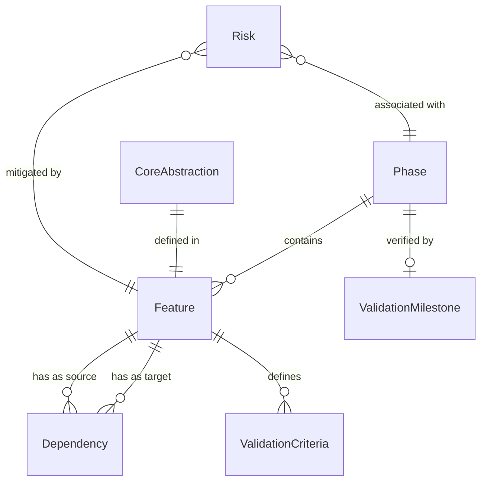

# 数据模型: 033-panoramic-doc-blueprint

**Feature Branch**: `033-panoramic-doc-blueprint`
**Date**: 2026-03-18

---

## 说明

本 Feature 的交付物是 Markdown 文档（blueprint.md），不涉及代码实现或数据库存储。以下数据模型描述的是蓝图文档中的**信息实体及其关系**，用于指导文档内容的组织和完整性校验。

---

## 实体定义

### Phase（阶段）

蓝图中的实施阶段，按技术依赖和复杂度递增排列。

| 属性 | 类型 | 约束 | 说明 |
|------|------|------|------|
| phaseNumber | number | 0-3, 唯一 | 阶段编号 |
| phaseName | string | 必填 | 阶段名称（基础设施层/核心能力层/增强能力层/高级能力层） |
| phaseGoal | string | 必填 | 阶段目标描述 |
| features | Feature[] | 至少 1 个 | 包含的 Feature 列表 |
| estimatedEffort | string | 格式: "N-M 天" | 预估总工作量范围 |
| prerequisitePhase | number? | 小于 phaseNumber | 前置阶段编号（Phase 0 无前置） |
| isExperimental | boolean | Phase 3 为 true | 是否标注为实验性 |

### Feature（特性）

Milestone 中的最小可交付单元。

| 属性 | 类型 | 约束 | 说明 |
|------|------|------|------|
| specsNumber | number | 034-050, 唯一 | specs 目录编号（主标识符） |
| name | string | 必填 | Feature 名称 |
| description | string | 必填 | 一句话描述 |
| phase | number | 0-3 | 所属 Phase 编号 |
| dependencies | Dependency[] | 可为空 | 前置依赖列表 |
| estimatedEffort | string | 格式: "N-M 天" | 预估工作量范围 |
| validationCriteria | string[] | 至少 2 条 | 验证标准列表 |
| deliverables | string[] | 至少 1 项 | 交付物清单 |
| parallelGroup | string? | 可选 | 可并行分组标识 |

### Dependency（依赖关系）

Feature 之间的前置条件约束。

| 属性 | 类型 | 约束 | 说明 |
|------|------|------|------|
| sourceFeature | number | 034-050 | 源 Feature（依赖方）的 specs 编号 |
| targetFeature | number | 034-050 | 目标 Feature（被依赖方）的 specs 编号 |
| dependencyType | enum | "strong" / "weak" | 依赖类型 |
| description | string? | 可选 | 依赖关系说明 |

**约束规则**:
- targetFeature 所属 Phase <= sourceFeature 所属 Phase（无跨 Phase 反向依赖）
- 依赖关系图必须是 DAG（无环）
- strong: 源 Feature 的实现必须调用或扩展目标 Feature 的交付物
- weak: 源 Feature 可受益于目标 Feature 但可降级实现

### ValidationMilestone（验证里程碑）

每个 Phase 完成后基于 OctoAgent 项目的端到端验证检查点。

| 属性 | 类型 | 约束 | 说明 |
|------|------|------|------|
| phase | number | 0-3 | 所属 Phase |
| validationTarget | string | 必填 | 验证操作描述 |
| expectedOutput | string | 必填 | 预期产出 |
| passCriteria | string | 必填 | 通过标准 |

### CoreAbstraction（核心抽象）

Phase 0 定义的接口契约。

| 属性 | 类型 | 约束 | 说明 |
|------|------|------|------|
| interfaceName | string | 必填, 唯一 | 接口名称 |
| responsibility | string | 必填 | 职责边界描述 |
| coreMethods | MethodSummary[] | 至少 1 个 | 核心方法列表 |
| relatedFeature | number | 034-036 | 关联的 Phase 0 Feature |

### Risk（风险）

技术风险条目。

| 属性 | 类型 | 约束 | 说明 |
|------|------|------|------|
| riskId | number | 唯一, 自增 | 风险编号 |
| description | string | 必填 | 风险描述 |
| probability | enum | "高" / "中" / "低" | 概率评估 |
| impact | enum | "高" / "中" / "低" | 影响评估 |
| mitigationStrategy | string | 必填 | 缓解策略 |
| relatedFeatureOrPhase | string | 必填 | 关联的 Feature 编号或 Phase |

---

## 实体关系图

---

## 编号映射

| specs 编号 | 调研编号 | Feature 名称 |
|-----------|---------|-------------|
| 034 | F-000 | DocumentGenerator + ArtifactParser 接口定义 |
| 035 | F-001 | ProjectContext 统一上下文 |
| 036 | F-002 | GeneratorRegistry 注册中心 |
| 037 | F-003 | 非代码制品解析 |
| 038 | F-004 | 通用数据模型文档 |
| 039 | F-005 | 配置参考手册生成 |
| 040 | F-006 | Monorepo 层级架构索引 |
| 041 | F-007 | 跨包依赖分析 |
| 042 | F-008 | API 端点文档生成 |
| 043 | F-009 | 部署/运维文档 |
| 044 | F-010 | 设计文档交叉引用 |
| 045 | F-011 | 反向架构概览模式 |
| 046 | F-012 | 文档完整性审计 |
| 047 | F-013 | 事件流/状态机文档 |
| 048 | F-014 | FAQ 生成 |
| 049 | F-015 | 增量差量 Spec 重生成 |
| 050 | F-016 | 架构模式检测 |
