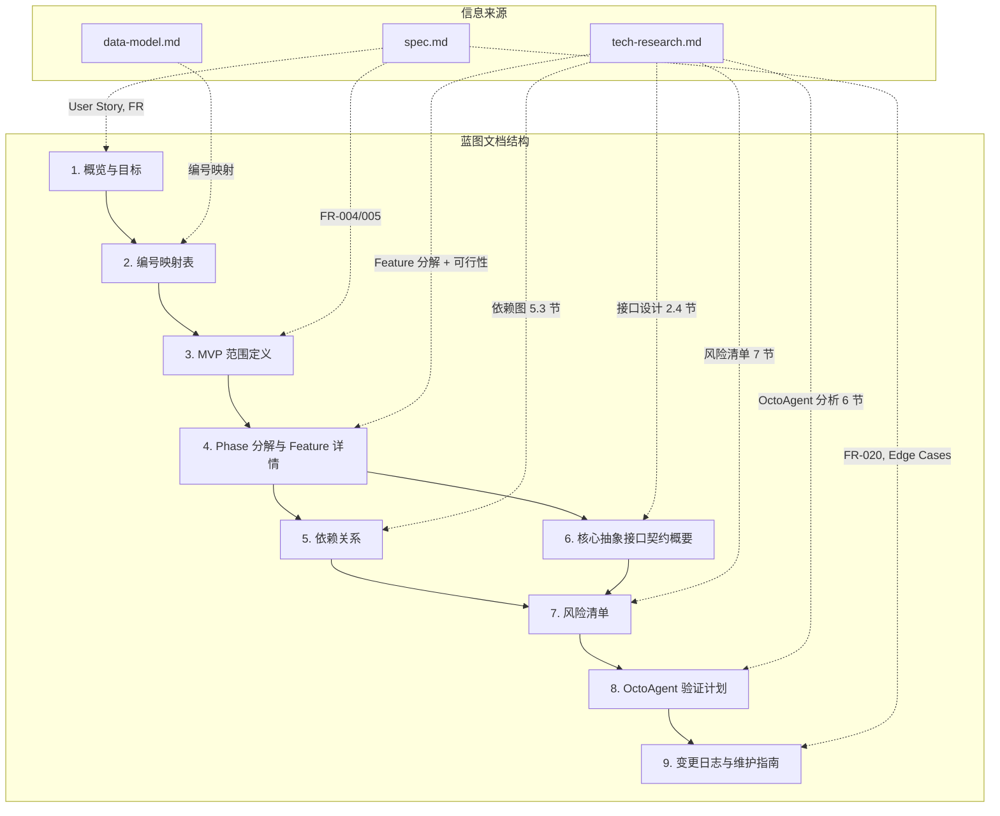
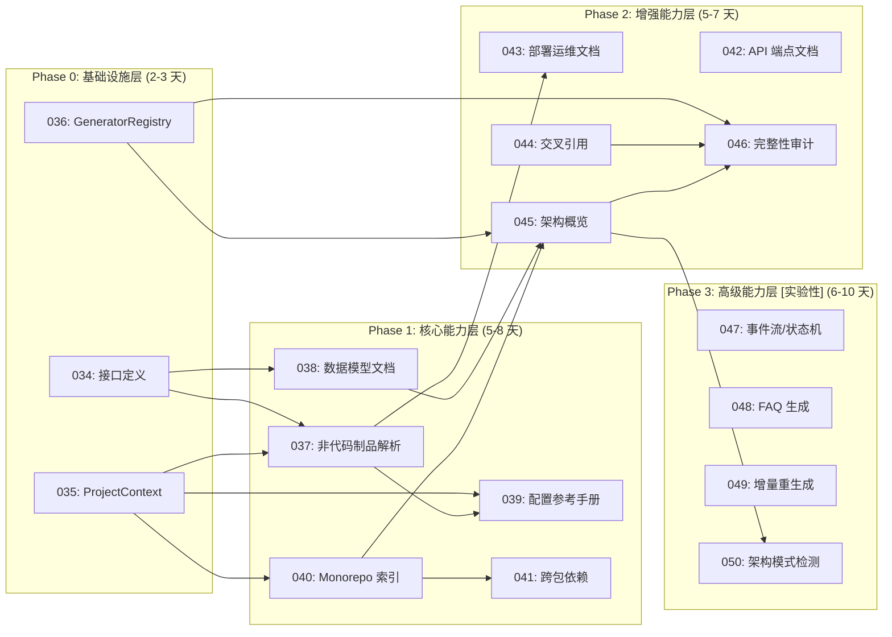
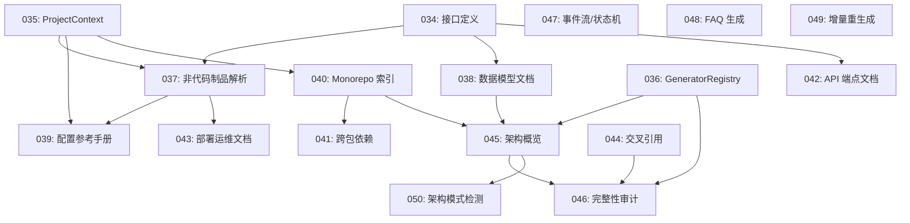

# Implementation Plan: 全景文档化 Milestone 蓝图

**Branch**: `033-panoramic-doc-blueprint` | **Date**: 2026-03-18 | **Spec**: [spec.md](./spec.md)
**Input**: Feature specification from `specs/033-panoramic-doc-blueprint/spec.md`

---

## Summary

本 Feature 的交付物是一份结构化的 Milestone 蓝图文档（`blueprint.md`），为 Reverse Spec 和 Spec Driver 的全景文档化能力提供完整规划。蓝图覆盖 17 个后续 Feature（specs 编号 034-050），划分为 4 个 Phase（基础设施层 → 核心能力层 → 增强能力层 → 高级能力层），包含依赖关系图、验证标准、核心抽象接口契约概要、风险清单和 OctoAgent 验证计划。

技术方案基于 tech-research.md 的推荐结论：采用"渐进式扩展为主 + 轻量抽象层为基础设施"的混合策略，在 Phase 0 引入 DocumentGenerator / ArtifactParser / ProjectContext / GeneratorRegistry 四个核心抽象，然后通过 Phase 1-3 逐步扩展具体的文档生成能力。

**本 Feature 不涉及代码实现**。交付物是纯 Markdown 文档，技术规划聚焦于文档结构设计、信息组织策略和内容生成方法。

---

## Technical Context

**语言/版本**: Markdown（文档输出格式）
**主要依赖**: 无运行时依赖。蓝图文档是纯 Markdown 文件，仅依赖 Mermaid 渲染（GitHub 原生支持）
**存储**: 文件系统（`specs/033-panoramic-doc-blueprint/blueprint.md`）
**测试**: 人工审阅 + spec.md 21 条 Functional Requirements 逐条检查
**目标平台**: GitHub Markdown 渲染（支持 Mermaid 图表）
**项目类型**: 文档型 Feature（无源代码变更）
**性能目标**: N/A
**约束**: 单文件输出，预估 600-700 行；specs 编号（034-050）为主标识符
**规模/范围**: 17 个 Feature、4 个 Phase、4 个核心抽象、8+ 项技术风险、4 个验证里程碑

---

## Constitution Check

*GATE: Must pass before Phase 0 research. Re-check after Phase 1 design.*

本 Feature 的交付物是 Markdown 蓝图文档，不涉及代码实现。按照 Constitution 的分区检查策略，项目级原则始终检查，Plugin 分区原则根据适用性评估。

### 项目级原则

| 原则 | 适用性 | 评估 | 说明 |
|------|--------|------|------|
| I. 双语文档规范 | 适用 | PASS | 蓝图文档使用中文撰写散文内容，保留英文代码标识符（接口名、方法名）。章节标题中文。 |
| II. Spec-Driven Development | 适用 | PASS | 本 Feature 通过完整的 spec-driver 流程（spec.md → plan.md → tasks.md）执行，不直接修改源代码。 |
| III. 诚实标注不确定性 | 适用 | PASS | 蓝图中的工作量预估使用区间（如"1-2 天"）反映不确定性；Phase 3 Feature 标注"实验性"。 |

### Plugin: reverse-spec 约束

| 原则 | 适用性 | 评估 | 说明 |
|------|--------|------|------|
| IV. AST 精确性优先 | 不适用 | N/A | 本 Feature 不涉及 AST 分析或代码提取。 |
| V. 混合分析流水线 | 不适用 | N/A | 本 Feature 不涉及代码分析流水线。 |
| VI. 只读安全性 | 适用 | PASS | 蓝图文档写入 `specs/` 目录，符合只读安全性的写操作范围限制。 |
| VII. 纯 Node.js 生态 | 不适用 | N/A | 本 Feature 不涉及运行时依赖引入。 |

### Plugin: spec-driver 约束

| 原则 | 适用性 | 评估 | 说明 |
|------|--------|------|------|
| VIII. Prompt 工程优先 | 不适用 | N/A | 本 Feature 不涉及子代理或 Skill 文件变更。 |
| IX. 零运行时依赖 | 适用 | PASS | 蓝图文档是纯 Markdown，无运行时依赖。 |
| X. 质量门控不可绕过 | 适用 | PASS | 通过 spec-driver 流程执行，设计门（plan.md 审阅）在 feature 模式下暂停等待用户确认。 |
| XI. 验证铁律 | 适用 | PASS | blueprint.md 完成后将通过 FR 逐条检查验证，而非推测性声明。 |
| XII. 向后兼容 | 不适用 | N/A | 本 Feature 新增文档，不修改现有配置或流程。 |

**Constitution Check 结果**: PASS（无 VIOLATION）

---

## Project Structure

### Documentation (this feature)

```text
specs/033-panoramic-doc-blueprint/
├── spec.md                          # 需求规范（已完成）
├── plan.md                          # 本文件 — 技术规划
├── research.md                      # 技术决策研究（7 项决策）
├── data-model.md                    # 蓝图信息实体模型
├── quickstart.md                    # 快速上手指南
├── contracts/
│   └── blueprint-structure.md       # blueprint.md 的文档结构契约
├── research/
│   └── tech-research.md             # 技术调研报告（前序制品）
├── checklists/
│   └── requirements.md              # 需求质量检查清单（前序制品）
└── blueprint.md                     # [待生成] 最终交付物
```

### Source Code (repository root)

本 Feature 不涉及源代码变更。蓝图文档是纯 Markdown 文件，不需要修改 `src/`、`tests/` 或任何 Plugin 目录下的文件。

**Structure Decision**: 纯文档型 Feature，所有制品存放在 `specs/033-panoramic-doc-blueprint/` 目录内。唯一的交付物 `blueprint.md` 与 spec.md 同级，便于在 specs 目录浏览时直接找到。

---

## Architecture

### 蓝图文档的信息架构

蓝图文档（blueprint.md）采用 9 章结构，按"先全景、后细节、再风险与验证"的阅读心智模型组织。



### Phase 分解总览（specs 编号）



### 依赖关系有向图（specs 编号版）

以下为 tech-research.md 第 5.3 节依赖图的 specs 编号转换版，将作为 blueprint.md 第 5 章的基础。



**DAG 验证**: 所有依赖边均从低 Phase 指向高 Phase 或同 Phase 内部，无跨 Phase 反向依赖，无环。

### 17 个 Feature 概要设计

以下为 blueprint.md 第 4 章中每个 Feature 卡片的核心内容预览。完整的 Feature 卡片格式见 `contracts/blueprint-structure.md`。

#### Phase 0: 基础设施层

**Feature 034: DocumentGenerator + ArtifactParser 接口定义**
- 预估: 0.5-1 天
- 依赖: 无
- 核心接口: DocumentGenerator（isApplicable / extract / generate / render）、ArtifactParser（parse / parseAll + filePatterns）
- 验证: (1) 接口定义通过 TypeScript 编译且有对应 Zod Schema; (2) 至少编写一个 Mock Generator 验证接口可用性

**Feature 035: ProjectContext 统一上下文**
- 预估: 0.5-1 天
- 依赖: 无
- 核心职责: 统一项目元信息（projectRoot、packageManager、workspaceType、detectedLanguages、configFiles、existingSpecs）
- 验证: (1) 对 OctoAgent 项目运行 ProjectContext 构建，正确检测 Python + TS 多语言; (2) 对非 monorepo 项目运行，workspaceType 为 "single"

**Feature 036: GeneratorRegistry 注册中心**
- 预估: 0.5-1 天
- 依赖: 无
- 核心职责: Generator 的注册、发现、启用/禁用管理
- 验证: (1) 注册 3+ 个 Mock Generator，通过 Registry 按 ProjectContext 过滤出适用的 Generator; (2) Registry 支持按 id 查询和全量列出

#### Phase 1: 核心能力层

**Feature 037: 非代码制品解析**
- 预估: 1.5-2 天
- 依赖: 034（强）、035（强）
- 核心交付: SkillMdParser、BehaviorYamlParser、DockerfileParser（ArtifactParser 的首批实现）
- 验证: (1) 解析 OctoAgent 的 SKILL.md 文件，提取 trigger、description、constraints; (2) 解析 behavior YAML，提取状态-行为映射

**Feature 038: 通用数据模型文档**
- 预估: 1-1.5 天
- 依赖: 034（强）
- 核心交付: DataModelGenerator + Mermaid ER 图渲染
- 验证: (1) 对 Python dataclass / Pydantic model 提取字段定义并生成文档; (2) 生成的 Mermaid ER 图正确反映实体间关系

**Feature 039: 配置参考手册生成**
- 预估: 1-1.5 天
- 依赖: 037（强）、035（弱）
- 核心交付: ConfigReferenceGenerator + config-reference.hbs 模板
- 验证: (1) 解析 OctoAgent 的 octoagent.yaml，生成完整的配置参考手册; (2) 手册包含每个配置项的名称、类型、默认值、说明

**Feature 040: Monorepo 层级架构索引**
- 预估: 1-1.5 天
- 依赖: 035（强）
- 核心交付: WorkspaceAnalyzer + batch-orchestrator 扩展
- 验证: (1) 对 OctoAgent 生成 packages/apps 层级索引; (2) 索引正确反映每个子包的职责和技术栈

**Feature 041: 跨包依赖分析**
- 预估: 1-1.5 天
- 依赖: 040（强）
- 核心交付: CrossPackageAnalyzer + 循环检测
- 验证: (1) 生成 OctoAgent 子包间的依赖拓扑图; (2) 正确检测跨包循环依赖

#### Phase 2: 增强能力层

**Feature 042: API 端点文档生成**
- 预估: 1-1.5 天
- 依赖: 034（强）
- 核心交付: ApiEndpointGenerator + openapi-summary.hbs
- 验证: (1) 提取 Express/FastAPI 路由定义并生成端点文档; (2) 文档包含 HTTP 方法、路径、参数、响应类型

**Feature 043: 部署/运维文档**
- 预估: 1-1.5 天
- 依赖: 037（强）
- 核心交付: DeploymentGenerator + deployment.hbs
- 验证: (1) 解析 Dockerfile 和 docker-compose 生成部署文档; (2) 文档包含环境变量、端口、卷映射、启动命令

**Feature 044: 设计文档交叉引用**
- 预估: 0.5-1 天
- 依赖: Phase 1 完成（弱）
- 核心交付: CrossReferenceIndex + spec 内链接注入
- 验证: (1) 在生成的 spec 中自动插入关联 spec 的链接; (2) 交叉引用覆盖同模块和跨模块关系

**Feature 045: 反向架构概览模式**
- 预估: 1-1.5 天
- 依赖: 036（强）、038（弱）、040（弱）
- 核心交付: ArchitectureOverviewGenerator（Composite 模式）
- 验证: (1) 对 OctoAgent 生成全局架构鸟瞰文档; (2) 文档包含分层视图、模块职责、关键数据流

**Feature 046: 文档完整性审计**
- 预估: 1-1.5 天
- 依赖: 036（强）、044（弱）、045（弱）
- 核心交付: CoverageAuditor + coverage-report.hbs
- 验证: (1) 审计报告列出项目中所有应文档化但未文档化的模块; (2) 覆盖率以百分比形式呈现

#### Phase 3: 高级能力层（实验性）

**Feature 047: 事件流/状态机文档**
- 预估: 2-3 天
- 依赖: 034（强）
- 核心交付: EventFlowGenerator + 状态机 Mermaid 图
- 验证: (1) 检测 emit/on 事件模式并生成事件流文档; (2) 生成的状态机图正确反映状态转换

**Feature 048: FAQ 生成**
- 预估: 1-2 天
- 依赖: 034（强）
- 核心交付: FaqGenerator + faq.hbs
- 验证: (1) 从错误处理模式和边界条件推导常见问题; (2) 生成的 FAQ 条目包含问题、答案、相关代码位置

**Feature 049: 增量差量 Spec 重生成**
- 预估: 2-3 天
- 依赖: Phase 1 完成（强）
- 核心交付: DeltaRegenerator + batch-orchestrator 扩展
- 验证: (1) 修改源文件后仅重生成受影响的 spec，非受影响 spec 保持不变; (2) skeleton hash 变更正确触发级联重生成

**Feature 050: 架构模式检测**
- 预估: 2-3 天
- 依赖: 045（强）
- 核心交付: PatternDetector + LLM 推理 prompt
- 验证: (1) 检测常见架构模式（分层架构、事件驱动、CQRS 等）; (2) 检测结果包含模式名称、置信度、证据代码位置

### 并行分组分析

| Phase | 可并行分组 | 说明 |
|-------|-----------|------|
| Phase 0 | {034, 035, 036} 全部可并行 | 三个基础设施 Feature 之间无依赖关系 |
| Phase 1 | {037, 038} 可并行; {040} 独立; {039} 依赖 037; {041} 依赖 040 | 最大并行度 3（037 + 038 + 040 同时启动） |
| Phase 2 | {042, 043, 044} 可并行; {045} 依赖 036+038+040; {046} 依赖 036+044+045 | 最大并行度 3 |
| Phase 3 | {047, 048} 可并行; {049} 独立; {050} 依赖 045 | 最大并行度 3（047 + 048 + 049 同时启动） |

### 信息来源与生成策略

蓝图文档的内容全部来源于已有的前序制品，不需要额外调研或代码分析。以下是每个章节的生成策略：

| blueprint.md 章节 | 生成策略 | 信息变换 |
|-------------------|---------|---------|
| 1. 概览与目标 | 从 spec.md User Story 1 提炼 | 将验收场景转化为目标陈述 |
| 2. 编号映射表 | 从 data-model.md 直接复制 | 无变换 |
| 3. MVP 范围定义 | 从 spec.md FR-004/005 + tech-research.md 10 节 | 合并理由说明 |
| 4. Feature 详情 | 从 tech-research.md 第 5 节 + 第 9 节 | F-xxx → 034-050 编号转换; 补充验证标准 |
| 5. 依赖关系 | 从 tech-research.md 第 5.3 节 | F-xxx → 034-050 编号转换; 新增依赖矩阵表格 |
| 6. 核心抽象 | 从 tech-research.md 第 2.4 节 | TypeScript 接口 → 自然语言 + 方法列表 |
| 7. 风险清单 | 从 tech-research.md 第 7 节 | 补充 Feature/Phase 关联 |
| 8. 验证计划 | 从 tech-research.md 第 6 节推导 | 按 Phase 组织验证里程碑 |
| 9. 变更日志 | 从 spec.md FR-020 + Edge Cases | 建立维护模板 |

### 工作量汇总

| Phase | Feature 数量 | 预估工作量 | 累计工作量 |
|-------|-------------|-----------|-----------|
| Phase 0 | 3 | 1.5-3 天 | 1.5-3 天 |
| Phase 1 | 5 | 5-8 天 | 6.5-11 天 |
| Phase 2 | 5 | 4-6 天 | 10.5-17 天 |
| Phase 3 | 4 | 7-11 天 | 17.5-28 天 |
| **合计** | **17** | **17.5-28 天** | - |
| **MVP (Phase 0+1)** | **8** | **6.5-11 天** | - |

---

## Complexity Tracking

> 本 Feature 无 Constitution Check violation，无需记录复杂度偏差。

| 决策 | 选择 | 更简单的替代方案 | 拒绝理由 |
|------|------|----------------|---------|
| 9 章文档结构 | 按"全景→细节→风险→验证"组织 | 按 Phase 线性排列所有内容 | 线性排列导致依赖关系、风险等横切关注点被打散到各 Phase 中，无法集中查阅（违反 Story 2/5） |
| Feature 卡片标准格式 | 固定 8 字段格式 | 自由格式文本描述 | 自由格式无法保证 17 个 Feature 信息的一致性和完整性，不利于后续 spec 编写者引用（违反 SC-004） |
| 双重依赖展示（图+表） | Mermaid 图 + 依赖矩阵表格 | 仅用其一 | spec.md FR-006/FR-007 分别要求两种格式，且图/表服务于不同阅读场景 |
