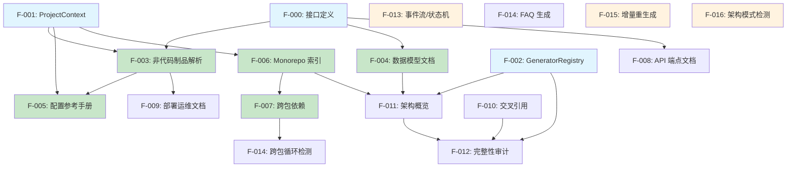

# 技术调研报告: 033-panoramic-doc-blueprint（全景文档化 Milestone 蓝图）

**特性分支**: `033-panoramic-doc-blueprint`
**调研日期**: 2026-03-18
**调研模式**: 在线
**产品调研基础**: [独立模式] 本次技术调研未参考产品调研结论，基于需求描述和代码上下文执行

## 1. 调研目标

**核心问题**:
- 问题 1: 14 项改进方向中，哪些可在现有 Reverse Spec 架构上扩展，哪些需要重构？
- 问题 2: 如何设计一组核心抽象（DocumentGenerator、ArtifactParser 等）统一所有改进方向？
- 问题 3: Feature 之间的依赖关系如何？最优实施顺序是什么？
- 问题 4: OctoAgent 项目作为验证目标具备哪些关键特征，如何影响优先级？

**需求描述中的 MVP 范围**:
- 规划完整 Milestone 蓝图：Feature 分解、依赖关系、优先级排序
- 14 项改进方向的技术可行性评估
- 识别需要新增的核心抽象

## 2. 架构方案对比

### 2.1 现有架构分析

当前 Reverse Spec 的核心架构是一条 **三阶段流水线**：

```
阶段 1: 预处理（scan + AST + 脱敏）
  → file-scanner → LanguageAdapter.analyzeFile() → CodeSkeleton
阶段 2: 上下文组装
  → context-assembler → AssembledContext（prompt + token 预算）
阶段 3: 生成增强
  → LLM 调用 → parseLLMResponse → Handlebars 渲染 → .spec.md
```

**关键扩展点**:

| 组件 | 接口 | 扩展性评估 |
|------|------|-----------|
| `LanguageAdapter` | 接口完备（analyzeFile / analyzeFallback / buildDependencyGraph / getTerminology / getTestPatterns） | 高 — 已支持 TS/JS/Python/Go/Java，新增语言只需实现接口 |
| `CodeSkeleton` | Zod Schema 定义的中间表示 | 中 — 针对代码文件设计，非代码制品需要新的中间表示 |
| `SpecSections` | 硬编码 9 段式结构 | 低 — 需要引入可组合的 Section 注册机制才能支持新文档类型 |
| `context-assembler` | 单一 prompt 组装策略 | 中 — 可通过策略模式扩展不同的 prompt 模板 |
| `spec-renderer` | Handlebars 模板驱动 | 高 — 新增模板即可支持新输出格式 |
| `batch-orchestrator` | 按模块级拓扑排序 | 中 — 需增加 artifact 级别的编排能力 |
| `dependency-graph` | dependency-cruiser 封装 | 低 — 仅支持 TS/JS 的 import 拓扑，非代码制品无法接入 |

### 2.2 方案对比表

| 维度 | 方案 A: 渐进式扩展（Plugin Architecture） | 方案 B: 核心重构（DocumentGenerator 抽象层） |
|------|------------------------------------------|---------------------------------------------|
| 概述 | 在现有架构上通过新增 Plugin / Adapter 模式逐步扩展，每个改进方向作为独立 Feature 添加新的 Generator 类 | 提取通用的 `DocumentGenerator` 接口和 `ArtifactParser` 抽象层，重新定义中间表示，然后基于新架构实现所有改进 |
| 性能 | 无重构开销，增量交付 | 初期重构成本高，但长期架构更清晰 |
| 可维护性 | 中等 — 各 Generator 松散耦合，但缺少统一契约可能导致接口碎片化 | 高 — 统一接口和中间表示，新增 Generator 遵循固定模式 |
| 学习曲线 | 低 — 沿用现有模式，开发者已熟悉 | 中 — 需理解新抽象层，但一旦理解后开发效率更高 |
| 社区支持 | 无需引入新范式 | 参考 Docusaurus / TypeDoc 等文档工具的 Plugin 架构 |
| 适用规模 | 适合 5-8 个改进方向 | 适合 10+ 改进方向的大规模扩展 |
| 与现有项目兼容性 | 完全兼容，零破坏性变更 | 需要重构核心 Pipeline，影响 `single-spec-orchestrator`、`batch-orchestrator` |
| 风险 | 随着 Feature 增多，缺少统一抽象可能导致代码膨胀 | 重构过程中可能引入回归 bug |

### 2.3 推荐方案

**推荐**: 方案 A（渐进式扩展）为主体 + 方案 B 的关键抽象作为 Phase 0 基础设施

**理由**:
1. **14 项改进中约 60% 可直接在现有架构上扩展**：API 端点文档、数据模型文档、配置参考手册、部署文档等本质上是新的 Generator + 专用 Parser，不需要触碰核心 Pipeline
2. **引入轻量抽象层而非完全重构**：新增 `DocumentGenerator` 接口和 `ArtifactParser` 接口作为扩展契约，但不改动现有 `LanguageAdapter` / `CodeSkeleton` / `SpecSections` 的核心逻辑
3. **降低交付风险**：先通过 2-3 个低风险 Feature 验证抽象层设计，再逐步推进高复杂度 Feature
4. **OctoAgent 验证驱动**：优先实施 OctoAgent 项目最需要的改进（Python 项目的数据模型、behavior YAML、SKILL.md 解析、monorepo 架构索引）

### 2.4 推荐的核心抽象设计

```typescript
// ═══ 新增接口：DocumentGenerator ═══
interface DocumentGenerator<TInput, TOutput> {
  readonly id: string;
  readonly name: string;
  // 判断当前项目是否适用此 Generator
  isApplicable(projectContext: ProjectContext): Promise<boolean>;
  // 从项目中提取该 Generator 需要的输入数据
  extract(projectContext: ProjectContext): Promise<TInput>;
  // 将提取的数据转换为文档输出
  generate(input: TInput, options?: GenerateOptions): Promise<TOutput>;
  // 将输出渲染为 Markdown
  render(output: TOutput): string;
}

// ═══ 新增接口：ArtifactParser ═══
interface ArtifactParser<T> {
  readonly id: string;
  // 该 Parser 支持的文件模式（glob）
  readonly filePatterns: string[];
  // 解析单个制品文件
  parse(filePath: string): Promise<T>;
  // 批量解析
  parseAll(filePaths: string[]): Promise<T[]>;
}

// ═══ 新增：项目上下文（取代散落的 projectRoot 参数）═══
interface ProjectContext {
  readonly projectRoot: string;
  readonly packageManager?: 'npm' | 'yarn' | 'pnpm' | 'pip' | 'uv' | 'go' | 'maven' | 'gradle';
  readonly workspaceType?: 'single' | 'monorepo';
  readonly detectedLanguages: string[];
  readonly configFiles: Map<string, string>; // fileName → absolutePath
  readonly existingSpecs: string[];          // 已有的 spec 文件路径
}
```

## 3. 依赖库评估

### 3.1 评估矩阵

本次全景文档化扩展的核心原则是 **最小化新增运行时依赖**，优先复用现有依赖栈。

| 库名 | 用途 | 版本 | 周下载量 | 许可证 | 最近更新 | 评级 | 是否新增 |
|------|------|------|---------|--------|---------|------|---------|
| ts-morph | TS/JS AST 分析 | ^24.0.0 | ~800k | MIT | 活跃 | 高 | 否（现有） |
| web-tree-sitter | 多语言 AST 分析 | ^0.24.7 | ~200k | MIT | 活跃 | 高 | 否（现有） |
| dependency-cruiser | JS/TS 依赖图 | ^16.8.0 | ~600k | MIT | 活跃 | 高 | 否（现有） |
| handlebars | 模板渲染 | ^4.7.8 | ~10M | MIT | 稳定 | 高 | 否（现有） |
| zod | Schema 验证 | ^3.24.1 | ~15M | MIT | 活跃 | 高 | 否（现有） |
| @anthropic-ai/sdk | LLM 调用 | ^0.39.0 | ~100k | MIT | 活跃 | 高 | 否（现有） |
| js-yaml | YAML 解析 | ^4.1.0 | ~30M | MIT | 稳定 | 高 | 待评估 |
| toml | TOML 解析（pyproject.toml 等） | - | - | - | - | 中 | 待评估 |
| dockerfile-ast | Dockerfile AST 解析 | ^0.6.1 | ~20k | MIT | 2024 活跃 | 中 | 待评估 |

### 3.2 推荐依赖集

**核心依赖（无新增）**:
- 全部改进方向均可基于现有 6 个运行时依赖实现
- YAML 解析可通过 Node.js 内置的 JSON 解析 + 轻量自定义 parser 覆盖大部分场景
- Dockerfile / CI 配置解析可通过正则 + 行级解析实现（无需 AST 级别精度）

**可选依赖（视需求引入）**:
- `js-yaml`: 若 YAML 解析需求复杂度高（嵌套锚点、合并键等），建议引入。OctoAgent 项目使用 `octoagent.yaml`、`docker-compose.litellm.yml` 等文件，验证时可能需要
- `@iarna/toml`: Python 项目的 `pyproject.toml` 解析，OctoAgent 使用该格式

### 3.3 与现有项目的兼容性

| 现有依赖 | 兼容性 | 说明 |
|---------|--------|------|
| ts-morph ^24.0.0 | 兼容 | API 端点提取可复用 AST 分析能力（Express/Fastify 路由解析） |
| web-tree-sitter ^0.24.7 | 兼容 | Python dataclass / Go struct 解析已通过 QueryMapper 支持 |
| dependency-cruiser ^16.8.0 | 兼容 | Monorepo 层级索引可扩展 cruise() 配置 |
| handlebars ^4.7.8 | 兼容 | 新文档类型只需新增 .hbs 模板 |
| zod ^3.24.1 | 兼容 | 新中间表示（ArtifactSkeleton 等）用 Zod Schema 定义 |
| @anthropic-ai/sdk ^0.39.0 | 兼容 | 新 Generator 复用 callLLM 接口，仅需调整 system prompt |

## 4. 设计模式推荐

### 4.1 推荐模式

1. **Strategy Pattern（策略模式）** — 适用于 DocumentGenerator 体系
   - 每种文档类型（API、数据模型、状态机、配置参考等）作为一个独立 Strategy
   - 通过 `DocumentGeneratorRegistry` 统一注册和发现
   - 与现有 `LanguageAdapterRegistry` 模式完全一致，开发者零学习成本

2. **Composite Pattern（组合模式）** — 适用于全景报告生成
   - 反向架构概览模式（改进方向 10）需要组合多个 Generator 的输出
   - 文档完整性审计（改进方向 11）需要遍历所有已注册 Generator 检查覆盖
   - 通过 Composite 将多个 Generator 输出聚合为统一的全景文档

3. **Template Method Pattern（模板方法模式）** — 适用于 ArtifactParser
   - 所有非代码制品 Parser 共享相同的生命周期：`discover() → read() → parse() → validate()`
   - 子类只需覆写特定步骤（如 Dockerfile 解析 vs YAML 解析）

4. **Observer Pattern（观察者模式）** — 适用于增量差量重生成
   - 现有 `drift-orchestrator` 已实现基线骨架对比
   - 增量重生成扩展为：监听文件变更 → 对比 skeleton hash → 触发选择性重生成

### 4.2 应用案例

- **TypeDoc Plugin System**: TypeDoc 使用 Event + Plugin 模式，每个 Plugin 注册到 Renderer 的不同事件上，与推荐的 DocumentGenerator Registry 模式高度相似
- **Docusaurus Plugin Architecture**: 每个 Plugin 实现 `loadContent() → contentLoaded() → postBuild()` 生命周期，与 `extract() → generate() → render()` 三步走一致
- **dependency-cruiser 的 Reporter 模式**: 不同的输出格式（JSON / DOT / HTML）通过 Reporter 策略切换，与新增 Handlebars 模板的扩展方式一致

## 5. 14 项改进方向的技术可行性分析

### 5.1 逐项评估

| # | 改进方向 | 架构影响 | 实现复杂度 | 现有代码可复用度 | 新增抽象需求 | OctoAgent 验证价值 |
|---|---------|---------|-----------|----------------|-------------|-------------------|
| 1 | API 端点文档生成 | 新增 Generator | 中 | 高（ts-morph 提取路由装饰器 / Express handler） | ArtifactParser（路由） | 低（OctoAgent 为 Python + FastAPI） |
| 2 | 通用数据模型文档 | 新增 Generator | 中 | 高（CodeSkeleton.exports 已含 interface/type/class） | DataModelExtractor | **高**（Pydantic model + dataclass） |
| 3 | 事件流/状态机文档 | 新增 Generator | **高** | 低（需 AST 级别 emit/on 模式检测） | EventFlowAnalyzer | 中（OctoAgent 有事件驱动模式） |
| 4 | 非代码制品解析 | **新增 ArtifactParser 接口** | 中 | 低（全新领域） | ArtifactParser + ArtifactSkeleton | **高**（SKILL.md / behavior YAML / octoagent.yaml） |
| 5 | Monorepo 层级架构索引 | 扩展 batch-orchestrator | 中 | 中（已有 workspace 检测逻辑） | WorkspaceAnalyzer | **高**（OctoAgent 有 packages/ + apps/ 结构） |
| 6 | 设计文档交叉引用 | 扩展 spec-renderer | 低 | 高（现有 frontmatter 已含 sourceTarget） | CrossReferenceIndex | 中 |
| 7 | 配置参考手册生成 | 新增 Generator | 低 | 低（需 YAML/TOML/env 解析） | ConfigParser | **高**（octoagent.yaml / docker-compose） |
| 8 | FAQ 生成 | 新增 Generator | 中 | 中（可从 error handling 模式推导） | ErrorPatternAnalyzer | 低 |
| 9 | 部署/运维文档 | 新增 Generator | 中 | 低（Dockerfile/CI 解析为新领域） | DeploymentParser | 中（有 docker-compose.litellm.yml） |
| 10 | 反向架构概览模式 | **Composite Generator** | 中 | 高（复用 index-generator + 依赖图） | ArchitectureOverviewGenerator | **高** |
| 11 | 文档完整性审计 | **新增审计引擎** | 中 | 中（复用已有 spec 扫描逻辑） | CoverageAuditor | **高** |
| 12 | 增量差量 Spec 重生成 | 扩展 batch-orchestrator | **高** | 中（现有 drift-orchestrator + skeleton hash） | DeltaRegenerator | 中 |
| 13 | 架构模式检测 | 新增 Generator | **高** | 低（需跨模块模式识别，依赖 LLM） | PatternDetector | 中 |
| 14 | 跨包依赖分析 | 扩展 dependency-graph | 中 | 中（已有 SCC 检测 + 循环依赖标记） | CrossPackageAnalyzer | **高**（packages/ 间依赖） |

### 5.2 改进方向分层

根据技术依赖关系和实现复杂度，将 14 项改进分为 4 个 Phase：

```
Phase 0 — 基础设施层（必须先行）
  ├── F-000: DocumentGenerator + ArtifactParser 接口定义
  ├── F-001: ProjectContext 统一上下文
  └── F-002: GeneratorRegistry 注册中心

Phase 1 — 核心能力层（高价值 + 低-中复杂度）
  ├── F-003: 非代码制品解析（改进 4）      ← ArtifactParser 的第一个实现
  ├── F-004: 通用数据模型文档（改进 2）     ← 复用 CodeSkeleton
  ├── F-005: 配置参考手册生成（改进 7）     ← ArtifactParser 的第二个实现
  ├── F-006: Monorepo 层级架构索引（改进 5） ← 扩展 batch-orchestrator
  └── F-007: 跨包依赖分析（改进 14）        ← 扩展 dependency-graph

Phase 2 — 增强能力层（中复杂度）
  ├── F-008: API 端点文档生成（改进 1）     ← 依赖 Phase 0 接口
  ├── F-009: 部署/运维文档（改进 9）        ← 依赖 ArtifactParser
  ├── F-010: 设计文档交叉引用（改进 6）     ← 依赖 Phase 1 的 spec 输出
  ├── F-011: 反向架构概览模式（改进 10）    ← Composite，依赖 Phase 1 多个 Generator
  └── F-012: 文档完整性审计（改进 11）      ← 依赖 GeneratorRegistry 的完整注册

Phase 3 — 高级能力层（高复杂度 / 实验性）
  ├── F-013: 事件流/状态机文档（改进 3）    ← 需要深度 AST 分析 + LLM
  ├── F-014: FAQ 生成（改进 8）             ← 需要错误模式挖掘 + LLM
  ├── F-015: 增量差量 Spec 重生成（改进 12） ← 需要重构 batch-orchestrator
  └── F-016: 架构模式检测（改进 13）        ← 重度依赖 LLM 推理
```

### 5.3 依赖关系图



## 6. OctoAgent 验证目标分析

### 6.1 项目特征

| 特征 | 值 | 对全景文档化的意义 |
|------|------|-------------------|
| 主要语言 | Python（octoagent/packages/ + octoagent/apps/） | 验证 Python 适配器的深度使用 |
| 前端 | TypeScript/Vite（octoagent/frontend/） | 验证多语言混合项目支持 |
| 项目结构 | Monorepo（packages/core, memory, policy, protocol, provider, skills, tooling + apps/gateway） | 验证 Monorepo 层级索引（改进 5） + 跨包依赖分析（改进 14） |
| 非代码制品 | SKILL.md（10+ skills）、behavior YAML（system/）、octoagent.yaml、docker-compose | 验证非代码制品解析（改进 4）、配置参考（改进 7）、部署文档（改进 9） |
| 包管理 | uv（pyproject.toml + uv.lock） | 验证 Python 生态依赖图构建 |
| 测试体系 | pytest（unit / contract / integration 三层） | 测试覆盖文档可验证 |
| CI/CD | GitHub Actions（.github/workflows/） | 验证 CI 配置解析 |
| 数据模型 | Pydantic model / dataclass（推断） | 验证通用数据模型文档（改进 2） |

### 6.2 验证优先级排序

基于 OctoAgent 特征，优先实施以下改进方向：

1. **非代码制品解析（改进 4）** — SKILL.md + behavior YAML 是 OctoAgent 的核心特色，现有 Reverse Spec 完全无法处理
2. **通用数据模型文档（改进 2）** — Python Pydantic / dataclass 是 OctoAgent 的数据层基础
3. **Monorepo 层级架构索引（改进 5）** — packages/ + apps/ 结构需要 workspace 感知
4. **跨包依赖分析（改进 14）** — packages 之间的 import 拓扑和循环检测
5. **配置参考手册（改进 7）** — octoagent.yaml 是核心配置入口
6. **反向架构概览（改进 10）** — 需要全局鸟瞰 OctoAgent 的分层架构

## 7. 技术风险清单

| # | 风险描述 | 概率 | 影响 | 缓解策略 |
|---|---------|------|------|---------|
| 1 | ArtifactParser 接口设计不够通用，后续改进方向需要频繁修改接口 | 中 | 高 | Phase 0 先用 3+ 个具体 Parser（SKILL.md / YAML / Dockerfile）验证接口设计，再固化 |
| 2 | 非代码制品（YAML/Markdown）的 AST 精度不足，解析出的结构信息质量低 | 中 | 中 | 采用 "正则 + LLM 增强" 双通道策略：先用正则提取结构，再用 LLM 补充语义理解 |
| 3 | Monorepo workspace 检测在不同包管理器（npm/yarn/pnpm/uv）之间行为不一致 | 高 | 中 | 逐个适配，Phase 1 先支持 npm workspaces + uv workspace，后续按需扩展 |
| 4 | 事件流/状态机文档（改进 3）的 AST 模式检测误报率高 | 高 | 中 | 归入 Phase 3，采用 "AST 候选 + LLM 确认" 二阶段策略；标注 `[推断]` |
| 5 | 增量差量重生成（改进 12）的变更影响范围判断不准确 | 中 | 高 | 基于已有 skeleton hash 对比 + dependency-graph 传播分析；保守策略——不确定时全量重生成 |
| 6 | LLM token 消耗显著增加（14 项改进均可能调用 LLM） | 高 | 中 | 分级策略：纯 AST 可完成的（数据模型、配置解析）不调用 LLM；需要语义理解的（FAQ、架构模式）才调用 |
| 7 | 与 Spec Driver 插件的集成——新 MCP 工具注册和 Skill prompt 更新 | 低 | 中 | 每个 Phase 完成后统一更新 MCP server.ts 的 tool 注册和 Spec Driver 的 Skill 文件 |
| 8 | OctoAgent 项目 Python 适配器的 tree-sitter grammar 对 Pydantic BaseModel / dataclass 的提取不完整 | 中 | 高 | 扩展 PythonMapper 的 extractExports()，增加 `@dataclass` / `class Foo(BaseModel)` 模式识别 |

## 8. 需求-技术对齐度

### 8.1 覆盖评估

| 需求功能 | 技术方案覆盖 | 说明 |
|---------|-------------|------|
| Milestone 蓝图规划 | 完全覆盖 | 本报告已提供 4 Phase / 17 Feature 的完整分解 |
| Feature 分解 | 完全覆盖 | 每个改进方向已映射为具体 Feature，含复杂度和依赖 |
| 依赖关系图 | 完全覆盖 | Mermaid 依赖图已在 5.3 节给出 |
| 优先级排序 | 完全覆盖 | 结合技术依赖 + OctoAgent 验证价值的双维度排序 |
| 核心抽象设计 | 完全覆盖 | DocumentGenerator + ArtifactParser + ProjectContext 三大接口 |
| 现有架构兼容性 | 完全覆盖 | 2.1 节已逐组件评估扩展性 |
| 验证目标分析 | 完全覆盖 | OctoAgent 特征已详细分析 |

### 8.2 扩展性评估

技术方案支持以下未来扩展：
- **新语言适配器**：DocumentGenerator 接口与 LanguageAdapter 正交，新增语言不影响 Generator
- **新文档类型**：通过 GeneratorRegistry 注册新 Generator 即可，无需修改核心 Pipeline
- **新输出格式**：Handlebars 模板驱动，新增 .hbs 模板即可支持 HTML / PDF 等输出
- **外部工具集成**：ProjectContext 可扩展为从 IDE / CI 环境注入额外上下文

### 8.3 Constitution 约束检查

| 约束 | 兼容性 | 说明 |
|------|--------|------|
| TypeScript 5.x / Node.js LTS (20.x+) | 兼容 | 所有改进均在 TS 生态内实现 |
| 无新增运行时依赖（优先） | 兼容 | Phase 0-2 不引入新运行时依赖；Phase 3 视需求评估 js-yaml |
| MCP 协议兼容 | 兼容 | 新 Generator 可注册为 MCP 工具 |
| spec-driver.config.yaml 配置驱动 | 兼容 | 新 Generator 的开关和参数可纳入配置 |
| 使用 spec-driver 的方式执行需求变更不允许直接修改源代码 | 兼容 | 本 Milestone 遵循 spec-driver 工作流 |

## 9. Feature 详细分解建议

### Phase 0: 基础设施（3 Features，预计 2-3 天）

| Feature ID | 名称 | 交付物 | 预估工作量 |
|-----------|------|--------|-----------|
| F-000 | DocumentGenerator + ArtifactParser 接口定义 | `src/panoramic/interfaces.ts`、Zod Schemas | 0.5 天 |
| F-001 | ProjectContext 统一上下文 | `src/panoramic/project-context.ts`、单元测试 | 0.5 天 |
| F-002 | GeneratorRegistry 注册中心 | `src/panoramic/generator-registry.ts`、bootstrapGenerators() | 0.5 天 |

### Phase 1: 核心能力（5 Features，预计 5-8 天）

| Feature ID | 名称 | 交付物 | 预估工作量 | 依赖 |
|-----------|------|--------|-----------|------|
| F-003 | 非代码制品解析 | SkillMdParser / BehaviorYamlParser / DockerfileParser | 2 天 | F-000, F-001 |
| F-004 | 通用数据模型文档 | DataModelGenerator + ER 图 Mermaid 渲染 | 1.5 天 | F-000 |
| F-005 | 配置参考手册生成 | ConfigReferenceGenerator + config-reference.hbs | 1 天 | F-003 |
| F-006 | Monorepo 层级架构索引 | WorkspaceAnalyzer + 扩展 batch-orchestrator | 1.5 天 | F-001 |
| F-007 | 跨包依赖分析 | CrossPackageAnalyzer + 循环检测 | 1 天 | F-006 |

### Phase 2: 增强能力（5 Features，预计 5-7 天）

| Feature ID | 名称 | 交付物 | 预估工作量 | 依赖 |
|-----------|------|--------|-----------|------|
| F-008 | API 端点文档生成 | ApiEndpointGenerator + openapi-summary.hbs | 1.5 天 | F-000 |
| F-009 | 部署/运维文档 | DeploymentGenerator + deployment.hbs | 1 天 | F-003 |
| F-010 | 设计文档交叉引用 | CrossReferenceIndex + spec 内链接注入 | 1 天 | Phase 1 |
| F-011 | 反向架构概览模式 | ArchitectureOverviewGenerator（Composite） | 1.5 天 | F-002, F-004, F-006 |
| F-012 | 文档完整性审计 | CoverageAuditor + coverage-report.hbs | 1 天 | F-002, F-010 |

### Phase 3: 高级能力（4 Features，预计 6-10 天）

| Feature ID | 名称 | 交付物 | 预估工作量 | 依赖 |
|-----------|------|--------|-----------|------|
| F-013 | 事件流/状态机文档 | EventFlowGenerator + state-diagram Mermaid | 2-3 天 | F-000 |
| F-014 | FAQ 生成 | FaqGenerator + faq.hbs | 1.5 天 | F-000 |
| F-015 | 增量差量 Spec 重生成 | DeltaRegenerator + 扩展 batch-orchestrator | 2-3 天 | Phase 1 |
| F-016 | 架构模式检测 | PatternDetector + LLM 推理 prompt | 2-3 天 | F-011 |

## 10. 结论与建议

### 总结

本次技术调研对 14 项全景文档化改进方向进行了全面的可行性分析和架构影响评估。核心结论：

1. **现有架构具备良好的扩展基础**：LanguageAdapter 的 Strategy 模式、Handlebars 的模板驱动、dependency-cruiser 的图分析能力，为全景文档化提供了 ~60% 的可复用基础
2. **需要引入 3 个核心抽象**：DocumentGenerator 接口、ArtifactParser 接口、ProjectContext 统一上下文——作为 Phase 0 基础设施，成本低（2-3 天）但收益高
3. **推荐 4 Phase 渐进式交付**：从基础设施 → 核心能力 → 增强能力 → 高级能力，总计 17 个 Feature，预计 18-28 天工作量
4. **OctoAgent 是理想的验证目标**：其 Python + TS 多语言、monorepo 结构、丰富的非代码制品（SKILL.md / behavior YAML）可验证 70%+ 的改进方向
5. **无需新增核心运行时依赖**：Phase 0-2 完全基于现有依赖栈实现，Phase 3 仅视需求评估 js-yaml

### 对后续规划的建议

- **建议 1**: Milestone 蓝图应以 Phase 0 + Phase 1 为 MVP 范围，覆盖最高验证价值的 8 个 Feature
- **建议 2**: Phase 1 完成后立即在 OctoAgent 上执行端到端验证（`reverse-spec batch`），收集反馈后再启动 Phase 2
- **建议 3**: Phase 3 的 4 个 Feature（事件流、FAQ、增量重生成、架构模式检测）标记为 "实验性"，可根据社区反馈决定是否实施
- **建议 4**: PythonMapper 对 Pydantic BaseModel / dataclass 的提取能力是 Phase 1 的关键前置依赖，建议优先补强
- **建议 5**: 每个 Phase 完成后更新 MCP server.ts 注册新工具、更新 Spec Driver 的 agent prompt，确保工具链一致性
