# 数据模型文档

## 概览

| 指标 | 值 |
|------|-----|
| 模型总数 | 25 |
| 字段总数 | 148 |
| python 模型数 | 25 |
| dataclass 数量 | 25 |

---

## Python 数据模型

### SdkMcpTool

**文件**: `src/claude_agent_sdk/__init__.py`
**类型**: dataclass
**继承**: `Generic[T]`

| 字段名 | 类型 | 可选 | 默认值 | 描述 |
|--------|------|------|--------|------|
| `name` | `str` | 否 | — | — |
| `description` | `str` | 否 | — | — |
| `input_schema` | `type[T] | dict[str, Any]` | 否 | — | — |
| `handler` | `Callable[[T], Awaitable[dict[str, Any]]]` | 否 | — | — |
| `annotations` | `ToolAnnotations | None` | 是 | `None` | — |

### AgentDefinition

**文件**: `src/claude_agent_sdk/types.py`
**类型**: dataclass

| 字段名 | 类型 | 可选 | 默认值 | 描述 |
|--------|------|------|--------|------|
| `description` | `str` | 否 | — | — |
| `prompt` | `str` | 否 | — | — |
| `tools` | `list[str] | None` | 是 | `None` | — |
| `model` | `Literal["sonnet", "opus", "haiku", "inherit"] | None` | 是 | `None` | — |
| `skills` | `list[str] | None` | 是 | `None` | — |
| `memory` | `Literal["user", "project", "local"] | None` | 是 | `None` | — |
| `mcpServers` | `list[str | dict[str, Any]] | None` | 是 | `None  # noqa: N815` | — |

### AssistantMessage

**文件**: `src/claude_agent_sdk/types.py`
**类型**: dataclass

| 字段名 | 类型 | 可选 | 默认值 | 描述 |
|--------|------|------|--------|------|
| `content` | `list[ContentBlock]` | 否 | — | — |
| `model` | `str` | 否 | — | — |
| `parent_tool_use_id` | `str | None` | 是 | `None` | — |
| `error` | `AssistantMessageError | None` | 是 | `None` | — |
| `usage` | `dict[str, Any] | None` | 是 | `None` | — |

### ClaudeAgentOptions

**文件**: `src/claude_agent_sdk/types.py`
**类型**: dataclass

| 字段名 | 类型 | 可选 | 默认值 | 描述 |
|--------|------|------|--------|------|
| `tools` | `list[str] | ToolsPreset | None` | 是 | `None` | — |
| `allowed_tools` | `list[str]` | 否 | `list()` | — |
| `system_prompt` | `str | SystemPromptPreset | None` | 是 | `None` | — |
| `mcp_servers` | `dict[str, McpServerConfig] | str | Path` | 否 | `dict()` | — |
| `permission_mode` | `PermissionMode | None` | 是 | `None` | — |
| `continue_conversation` | `bool` | 否 | `False` | — |
| `resume` | `str | None` | 是 | `None` | — |
| `max_turns` | `int | None` | 是 | `None` | — |
| `max_budget_usd` | `float | None` | 是 | `None` | — |
| `disallowed_tools` | `list[str]` | 否 | `list()` | — |
| `model` | `str | None` | 是 | `None` | — |
| `fallback_model` | `str | None` | 是 | `None` | — |
| `betas` | `list[SdkBeta]` | 否 | `list()` | — |
| `permission_prompt_tool_name` | `str | None` | 是 | `None` | — |
| `cwd` | `str | Path | None` | 是 | `None` | — |
| `cli_path` | `str | Path | None` | 是 | `None` | — |
| `settings` | `str | None` | 是 | `None` | — |
| `add_dirs` | `list[str | Path]` | 否 | `list()` | — |
| `env` | `dict[str, str]` | 否 | `dict()` | — |
| `extra_args` | `dict[str, str | None]` | 是 | — | — |
| `max_buffer_size` | `int | None` | 是 | `None  # Max bytes when buffering CLI stdout` | — |
| `debug_stderr` | `Any` | 否 | `(` | — |
| `stderr` | `Callable[[str], None] | None` | 是 | `None  # Callback for stderr output from CLI` | — |
| `can_use_tool` | `CanUseTool | None` | 是 | `None` | — |
| `hooks` | `dict[HookEvent, list[HookMatcher]] | None` | 是 | `None` | — |
| `user` | `str | None` | 是 | `None` | — |
| `include_partial_messages` | `bool` | 否 | `False` | — |
| `fork_session` | `bool` | 否 | `False` | — |
| `agents` | `dict[str, AgentDefinition] | None` | 是 | `None` | — |
| `setting_sources` | `list[SettingSource] | None` | 是 | `None` | — |
| `sandbox` | `SandboxSettings | None` | 是 | `None` | — |
| `plugins` | `list[SdkPluginConfig]` | 否 | `list()` | — |
| `max_thinking_tokens` | `int | None` | 是 | `None` | — |
| `thinking` | `ThinkingConfig | None` | 是 | `None` | — |
| `effort` | `Literal["low", "medium", "high", "max"] | None` | 是 | `None` | — |
| `output_format` | `dict[str, Any] | None` | 是 | `None` | — |
| `enable_file_checkpointing` | `bool` | 否 | `False` | — |

### HookMatcher

**文件**: `src/claude_agent_sdk/types.py`
**类型**: dataclass

| 字段名 | 类型 | 可选 | 默认值 | 描述 |
|--------|------|------|--------|------|
| `matcher` | `str | None` | 是 | `None` | — |
| `hooks` | `list[HookCallback]` | 否 | `list()` | — |
| `timeout` | `float | None` | 是 | `None` | — |

### PermissionResultAllow

**文件**: `src/claude_agent_sdk/types.py`
**类型**: dataclass

| 字段名 | 类型 | 可选 | 默认值 | 描述 |
|--------|------|------|--------|------|
| `behavior` | `Literal["allow"]` | 否 | `"allow"` | — |
| `updated_input` | `dict[str, Any] | None` | 是 | `None` | — |
| `updated_permissions` | `list[PermissionUpdate] | None` | 是 | `None` | — |

### PermissionResultDeny

**文件**: `src/claude_agent_sdk/types.py`
**类型**: dataclass

| 字段名 | 类型 | 可选 | 默认值 | 描述 |
|--------|------|------|--------|------|
| `behavior` | `Literal["deny"]` | 否 | `"deny"` | — |
| `message` | `str` | 否 | `""` | — |
| `interrupt` | `bool` | 否 | `False` | — |

### PermissionRuleValue

**文件**: `src/claude_agent_sdk/types.py`
**类型**: dataclass

| 字段名 | 类型 | 可选 | 默认值 | 描述 |
|--------|------|------|--------|------|
| `tool_name` | `str` | 否 | — | — |
| `rule_content` | `str | None` | 是 | `None` | — |

### PermissionUpdate

**文件**: `src/claude_agent_sdk/types.py`
**类型**: dataclass

| 字段名 | 类型 | 可选 | 默认值 | 描述 |
|--------|------|------|--------|------|
| `type` | `Literal[` | 否 | — | — |
| `rules` | `list[PermissionRuleValue] | None` | 是 | `None` | — |
| `behavior` | `PermissionBehavior | None` | 是 | `None` | — |
| `mode` | `PermissionMode | None` | 是 | `None` | — |
| `directories` | `list[str] | None` | 是 | `None` | — |
| `destination` | `PermissionUpdateDestination | None` | 是 | `None` | — |

### RateLimitEvent

**文件**: `src/claude_agent_sdk/types.py`
**类型**: dataclass

| 字段名 | 类型 | 可选 | 默认值 | 描述 |
|--------|------|------|--------|------|
| `rate_limit_info` | `RateLimitInfo` | 否 | — | — |
| `uuid` | `str` | 否 | — | — |
| `session_id` | `str` | 否 | — | — |

### RateLimitInfo

**文件**: `src/claude_agent_sdk/types.py`
**类型**: dataclass

| 字段名 | 类型 | 可选 | 默认值 | 描述 |
|--------|------|------|--------|------|
| `status` | `RateLimitStatus` | 否 | — | — |
| `resets_at` | `int | None` | 是 | `None` | — |
| `rate_limit_type` | `RateLimitType | None` | 是 | `None` | — |
| `utilization` | `float | None` | 是 | `None` | — |
| `overage_status` | `RateLimitStatus | None` | 是 | `None` | — |
| `overage_resets_at` | `int | None` | 是 | `None` | — |
| `overage_disabled_reason` | `str | None` | 是 | `None` | — |
| `raw` | `dict[str, Any]` | 否 | `dict()` | — |

### ResultMessage

**文件**: `src/claude_agent_sdk/types.py`
**类型**: dataclass

| 字段名 | 类型 | 可选 | 默认值 | 描述 |
|--------|------|------|--------|------|
| `subtype` | `str` | 否 | — | — |
| `duration_ms` | `int` | 否 | — | — |
| `duration_api_ms` | `int` | 否 | — | — |
| `is_error` | `bool` | 否 | — | — |
| `num_turns` | `int` | 否 | — | — |
| `session_id` | `str` | 否 | — | — |
| `stop_reason` | `str | None` | 是 | `None` | — |
| `total_cost_usd` | `float | None` | 是 | `None` | — |
| `usage` | `dict[str, Any] | None` | 是 | `None` | — |
| `result` | `str | None` | 是 | `None` | — |
| `structured_output` | `Any` | 否 | `None` | — |

### SDKSessionInfo

**文件**: `src/claude_agent_sdk/types.py`
**类型**: dataclass

| 字段名 | 类型 | 可选 | 默认值 | 描述 |
|--------|------|------|--------|------|
| `session_id` | `str` | 否 | — | — |
| `summary` | `str` | 否 | — | — |
| `last_modified` | `int` | 否 | — | — |
| `file_size` | `int` | 否 | — | — |
| `custom_title` | `str | None` | 是 | `None` | — |
| `first_prompt` | `str | None` | 是 | `None` | — |
| `git_branch` | `str | None` | 是 | `None` | — |
| `cwd` | `str | None` | 是 | `None` | — |

### SessionMessage

**文件**: `src/claude_agent_sdk/types.py`
**类型**: dataclass

| 字段名 | 类型 | 可选 | 默认值 | 描述 |
|--------|------|------|--------|------|
| `type` | `Literal["user", "assistant"]` | 否 | — | — |
| `uuid` | `str` | 否 | — | — |
| `session_id` | `str` | 否 | — | — |
| `message` | `Any` | 否 | — | — |
| `parent_tool_use_id` | `None` | 否 | `None` | — |

### StreamEvent

**文件**: `src/claude_agent_sdk/types.py`
**类型**: dataclass

| 字段名 | 类型 | 可选 | 默认值 | 描述 |
|--------|------|------|--------|------|
| `uuid` | `str` | 否 | — | — |
| `session_id` | `str` | 否 | — | — |
| `event` | `dict[str, Any]  # The raw Anthropic API stream event` | 否 | — | — |
| `parent_tool_use_id` | `str | None` | 是 | `None` | — |

### SystemMessage

**文件**: `src/claude_agent_sdk/types.py`
**类型**: dataclass

| 字段名 | 类型 | 可选 | 默认值 | 描述 |
|--------|------|------|--------|------|
| `subtype` | `str` | 否 | — | — |
| `data` | `dict[str, Any]` | 否 | — | — |

### TaskNotificationMessage

**文件**: `src/claude_agent_sdk/types.py`
**类型**: dataclass
**继承**: `SystemMessage`

| 字段名 | 类型 | 可选 | 默认值 | 描述 |
|--------|------|------|--------|------|
| `task_id` | `str` | 否 | — | — |
| `status` | `TaskNotificationStatus` | 否 | — | — |
| `output_file` | `str` | 否 | — | — |
| `summary` | `str` | 否 | — | — |
| `uuid` | `str` | 否 | — | — |
| `session_id` | `str` | 否 | — | — |
| `tool_use_id` | `str | None` | 是 | `None` | — |
| `usage` | `TaskUsage | None` | 是 | `None` | — |

### TaskProgressMessage

**文件**: `src/claude_agent_sdk/types.py`
**类型**: dataclass
**继承**: `SystemMessage`

| 字段名 | 类型 | 可选 | 默认值 | 描述 |
|--------|------|------|--------|------|
| `task_id` | `str` | 否 | — | — |
| `description` | `str` | 否 | — | — |
| `usage` | `TaskUsage` | 否 | — | — |
| `uuid` | `str` | 否 | — | — |
| `session_id` | `str` | 否 | — | — |
| `tool_use_id` | `str | None` | 是 | `None` | — |
| `last_tool_name` | `str | None` | 是 | `None` | — |

### TaskStartedMessage

**文件**: `src/claude_agent_sdk/types.py`
**类型**: dataclass
**继承**: `SystemMessage`

| 字段名 | 类型 | 可选 | 默认值 | 描述 |
|--------|------|------|--------|------|
| `task_id` | `str` | 否 | — | — |
| `description` | `str` | 否 | — | — |
| `uuid` | `str` | 否 | — | — |
| `session_id` | `str` | 否 | — | — |
| `tool_use_id` | `str | None` | 是 | `None` | — |
| `task_type` | `str | None` | 是 | `None` | — |

### TextBlock

**文件**: `src/claude_agent_sdk/types.py`
**类型**: dataclass

| 字段名 | 类型 | 可选 | 默认值 | 描述 |
|--------|------|------|--------|------|
| `text` | `str` | 否 | — | — |

### ThinkingBlock

**文件**: `src/claude_agent_sdk/types.py`
**类型**: dataclass

| 字段名 | 类型 | 可选 | 默认值 | 描述 |
|--------|------|------|--------|------|
| `thinking` | `str` | 否 | — | — |
| `signature` | `str` | 否 | — | — |

### ToolPermissionContext

**文件**: `src/claude_agent_sdk/types.py`
**类型**: dataclass

| 字段名 | 类型 | 可选 | 默认值 | 描述 |
|--------|------|------|--------|------|
| `signal` | `Any | None` | 是 | `None  # Future: abort signal support` | — |
| `suggestions` | `list[PermissionUpdate]` | 否 | — | — |

### ToolResultBlock

**文件**: `src/claude_agent_sdk/types.py`
**类型**: dataclass

| 字段名 | 类型 | 可选 | 默认值 | 描述 |
|--------|------|------|--------|------|
| `tool_use_id` | `str` | 否 | — | — |
| `content` | `str | list[dict[str, Any]] | None` | 是 | `None` | — |
| `is_error` | `bool | None` | 是 | `None` | — |

### ToolUseBlock

**文件**: `src/claude_agent_sdk/types.py`
**类型**: dataclass

| 字段名 | 类型 | 可选 | 默认值 | 描述 |
|--------|------|------|--------|------|
| `id` | `str` | 否 | — | — |
| `name` | `str` | 否 | — | — |
| `input` | `dict[str, Any]` | 否 | — | — |

### UserMessage

**文件**: `src/claude_agent_sdk/types.py`
**类型**: dataclass

| 字段名 | 类型 | 可选 | 默认值 | 描述 |
|--------|------|------|--------|------|
| `content` | `str | list[ContentBlock]` | 否 | — | — |
| `uuid` | `str | None` | 是 | `None` | — |
| `parent_tool_use_id` | `str | None` | 是 | `None` | — |
| `tool_use_result` | `dict[str, Any] | None` | 是 | `None` | — |

## 实体关系图

```mermaid
erDiagram
    SdkMcpTool {
        str name
        str description
        type_T__dict_strAny_ input_schema
        Callable__T_Awaitable_dict_strAny___ handler
        ToolAnnotations_None annotations
    }
    AgentDefinition {
        str description
        str prompt
        list_str__None tools
        Literal_sonnetopushaikuinherit__None model
        list_str__None skills
        Literal_userprojectlocal__None memory
        list_str_dict_strAny___None mcpServers
    }
    AssistantMessage {
        list_ContentBlock_ content
        str model
        str_None parent_tool_use_id
        AssistantMessageError_None error
        dict_strAny__None usage
    }
    ClaudeAgentOptions {
        list_str__ToolsPreset_None tools
        list_str_ allowed_tools
        str_SystemPromptPreset_None system_prompt
        dict_strMcpServerConfig__str_Path mcp_servers
        PermissionMode_None permission_mode
        bool continue_conversation
        str_None resume
        int_None max_turns
        float_None max_budget_usd
        list_str_ disallowed_tools
        str_None model
        str_None fallback_model
        list_SdkBeta_ betas
        str_None permission_prompt_tool_name
        str_Path_None cwd
        str_Path_None cli_path
        str_None settings
        list_str_Path_ add_dirs
        dict_strstr_ env
        dict_strstr_None_ extra_args
        int_None max_buffer_size
        Any debug_stderr
        Callable__str_None__None stderr
        CanUseTool_None can_use_tool
        dict_HookEventlist_HookMatcher___None hooks
        str_None user
        bool include_partial_messages
        bool fork_session
        dict_strAgentDefinition__None agents
        list_SettingSource__None setting_sources
        SandboxSettings_None sandbox
        list_SdkPluginConfig_ plugins
        int_None max_thinking_tokens
        ThinkingConfig_None thinking
        Literal_lowmediumhighmax__None effort
        dict_strAny__None output_format
        bool enable_file_checkpointing
    }
    HookMatcher {
        str_None matcher
        list_HookCallback_ hooks
        float_None timeout
    }
    PermissionResultAllow {
        Literal_allow_ behavior
        dict_strAny__None updated_input
        list_PermissionUpdate__None updated_permissions
    }
    PermissionResultDeny {
        Literal_deny_ behavior
        str message
        bool interrupt
    }
    PermissionRuleValue {
        str tool_name
        str_None rule_content
    }
    PermissionUpdate {
        Literal_ type
        list_PermissionRuleValue__None rules
        PermissionBehavior_None behavior
        PermissionMode_None mode
        list_str__None directories
        PermissionUpdateDestination_None destination
    }
    RateLimitEvent {
        RateLimitInfo rate_limit_info
        str uuid
        str session_id
    }
    RateLimitInfo {
        RateLimitStatus status
        int_None resets_at
        RateLimitType_None rate_limit_type
        float_None utilization
        RateLimitStatus_None overage_status
        int_None overage_resets_at
        str_None overage_disabled_reason
        dict_strAny_ raw
    }
    ResultMessage {
        str subtype
        int duration_ms
        int duration_api_ms
        bool is_error
        int num_turns
        str session_id
        str_None stop_reason
        float_None total_cost_usd
        dict_strAny__None usage
        str_None result
        Any structured_output
    }
    SDKSessionInfo {
        str session_id
        str summary
        int last_modified
        int file_size
        str_None custom_title
        str_None first_prompt
        str_None git_branch
        str_None cwd
    }
    SessionMessage {
        Literal_userassistant_ type
        str uuid
        str session_id
        Any message
        None parent_tool_use_id
    }
    StreamEvent {
        str uuid
        str session_id
        dict_strAny_TherawAnthropicAPIstreamevent event
        str_None parent_tool_use_id
    }
    SystemMessage {
        str subtype
        dict_strAny_ data
    }
    TaskNotificationMessage {
        str task_id
        TaskNotificationStatus status
        str output_file
        str summary
        str uuid
        str session_id
        str_None tool_use_id
        TaskUsage_None usage
    }
    TaskProgressMessage {
        str task_id
        str description
        TaskUsage usage
        str uuid
        str session_id
        str_None tool_use_id
        str_None last_tool_name
    }
    TaskStartedMessage {
        str task_id
        str description
        str uuid
        str session_id
        str_None tool_use_id
        str_None task_type
    }
    TextBlock {
        str text
    }
    ThinkingBlock {
        str thinking
        str signature
    }
    ToolPermissionContext {
        Any_None signal
        list_PermissionUpdate_ suggestions
    }
    ToolResultBlock {
        str tool_use_id
        str_list_dict_strAny___None content
        bool_None is_error
    }
    ToolUseBlock {
        str id
        str name
        dict_strAny_ input
    }
    UserMessage {
        str_list_ContentBlock_ content
        str_None uuid
        str_None parent_tool_use_id
        dict_strAny__None tool_use_result
    }
    PermissionUpdate ||--o| PermissionRuleValue : "has"
    ToolPermissionContext ||--o| PermissionUpdate : "has"
    PermissionResultAllow ||--o| PermissionUpdate : "has"
    SystemMessage ||--o{ TaskStartedMessage : "inherits"
    SystemMessage ||--o{ TaskProgressMessage : "inherits"
    SystemMessage ||--o{ TaskNotificationMessage : "inherits"
    RateLimitEvent ||--o| RateLimitInfo : "has"
    ClaudeAgentOptions ||--o| HookMatcher : "has"
    ClaudeAgentOptions ||--o| AgentDefinition : "has"
```

