# 数据模型文档

## 概览

| 指标 | 值 |
|------|-----|
| 模型总数 | 25 |
| 字段总数 | 148 |
| python 模型数 | 25 |
| dataclass 数量 | 25 |

---

## Python 数据模型

### SdkMcpTool

**文件**: `src/claude_agent_sdk/__init__.py`
**类型**: dataclass
**继承**: `Generic[T]`

[AI] 表示一个可注册到 MCP 的工具定义，封装了工具名称、说明、输入 Schema（泛型）、异步处理函数及可选的行为标注，用于在 SDK 中声明自定义工具。

| 字段名 | 类型 | 可选 | 默认值 | 描述 |
|--------|------|------|--------|------|
| `name` | `str` | 否 | — | [AI] 工具的唯一标识名称，用于在 MCP 协议中注册和调用 |
| `description` | `str` | 否 | — | [AI] 工具的功能说明，供 LLM 理解并决策何时调用该工具 |
| `input_schema` | `type[T] | dict[str, Any]` | 否 | — | [AI] 工具入参的结构定义，支持 Pydantic 类型或原始 JSON Schema 字典 |
| `handler` | `Callable[[T], Awaitable[dict[str, Any]]]` | 否 | — | [AI] 工具的异步执行函数，接收类型化入参并返回结果字典 |
| `annotations` | `ToolAnnotations | None` | 是 | `None` | [AI] 工具的附加元数据标注，如只读、破坏性等行为提示，可为空 |

### AgentDefinition

**文件**: `src/claude_agent_sdk/types.py`
**类型**: dataclass

[AI] 描述一个子 Agent 的静态配置规格，包含系统提示、可用工具列表、模型选择、技能集、记忆范围及 MCP 服务器绑定，供父 Agent 动态实例化使用。

| 字段名 | 类型 | 可选 | 默认值 | 描述 |
|--------|------|------|--------|------|
| `description` | `str` | 否 | — | [AI] Agent 的功能描述，用于说明该 Agent 的用途和能力 |
| `prompt` | `str` | 否 | — | [AI] Agent 的系统提示词，定义其行为规则和任务目标 |
| `tools` | `list[str] | None` | 是 | `None` | [AI] Agent 可使用的工具列表，为空时继承默认工具集 |
| `model` | `Literal["sonnet", "opus", "haiku", "inherit"] | None` | 是 | `None` | [AI] Agent 使用的 Claude 模型版本，inherit 表示继承父级配置 |
| `skills` | `list[str] | None` | 是 | `None` | [AI] Agent 可调用的技能列表，扩展其专项能力 |
| `memory` | `Literal["user", "project", "local"] | None` | 是 | `None` | [AI] Agent 的记忆作用域，控制记忆读写的访问级别 |
| `mcpServers` | `list[str | dict[str, Any]] | None` | 是 | `None  # noqa: N815` | [AI] Agent 可连接的 MCP 服务器列表，支持字符串名称或完整配置对象 |

### AssistantMessage

**文件**: `src/claude_agent_sdk/types.py`
**类型**: dataclass

[AI] 表示 Claude Agent 的一次助手回复，包含内容块列表、生成所用模型、与父工具调用的关联 ID、错误信息及 token 用量统计。

| 字段名 | 类型 | 可选 | 默认值 | 描述 |
|--------|------|------|--------|------|
| `content` | `list[ContentBlock]` | 否 | — | [AI] 消息的内容块列表，包含文本或工具调用等多种类型 |
| `model` | `str` | 否 | — | [AI] 生成此消息所使用的模型标识符 |
| `parent_tool_use_id` | `str | None` | 是 | `None` | [AI] 触发此消息的父级工具调用 ID，用于追踪工具调用链 |
| `error` | `AssistantMessageError | None` | 是 | `None` | [AI] 消息生成过程中发生的错误信息，无错误时为空 |
| `usage` | `dict[str, Any] | None` | 是 | `None` | [AI] 本次调用的 token 用量统计信息 |

### ClaudeAgentOptions

**文件**: `src/claude_agent_sdk/types.py`
**类型**: dataclass

[AI] Claude Agent 运行时的全量配置项，涵盖工具权限、系统提示、MCP 服务器、会话管理、预算限制、模型选择、沙箱环境、Hooks 注册及插件列表，是启动 Agent 的核心入口参数。

| 字段名 | 类型 | 可选 | 默认值 | 描述 |
|--------|------|------|--------|------|
| `tools` | `list[str] | ToolsPreset | None` | 是 | `None` | [AI] 代理可使用的工具列表或预设工具集 |
| `allowed_tools` | `list[str]` | 否 | `list()` | [AI] 明确允许使用的工具名称白名单 |
| `system_prompt` | `str | SystemPromptPreset | None` | 是 | `None` | [AI] 代理的系统提示词或预设提示类型 |
| `mcp_servers` | `dict[str, McpServerConfig] | str | Path` | 否 | `dict()` | [AI] MCP 服务器配置，支持字典或配置文件路径 |
| `permission_mode` | `PermissionMode | None` | 是 | `None` | [AI] 工具调用的权限审批模式 |
| `continue_conversation` | `bool` | 否 | `False` | [AI] 是否继续上一次对话而非开启新会话 |
| `resume` | `str | None` | 是 | `None` | [AI] 要恢复的会话 ID 或标识符 |
| `max_turns` | `int | None` | 是 | `None` | [AI] 单次运行最大对话轮数上限 |
| `max_budget_usd` | `float | None` | 是 | `None` | [AI] 单次运行的最大费用预算（美元） |
| `disallowed_tools` | `list[str]` | 否 | `list()` | [AI] 明确禁止使用的工具名称黑名单 |
| `model` | `str | None` | 是 | `None` | [AI] 指定使用的 Claude 模型 ID |
| `fallback_model` | `str | None` | 是 | `None` | [AI] 主模型不可用时的备用模型 ID |
| `betas` | `list[SdkBeta]` | 否 | `list()` | [AI] 启用的 SDK Beta 功能列表 |
| `permission_prompt_tool_name` | `str | None` | 是 | `None` | [AI] 自定义权限询问时使用的工具名称 |
| `cwd` | `str | Path | None` | 是 | `None` | [AI] 代理运行时的当前工作目录 |
| `cli_path` | `str | Path | None` | 是 | `None` | [AI] Claude CLI 可执行文件的路径 |
| `settings` | `str | None` | 是 | `None` | [AI] 指定使用的设置配置文件标识 |
| `add_dirs` | `list[str | Path]` | 否 | `list()` | [AI] 额外挂载到代理上下文中的目录路径列表 |
| `env` | `dict[str, str]` | 否 | `dict()` | [AI] 传递给代理进程的环境变量键值对 |
| `extra_args` | `dict[str, str | None]` | 是 | — | [AI] 传递给 CLI 的额外命令行参数 |
| `max_buffer_size` | `int | None` | 是 | `None  # Max bytes when buffering CLI stdout` | [AI] 进程输出缓冲区的最大字节数 |
| `debug_stderr` | `Any` | 否 | `(` | [AI] 是否将标准错误输出用于调试 |
| `stderr` | `Callable[[str], None] | None` | 是 | `None  # Callback for stderr output from CLI` | [AI] 处理标准错误输出的自定义回调函数 |
| `can_use_tool` | `CanUseTool | None` | 是 | `None` | [AI] 动态判断工具是否允许被调用的回调函数 |
| `hooks` | `dict[HookEvent, list[HookMatcher]] | None` | 是 | `None` | [AI] 按事件类型注册的钩子匹配器列表 |
| `user` | `str | None` | 是 | `None` | [AI] 运行代理的用户标识 |
| `include_partial_messages` | `bool` | 否 | `False` | [AI] 是否在流式输出中包含未完成的中间消息 |
| `fork_session` | `bool` | 否 | `False` | [AI] 是否从当前会话派生出独立的子会话 |
| `agents` | `dict[str, AgentDefinition] | None` | 是 | `None` | [AI] 可调用的子代理定义字典，以名称为键 |
| `setting_sources` | `list[SettingSource] | None` | 是 | `None` | [AI] 设置文件的来源列表，用于层级配置合并 |
| `sandbox` | `SandboxSettings | None` | 是 | `None` | [AI] 代理运行时的沙箱隔离配置 |
| `plugins` | `list[SdkPluginConfig]` | 否 | `list()` | [AI] 代理加载的 SDK 插件配置列表 |
| `max_thinking_tokens` | `int | None` | 是 | `None` | [AI] 扩展思考模式允许使用的最大 token 数 |
| `thinking` | `ThinkingConfig | None` | 是 | `None` | [AI] 扩展思考功能的详细配置 |
| `effort` | `Literal["low", "medium", "high", "max"] | None` | 是 | `None` | [AI] 任务推理努力程度（低/中/高/最大） |
| `output_format` | `dict[str, Any] | None` | 是 | `None` | [AI] 结构化输出的格式 schema 定义 |
| `enable_file_checkpointing` | `bool` | 否 | `False` | [AI] 是否启用文件级别的检查点持久化 |

### HookMatcher

**文件**: `src/claude_agent_sdk/types.py`
**类型**: dataclass

[AI] 定义 Hook 事件的匹配规则，将一个可选的字符串匹配模式与一组回调函数及超时时长绑定，用于在特定事件触发时选择性地执行拦截逻辑。

| 字段名 | 类型 | 可选 | 默认值 | 描述 |
|--------|------|------|--------|------|
| `matcher` | `str | None` | 是 | `None` | [AI] 用于匹配触发条件的字符串模式，为空时匹配所有事件 |
| `hooks` | `list[HookCallback]` | 否 | `list()` | [AI] 匹配成功后依次执行的回调函数列表 |
| `timeout` | `float | None` | 是 | `None` | [AI] 单个 Hook 执行的超时时间（秒），为空时不限制 |

### PermissionResultAllow

**文件**: `src/claude_agent_sdk/types.py`
**类型**: dataclass

[AI] 表示权限检查的批准结果，可携带修改后的工具输入参数和动态更新的权限规则列表，用于在允许操作时按需调整执行上下文。

| 字段名 | 类型 | 可选 | 默认值 | 描述 |
|--------|------|------|--------|------|
| `behavior` | `Literal["allow"]` | 否 | `"allow"` | [AI] 权限检查结果类型，固定值为 "allow"，表示本次操作被允许 |
| `updated_input` | `dict[str, Any] | None` | 是 | `None` | [AI] 经权限处理后修改的输入参数，为空表示输入无需变更 |
| `updated_permissions` | `list[PermissionUpdate] | None` | 是 | `None` | [AI] 本次操作后需更新的权限列表，为空表示权限无需变更 |

### PermissionResultDeny

**文件**: `src/claude_agent_sdk/types.py`
**类型**: dataclass

[AI] 表示权限检查的拒绝结果，包含拒绝原因消息及是否中断当前 Agent 流程的标志位。

| 字段名 | 类型 | 可选 | 默认值 | 描述 |
|--------|------|------|--------|------|
| `behavior` | `Literal["deny"]` | 否 | `"deny"` | [AI] 权限处理行为类型，固定值为 "deny"，表示拒绝操作 |
| `message` | `str` | 否 | `""` | [AI] 拒绝操作时返回给调用方的提示说明文本 |
| `interrupt` | `bool` | 否 | `False` | [AI] 是否中断当前执行流程，true 表示立即中断 |

### PermissionRuleValue

**文件**: `src/claude_agent_sdk/types.py`
**类型**: dataclass

[AI] 表示针对特定工具的权限规则条目，由工具名称与可选的规则内容字符串组成，用于细粒度控制工具调用的访问策略。

| 字段名 | 类型 | 可选 | 默认值 | 描述 |
|--------|------|------|--------|------|
| `tool_name` | `str` | 否 | — | [AI] 权限规则所针对的工具名称 |
| `rule_content` | `str | None` | 是 | `None` | [AI] 权限规则的具体内容或限制条件，可为空 |

### PermissionUpdate

**文件**: `src/claude_agent_sdk/types.py`
**类型**: dataclass

[AI] 表示一次权限配置变更请求，封装了权限类型、规则列表、行为模式、作用目录及目标位置，用于动态调整 Agent 的工具访问控制策略。

| 字段名 | 类型 | 可选 | 默认值 | 描述 |
|--------|------|------|--------|------|
| `type` | `Literal[` | 否 | — | [AI] 权限更新操作的类型标识，固定字面量值 |
| `rules` | `list[PermissionRuleValue] | None` | 是 | `None` | [AI] 权限规则值列表，定义具体的权限规则集合 |
| `behavior` | `PermissionBehavior | None` | 是 | `None` | [AI] 权限行为策略，决定权限的执行方式 |
| `mode` | `PermissionMode | None` | 是 | `None` | [AI] 权限模式，控制权限的应用范围或级别 |
| `directories` | `list[str] | None` | 是 | `None` | [AI] 受权限约束的目录路径列表 |
| `destination` | `PermissionUpdateDestination | None` | 是 | `None` | [AI] 权限更新的目标位置，指定权限写入的目的地 |

### RateLimitEvent

**文件**: `src/claude_agent_sdk/types.py`
**类型**: dataclass

[AI] 表示一次限流事件通知，关联具体的限流详情与会话标识，用于在 Agent 运行时传递速率限制触发信号。

| 字段名 | 类型 | 可选 | 默认值 | 描述 |
|--------|------|------|--------|------|
| `rate_limit_info` | `RateLimitInfo` | 否 | — | [AI] 速率限制的详细信息，包含限制阈值和剩余配额等数据 |
| `uuid` | `str` | 否 | — | [AI] 该速率限制事件的唯一标识符 |
| `session_id` | `str` | 否 | — | [AI] 触发此速率限制事件的会话标识符 |

### RateLimitInfo

**文件**: `src/claude_agent_sdk/types.py`
**类型**: dataclass

[AI] 封装当前速率限制的完整状态，包含限流类型、重置时间、使用率及超额信息，供调用方判断是否可继续发起请求。

| 字段名 | 类型 | 可选 | 默认值 | 描述 |
|--------|------|------|--------|------|
| `status` | `RateLimitStatus` | 否 | — | [AI] 当前速率限制的状态（如正常、受限等） |
| `resets_at` | `int | None` | 是 | `None` | [AI] 速率限制重置的 Unix 时间戳 |
| `rate_limit_type` | `RateLimitType | None` | 是 | `None` | [AI] 速率限制的类型（如请求数、Token 数等） |
| `utilization` | `float | None` | 是 | `None` | [AI] 当前速率限制的使用率，取值范围 0.0~1.0 |
| `overage_status` | `RateLimitStatus | None` | 是 | `None` | [AI] 超额使用部分的速率限制状态 |
| `overage_resets_at` | `int | None` | 是 | `None` | [AI] 超额限制重置的 Unix 时间戳 |
| `overage_disabled_reason` | `str | None` | 是 | `None` | [AI] 超额功能被禁用的原因说明 |
| `raw` | `dict[str, Any]` | 否 | `dict()` | [AI] 原始速率限制信息的完整字典数据 |

### ResultMessage

**文件**: `src/claude_agent_sdk/types.py`
**类型**: dataclass

[AI] 表示 Agent 会话的最终执行结果，汇总了运行时长、轮次数、费用、停止原因及结构化输出，是会话结束时的汇总报告。

| 字段名 | 类型 | 可选 | 默认值 | 描述 |
|--------|------|------|--------|------|
| `subtype` | `str` | 否 | — | [AI] 消息的子类型标识，用于区分不同类别的结果消息 |
| `duration_ms` | `int` | 否 | — | [AI] 任务总耗时，单位毫秒 |
| `duration_api_ms` | `int` | 否 | — | [AI] API 调用耗时，单位毫秒，不含本地处理时间 |
| `is_error` | `bool` | 否 | — | [AI] 标识本次执行是否以错误结束 |
| `num_turns` | `int` | 否 | — | [AI] 对话轮次数，即与模型交互的回合总数 |
| `session_id` | `str` | 否 | — | [AI] 当前会话的唯一标识符 |
| `stop_reason` | `str | None` | 是 | `None` | [AI] 任务终止原因，如正常结束、超时、工具调用等 |
| `total_cost_usd` | `float | None` | 是 | `None` | [AI] 本次会话的总费用，单位美元 |
| `usage` | `dict[str, Any] | None` | 是 | `None` | [AI] Token 用量统计，包含输入、输出等各项消耗明细 |
| `result` | `str | None` | 是 | `None` | [AI] 任务执行的最终文本结果 |
| `structured_output` | `Any` | 否 | `None` | [AI] 任务执行的结构化输出，类型由具体任务决定 |

### SDKSessionInfo

**文件**: `src/claude_agent_sdk/types.py`
**类型**: dataclass

[AI] 描述一个历史会话的元数据摘要，包含会话 ID、首次提示、所在分支和工作目录等信息，用于会话列表展示与恢复。

| 字段名 | 类型 | 可选 | 默认值 | 描述 |
|--------|------|------|--------|------|
| `session_id` | `str` | 否 | — | [AI] 会话的唯一标识符 |
| `summary` | `str` | 否 | — | [AI] 会话内容的摘要描述 |
| `last_modified` | `int` | 否 | — | [AI] 会话最后修改时间的时间戳（Unix 时间） |
| `file_size` | `int` | 否 | — | [AI] 会话文件的大小（字节数） |
| `custom_title` | `str | None` | 是 | `None` | [AI] 用户自定义的会话标题，可为空 |
| `first_prompt` | `str | None` | 是 | `None` | [AI] 会话中第一条用户输入的提示内容，可为空 |
| `git_branch` | `str | None` | 是 | `None` | [AI] 会话关联的 Git 分支名称，可为空 |
| `cwd` | `str | None` | 是 | `None` | [AI] 会话启动时的工作目录路径，可为空 |

### SessionMessage

**文件**: `src/claude_agent_sdk/types.py`
**类型**: dataclass

[AI] 表示会话中的单条用户或助手消息，携带消息体、UUID 及父工具调用关联，是会话对话流的基本单元。

| 字段名 | 类型 | 可选 | 默认值 | 描述 |
|--------|------|------|--------|------|
| `type` | `Literal["user", "assistant"]` | 否 | — | [AI] 消息发送方角色，区分用户消息与助手回复 |
| `uuid` | `str` | 否 | — | [AI] 消息的全局唯一标识符 |
| `session_id` | `str` | 否 | — | [AI] 消息所属会话的唯一标识 |
| `message` | `Any` | 否 | — | [AI] 消息的具体内容，可为任意类型 |
| `parent_tool_use_id` | `None` | 否 | `None` | [AI] 关联的父级工具调用 ID，无父级时为空 |

### StreamEvent

**文件**: `src/claude_agent_sdk/types.py`
**类型**: dataclass

[AI] 封装 Anthropic API 的原始流式事件，附带会话标识与父工具调用上下文，用于在流式响应过程中逐步传递事件数据。

| 字段名 | 类型 | 可选 | 默认值 | 描述 |
|--------|------|------|--------|------|
| `uuid` | `str` | 否 | — | [AI] 流式事件的唯一标识符 |
| `session_id` | `str` | 否 | — | [AI] 所属会话的唯一标识符 |
| `event` | `dict[str, Any]  # The raw Anthropic API stream event` | 否 | — | [AI] 来自 Anthropic API 的原始流式事件数据 |
| `parent_tool_use_id` | `str | None` | 是 | `None` | [AI] 触发此事件的父级工具调用 ID，无父级时为空 |

### SystemMessage

**文件**: `src/claude_agent_sdk/types.py`
**类型**: dataclass

[AI] 表示系统级内部消息，携带子类型标识与任意结构化数据，用于在 Agent 运行时传递非对话类的系统通知或控制信息。

| 字段名 | 类型 | 可选 | 默认值 | 描述 |
|--------|------|------|--------|------|
| `subtype` | `str` | 否 | — | [AI] 系统消息的具体子类型标识，用于区分不同种类的系统事件 |
| `data` | `dict[str, Any]` | 否 | — | [AI] 系统消息携带的附加数据载荷，结构依 subtype 而定 |

### TaskNotificationMessage

**文件**: `src/claude_agent_sdk/types.py`
**类型**: dataclass
**继承**: `SystemMessage`

[AI] 任务状态变更通知消息，携带任务最终状态、输出文件路径、执行摘要及 Token 用量，用于通知调用方任务已完成或发生异常。

| 字段名 | 类型 | 可选 | 默认值 | 描述 |
|--------|------|------|--------|------|
| `task_id` | `str` | 否 | — | [AI] 任务的唯一标识符，用于追踪和查询特定任务 |
| `status` | `TaskNotificationStatus` | 否 | — | [AI] 任务当前的通知状态，表示任务执行进度或结果 |
| `output_file` | `str` | 否 | — | [AI] 任务输出结果保存的文件路径 |
| `summary` | `str` | 否 | — | [AI] 任务执行结果的简要摘要描述 |
| `uuid` | `str` | 否 | — | [AI] 消息的全局唯一标识符，用于去重和追踪 |
| `session_id` | `str` | 否 | — | [AI] 所属会话的标识符，关联任务与具体会话上下文 |
| `tool_use_id` | `str | None` | 是 | `None` | [AI] 触发此任务的工具调用标识符，可为空 |
| `usage` | `TaskUsage | None` | 是 | `None` | [AI] 任务执行过程中的资源用量统计，如 token 消耗等，可为空 |

### TaskProgressMessage

**文件**: `src/claude_agent_sdk/types.py`
**类型**: dataclass
**继承**: `SystemMessage`

[AI] 任务执行过程中的进度心跳消息，记录当前描述、最近调用的工具名称及累计 Token 用量，供调用方实时监控任务运行状态。

| 字段名 | 类型 | 可选 | 默认值 | 描述 |
|--------|------|------|--------|------|
| `task_id` | `str` | 否 | — | [AI] 任务的唯一标识符，用于关联和追踪特定任务 |
| `description` | `str` | 否 | — | [AI] 任务进度消息的文字描述，说明当前进度状态 |
| `usage` | `TaskUsage` | 否 | — | [AI] 任务资源使用情况，包含 token 等消耗统计 |
| `uuid` | `str` | 否 | — | [AI] 消息实例的全局唯一标识符 |
| `session_id` | `str` | 否 | — | [AI] 所属会话的标识符，用于关联同一会话下的消息 |
| `tool_use_id` | `str | None` | 是 | `None` | [AI] 触发本进度消息的工具调用 ID，无工具调用时为空 |
| `last_tool_name` | `str | None` | 是 | `None` | [AI] 最近一次调用的工具名称，无工具调用时为空 |

### TaskStartedMessage

**文件**: `src/claude_agent_sdk/types.py`
**类型**: dataclass
**继承**: `SystemMessage`

[AI] 任务启动时发出的首条系统消息，标识任务类型与描述，供调用方确认任务已被接受并开始调度执行。

| 字段名 | 类型 | 可选 | 默认值 | 描述 |
|--------|------|------|--------|------|
| `task_id` | `str` | 否 | — | [AI] 任务的唯一标识符，用于追踪和引用特定任务 |
| `description` | `str` | 否 | — | [AI] 任务的文字描述，说明任务的内容或目的 |
| `uuid` | `str` | 否 | — | [AI] 任务的全局唯一标识符（UUID 格式），用于跨系统唯一定位 |
| `session_id` | `str` | 否 | — | [AI] 所属会话的标识符，关联任务与其所在的交互会话 |
| `tool_use_id` | `str | None` | 是 | `None` | [AI] 触发本任务的工具调用 ID，为空表示非工具触发 |
| `task_type` | `str | None` | 是 | `None` | [AI] 任务的类型分类，为空时使用默认任务类型 |

### TextBlock

**文件**: `src/claude_agent_sdk/types.py`
**类型**: dataclass

[AI] 表示消息内容中的纯文本片段，是 Assistant 回复或用户输入中最基础的内容单元。

| 字段名 | 类型 | 可选 | 默认值 | 描述 |
|--------|------|------|--------|------|
| `text` | `str` | 否 | — | [AI] 文本块的原始文本内容 |

### ThinkingBlock

**文件**: `src/claude_agent_sdk/types.py`
**类型**: dataclass

[AI] 封装 Claude 的扩展思考过程，包含内部推理文本与完整性签名，用于支持可验证的链式思维输出。

| 字段名 | 类型 | 可选 | 默认值 | 描述 |
|--------|------|------|--------|------|
| `thinking` | `str` | 否 | — | [AI] Claude 推理过程中产生的思考链文本内容 |
| `signature` | `str` | 否 | — | [AI] 用于验证思考块真实性的加密签名 |

### ToolPermissionContext

**文件**: `src/claude_agent_sdk/types.py`
**类型**: dataclass

[AI] 工具调用权限决策的上下文载体，包含来自权限控制器的信号及建议的权限变更列表，用于运行时动态授权或拒绝工具使用。

| 字段名 | 类型 | 可选 | 默认值 | 描述 |
|--------|------|------|--------|------|
| `signal` | `Any | None` | 是 | `None  # Future: abort signal support` | [AI] 工具权限触发信号，用于标识当前权限上下文的触发来源或状态 |
| `suggestions` | `list[PermissionUpdate]` | 否 | — | [AI] 系统建议的权限变更列表，供用户审批或自动应用 |

### ToolResultBlock

**文件**: `src/claude_agent_sdk/types.py`
**类型**: dataclass

[AI] 工具执行结果的结构化表示，关联触发该工具的调用 ID，携带返回内容及是否发生错误的标志，作为后续对话轮次的输入。

| 字段名 | 类型 | 可选 | 默认值 | 描述 |
|--------|------|------|--------|------|
| `tool_use_id` | `str` | 否 | — | [AI] 关联的工具调用请求 ID，用于匹配对应的 tool_use 请求 |
| `content` | `str | list[dict[str, Any]] | None` | 是 | `None` | [AI] 工具执行返回的结果内容，可为纯文本或结构化数据列表 |
| `is_error` | `bool | None` | 是 | `None` | [AI] 标记工具执行是否发生错误，为 null 时视为成功 |

### ToolUseBlock

**文件**: `src/claude_agent_sdk/types.py`
**类型**: dataclass

[AI] 表示 Claude 发出的一次工具调用请求，包含工具唯一标识、工具名称及结构化输入参数，是工具执行流程的起点。

| 字段名 | 类型 | 可选 | 默认值 | 描述 |
|--------|------|------|--------|------|
| `id` | `str` | 否 | — | [AI] 工具调用的唯一标识符，用于追踪和关联工具调用结果 |
| `name` | `str` | 否 | — | [AI] 被调用的工具名称 |
| `input` | `dict[str, Any]` | 否 | — | [AI] 工具调用时传入的参数，以键值对形式表示 |

### UserMessage

**文件**: `src/claude_agent_sdk/types.py`
**类型**: dataclass

[AI] 表示对话中用户侧的消息，封装了文本或结构化内容块，同时支持携带工具调用的结果，用于将 tool use 的输出回传给模型。

| 字段名 | 类型 | 可选 | 默认值 | 描述 |
|--------|------|------|--------|------|
| `content` | `str | list[ContentBlock]` | 否 | — | [AI] 消息的正文内容，可以是纯文本字符串或结构化内容块列表 |
| `uuid` | `str | None` | 是 | `None` | [AI] 消息的唯一标识符，用于追踪和引用特定消息 |
| `parent_tool_use_id` | `str | None` | 是 | `None` | [AI] 触发本条消息的上游工具调用 ID，表明该消息是某次工具调用的后续 |
| `tool_use_result` | `dict[str, Any] | None` | 是 | `None` | [AI] 工具执行完成后返回的结果数据，以键值对形式存储 |

## 实体关系图

```mermaid
erDiagram
    SdkMcpTool {
        str name
        str description
        type_T__dict_strAny_ input_schema
        Callable__T_Awaitable_dict_strAny___ handler
        ToolAnnotations_None annotations
    }
    AgentDefinition {
        str description
        str prompt
        list_str__None tools
        Literal_sonnetopushaikuinherit__None model
        list_str__None skills
        Literal_userprojectlocal__None memory
        list_str_dict_strAny___None mcpServers
    }
    AssistantMessage {
        list_ContentBlock_ content
        str model
        str_None parent_tool_use_id
        AssistantMessageError_None error
        dict_strAny__None usage
    }
    ClaudeAgentOptions {
        list_str__ToolsPreset_None tools
        list_str_ allowed_tools
        str_SystemPromptPreset_None system_prompt
        dict_strMcpServerConfig__str_Path mcp_servers
        PermissionMode_None permission_mode
        bool continue_conversation
        str_None resume
        int_None max_turns
        float_None max_budget_usd
        list_str_ disallowed_tools
        str_None model
        str_None fallback_model
        list_SdkBeta_ betas
        str_None permission_prompt_tool_name
        str_Path_None cwd
        str_Path_None cli_path
        str_None settings
        list_str_Path_ add_dirs
        dict_strstr_ env
        dict_strstr_None_ extra_args
        int_None max_buffer_size
        Any debug_stderr
        Callable__str_None__None stderr
        CanUseTool_None can_use_tool
        dict_HookEventlist_HookMatcher___None hooks
        str_None user
        bool include_partial_messages
        bool fork_session
        dict_strAgentDefinition__None agents
        list_SettingSource__None setting_sources
        SandboxSettings_None sandbox
        list_SdkPluginConfig_ plugins
        int_None max_thinking_tokens
        ThinkingConfig_None thinking
        Literal_lowmediumhighmax__None effort
        dict_strAny__None output_format
        bool enable_file_checkpointing
    }
    HookMatcher {
        str_None matcher
        list_HookCallback_ hooks
        float_None timeout
    }
    PermissionResultAllow {
        Literal_allow_ behavior
        dict_strAny__None updated_input
        list_PermissionUpdate__None updated_permissions
    }
    PermissionResultDeny {
        Literal_deny_ behavior
        str message
        bool interrupt
    }
    PermissionRuleValue {
        str tool_name
        str_None rule_content
    }
    PermissionUpdate {
        Literal_ type
        list_PermissionRuleValue__None rules
        PermissionBehavior_None behavior
        PermissionMode_None mode
        list_str__None directories
        PermissionUpdateDestination_None destination
    }
    RateLimitEvent {
        RateLimitInfo rate_limit_info
        str uuid
        str session_id
    }
    RateLimitInfo {
        RateLimitStatus status
        int_None resets_at
        RateLimitType_None rate_limit_type
        float_None utilization
        RateLimitStatus_None overage_status
        int_None overage_resets_at
        str_None overage_disabled_reason
        dict_strAny_ raw
    }
    ResultMessage {
        str subtype
        int duration_ms
        int duration_api_ms
        bool is_error
        int num_turns
        str session_id
        str_None stop_reason
        float_None total_cost_usd
        dict_strAny__None usage
        str_None result
        Any structured_output
    }
    SDKSessionInfo {
        str session_id
        str summary
        int last_modified
        int file_size
        str_None custom_title
        str_None first_prompt
        str_None git_branch
        str_None cwd
    }
    SessionMessage {
        Literal_userassistant_ type
        str uuid
        str session_id
        Any message
        None parent_tool_use_id
    }
    StreamEvent {
        str uuid
        str session_id
        dict_strAny_TherawAnthropicAPIstreamevent event
        str_None parent_tool_use_id
    }
    SystemMessage {
        str subtype
        dict_strAny_ data
    }
    TaskNotificationMessage {
        str task_id
        TaskNotificationStatus status
        str output_file
        str summary
        str uuid
        str session_id
        str_None tool_use_id
        TaskUsage_None usage
    }
    TaskProgressMessage {
        str task_id
        str description
        TaskUsage usage
        str uuid
        str session_id
        str_None tool_use_id
        str_None last_tool_name
    }
    TaskStartedMessage {
        str task_id
        str description
        str uuid
        str session_id
        str_None tool_use_id
        str_None task_type
    }
    TextBlock {
        str text
    }
    ThinkingBlock {
        str thinking
        str signature
    }
    ToolPermissionContext {
        Any_None signal
        list_PermissionUpdate_ suggestions
    }
    ToolResultBlock {
        str tool_use_id
        str_list_dict_strAny___None content
        bool_None is_error
    }
    ToolUseBlock {
        str id
        str name
        dict_strAny_ input
    }
    UserMessage {
        str_list_ContentBlock_ content
        str_None uuid
        str_None parent_tool_use_id
        dict_strAny__None tool_use_result
    }
    PermissionUpdate ||--o| PermissionRuleValue : "has"
    ToolPermissionContext ||--o| PermissionUpdate : "has"
    PermissionResultAllow ||--o| PermissionUpdate : "has"
    SystemMessage ||--o{ TaskStartedMessage : "inherits"
    SystemMessage ||--o{ TaskProgressMessage : "inherits"
    SystemMessage ||--o{ TaskNotificationMessage : "inherits"
    RateLimitEvent ||--o| RateLimitInfo : "has"
    ClaudeAgentOptions ||--o| HookMatcher : "has"
    ClaudeAgentOptions ||--o| AgentDefinition : "has"
```

