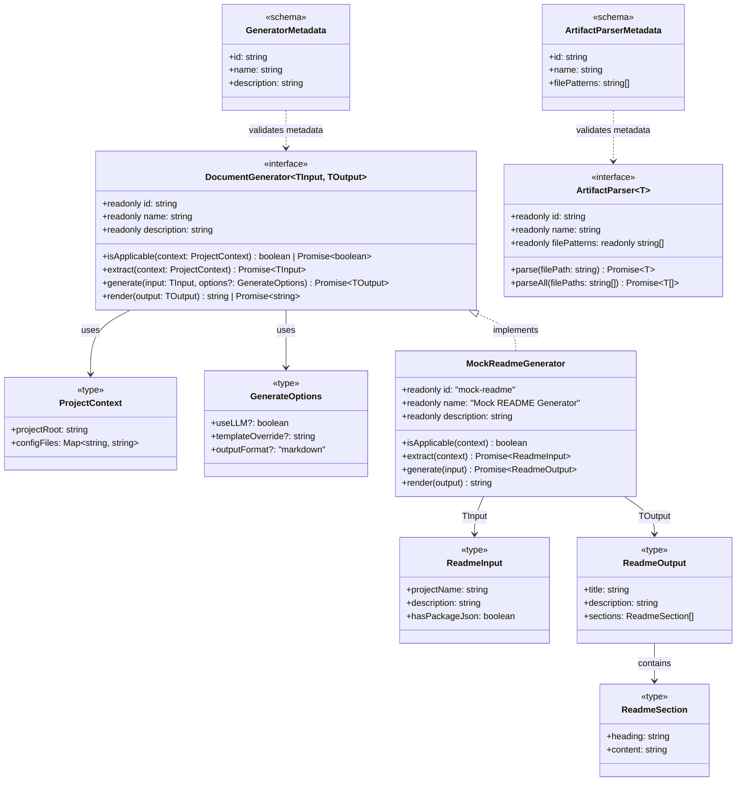

# Feature 034 数据模型定义

**Feature**: DocumentGenerator + ArtifactParser 接口定义
**日期**: 2026-03-19
**状态**: 已完成

---

## 实体关系概览



---

## 核心接口

### DocumentGenerator<TInput, TOutput>

文档生成策略接口。定义从项目中提取信息并生成特定类型文档的统一契约。

| 成员 | 类型 | 说明 |
|------|------|------|
| `id` | `readonly string` | 唯一标识符，用于 GeneratorRegistry 注册和查询（如 `'data-model'`、`'config-reference'`） |
| `name` | `readonly string` | 显示名称，用于日志和 CLI 输出（如 `'Data Model Generator'`） |
| `description` | `readonly string` | 功能描述，用于 help 信息和 MCP 工具描述 |
| `isApplicable(context)` | `(ctx: ProjectContext) => boolean \| Promise<boolean>` | 判断当前项目是否适用此 Generator |
| `extract(context)` | `(ctx: ProjectContext) => Promise<TInput>` | 从项目中提取 Generator 所需的输入数据 |
| `generate(input, options?)` | `(input: TInput, opts?: GenerateOptions) => Promise<TOutput>` | 将提取的原始数据转换为结构化文档输出 |
| `render(output)` | `(output: TOutput) => string \| Promise<string>` | 将文档输出对象渲染为 Markdown 字符串 |

**生命周期**: `isApplicable` -> `extract` -> `generate` -> `render`

**设计要点**:
- `isApplicable` 和 `render` 支持同步/异步联合返回——轻量操作可同步，重量操作可异步
- `extract` 和 `generate` 强制异步——数据提取和转换通常涉及文件 I/O 或 LLM 调用
- 泛型参数无基类型约束——Phase 0 阶段保持最大灵活性

### ArtifactParser<T>

非代码制品解析接口。定义非代码制品（SKILL.md、behavior YAML、Dockerfile 等）的解析契约。

| 成员 | 类型 | 说明 |
|------|------|------|
| `id` | `readonly string` | 唯一标识符（如 `'skill-md'`、`'dockerfile'`） |
| `name` | `readonly string` | 显示名称（如 `'SKILL.md Parser'`） |
| `filePatterns` | `readonly string[]` | 支持的文件匹配模式，glob 格式（如 `['**/SKILL.md']`） |
| `parse(filePath)` | `(filePath: string) => Promise<T>` | 解析单个制品文件，返回结构化数据 |
| `parseAll(filePaths)` | `(filePaths: string[]) => Promise<T[]>` | 批量解析多个同类制品文件 |

**设计要点**:
- `filePatterns` 为只读数组，声明式描述 Parser 支持的文件类型
- `parse` 强制异步——文件读取为 I/O 操作
- `parseAll` 接口层面不提供默认实现，后续 Feature 037 的抽象基类可提供遍历调用 `parse` 的默认实现

---

## 辅助类型

### ProjectContext（最小占位版本）

项目元信息容器。Feature 034 定义最小版本，Feature 035 扩展为完整实现。

| 属性 | 类型 | 说明 |
|------|------|------|
| `projectRoot` | `string` | 项目根目录绝对路径 |
| `configFiles` | `Map<string, string>` | 已识别的配置文件映射（文件名 -> 绝对路径），如 `{ 'package.json': '/path/to/package.json' }` |

**扩展预留**: Feature 035 将通过 `interface FullProjectContext extends ProjectContext` 添加 `detectedLanguages`、`workspaceType`、`packageManager`、`existingSpecs` 等属性。

### GenerateOptions

文档生成的通用选项。

| 属性 | 类型 | 默认值 | 说明 |
|------|------|--------|------|
| `useLLM?` | `boolean` | `false` | 是否启用 LLM 增强生成。false 时仅使用 AST/正则分析 |
| `templateOverride?` | `string` | `undefined` | 自定义 Handlebars 模板路径。未指定时使用内置模板 |
| `outputFormat?` | `'markdown'` | `'markdown'` | 输出格式。当前仅支持 markdown，预留未来扩展 |

**扩展方式**: Phase 1 各 Generator 通过类型交叉扩展 Generator 特定选项：
```typescript
type DataModelOptions = GenerateOptions & {
  includeERDiagram?: boolean;
  maxDepth?: number;
};
```

---

## Zod Schema 定义

### GeneratorMetadataSchema

验证 DocumentGenerator 的元数据字段（id、name、description）。

```typescript
// Zod Schema
const GeneratorMetadataSchema = z.object({
  id: z.string().min(1).regex(/^[a-z][a-z0-9-]*$/),  // kebab-case 标识符
  name: z.string().min(1),
  description: z.string().min(1),
});

// 推导类型
type GeneratorMetadata = z.infer<typeof GeneratorMetadataSchema>;
```

### ArtifactParserMetadataSchema

验证 ArtifactParser 的元数据字段（id、name、filePatterns）。

```typescript
const ArtifactParserMetadataSchema = z.object({
  id: z.string().min(1).regex(/^[a-z][a-z0-9-]*$/),
  name: z.string().min(1),
  filePatterns: z.array(z.string().min(1)).min(1),  // 至少一个 glob 模式
});

type ArtifactParserMetadata = z.infer<typeof ArtifactParserMetadataSchema>;
```

### GenerateOptionsSchema

验证 GenerateOptions。

```typescript
const OutputFormatSchema = z.enum(['markdown']);

const GenerateOptionsSchema = z.object({
  useLLM: z.boolean().optional().default(false),
  templateOverride: z.string().optional(),
  outputFormat: OutputFormatSchema.optional().default('markdown'),
});

type GenerateOptions = z.infer<typeof GenerateOptionsSchema>;
```

### ProjectContextSchema（最小占位版本）

验证 ProjectContext 最小版本。

```typescript
const ProjectContextSchema = z.object({
  projectRoot: z.string().min(1),
  configFiles: z.map(z.string(), z.string()),
});

type ProjectContext = z.infer<typeof ProjectContextSchema>;
```

---

## Mock Generator 数据类型

### ReadmeInput

MockReadmeGenerator 的 `extract()` 输出类型。

| 属性 | 类型 | 说明 |
|------|------|------|
| `projectName` | `string` | 项目名称（从 package.json 的 name 字段提取） |
| `description` | `string` | 项目描述（从 package.json 的 description 字段提取） |
| `hasPackageJson` | `boolean` | 是否存在 package.json |

### ReadmeOutput

MockReadmeGenerator 的 `generate()` 输出类型。

| 属性 | 类型 | 说明 |
|------|------|------|
| `title` | `string` | README 标题 |
| `description` | `string` | 项目描述段落 |
| `sections` | `ReadmeSection[]` | README 的各个章节 |

### ReadmeSection

README 文档的单个章节。

| 属性 | 类型 | 说明 |
|------|------|------|
| `heading` | `string` | 章节标题 |
| `content` | `string` | 章节内容 |

---

## 与现有类型的正交性

| 维度 | 现有类型 | 新增类型 | 关系 |
|------|---------|---------|------|
| 代码分析 | `LanguageAdapter` | `DocumentGenerator` | **正交**：Adapter 处理代码 AST，Generator 处理文档生成 |
| 中间表示 | `CodeSkeleton` | `TInput`（泛型） | **正交**：CodeSkeleton 是 AST 中间表示，TInput 是文档数据中间表示 |
| 最终输出 | `ModuleSpec` | `TOutput` -> Markdown | **正交**：ModuleSpec 是 9 章节 spec，TOutput 是任意文档结构 |
| 项目信息 | `BatchState.projectRoot` | `ProjectContext` | **独立**：ProjectContext 不引用 BatchState，Feature 035 可桥接 |
| 注册中心 | `LanguageAdapterRegistry` | `GeneratorRegistry`（Feature 036） | **并行**：两个独立 Registry，各管各的 |
| 数据验证 | `CodeSkeletonSchema`（Zod） | `GeneratorMetadataSchema`（Zod） | **同模式**：共享 Zod 验证模式，但无导入依赖 |
