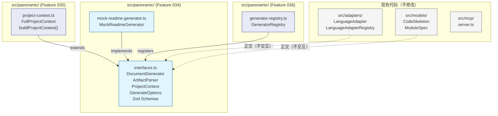
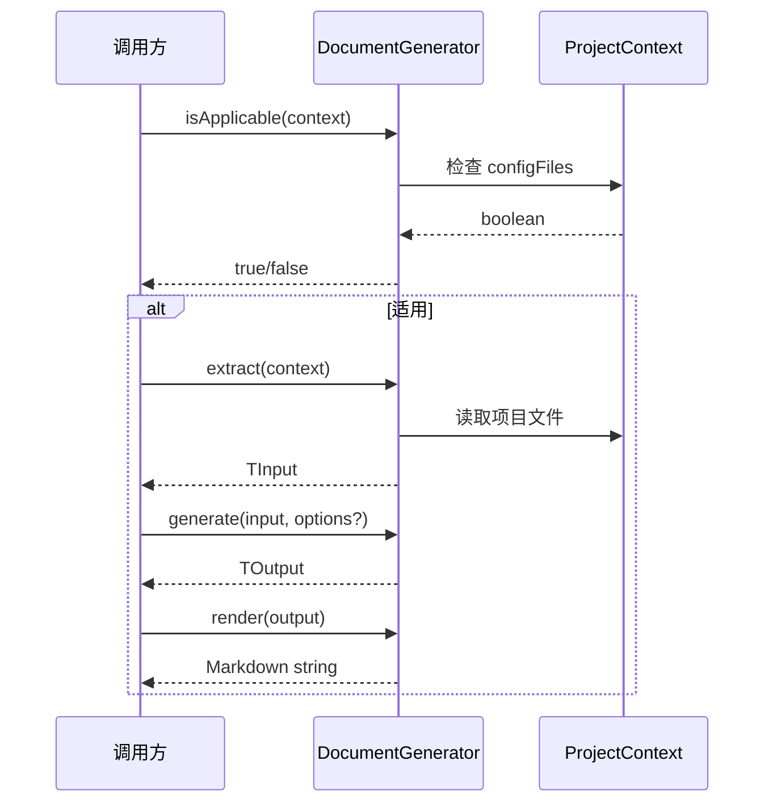
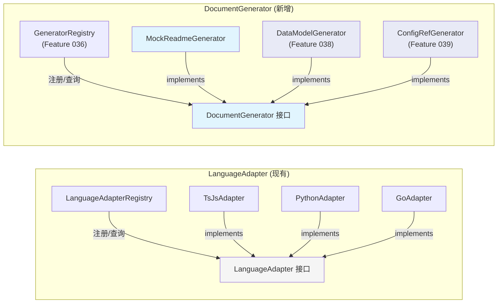

# Implementation Plan: DocumentGenerator + ArtifactParser 接口定义

**Branch**: `034-doc-generator-interfaces` | **Date**: 2026-03-19 | **Spec**: [spec.md](./spec.md)
**Input**: Feature specification from `specs/034-doc-generator-interfaces/spec.md`

---

## Summary

为全景文档化 Milestone（17 个 Feature，034-050）定义两个核心抽象接口：`DocumentGenerator<TInput, TOutput>` 和 `ArtifactParser<T>`。这是 Phase 0 基础设施层的首个 Feature，后续 12+ 个 Feature 的所有 Generator 和 Parser 均依赖此接口契约。

技术方案：在 `src/panoramic/interfaces.ts` 中采用 Zod Schema + TypeScript interface 同文件组织模式（参考现有 `code-skeleton.ts`），定义核心接口、辅助类型和运行时验证 Schema。提供 MockReadmeGenerator 作为接口设计的冒烟验证，通过完整的 `isApplicable -> extract -> generate -> render` 四步生命周期测试确认接口可行性。

---

## Technical Context

**Language/Version**: TypeScript 5.7.3, Node.js LTS (>=20.x)
**Primary Dependencies**: `zod`（数据验证，已存在）——无新增运行时依赖
**Storage**: 文件系统（`src/panoramic/` 目录新增源码文件，`tests/panoramic/` 新增测试文件）
**Testing**: vitest（`npm test` / `vitest run`）
**Target Platform**: Node.js CLI / MCP Server
**Project Type**: single（新增 `src/panoramic/` 子模块，不改变项目整体结构）
**Performance Goals**: N/A（接口定义和 Mock 实现，无运行时性能需求）
**Constraints**: 不修改 `src/adapters/`、`src/models/`、`src/core/` 等现有目录；不引入新依赖
**Scale/Scope**: 新增约 300 行接口/类型定义 + 150 行 Mock 实现 + 200 行测试

---

## Constitution Check

*GATE: Must pass before Phase 0 research. Re-check after Phase 1 design.*

| 原则 | 适用性 | 评估 | 说明 |
|------|--------|------|------|
| **I. 双语文档规范** | 适用 | PASS | 所有文档使用中文散文 + 英文代码标识符。接口/类型名称为英文，JSDoc 注释为中文 |
| **II. Spec-Driven Development** | 适用 | PASS | 遵循标准流程：spec.md -> research -> plan.md -> tasks.md -> 实现。制品链维护在 `specs/034-doc-generator-interfaces/` |
| **III. 诚实标注不确定性** | 适用 | PASS | ProjectContext 定义为"最小占位版本"，明确标注 Feature 035 负责完整实现 |
| **IV. AST 精确性优先** | 低适用 | PASS | 本 Feature 不涉及 AST 分析，仅定义接口。后续 Generator 实现（Phase 1）将遵循此原则 |
| **V. 混合分析流水线** | 低适用 | PASS | 接口设计遵循 `extract -> generate -> render` 三阶段分离，与混合流水线理念一致 |
| **VI. 只读安全性** | 适用 | PASS | DocumentGenerator 和 ArtifactParser 均为只读分析接口，不修改目标源代码。写操作仅限 Markdown 输出 |
| **VII. 纯 Node.js 生态** | 适用 | PASS | 不引入新依赖。仅使用已有的 `zod` 库。所有代码为纯 TypeScript |
| **VIII-XII. spec-driver 约束** | 不适用 | N/A | 本 Feature 属于 reverse-spec 插件范畴，不涉及 spec-driver 插件 |

**Constitution Check 结果**: 全部 PASS，无 VIOLATION。

---

## Project Structure

### Documentation (this feature)

```text
specs/034-doc-generator-interfaces/
├── spec.md              # 需求规范
├── plan.md              # 本文件（技术计划）
├── research.md          # 技术决策研究（8 项决策）
├── data-model.md        # 数据模型定义
├── checklists/          # 验证清单
└── research/
    └── tech-research.md # 前序技术调研
```

### Source Code (repository root)

```text
src/panoramic/                         # 新增目录：全景文档化核心
├── interfaces.ts                      # 核心接口 + Zod Schema + 辅助类型
│   ├── [Zod] ProjectContextSchema     #   最小占位版本
│   ├── [Zod] GenerateOptionsSchema    #   生成选项验证
│   ├── [Zod] GeneratorMetadataSchema  #   Generator 元数据验证
│   ├── [Zod] ArtifactParserMetadataSchema  # Parser 元数据验证
│   ├── [Zod] OutputFormatSchema       #   输出格式枚举
│   ├── [type] ProjectContext          #   项目上下文类型
│   ├── [type] GenerateOptions         #   生成选项类型
│   ├── [type] GeneratorMetadata       #   Generator 元数据类型
│   ├── [type] ArtifactParserMetadata  #   Parser 元数据类型
│   ├── [interface] DocumentGenerator  #   文档生成器接口
│   └── [interface] ArtifactParser     #   制品解析器接口
└── mock-readme-generator.ts           # Mock Generator 实现
    ├── [type] ReadmeInput             #   extract 输出类型
    ├── [type] ReadmeOutput            #   generate 输出类型
    ├── [type] ReadmeSection           #   README 章节类型
    └── [class] MockReadmeGenerator    #   DocumentGenerator 实现

tests/panoramic/                       # 新增目录：全景文档化测试
├── schemas.test.ts                    # Zod Schema 验证测试
│   ├── GeneratorMetadataSchema 合法/非法输入
│   ├── ArtifactParserMetadataSchema 合法/非法输入
│   ├── GenerateOptionsSchema 默认值/覆盖
│   └── ProjectContextSchema 合法/非法输入
└── mock-generator.test.ts             # Mock Generator 生命周期测试
    ├── isApplicable（适用/不适用场景）
    ├── extract（数据提取）
    ├── generate（数据转换）
    ├── render（Markdown 渲染）
    └── 全链路 e2e（extract -> generate -> render）
```

**Structure Decision**: 采用 `src/panoramic/` 独立目录，与现有 `src/adapters/`、`src/models/` 正交。测试目录 `tests/panoramic/` 对称新建。不创建 barrel 文件（`index.ts`），待 Feature 036 GeneratorRegistry 时统一创建。

---

## Architecture

### 接口设计架构图



### DocumentGenerator 生命周期流程



### 与现有 Strategy 模式的对比



---

## 详细设计

### interfaces.ts 文件结构

文件内部按以下顺序组织（参考 `code-skeleton.ts` 的 Zod + type 同文件模式）：

```
1. 导入（zod）
2. OutputFormat 枚举 Schema + type
3. GenerateOptions Schema + type
4. ProjectContext Schema + type（最小占位版本）
5. GeneratorMetadata Schema + type
6. ArtifactParserMetadata Schema + type
7. DocumentGenerator<TInput, TOutput> interface
8. ArtifactParser<T> interface
```

**关键设计点**:

1. **Zod Schema 验证范围**: Schema 仅验证元数据（id、name、description、filePatterns）和选项（GenerateOptions），不验证泛型参数 TInput/TOutput——这些在具体 Generator 实现时各自定义 Schema
2. **id 格式约束**: `z.string().min(1).regex(/^[a-z][a-z0-9-]*$/)` 强制 kebab-case，确保与未来 GeneratorRegistry 的 id 查询兼容
3. **ProjectContext 使用 `z.map()`**: Zod 的 `z.map()` 对应 TypeScript 的 `Map<K, V>` 类型，与 `z.record()` 不同（后者对应 `Record<K, V>`）

### mock-readme-generator.ts 实现策略

MockReadmeGenerator 是接口设计的冒烟验证，实现尽量简单：

- **isApplicable**: 同步检查 `context.configFiles.has('package.json')` 返回 boolean
- **extract**: 异步读取 package.json 文件（使用 `fs.readFile`），提取 name 和 description
- **generate**: 纯内存转换，将 ReadmeInput 映射为 ReadmeOutput（包含 title、description、Installation/Usage 两个默认 section）
- **render**: 同步拼接 Markdown 字符串，返回 string

**Edge Case 处理**:
- 空 ProjectContext（configFiles 为空 Map）: `isApplicable` 返回 `false`
- extract 时 package.json 中缺少 name/description: 使用默认值（`'unknown-project'` / `'No description provided'`）
- render 时 sections 为空数组: 仅输出 title 和 description

### 测试策略

**schemas.test.ts**（约 80 行）:
- GeneratorMetadataSchema: 合法输入通过、缺失 id 抛出 ZodError、id 非 kebab-case 抛出 ZodError
- ArtifactParserMetadataSchema: 合法输入通过、空 filePatterns 抛出 ZodError
- GenerateOptionsSchema: 默认值填充、useLLM 覆盖、无效 outputFormat 抛出 ZodError
- ProjectContextSchema: 合法输入通过、空 projectRoot 抛出 ZodError
- 类型兼容性: `z.infer<typeof Schema>` 可赋值给对应 interface

**mock-generator.test.ts**（约 120 行）:
- isApplicable: 包含 package.json 返回 true；不包含返回 false；空 Map 返回 false
- extract: 正确提取 projectName 和 description；缺失字段使用默认值
- generate: 输出包含 title、description 和 sections
- render: 输出为合法 Markdown（包含 `#` 标题和段落）
- 全链路: extract -> generate -> render 顺序调用，最终 Markdown 包含项目名称

---

## 关键约束与决策

### 不变量

1. **正交性**: `src/panoramic/` 不导入 `src/adapters/`、`src/models/`、`src/core/` 的任何模块
2. **零新依赖**: 仅使用已有的 `zod` 库
3. **编译通过**: `npm run build` 零错误
4. **测试通过**: `npm test` 全部通过（含现有测试 + 新增测试）
5. **接口完整性**: DocumentGenerator 包含 id、name、description、isApplicable、extract、generate、render 全部成员

### 与后续 Feature 的衔接

| 后续 Feature | 034 提供的接口/类型 | 衔接方式 |
|-------------|-------------------|---------|
| 035 ProjectContext | `ProjectContext` 最小占位类型 | Feature 035 通过 `interface FullProjectContext extends ProjectContext` 扩展 |
| 036 GeneratorRegistry | `DocumentGenerator.id` 唯一标识符 | Registry 通过 `id` 注册和查询 Generator |
| 037 非代码制品解析 | `ArtifactParser<T>` 接口 | 具体 Parser（SkillMdParser 等）实现此接口 |
| 038 数据模型文档 | `DocumentGenerator<TInput, TOutput>` 接口 | DataModelGenerator 实现此接口 |
| 039 配置参考手册 | `DocumentGenerator` + `GenerateOptions` | ConfigReferenceGenerator 通过类型交叉扩展 options |

---

## Complexity Tracking

> 本 Feature Constitution Check 全部 PASS，无 VIOLATION 需要论证。以下记录偏离最简方案的设计决策。

| 设计决策 | 为何不用更简单方案 | 被拒绝的简单方案 |
|---------|------------------|----------------|
| `boolean \| Promise<boolean>` 联合返回类型（isApplicable/render） | 强制 async 为同步判断增加不必要的 Promise 开销；spec FR-002/FR-005 明确要求 | 统一 `Promise<boolean>` |
| 双泛型 `<TInput, TOutput>` | 单泛型无法分离 extract 和 generate 的数据类型，限制类型安全 | 单泛型 `<T>` + 固定 Input |
| Zod Schema 与 interface 同文件 | 分离增加维护成本和类型 drift 风险；参考现有 code-skeleton.ts 模式 | 独立 schemas.ts 文件 |
| ProjectContext 最小占位版本 | 完整版侵入 Feature 035 范围；any 类型丢失类型安全 | 使用 `any` 或完整定义 |
| `z.map()` 而非 `z.record()` | `Map<string, string>` 语义更精确（有序、支持 has/get 方法），configFiles 不需要 Record 的字符串索引访问模式 | 使用 `z.record(z.string(), z.string())` |

---

## 验证标准对照

| spec SC 编号 | 验证方式 | plan 覆盖位置 |
|-------------|---------|-------------|
| SC-001 | `npm run build` 零错误 | Source Code 结构 + interfaces.ts 设计 |
| SC-002 | MockReadmeGenerator 四步生命周期单元测试全部通过 | mock-generator.test.ts 测试策略 |
| SC-003 | Zod Schema parse/ZodError 测试 | schemas.test.ts 测试策略 |
| SC-004 | 现有测试套件全部通过 | 正交性约束（不修改现有文件） |
| SC-005 | 接口设计与蓝图第 6 章一致 | 详细设计 + 数据模型 |
