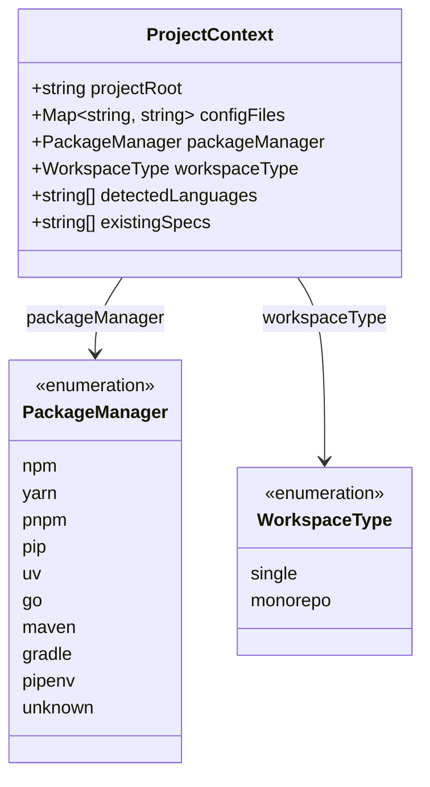
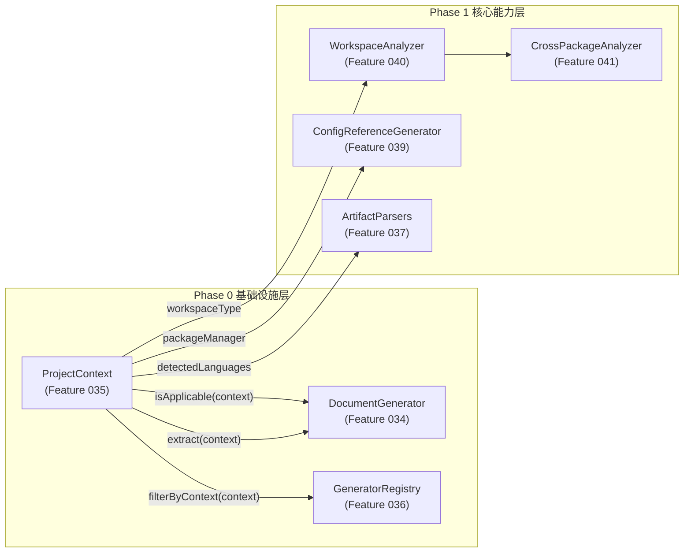

# Feature 035 数据模型

**Feature**: ProjectContext 统一上下文
**日期**: 2026-03-19

---

## 1. 核心实体

### 1.1 ProjectContext（完整版本）



**描述**: 项目元信息只读数据容器。在分析流程开始时由 `buildProjectContext()` 一次性构建，作为参数传递给所有 DocumentGenerator 和 ArtifactParser。

**属性详情**:

| 属性 | 类型 | 来源 | 默认值 | 描述 |
|------|------|------|--------|------|
| `projectRoot` | `string` (min 1) | 参数传入 | 无（必填） | 项目根目录绝对路径 |
| `configFiles` | `Map<string, string>` | 根目录文件扫描 | `new Map()` | 已知配置文件映射（文件名 -> 绝对路径） |
| `packageManager` | `PackageManager` | lock 文件检测 | `"unknown"` | 检测到的包管理器类型 |
| `workspaceType` | `WorkspaceType` | workspace 配置分析 | `"single"` | 项目类型——单包或 Monorepo |
| `detectedLanguages` | `string[]` | scanFiles + Registry | `[]` | 检测到的编程语言 adapter ID 列表 |
| `existingSpecs` | `string[]` | specs/ 目录扫描 | `[]` | 已有 spec 文件的绝对路径列表 |

### 1.2 PackageManager 枚举

| 值 | 对应 lock 文件/标识文件 | 检测优先级 |
|----|----------------------|-----------|
| `"pnpm"` | `pnpm-lock.yaml` | 1（最高） |
| `"yarn"` | `yarn.lock` | 2 |
| `"npm"` | `package-lock.json` | 3 |
| `"uv"` | `uv.lock` | 4 |
| `"pipenv"` | `Pipfile.lock` | 5 |
| `"go"` | `go.sum` 或 `go.mod` | 6 |
| `"maven"` | `pom.xml` | 7 |
| `"gradle"` | `build.gradle` 或 `build.gradle.kts` | 8（最低） |
| `"pip"` | （无自动检测规则，预留值） | N/A |
| `"unknown"` | 均不匹配时的默认值 | N/A |

### 1.3 WorkspaceType 枚举

| 值 | 检测条件（满足任一即为 monorepo） |
|----|-------------------------------|
| `"monorepo"` | (a) `package.json` 含 `"workspaces"` 字段; (b) 存在 `pnpm-workspace.yaml`; (c) `pyproject.toml` 含 `[tool.uv.workspace]`; (d) 存在 `lerna.json` |
| `"single"` | 以上条件均不满足 |

---

## 2. Zod Schema 定义

### 2.1 新增枚举 Schema

```typescript
/** 包管理器枚举 Schema */
export const PackageManagerSchema = z.enum([
  'npm', 'yarn', 'pnpm', 'pip', 'uv',
  'go', 'maven', 'gradle', 'pipenv', 'unknown',
]);
export type PackageManager = z.infer<typeof PackageManagerSchema>;

/** Workspace 类型枚举 Schema */
export const WorkspaceTypeSchema = z.enum(['single', 'monorepo']);
export type WorkspaceType = z.infer<typeof WorkspaceTypeSchema>;
```

### 2.2 扩展后的 ProjectContextSchema

```typescript
// 保留原始基础版定义为内部引用
const BaseProjectContextSchema = z.object({
  projectRoot: z.string().min(1),
  configFiles: z.map(z.string(), z.string()),
});

// 完整版：在基础版上扩展四个新属性，全部提供默认值以保持向后兼容
export const ProjectContextSchema = BaseProjectContextSchema.extend({
  packageManager: PackageManagerSchema.default('unknown'),
  workspaceType: WorkspaceTypeSchema.default('single'),
  detectedLanguages: z.array(z.string()).default([]),
  existingSpecs: z.array(z.string()).default([]),
});

export type ProjectContext = z.infer<typeof ProjectContextSchema>;
```

---

## 3. 构建函数签名

```typescript
/**
 * 构建完整的 ProjectContext 对象
 *
 * 执行五个子流程：
 * 1. 包管理器检测（detectPackageManager）
 * 2. Workspace 类型识别（detectWorkspaceType）
 * 3. 多语言检测（detectLanguages，复用 scanFiles）
 * 4. 配置文件扫描（scanConfigFiles）
 * 5. 已有 spec 文件发现（discoverExistingSpecs）
 *
 * @param projectRoot - 项目根目录绝对路径
 * @returns 通过 ProjectContextSchema.parse() 验证的完整 ProjectContext 对象
 * @throws Error 当 projectRoot 不存在或不是目录时
 */
export async function buildProjectContext(
  projectRoot: string
): Promise<ProjectContext>;
```

---

## 4. 内部辅助函数签名

| 函数名 | 签名 | 职责 |
|--------|------|------|
| `detectPackageManager` | `(projectRoot: string) => PackageManager` | 按优先级检测 lock 文件，返回包管理器枚举值 |
| `detectWorkspaceType` | `(projectRoot: string) => WorkspaceType` | 检测 workspace 配置，返回 single 或 monorepo |
| `detectLanguages` | `(projectRoot: string) => string[]` | 复用 scanFiles 提取语言列表，Registry 未初始化时返回空数组 |
| `scanConfigFiles` | `(projectRoot: string) => Map<string, string>` | 扫描根目录已知配置文件，返回文件名到绝对路径的映射 |
| `discoverExistingSpecs` | `(projectRoot: string) => string[]` | 递归扫描 specs/ 目录下 *.spec.md 文件，返回绝对路径数组 |

---

## 5. 已知配置文件列表

`scanConfigFiles` 扫描的配置文件最小集合（FR-015 定义）：

| 类别 | 文件名模式 |
|------|-----------|
| Node.js | `package.json` |
| TypeScript | `tsconfig.json`, `tsconfig.*.json`（通配） |
| Python | `pyproject.toml` |
| Docker | `docker-compose.yml`, `docker-compose.yaml`, `Dockerfile` |
| Lint | `.eslintrc`, `.eslintrc.json`, `.prettierrc`, `.prettierrc.json` |
| Test | `jest.config.ts`, `jest.config.js`, `vitest.config.ts`, `vitest.config.js` |

---

## 6. 与其他实体的关系



**说明**:
- `ProjectContext` 是所有 Generator 和 Parser 的输入参数
- `workspaceType` 被 Feature 040 的 `WorkspaceAnalyzer` 用于 `isApplicable()` 判断
- `packageManager` 被 Feature 039 的 `ConfigReferenceGenerator` 用于选择依赖解析策略
- `detectedLanguages` 被各 Generator 的 `isApplicable()` 用于判断语言适用性
