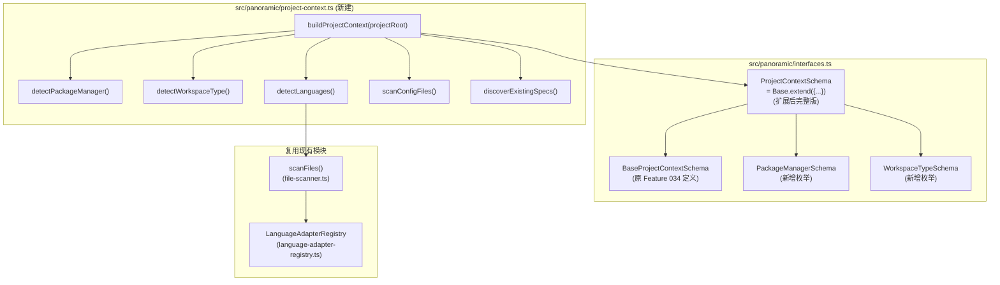
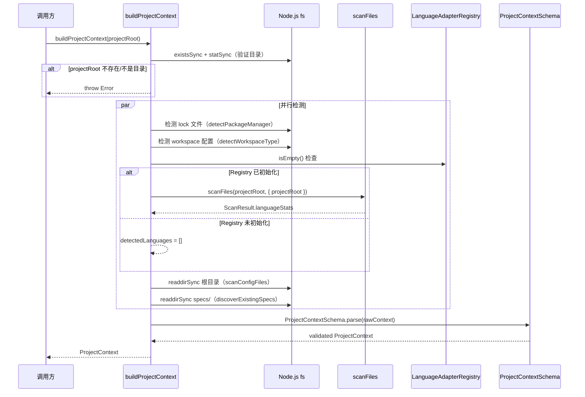

# Implementation Plan: ProjectContext 统一上下文

**Branch**: `035-project-context-unified` | **Date**: 2026-03-19 | **Spec**: [spec.md](./spec.md)
**Input**: Feature specification from `/specs/035-project-context-unified/spec.md`

## Summary

扩展 Feature 034 中定义的最小 ProjectContext 占位版本，添加完整的项目元信息。在 `interfaces.ts` 中使用 Zod `.extend()` 扩展 Schema（新增 `packageManager`、`workspaceType`、`detectedLanguages`、`existingSpecs` 四个属性），在新建的 `src/panoramic/project-context.ts` 中实现 `buildProjectContext(projectRoot)` 异步构建函数。语言检测复用 `file-scanner.ts` 的 `scanFiles()`，包管理器通过 lock 文件优先级检测，workspace 通过配置文件分析识别。所有新增字段提供默认值以确保向后兼容。

## Technical Context

**Language/Version**: TypeScript 5.7.3, Node.js LTS (>=20.x)
**Primary Dependencies**: zod（数据验证，现有）、Node.js 内置模块（fs, path）——不引入新运行时依赖
**Storage**: 文件系统（只读扫描，不写入）
**Testing**: vitest（现有测试框架）
**Target Platform**: Node.js CLI / MCP Server
**Project Type**: single（npm 生态的 TypeScript 库项目）
**Performance Goals**: `buildProjectContext()` 在包含数万文件的项目上秒级完成
**Constraints**: 不引入新依赖；不修改现有 batch-orchestrator；向后兼容 Feature 034 已交付代码
**Scale/Scope**: 新增 1 个源文件 + 1 个测试文件；修改 1 个现有文件（interfaces.ts）

## Constitution Check

*GATE: Must pass before Phase 0 research. Re-check after Phase 1 design.*

| 原则 | 适用性 | 评估 | 说明 |
|------|--------|------|------|
| **I. 双语文档规范** | 适用 | PASS | 所有文档中文撰写，代码标识符英文。Zod Schema 字段名、类型名使用英文，注释使用中文 |
| **II. Spec-Driven Development** | 适用 | PASS | 本 Feature 遵循完整的 spec -> plan -> tasks -> impl 流程，spec.md 已就绪 |
| **III. 诚实标注不确定性** | 适用 | PASS | 所有检测逻辑基于确定性条件（文件存在性、JSON/正则解析），无推断内容 |
| **IV. AST 精确性优先** | 不适用 | N/A | 本 Feature 不涉及 AST 分析或结构化数据提取，仅做项目元信息检测 |
| **V. 混合分析流水线** | 不适用 | N/A | 本 Feature 不涉及 LLM 调用或代码分析流水线 |
| **VI. 只读安全性** | 适用 | PASS | `buildProjectContext()` 仅读取文件系统（`fs.existsSync` / `fs.readFileSync` / `fs.readdirSync`），不写入、删除或修改任何文件 |
| **VII. 纯 Node.js 生态** | 适用 | PASS | 仅使用 Node.js 内置模块（fs, path）和现有依赖（zod），不引入新依赖。pyproject.toml 使用正则匹配而非引入 TOML 解析库 |
| **VIII-XII. spec-driver 约束** | 不适用 | N/A | 本 Feature 为 reverse-spec 插件的 TypeScript 源代码开发，不涉及 spec-driver 插件 |

**Constitution Check 结论**: PASS（无 VIOLATION）

---

## Architecture

### 整体架构



### 构建流程时序



---

## Project Structure

### Documentation (this feature)

```text
specs/035-project-context-unified/
├── spec.md              # 需求规范（已存在）
├── plan.md              # 本文件（技术规划）
├── research.md          # 技术决策研究
├── data-model.md        # 数据模型定义
├── checklists/          # 已存在
└── research/
    └── tech-research.md # 前序技术调研（已存在）
```

### Source Code (repository root)

```text
src/panoramic/
├── interfaces.ts              # 修改：扩展 ProjectContextSchema
├── project-context.ts         # 新建：buildProjectContext 函数
└── mock-readme-generator.ts   # 不修改

tests/panoramic/
├── schemas.test.ts            # 不修改（验证向后兼容）
├── mock-generator.test.ts     # 不修改（验证向后兼容）
└── project-context.test.ts    # 新建：buildProjectContext 测试
```

**Structure Decision**: 采用 Phase 0 基础设施层的标准布局。`interfaces.ts` 原地扩展 Schema（保持导出路径不变），新建 `project-context.ts` 仅包含构建函数逻辑。测试文件与源文件目录结构对称。

---

## 详细设计

### Phase 1: interfaces.ts Schema 扩展

**变更文件**: `src/panoramic/interfaces.ts`

**变更内容**:
1. 在 ProjectContext 区块之前，新增 `PackageManagerSchema` 和 `WorkspaceTypeSchema` 两个枚举 Schema 及其 type
2. 将现有 `ProjectContextSchema` 的定义改为"基础版 + 扩展版"模式
3. 所有新增字段提供 `.default()` 值，确保旧测试的 `parse({ projectRoot, configFiles })` 调用仍有效

**关键约束**:
- `PackageManagerSchema` 枚举值包含 10 项：`npm | yarn | pnpm | pip | uv | go | maven | gradle | pipenv | unknown`
- `WorkspaceTypeSchema` 枚举值包含 2 项：`single | monorepo`
- `detectedLanguages` 默认值 `[]`（空数组）
- `existingSpecs` 默认值 `[]`（空数组）
- `packageManager` 默认值 `"unknown"`
- `workspaceType` 默认值 `"single"`

### Phase 2: project-context.ts 构建函数

**新建文件**: `src/panoramic/project-context.ts`

**导出**:
- `buildProjectContext(projectRoot: string): Promise<ProjectContext>` — 主入口函数

**内部函数**（不导出，仅模块内使用）:

#### detectPackageManager(projectRoot)

按优先级顺序检查 lock 文件存在性：

```text
pnpm-lock.yaml  -> "pnpm"
yarn.lock       -> "yarn"
package-lock.json -> "npm"
uv.lock         -> "uv"
Pipfile.lock    -> "pipenv"
go.sum / go.mod -> "go"
pom.xml         -> "maven"
build.gradle / build.gradle.kts -> "gradle"
均不存在        -> "unknown"
```

实现方式：`fs.existsSync(path.join(projectRoot, lockFile))`，第一个匹配即返回。

#### detectWorkspaceType(projectRoot)

检测顺序（满足任一即返回 `"monorepo"`）：
1. `pnpm-workspace.yaml` 存在
2. `lerna.json` 存在
3. `package.json` 存在且包含 `"workspaces"` 字段（JSON.parse，解析失败跳过）
4. `pyproject.toml` 存在且内容匹配 `/^\[tool\.uv\.workspace\]/m`（readFileSync + 正则，解析失败跳过）

以上均不满足则返回 `"single"`。

#### detectLanguages(projectRoot)

1. 检查 `LanguageAdapterRegistry.getInstance().isEmpty()`
2. 若 Registry 为空，返回 `[]`
3. 否则调用 `scanFiles(projectRoot, { projectRoot })` 获取 `ScanResult`
4. 从 `ScanResult.languageStats` 提取 key 列表返回

#### scanConfigFiles(projectRoot)

1. 定义已知配置文件名列表（`KNOWN_CONFIG_FILES`）
2. 对每个文件名，检查 `fs.existsSync(path.join(projectRoot, fileName))`
3. 对 `tsconfig.*.json` 通配，使用 `fs.readdirSync(projectRoot)` 过滤匹配项
4. 匹配的文件加入 `Map<string, string>`（key=文件名, value=绝对路径）

#### discoverExistingSpecs(projectRoot)

1. 计算 `specsDir = path.join(projectRoot, 'specs')`
2. 若 `specsDir` 不存在或不可读，返回 `[]`
3. 递归遍历 `specsDir`，收集所有 `*.spec.md` 文件的绝对路径
4. 返回排序后的路径数组

#### buildProjectContext 主函数

1. 验证 `projectRoot` 存在且为目录
2. 并行执行五个子流程（实际为同步 I/O + 一个可能的异步 scanFiles）
3. 组装 raw 对象
4. `ProjectContextSchema.parse(raw)` 验证
5. 返回验证后的 `ProjectContext`

### Phase 3: 单元测试

**新建文件**: `tests/panoramic/project-context.test.ts`

**测试分组**:

| 测试组 | 覆盖场景 | 对应 FR |
|--------|---------|---------|
| `detectPackageManager` | npm / pnpm / uv 三种 lock 文件检测；多 lock 文件优先级；无 lock 文件返回 unknown | FR-009, FR-010 |
| `detectWorkspaceType` | package.json workspaces / pnpm-workspace.yaml / pyproject.toml [tool.uv.workspace] / lerna.json 四种 monorepo 检测；single 项目 | FR-011, FR-012 |
| `detectLanguages` | TypeScript + Python 共存；Registry 未初始化返回空数组 | FR-013, FR-014 |
| `scanConfigFiles` | package.json + tsconfig.json 存在；tsconfig.*.json 通配；无配置文件返回空 Map | FR-015, FR-016 |
| `discoverExistingSpecs` | 存在 spec 文件；specs/ 目录不存在返回空数组 | FR-017, FR-018 |
| `buildProjectContext 集成` | projectRoot 不存在抛出错误；正常项目返回完整对象并通过 Schema 验证 | FR-006, FR-007, FR-008 |
| `向后兼容性` | 扩展 Schema 后旧测试仍通过；仅传入 projectRoot + configFiles 的 parse 调用成功 | FR-021 |

**测试策略**:
- 使用 `vitest` 的 `beforeEach` / `afterEach` 在 `os.tmpdir()` 下创建临时目录结构
- 语言检测测试需先调用 `bootstrapAdapters()` 初始化 Registry，测试结束后 `LanguageAdapterRegistry.resetInstance()`
- 向后兼容性测试：直接 `ProjectContextSchema.parse({ projectRoot: '/tmp', configFiles: new Map() })`，验证新增字段使用默认值填充

---

## Lock 文件优先级检测表

| 优先级 | Lock 文件 | 包管理器 | 检测方式 |
|--------|-----------|---------|---------|
| 1 | `pnpm-lock.yaml` | `pnpm` | `fs.existsSync()` |
| 2 | `yarn.lock` | `yarn` | `fs.existsSync()` |
| 3 | `package-lock.json` | `npm` | `fs.existsSync()` |
| 4 | `uv.lock` | `uv` | `fs.existsSync()` |
| 5 | `Pipfile.lock` | `pipenv` | `fs.existsSync()` |
| 6 | `go.sum` | `go` | `fs.existsSync()` |
| 6 | `go.mod` | `go` | `fs.existsSync()`（与 go.sum 同优先级） |
| 7 | `pom.xml` | `maven` | `fs.existsSync()` |
| 8 | `build.gradle` | `gradle` | `fs.existsSync()` |
| 8 | `build.gradle.kts` | `gradle` | `fs.existsSync()`（与 build.gradle 同优先级） |

---

## 已知配置文件扫描清单

| 类别 | 配置文件名 | 匹配方式 |
|------|-----------|---------|
| Node.js | `package.json` | 精确匹配 |
| TypeScript | `tsconfig.json` | 精确匹配 |
| TypeScript | `tsconfig.*.json` | 正则 `/^tsconfig\..+\.json$/` |
| Python | `pyproject.toml` | 精确匹配 |
| Docker | `docker-compose.yml` | 精确匹配 |
| Docker | `docker-compose.yaml` | 精确匹配 |
| Docker | `Dockerfile` | 精确匹配 |
| ESLint | `.eslintrc` | 精确匹配 |
| ESLint | `.eslintrc.json` | 精确匹配 |
| Prettier | `.prettierrc` | 精确匹配 |
| Prettier | `.prettierrc.json` | 精确匹配 |
| Jest | `jest.config.ts` | 精确匹配 |
| Jest | `jest.config.js` | 精确匹配 |
| Vitest | `vitest.config.ts` | 精确匹配 |
| Vitest | `vitest.config.js` | 精确匹配 |

---

## Complexity Tracking

> 无 Constitution Check violation，无需记录复杂度偏差。

| 决策 | 选择 | 简单替代方案 | 拒绝简单方案的理由 |
|------|------|------------|-------------------|
| pyproject.toml 正则匹配 | 行级正则 `/^\[tool\.uv\.workspace\]/m` | 引入 TOML 解析库获得完整解析能力 | Constitution VII 约束不引入新依赖；spec 明确要求不引入新依赖；正则足以检测 section 标题 |
| Schema extend + default | `.extend()` + 全字段 `.default()` | 新建独立 FullProjectContextSchema | 保持导出名和导入路径不变，避免两套 Schema/类型共存增加消费方认知负担 |

---

## 验证计划

### 编译验证

- `npm run build` 零错误
- `interfaces.ts` 扩展后的 `ProjectContextSchema` 类型推导正确
- `project-context.ts` 的 `buildProjectContext` 返回类型与 `ProjectContext` 一致

### 单元测试验证

- `npm test` 退出码 0
- Feature 034 的 `schemas.test.ts` 和 `mock-generator.test.ts` 全部通过（向后兼容）
- 新增 `project-context.test.ts` 覆盖所有 FR-006~FR-022 场景

### 集成验证（手动）

- 对本项目（cc-plugin-market）运行 `buildProjectContext()`：
  - `packageManager` 预期为 `"npm"`（存在 `package-lock.json`）
  - `workspaceType` 预期为 `"single"`（无 workspaces 配置）
  - `detectedLanguages` 预期包含 `"ts-js"`
  - `configFiles` 预期包含 `package.json`、`tsconfig.json` 等
