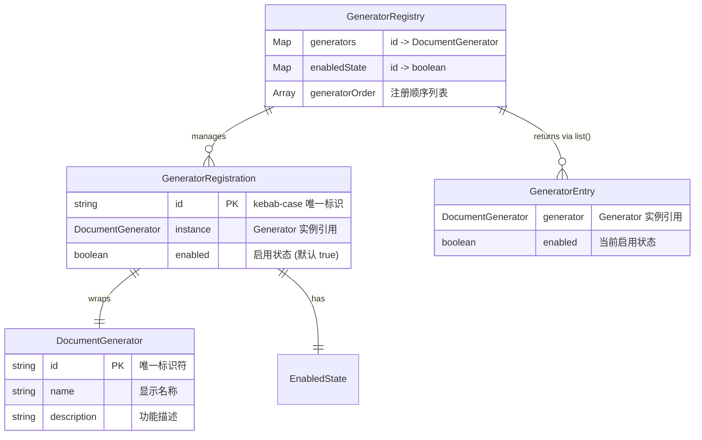
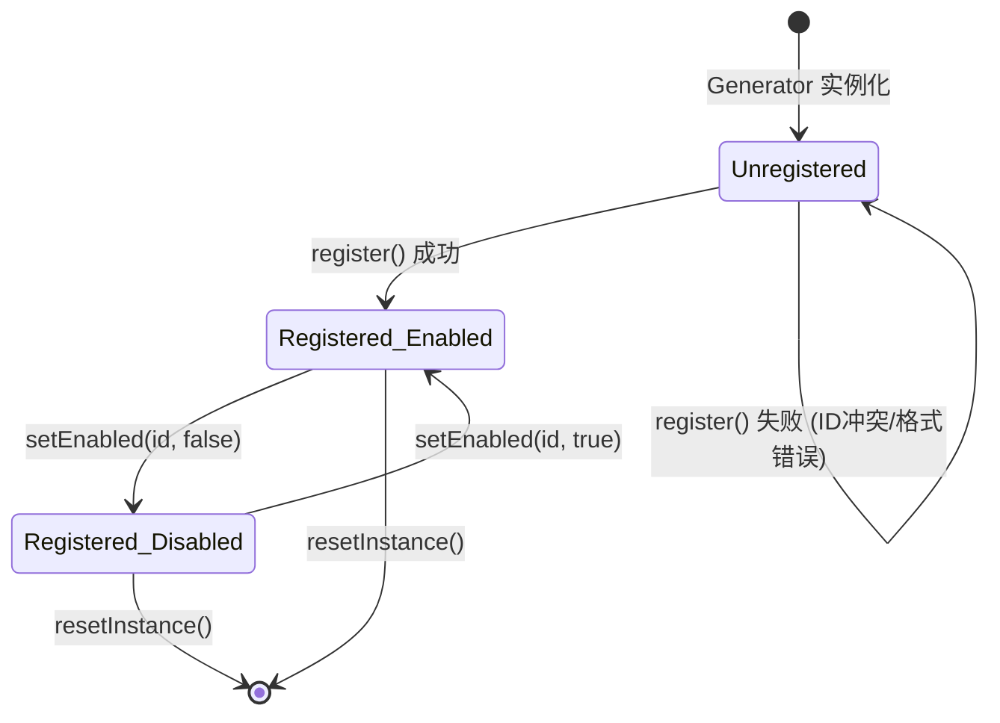
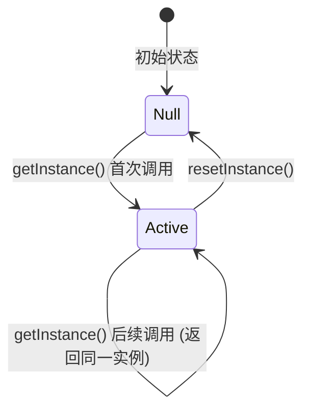

# Feature 036 数据模型

**Feature**: GeneratorRegistry 注册中心
**Date**: 2026-03-19

---

## 实体关系图



## 核心实体

### 1. GeneratorRegistry

Generator 的中心化注册中心。进程级单例，全局唯一。

| 属性 | 类型 | 可见性 | 说明 |
|------|------|--------|------|
| `instance` | `GeneratorRegistry \| null` | private static | 单例引用，懒初始化 |
| `generators` | `Map<string, DocumentGenerator<any, any>>` | private | id 到 Generator 实例的映射 |
| `enabledState` | `Map<string, boolean>` | private | id 到启用/禁用状态的映射 |
| `generatorOrder` | `DocumentGenerator<any, any>[]` | private | 按注册顺序维护的有序列表 |

**不变量（Invariants）**:
- `generators.size === enabledState.size === generatorOrder.length` — 三个数据结构始终同步
- `generators` 中每个 key 必须匹配 `/^[a-z][a-z0-9-]*$/` 正则
- `generatorOrder` 中的元素与 `generators.values()` 集合完全一致
- 全局仅存在一个 `instance`（单例约束）

**方法签名**:

| 方法 | 签名 | 说明 |
|------|------|------|
| `getInstance()` | `static getInstance(): GeneratorRegistry` | 获取或创建单例 |
| `resetInstance()` | `static resetInstance(): void` | 重置单例（仅测试使用） |
| `register()` | `register(generator: DocumentGenerator<any, any>): void` | 注册 Generator（两阶段验证） |
| `get()` | `get(id: string): DocumentGenerator<any, any> \| undefined` | 按 id 查询 |
| `list()` | `list(): GeneratorEntry[]` | 全量列出（含状态） |
| `filterByContext()` | `filterByContext(context: ProjectContext): Promise<DocumentGenerator<any, any>[]>` | 按项目上下文过滤 |
| `setEnabled()` | `setEnabled(id: string, enabled: boolean): void` | 切换启用/禁用状态 |
| `isEmpty()` | `isEmpty(): boolean` | 检查是否为空 |

### 2. GeneratorEntry

list() 方法返回的只读数据视图。

```typescript
export interface GeneratorEntry {
  /** Generator 实例引用（只读视图，不应通过此引用修改 Generator） */
  readonly generator: DocumentGenerator<any, any>;
  /** 当前启用/禁用状态 */
  readonly enabled: boolean;
}
```

| 字段 | 类型 | 说明 |
|------|------|------|
| `generator` | `DocumentGenerator<any, any>` | Generator 实例的只读引用 |
| `enabled` | `boolean` | 注册时默认 `true`，可通过 `setEnabled()` 修改 |

**设计说明**: GeneratorEntry 是纯数据传输对象（DTO），不含行为方法。list() 每次调用生成新的 Entry 数组（防御性拷贝），避免外部代码通过引用修改内部状态。

### 3. DocumentGenerator<TInput, TOutput>（已有，不修改）

来自 `src/panoramic/interfaces.ts`，此处仅列出 Registry 使用到的属性和方法。

| 属性/方法 | 类型 | Registry 如何使用 |
|-----------|------|-------------------|
| `id` | `readonly string` | register() 的索引键，get() 的查询键 |
| `name` | `readonly string` | 冲突检测错误消息中引用 |
| `description` | `readonly string` | list() 返回时可能引用 |
| `isApplicable(context)` | `boolean \| Promise<boolean>` | filterByContext() 调用以判断适用性 |

### 4. bootstrapGenerators()（函数，非实体）

幂等初始化函数，在应用启动时将所有内置 Generator 注册到 Registry。

```typescript
export function bootstrapGenerators(): void
```

**行为**:
- 调用 `GeneratorRegistry.getInstance()`
- 检查 `isEmpty()`：非空则直接 return（幂等保障）
- 空时逐个注册内置 Generator（当前仅 `MockReadmeGenerator`）

**调用点**:
- `src/cli/index.ts` — `main()` 函数，紧接 `bootstrapAdapters()` 之后
- `src/mcp/server.ts` — `createMcpServer()` 函数，紧接 `bootstrapAdapters()` 之后

## 状态转换

### Generator 注册生命周期



### Registry 单例生命周期



## 约束条件

| 约束 | 说明 | 来源 |
|------|------|------|
| ID 唯一性 | 同一 id 不可重复注册，冲突时抛错 | FR-003 |
| ID 格式 | 必须匹配 `/^[a-z][a-z0-9-]*$/`（kebab-case） | FR-004, GeneratorMetadataSchema |
| 默认启用 | 新注册 Generator 默认 `enabled = true` | FR-011 |
| 注册顺序保留 | list() 和 filterByContext() 按注册顺序返回 | spec 验收场景 1.1 |
| 单例唯一性 | 进程内全局唯一实例 | FR-001 |
| 三 Map 同步 | generators、enabledState、generatorOrder 始终数量一致 | 架构不变量 |
