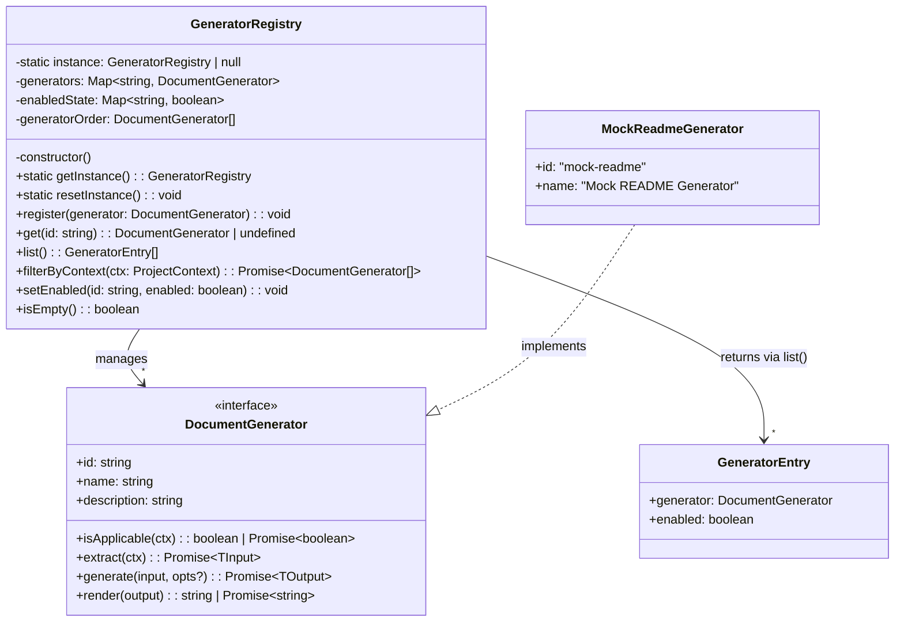
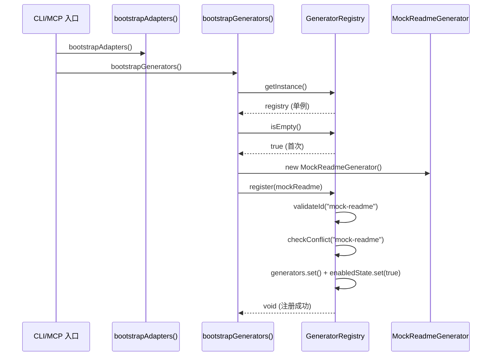
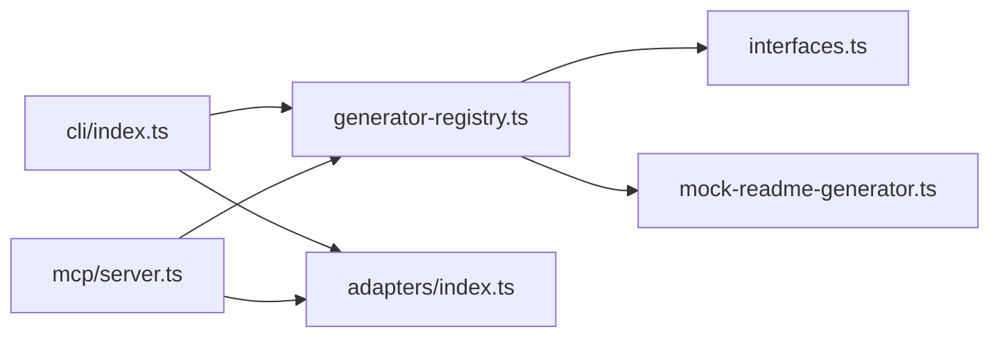

# Implementation Plan: GeneratorRegistry 注册中心

**Branch**: `036-generator-registry` | **Date**: 2026-03-19 | **Spec**: [spec.md](./spec.md)
**Input**: Feature specification from `specs/036-generator-registry/spec.md`

## Summary

实现 `GeneratorRegistry` 类——全景文档化体系的 Generator 中心化注册中心。该注册中心遵循现有 `LanguageAdapterRegistry` 的单例 + 两阶段验证模式，新增 `filterByContext()` 异步过滤和启用/禁用状态管理两项差异化能力。核心代码位于 `src/panoramic/generator-registry.ts`，与 `interfaces.ts` 中已有的 `DocumentGenerator` 接口和 `MockReadmeGenerator` 实现无缝对接。

技术方案选择"复用现有模式 + 最小差异扩展"策略，在 LanguageAdapterRegistry 已验证的单例/两阶段验证骨架上，叠加 `Map<string, boolean>` 状态管理和 `Promise.resolve()` 统一包装的异步过滤逻辑。

## Technical Context

**Language/Version**: TypeScript 5.7.3, Node.js LTS (>=20.x)
**Primary Dependencies**: 无新增运行时依赖。仅使用已有的 `zod`（`GeneratorMetadataSchema` 验证）和 `interfaces.ts` 中定义的类型
**Storage**: N/A（纯内存 Map 存储，进程级生命周期）
**Testing**: vitest（项目现有测试框架）
**Target Platform**: Node.js CLI + MCP Server
**Project Type**: single（npm 单包项目）
**Performance Goals**: N/A（Generator 数量预期 <50 个，无性能瓶颈）
**Constraints**: 零新增依赖；与 LanguageAdapterRegistry 设计模式一致；`DocumentGenerator` 接口不可修改
**Scale/Scope**: 初始 1 个内置 Generator（MockReadmeGenerator），架构支持 50+ Generator 注册

## Constitution Check

*GATE: Must pass before Phase 0 research. Re-check after Phase 1 design.*

| 原则 | 适用性 | 评估 | 说明 |
|------|--------|------|------|
| I. 双语文档规范 | 适用 | PASS | 所有文档和代码注释使用中文，代码标识符使用英文 |
| II. Spec-Driven Development | 适用 | PASS | 通过 spec-driver 流程产出 spec.md -> plan.md -> tasks.md 制品链 |
| III. 诚实标注不确定性 | 适用 | PASS | 无推断内容，所有设计决策均有明确依据 |
| IV. AST 精确性优先 | 不适用 | N/A | 本 Feature 不涉及代码分析或 Spec 生成 |
| V. 混合分析流水线 | 不适用 | N/A | 本 Feature 不涉及 LLM 调用或代码分析流水线 |
| VI. 只读安全性 | 不适用 | N/A | 本 Feature 不涉及源文件读写，仅操作内存数据结构 |
| VII. 纯 Node.js 生态 | 适用 | PASS | 零新增依赖，仅使用 TypeScript/Node.js 内置能力和已有 zod 库 |
| VIII-XII. spec-driver 约束 | 不适用 | N/A | 本 Feature 属于 reverse-spec 插件的 TypeScript 源代码开发 |

**结论**: 所有适用原则均 PASS，无 VIOLATION。

## Architecture

### 类图



### 调用流程



### 模块依赖关系



## Project Structure

### Documentation (this feature)

```text
specs/036-generator-registry/
├── spec.md              # 需求规范
├── plan.md              # 本文件
├── research.md          # 技术决策研究
├── data-model.md        # 数据模型
├── research/
│   └── tech-research.md # 前序技术调研
└── tasks.md             # 待生成
```

### Source Code (repository root)

```text
src/
├── panoramic/
│   ├── interfaces.ts              # DocumentGenerator 接口 (已有，不修改)
│   ├── mock-readme-generator.ts   # MockReadmeGenerator (已有，不修改)
│   ├── generator-registry.ts      # [新增] GeneratorRegistry 类 + bootstrapGenerators()
│   └── project-context.ts         # ProjectContext 构建 (已有，不修改)
├── cli/
│   └── index.ts                   # [修改] 添加 bootstrapGenerators() 调用
├── mcp/
│   └── server.ts                  # [修改] 添加 bootstrapGenerators() 调用
└── adapters/
    └── language-adapter-registry.ts  # 参考实现 (不修改)

tests/
└── panoramic/
    └── generator-registry.test.ts   # [新增] 单元测试
```

**Structure Decision**: 遵循现有单包项目结构。新增文件仅 `generator-registry.ts`（源码）和 `generator-registry.test.ts`（测试），修改 `cli/index.ts` 和 `mcp/server.ts` 的入口调用点。所有新代码位于 `src/panoramic/` 模块内，与接口定义和已有 Generator 实现在同一包下。

## Detailed Design

### 1. GeneratorRegistry 类

**文件**: `src/panoramic/generator-registry.ts`

#### 1.1 内部存储

| 字段 | 类型 | 说明 |
|------|------|------|
| `instance` | `GeneratorRegistry \| null` | 静态单例引用 |
| `generators` | `Map<string, DocumentGenerator<any, any>>` | id -> Generator 实例映射 |
| `enabledState` | `Map<string, boolean>` | id -> 启用/禁用状态映射 |
| `generatorOrder` | `DocumentGenerator<any, any>[]` | 按注册顺序维护的有序列表 |

#### 1.2 register(generator) 方法

两阶段验证流程：

1. **Phase A — ID 格式校验**: 使用 `GeneratorMetadataSchema` 的正则 `/^[a-z][a-z0-9-]*$/` 验证 `generator.id`，不符合时抛出格式错误
2. **Phase B — 冲突检测**: 检查 `generators.has(id)`，已存在时抛出冲突错误，Error 消息包含已注册 Generator 的 id 和 name
3. **提交**: 同时写入 `generators`、`enabledState`（默认 true）和 `generatorOrder`

确保原子性：Phase A/B 任一失败则不修改任何内部状态。

#### 1.3 filterByContext(projectContext) 方法

```
async filterByContext(context: ProjectContext): Promise<DocumentGenerator<any, any>[]>
```

处理逻辑：
1. 遍历 `generatorOrder`，跳过 `enabledState.get(id) === false` 的 Generator
2. 对每个启用的 Generator 调用 `Promise.resolve(generator.isApplicable(context))`，统一处理同步/异步返回值
3. 使用 `Promise.allSettled()` 并发执行所有 `isApplicable` 调用
4. 对 `rejected` 的 Promise 记录 `console.warn` 警告并跳过（防御性编程）
5. 收集 `fulfilled` 且值为 `true` 的 Generator，按原始注册顺序返回

#### 1.4 setEnabled(id, enabled) 方法

- 检查 `generators.has(id)`，不存在时抛出 `Error: Generator '${id}' not found in registry`
- 更新 `enabledState.set(id, enabled)`

#### 1.5 单例管理

- `getInstance()`: 懒初始化，`instance` 为 null 时创建新实例
- `resetInstance()`: 将 `instance` 设为 null，与 LanguageAdapterRegistry 行为完全一致

### 2. bootstrapGenerators() 函数

**同文件定义**: 在 `generator-registry.ts` 底部导出

```
export function bootstrapGenerators(): void
```

幂等逻辑：
- 调用 `registry.isEmpty()` 检查，非空则直接 return
- 空时依次注册内置 Generator：`new MockReadmeGenerator()`
- 未来新增内置 Generator 只需在此函数中追加 register 调用

### 3. CLI/MCP 入口调用点

**cli/index.ts** — `main()` 函数中，紧接 `bootstrapAdapters()` 后添加:
```typescript
import { bootstrapGenerators } from '../panoramic/generator-registry.js';
// ...
bootstrapAdapters();
bootstrapGenerators();  // [新增]
```

**mcp/server.ts** — `createMcpServer()` 函数中，紧接 `bootstrapAdapters()` 后添加:
```typescript
import { bootstrapGenerators } from '../panoramic/generator-registry.js';
// ...
bootstrapAdapters();
bootstrapGenerators();  // [新增]
```

### 4. 导出策略

`generator-registry.ts` 导出：
- `GeneratorRegistry` 类
- `GeneratorEntry` 接口
- `bootstrapGenerators` 函数

暂不创建 `src/panoramic/index.ts` 桶文件——等后续 Feature 需要时再统一组织（避免过度设计）。

### 5. 测试策略

**文件**: `tests/panoramic/generator-registry.test.ts`

| 测试场景 | 覆盖的 FR | 说明 |
|----------|----------|------|
| 注册 3+ 个 Mock Generator 成功 | FR-002 | 验证 register + list 数量和顺序 |
| ID 冲突抛出 Error | FR-003 | 验证错误消息 + Registry 状态不被污染 |
| ID 格式校验（非 kebab-case 拒绝） | FR-004 | 验证包含大写/空格/特殊字符的 id 被拒绝 |
| get(id) 命中和未命中 | FR-005 | 命中返回实例，未命中返回 undefined |
| list() 返回全量 + 状态 | FR-006 | 验证 GeneratorEntry 结构和 enabled 字段 |
| filterByContext 同步/异步混合 | FR-007, FR-008 | Mock 3 个 Generator 分别返回 true/false/Promise<true> |
| filterByContext 跳过禁用项 | FR-009 | 禁用后不包含在过滤结果中 |
| filterByContext 异常容错 | FR-010 | isApplicable 抛异常时跳过而非中断 |
| 启用/禁用切换 | FR-011, FR-012 | 默认启用 -> 禁用 -> 恢复 + 不存在 id 报错 |
| bootstrapGenerators 幂等 | FR-013, FR-014 | 连续调用两次，Generator 数量不变 |
| isEmpty() | FR-015 | 空 Registry -> true，注册后 -> false |
| 单例 + resetInstance() | 单例模式 | getInstance() 同引用，reset 后新实例 |
| 空 Registry 调用 filterByContext/list | 边界情况 | 返回空数组，不抛异常 |

## Complexity Tracking

> 本 Feature 无 Constitution VIOLATION，无需偏差论证。

| 决策点 | 选择 | 更简单的替代方案 | 拒绝理由 |
|--------|------|-----------------|----------|
| Promise.allSettled vs 逐个 await | Promise.allSettled | 逐个 for-await | allSettled 支持并发 + 内置错误隔离，与防御性编程需求完美匹配 |
| Map<id, boolean> 状态管理 | 独立 Map | 在 Generator 实例上增加 enabled 属性 | 不应修改外部传入对象的属性，Registry 应拥有状态所有权 |
| 同文件导出 class + bootstrap | 同文件 | 拆分为 registry.ts + bootstrap.ts | 当前仅 1 个内置 Generator，拆分增加无意义的文件间依赖 |
