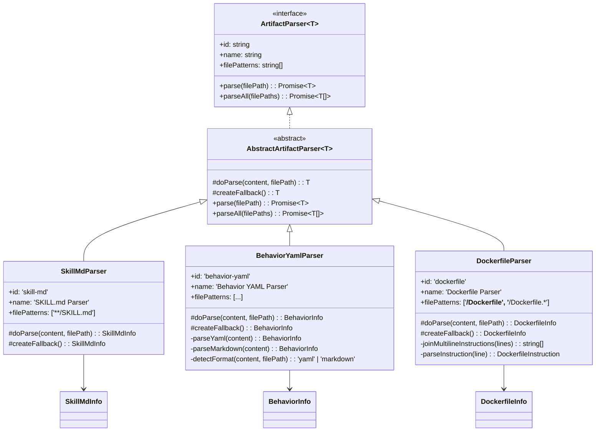

# Feature 037 数据模型

**Feature Branch**: `037-artifact-parsers`
**日期**: 2026-03-19

---

## 1. 输出类型定义

所有输出类型定义在 `src/panoramic/parsers/types.ts`，每个类型配套 Zod Schema 用于运行时验证。

### 1.1 SkillMdInfo

SkillMdParser 的解析输出，表示一个 SKILL.md 文件的结构化内容。

```typescript
/** SKILL.md 的单个二级标题分段 */
interface SkillMdSection {
  /** 二级标题文本（不含 ## 前缀） */
  heading: string;
  /** 该标题下的正文内容（保留原始 Markdown 格式） */
  content: string;
}

/** SkillMdParser 的解析输出 */
interface SkillMdInfo {
  /** 名称——从 frontmatter 的 name 字段提取，无 frontmatter 时从一级标题推断 */
  name: string;
  /** 描述——从 frontmatter 的 description 字段提取，缺失时为空字符串 */
  description: string;
  /** 版本号——从 frontmatter 的 version 字段提取，缺失时为 undefined */
  version?: string;
  /** 一级标题文本——从 Markdown body 中第一个 # 标题提取 */
  title: string;
  /** 二级标题分段数组——按文件中出现顺序排列 */
  sections: SkillMdSection[];
}
```

**降级结果**: `{ name: '', description: '', title: '', sections: [] }`

**Zod Schema**:
```typescript
const SkillMdSectionSchema = z.object({
  heading: z.string(),
  content: z.string(),
});

const SkillMdInfoSchema = z.object({
  name: z.string(),
  description: z.string(),
  version: z.string().optional(),
  title: z.string(),
  sections: z.array(SkillMdSectionSchema),
});
```

---

### 1.2 BehaviorInfo

BehaviorYamlParser 的解析输出，表示一个 behavior 文件中的状态-行为映射。

```typescript
/** 单个状态及其关联行为 */
interface BehaviorState {
  /** 状态名称——从 YAML key 或 Markdown 标题提取 */
  name: string;
  /** 状态描述——从 YAML value 或 Markdown 段落提取 */
  description: string;
  /** 行为列表——从 YAML 数组或 Markdown 列表项提取 */
  actions: string[];
}

/** BehaviorYamlParser 的解析输出 */
interface BehaviorInfo {
  /** 状态-行为映射数组 */
  states: BehaviorState[];
}
```

**降级结果**: `{ states: [] }`

**Zod Schema**:
```typescript
const BehaviorStateSchema = z.object({
  name: z.string(),
  description: z.string(),
  actions: z.array(z.string()),
});

const BehaviorInfoSchema = z.object({
  states: z.array(BehaviorStateSchema),
});
```

---

### 1.3 DockerfileInfo

DockerfileParser 的解析输出，表示一个 Dockerfile 的多阶段构建信息。

```typescript
/** Dockerfile 的单条指令 */
interface DockerfileInstruction {
  /** 指令类型（大写，如 RUN、COPY、ENV） */
  type: string;
  /** 指令参数（已拼接多行续行） */
  args: string;
}

/** Dockerfile 的单个构建阶段 */
interface DockerfileStage {
  /** 基础镜像——FROM 指令的镜像名称（含 tag） */
  baseImage: string;
  /** 阶段别名——FROM image AS alias 中的 alias，无则为 undefined */
  alias?: string;
  /** 该阶段的指令列表（不含 FROM 本身，按出现顺序排列） */
  instructions: DockerfileInstruction[];
}

/** DockerfileParser 的解析输出 */
interface DockerfileInfo {
  /** 构建阶段数组——按 FROM 出现顺序排列 */
  stages: DockerfileStage[];
}
```

**降级结果**: `{ stages: [] }`

**Zod Schema**:
```typescript
const DockerfileInstructionSchema = z.object({
  type: z.string(),
  args: z.string(),
});

const DockerfileStageSchema = z.object({
  baseImage: z.string(),
  alias: z.string().optional(),
  instructions: z.array(DockerfileInstructionSchema),
});

const DockerfileInfoSchema = z.object({
  stages: z.array(DockerfileStageSchema),
});
```

---

## 2. Parser 元数据

每个 Parser 的静态元数据属性（通过 ArtifactParserMetadataSchema 验证）:

| Parser | id | name | filePatterns |
|--------|----|----|--------------|
| SkillMdParser | `skill-md` | `SKILL.md Parser` | `['**/SKILL.md']` |
| BehaviorYamlParser | `behavior-yaml` | `Behavior YAML Parser` | `['**/behavior/**/*.yaml', '**/behavior/**/*.yml', '**/behavior/**/*.md']` |
| DockerfileParser | `dockerfile` | `Dockerfile Parser` | `['**/Dockerfile', '**/Dockerfile.*']` |

---

## 3. 抽象基类

`AbstractArtifactParser<T>` 封装三个 Parser 的共通逻辑:

```typescript
abstract class AbstractArtifactParser<T> implements ArtifactParser<T> {
  abstract readonly id: string;
  abstract readonly name: string;
  abstract readonly filePatterns: readonly string[];

  /** 子类实现：从文件内容解析为结构化数据 */
  protected abstract doParse(content: string, filePath: string): T;

  /** 子类实现：提供降级结果 */
  protected abstract createFallback(): T;

  /** 统一的容错解析入口 */
  async parse(filePath: string): Promise<T> {
    try {
      const content = await fs.promises.readFile(filePath, 'utf-8');
      return this.doParse(content, filePath);
    } catch {
      return this.createFallback();
    }
  }

  /** 默认的批量解析实现 */
  async parseAll(filePaths: string[]): Promise<T[]> {
    return Promise.all(filePaths.map(fp => this.parse(fp)));
  }
}
```

**设计要点**:
- `doParse()` 接收已读取的文件内容字符串，不再负责 I/O
- `createFallback()` 返回空但合法的类型实例
- `parse()` 在 try-catch 中调用 `doParse()`，任何异常均降级
- `parseAll()` 使用 `Promise.all` 并发执行，因为每个 `parse()` 内部已有容错

---

## 4. 实体关系图


