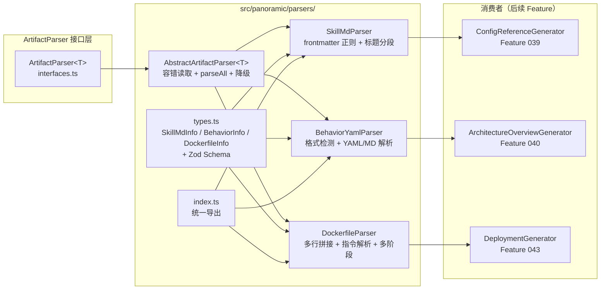
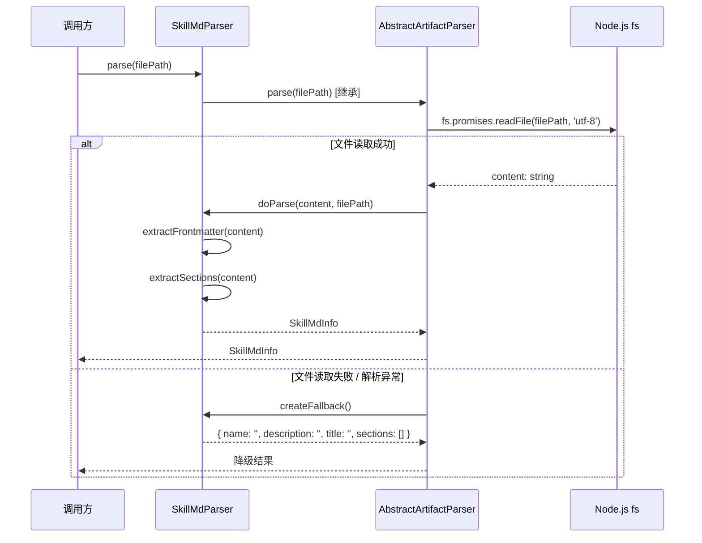

# Implementation Plan: 非代码制品解析

**Branch**: `037-artifact-parsers` | **Date**: 2026-03-19 | **Spec**: [spec.md](./spec.md)
**Input**: Feature specification from `specs/037-artifact-parsers/spec.md`

## Summary

实现 ArtifactParser 接口的首批三个具体 Parser：SkillMdParser（解析 SKILL.md）、BehaviorYamlParser（解析 behavior YAML/Markdown）、DockerfileParser（解析 Dockerfile）。三个 Parser 均实现 Feature 034 定义的 `ArtifactParser<T>` 泛型接口，共享一个抽象基类 `AbstractArtifactParser<T>` 来封装容错降级和批量解析的共通逻辑。全部解析逻辑使用纯正则和行级字符串处理，不引入新运行时依赖。

## Technical Context

**Language/Version**: TypeScript 5.7.3, Node.js LTS (>=20.x)
**Primary Dependencies**: zod（数据验证，现有依赖）+ Node.js 内置模块（fs, path）
**Storage**: N/A（纯解析，无持久化需求）
**Testing**: vitest（现有测试框架）
**Target Platform**: Node.js CLI / MCP Server
**Project Type**: single
**Performance Goals**: 单文件解析 < 10ms，100 文件批量解析 < 1s
**Constraints**: 不引入新运行时依赖；解析失败必须容错降级
**Scale/Scope**: 首批 3 个 Parser，覆盖 SKILL.md / behavior YAML-Markdown / Dockerfile 三种制品类型

## Constitution Check

*GATE: Must pass before Phase 0 research. Re-check after Phase 1 design.*

| 原则 | 适用性 | 评估 | 说明 |
|------|--------|------|------|
| **I. 双语文档规范** | 适用 | PASS | 所有文档中文散文 + 英文代码标识符。注释使用中文 |
| **II. Spec-Driven Development** | 适用 | PASS | 遵循 spec.md -> plan.md -> tasks.md 标准流程 |
| **III. 诚实标注不确定性** | 适用 | PASS | 无推断性内容。所有决策基于 spec.md 明确要求 |
| **IV. AST 精确性优先** | 部分适用 | PASS | Feature 037 处理非代码制品（SKILL.md、Dockerfile），不涉及代码 AST 解析。使用正则/行级解析提取结构化数据，符合"结构化数据来源于静态分析"的精神 |
| **V. 混合分析流水线** | 不适用 | N/A | Feature 037 不涉及 LLM 分析流水线，是纯静态解析 |
| **VI. 只读安全性** | 适用 | PASS | Parser 只读取文件内容，不修改目标文件。写操作仅限于 specs/ 目录下的设计文档 |
| **VII. 纯 Node.js 生态** | 适用 | PASS | 不引入新运行时依赖，仅使用 Node.js 内置模块（fs, path）和现有依赖（zod） |
| **VIII-XII（spec-driver 原则）** | 不适用 | N/A | Feature 037 属于 reverse-spec 插件的 TypeScript 源码开发，不属于 spec-driver 插件 |

**Constitution Check 结论**: 全部通过，无违规项。

## Project Structure

### Documentation (this feature)

```text
specs/037-artifact-parsers/
├── spec.md              # 需求规范
├── plan.md              # 本文件（技术规划）
├── research.md          # 技术决策研究
├── data-model.md        # 数据模型定义
└── research/
    └── tech-research.md # 前序技术调研
```

### Source Code (repository root)

```text
src/panoramic/parsers/
├── types.ts                      # 输出类型定义 + Zod Schema
│                                 #   SkillMdInfo, BehaviorInfo, DockerfileInfo
│                                 #   SkillMdInfoSchema, BehaviorInfoSchema, DockerfileInfoSchema
├── abstract-artifact-parser.ts   # 抽象基类 AbstractArtifactParser<T>
│                                 #   封装容错读取、降级返回、parseAll 默认实现
├── skill-md-parser.ts            # SkillMdParser
│                                 #   YAML frontmatter 正则提取 + Markdown 标题分段
├── behavior-yaml-parser.ts       # BehaviorYamlParser
│                                 #   格式自动检测 + YAML 正则解析 + Markdown 标题分段
├── dockerfile-parser.ts          # DockerfileParser
│                                 #   多行拼接预处理 + 逐行指令解析 + 多阶段检测
└── index.ts                      # 桶文件，统一导出所有 Parser 和类型

tests/panoramic/
├── skill-md-parser.test.ts       # SkillMdParser 单元测试
├── behavior-yaml-parser.test.ts  # BehaviorYamlParser 单元测试
├── dockerfile-parser.test.ts     # DockerfileParser 单元测试
└── fixtures/
    ├── skill-md/
    │   ├── standard.skill.md     # 标准 YAML frontmatter + Markdown sections
    │   ├── no-frontmatter.skill.md  # 无 frontmatter，仅 Markdown
    │   ├── empty.skill.md        # 空文件（0 字节）
    │   └── duplicate-headings.skill.md  # 重复 ## 标题
    ├── behavior/
    │   ├── standard.yaml         # 标准 YAML 格式
    │   ├── markdown-format.md    # Markdown 格式 behavior
    │   ├── invalid.yaml          # 无效格式（降级测试）
    │   └── empty.yaml            # 空文件
    └── dockerfile/
        ├── single-stage.Dockerfile   # 单阶段构建
        ├── multi-stage.Dockerfile    # 多阶段 + AS alias
        ├── multiline.Dockerfile      # 多行续行拼接
        ├── comments-only.Dockerfile  # 仅注释和空行
        └── arg-before-from.Dockerfile # FROM 前的 ARG 指令
```

**Structure Decision**: 在现有 `src/panoramic/` 目录下新增 `parsers/` 子目录，与 `interfaces.ts`、`generator-registry.ts` 等现有文件保持同级。三个 Parser 各自独立文件，共享一个抽象基类和一个类型定义文件。测试文件遵循现有 `tests/panoramic/` 的命名约定。

## Architecture

### 整体架构图



### 解析流程（以 SkillMdParser 为例）



### 各 Parser 核心解析策略

#### SkillMdParser

1. **Frontmatter 提取**: 使用正则 `/^---\n([\s\S]*?)\n---/` 匹配 `---` 分隔的 YAML frontmatter 块
2. **Frontmatter 字段解析**: 逐行匹配 `/^(\w+):\s*(.*)$/` 提取 `key: value` 对，支持 name/description/version
3. **一级标题提取**: 匹配 `/^#\s+(.+)$/m` 提取第一个 `#` 标题作为 title
4. **二级标题分段**: 按 `/^##\s+(.+)$/gm` 分割内容，每个 `##` 标题及其下方文本组成一个 section

#### BehaviorYamlParser

1. **格式检测**: `detectFormat(content, filePath)`
   - 扩展名为 `.yaml`/`.yml` -> YAML 模式
   - 扩展名为 `.md` -> Markdown 模式
   - 扩展名不明确时，检查内容是否包含 Markdown 标题（`#`）或 YAML 结构（缩进键值对）
2. **YAML 模式**: 逐行解析 `key: value` 结构，识别顶层键作为 state name，嵌套列表项（`- action`）作为 actions
3. **Markdown 模式**: 与 SkillMdParser 类似的标题分段策略——标题作为 state name，段落作为 description，列表项作为 actions

#### DockerfileParser

1. **预处理——多行拼接**: 遍历原始行，当行尾为 `\` 时将下一行拼接，生成逻辑行列表
2. **过滤**: 移除空行和注释行（`#` 开头，注意需 trim 后判断）
3. **FROM 前 ARG 处理**: 第一个 FROM 之前的 ARG 指令作为全局 ARG，不归属任何 stage
4. **多阶段检测**: 每个 FROM 指令开启新 stage，解析 `FROM image:tag AS alias` 格式
5. **指令解析**: 对每个逻辑行，匹配 `/^(\w+)\s+(.*)/` 提取 type（大写化）和 args

### 容错降级策略

每个 Parser 的容错层级：

| 层级 | 触发条件 | 行为 |
|------|----------|------|
| L0 | 文件不存在 / 读取失败 | `createFallback()` 返回空结构 |
| L1 | 文件内容为空 | `createFallback()` 返回空结构 |
| L2 | 格式不识别（如二进制文件） | `doParse()` 内部 try-catch 返回 `createFallback()` |
| L3 | 部分字段缺失（如无 frontmatter） | 部分降级——缺失字段使用默认值，已识别字段正常返回 |

`parseAll()` 的容错保证：返回与输入数组等长的结果数组。单个文件解析失败时，对应位置为降级结果，不中断批量流程。

## Implementation Phases

### Phase 1: 基础设施（types.ts + abstract-artifact-parser.ts + index.ts）

**目标**: 建立 Parser 模块的类型基础和共通抽象

**产出文件**:
- `src/panoramic/parsers/types.ts` — 三个输出类型 + Zod Schema
- `src/panoramic/parsers/abstract-artifact-parser.ts` — 抽象基类
- `src/panoramic/parsers/index.ts` — 桶文件（初始仅导出 types 和基类）

**验证**: `npm run build` 编译通过

### Phase 2: SkillMdParser（P1 优先级）

**目标**: 实现 SKILL.md 文件的完整解析

**产出文件**:
- `src/panoramic/parsers/skill-md-parser.ts`
- `tests/panoramic/skill-md-parser.test.ts`
- `tests/panoramic/fixtures/skill-md/` 下 4 个 fixture 文件

**验证**: `npm test` 通过，覆盖正常解析 / 无 frontmatter / 空文件 / 重复标题 / parseAll 五个场景

### Phase 3: BehaviorYamlParser（P1 优先级）

**目标**: 实现 behavior YAML/Markdown 文件的双格式解析

**产出文件**:
- `src/panoramic/parsers/behavior-yaml-parser.ts`
- `tests/panoramic/behavior-yaml-parser.test.ts`
- `tests/panoramic/fixtures/behavior/` 下 4 个 fixture 文件

**验证**: `npm test` 通过，覆盖 YAML 格式 / Markdown 格式 / 无效格式 / 空文件 / parseAll 五个场景

### Phase 4: DockerfileParser（P2 优先级）

**目标**: 实现 Dockerfile 的逐行解析和多阶段构建检测

**产出文件**:
- `src/panoramic/parsers/dockerfile-parser.ts`
- `tests/panoramic/dockerfile-parser.test.ts`
- `tests/panoramic/fixtures/dockerfile/` 下 5 个 fixture 文件

**验证**: `npm test` 通过，覆盖单阶段 / 多阶段 / 多行拼接 / 仅注释 / FROM 前 ARG / parseAll 六个场景

### Phase 5: 集成验证

**目标**: 确保所有代码集成后项目整体健康

**验证清单**:
- `npm run build` 零错误
- `npm test` 全部通过，无新增失败
- `npm run lint` 无新增 lint 错误
- `package.json` 的 dependencies 无新增项
- index.ts 正确导出所有 Parser 和类型

## Complexity Tracking

> 无 Constitution Check 违规项，无复杂度偏差需要记录。

| 偏离 | 必要性说明 | 被拒绝的更简方案及原因 |
|------|------------|------------------------|
| 引入 AbstractArtifactParser 抽象基类 | 三个 Parser 共享容错读取、降级返回、parseAll 逻辑，DRY 收益显著 | 直接在每个 Parser 中重复实现——代码重复率约 40%，维护成本高 |
| BehaviorYamlParser 双格式支持 | OctoAgent 验证场景要求解析 Markdown 格式的 behavior 文件 | 仅支持 YAML——无法通过蓝图验证标准 |
