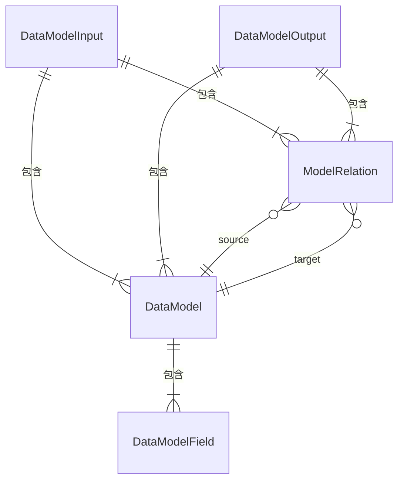

# 数据模型: Feature 038 — 通用数据模型文档生成

## 核心实体

### DataModelField

单个数据模型字段的结构化表示。

| 属性 | 类型 | 必填 | 说明 |
|------|------|------|------|
| name | string | 是 | 字段名称 |
| typeStr | string | 是 | 类型注解的原始文本（如 `Optional[List[str]]`、`string \| null`） |
| optional | boolean | 是 | 是否可选（Python: Optional/None 默认值; TS: `?` 标记） |
| defaultValue | string \| null | 是 | 默认值文本（无默认值时为 null） |
| description | string \| null | 是 | 字段描述（来自 docstring/JSDoc/Field(description=...)） |

### DataModel

单个数据模型（类/接口）的结构化表示。

| 属性 | 类型 | 必填 | 说明 |
|------|------|------|------|
| name | string | 是 | 模型名称（如 `User`、`OrderConfig`） |
| filePath | string | 是 | 源文件相对路径 |
| language | 'python' \| 'typescript' | 是 | 所属语言 |
| kind | 'dataclass' \| 'pydantic' \| 'interface' \| 'type' | 是 | 模型定义类型 |
| fields | DataModelField[] | 是 | 字段列表 |
| bases | string[] | 是 | 基类/扩展接口名称列表 |
| description | string \| null | 是 | 模型级描述（docstring/JSDoc） |

### ModelRelation

模型间关系的结构化表示。

| 属性 | 类型 | 必填 | 说明 |
|------|------|------|------|
| source | string | 是 | 源模型名称 |
| target | string | 是 | 目标模型名称 |
| type | 'inherits' \| 'has' \| 'contains' | 是 | 关系类型 |

关系类型说明：
- **inherits**: 继承关系（Python `class A(B):`、TS `interface A extends B`）
- **has**: 单值引用（字段类型为另一个已知模型）
- **contains**: 集合引用（字段类型为 `List[Model]`、`Model[]` 等）

### DataModelInput

DataModelGenerator.extract() 的输出类型。

| 属性 | 类型 | 必填 | 说明 |
|------|------|------|------|
| models | DataModel[] | 是 | 提取到的所有数据模型列表 |
| relations | ModelRelation[] | 是 | 模型间关系列表 |
| sourceFiles | string[] | 是 | 扫描的源文件列表 |

### DataModelOutput

DataModelGenerator.generate() 的输出类型。

| 属性 | 类型 | 必填 | 说明 |
|------|------|------|------|
| models | DataModel[] | 是 | 按语言和文件路径排序的模型列表 |
| relations | ModelRelation[] | 是 | 去重后的关系列表 |
| erDiagram | string | 是 | Mermaid erDiagram 源代码 |
| summary | object | 是 | 统计摘要 |
| summary.totalModels | number | 是 | 模型总数 |
| summary.totalFields | number | 是 | 字段总数 |
| summary.byLanguage | Record<string, number> | 是 | 按语言统计模型数量 |
| summary.byKind | Record<string, number> | 是 | 按模型类型统计数量 |

## 实体关系图

