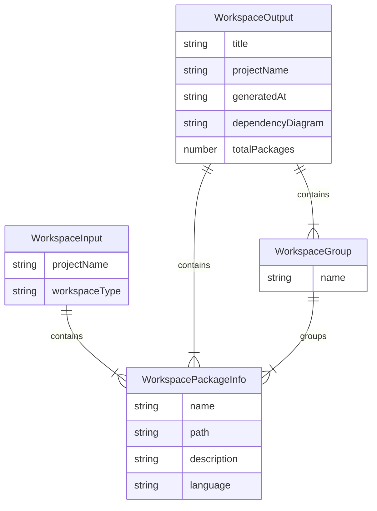
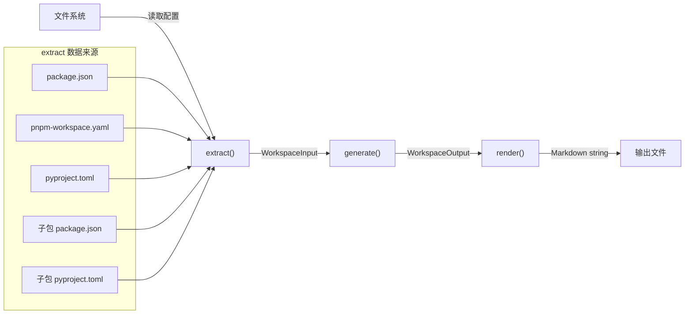

# Feature 040 数据模型

**日期**: 2026-03-19
**关联**: [spec.md](./spec.md) | [plan.md](./plan.md)

---

## 实体定义

### WorkspacePackageInfo

单个子包的元信息。从子包的 `package.json`（npm/pnpm）或 `pyproject.toml`（uv）中提取。

```typescript
interface WorkspacePackageInfo {
  /** 包名（如 "@scope/core"、"octoagent-core"） */
  name: string;

  /** 子包相对于 projectRoot 的路径（如 "packages/core"） */
  path: string;

  /** 包描述（来自 description 字段，缺失时为空字符串） */
  description: string;

  /** 主要语言（TypeScript / JavaScript / Python / Unknown） */
  language: string;

  /** workspace 内部依赖列表（仅包名，不含版本） */
  dependencies: string[];
}
```

| 字段 | 类型 | 来源（npm/pnpm） | 来源（uv） | 必填 |
|------|------|-----------------|-----------|------|
| name | string | `package.json` -> `name` | `pyproject.toml` -> `[project].name` | Y |
| path | string | 子包目录相对路径 | 子包目录相对路径 | Y |
| description | string | `package.json` -> `description` | `pyproject.toml` -> `[project].description` | Y（缺失时 ""） |
| language | string | 目录内文件特征推断 | 目录内文件特征推断 | Y |
| dependencies | string[] | `dependencies` + `devDependencies` 中属于 workspace 内部的包名 | `[project].dependencies` 中属于 workspace 内部的包名 | Y（无依赖时 []） |

---

### WorkspaceInput

`extract()` 步骤的输出。包含项目级信息和所有子包的元信息列表。

```typescript
interface WorkspaceInput {
  /** 项目名称（来自根 package.json 或 pyproject.toml，降级为目录名） */
  projectName: string;

  /** workspace 管理器类型 */
  workspaceType: 'npm' | 'pnpm' | 'uv';

  /** 所有子包的元信息列表 */
  packages: WorkspacePackageInfo[];
}
```

| 字段 | 类型 | 来源 | 必填 |
|------|------|------|------|
| projectName | string | 根 `package.json.name` 或 `pyproject.toml [project].name`，降级为 `path.basename(projectRoot)` | Y |
| workspaceType | string | extract 阶段检测结果 | Y |
| packages | WorkspacePackageInfo[] | 各子包元信息聚合 | Y（可为 []） |

---

### WorkspaceOutput

`generate()` 步骤的输出。包含渲染模板所需的全部数据。

```typescript
interface WorkspaceOutput {
  /** 文档标题（如 "Workspace 架构索引: my-project"） */
  title: string;

  /** 项目名称 */
  projectName: string;

  /** 生成日期（YYYY-MM-DD 格式） */
  generatedAt: string;

  /** 所有子包信息（按路径排序） */
  packages: WorkspacePackageInfo[];

  /** Mermaid graph TD 依赖拓扑图源代码 */
  dependencyDiagram: string;

  /** 子包总数 */
  totalPackages: number;

  /** 按层级目录分组的子包（如 { "packages": [...], "apps": [...] }） */
  groups: WorkspaceGroup[];
}
```

---

### WorkspaceGroup

按路径第一级目录分组的子包集合。

```typescript
interface WorkspaceGroup {
  /** 分组名称（第一级目录名，如 "packages"、"apps"） */
  name: string;

  /** 该分组下的子包列表 */
  packages: WorkspacePackageInfo[];
}
```

---

## 实体关系图



---

## 数据流



---

## 与现有类型的关系

| 本 Feature 类型 | 关联的现有类型 | 关系说明 |
|----------------|--------------|---------|
| WorkspaceIndexGenerator | `DocumentGenerator<WorkspaceInput, WorkspaceOutput>` | 实现接口 |
| WorkspaceIndexGenerator | `ProjectContext` | isApplicable 使用 `workspaceType` 字段；extract 使用 `projectRoot` |
| WorkspaceIndexGenerator | `GenerateOptions` | generate 方法接受可选 options 参数 |
| WorkspaceIndexGenerator | `GeneratorRegistry` | 通过 bootstrapGenerators() 注册，id = `'workspace-index'` |

---

## 边界值约束

| 字段 | 约束 | 处理 |
|------|------|------|
| `WorkspacePackageInfo.name` | 非空字符串 | package.json/pyproject.toml 缺少 name 时使用目录名作为降级值 |
| `WorkspacePackageInfo.description` | 可为空字符串 | 缺失时设为 `""` |
| `WorkspacePackageInfo.dependencies` | 仅包含 workspace 内部包名 | 外部依赖不纳入 |
| `WorkspaceInput.packages` | 可为空数组 | 配置解析失败或无有效子包时返回 `[]` |
| `WorkspaceOutput.dependencyDiagram` | Mermaid graph TD 语法 | 无内部依赖时生成仅含节点无边的图 |
| `WorkspaceOutput.groups` | 至少一个分组 | 按路径第一级目录聚合，单层级项目产生一个分组 |
| Mermaid 节点 ID | 仅允许 `[a-zA-Z0-9_]` | `@scope/pkg` 中的 `@` 和 `/` 替换为 `_` |
