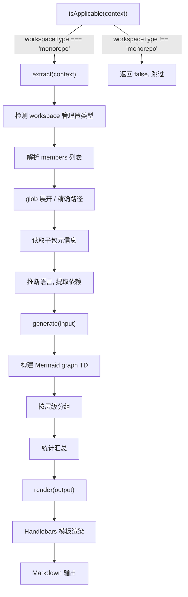
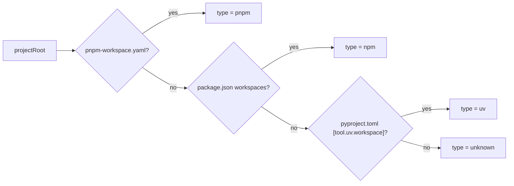
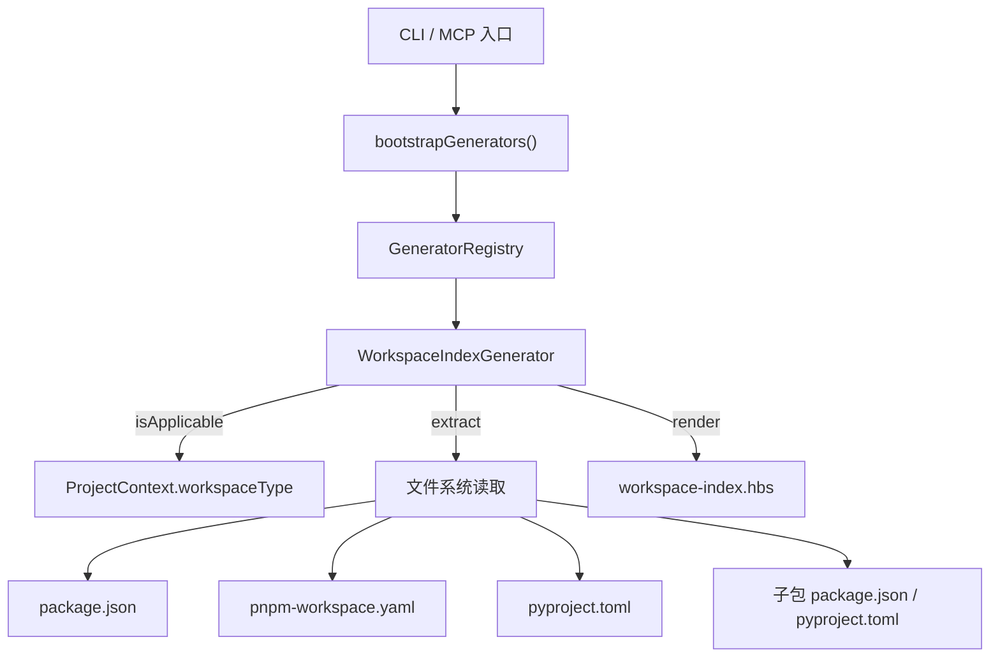

# Implementation Plan: Monorepo 层级架构索引

**Branch**: `040-monorepo-workspace-index` | **Date**: 2026-03-19 | **Spec**: [spec.md](./spec.md)
**Input**: Feature specification from `specs/040-monorepo-workspace-index/spec.md`

## Summary

实现 `WorkspaceIndexGenerator`（`DocumentGenerator<WorkspaceInput, WorkspaceOutput>` 接口），为 Monorepo 项目生成 packages/apps 层级索引文档。支持 npm/pnpm workspace（glob 展开）和 uv workspace（精确路径），生成包含子包列表和 Mermaid 包级依赖拓扑图的 Markdown 文档。技术方案基于 tech-research.md 结论：复用现有 `project-context.ts` 的 workspace 检测逻辑，纯 `fs.readdirSync` 展开 glob，纯正则解析 `pyproject.toml`，Handlebars 模板渲染。

## Technical Context

**Language/Version**: TypeScript 5.x, Node.js LTS (>=20.x)
**Primary Dependencies**: handlebars（模板渲染，现有依赖）、zod（可选，数据验证）——无新增运行时依赖
**Storage**: 文件系统（读取 workspace 配置文件；输出 Markdown 文档）
**Testing**: vitest（项目现有测试框架）
**Target Platform**: Node.js CLI / MCP Server
**Project Type**: single（本项目为单包，但目标是分析 Monorepo 项目）
**Performance Goals**: 50 个子包的完整生命周期 < 2 秒
**Constraints**: 不引入额外 glob 库、不引入 TOML 解析库、不引入 YAML 解析库
**Scale/Scope**: 支持 ~100 个子包的 Monorepo

## Constitution Check

*GATE: Must pass before Phase 0 research. Re-check after Phase 1 design.*

| 原则 | 适用性 | 评估 | 说明 |
|------|--------|------|------|
| I. 双语文档规范 | 适用 | PASS | 文档中文散文 + 英文代码标识符 |
| II. Spec-Driven Development | 适用 | PASS | 通过 spec.md -> plan.md -> tasks.md 标准流程 |
| III. 诚实标注不确定性 | 适用 | PASS | 所有数据来自文件系统实际读取，无推断内容 |
| IV. AST 精确性优先 | 不适用 | N/A | 本 Feature 不涉及 AST 解析，仅读取 JSON/YAML/TOML 配置文件 |
| V. 混合分析流水线 | 不适用 | N/A | 本 Feature 不涉及 LLM 调用或代码分析 |
| VI. 只读安全性 | 适用 | PASS | Generator 仅读取配置文件，输出由编排层写入 |
| VII. 纯 Node.js 生态 | 适用 | PASS | 仅使用 Node.js 内置模块 + 现有 npm 依赖（handlebars），不引入新依赖 |
| VIII-XII. spec-driver 约束 | 不适用 | N/A | 本 Feature 属于 reverse-spec plugin 的 panoramic 模块 |

**结论**: 全部适用原则通过检查，无 VIOLATION，无需豁免。

## Project Structure

### Documentation (this feature)

```text
specs/040-monorepo-workspace-index/
├── spec.md              # 需求规范
├── plan.md              # 本文件
├── research.md          # 技术决策研究
├── data-model.md        # 数据模型文档
└── research/
    └── tech-research.md # 前序技术调研
```

### Source Code (repository root)

```text
src/panoramic/
├── interfaces.ts                    # [现有] DocumentGenerator 接口、ProjectContext 类型
├── generator-registry.ts            # [修改] bootstrapGenerators() 注册 WorkspaceIndexGenerator
├── index.ts                         # [修改] 导出 WorkspaceIndexGenerator
├── workspace-index-generator.ts     # [新增] WorkspaceIndexGenerator 实现
└── project-context.ts               # [现有] detectWorkspaceType() 参考

templates/
└── workspace-index.hbs              # [新增] Handlebars 渲染模板

tests/panoramic/
└── workspace-index-generator.test.ts # [新增] 单元测试
```

**Structure Decision**: 遵循现有 Generator 实现模式（参考 `config-reference-generator.ts`、`data-model-generator.ts`），在 `src/panoramic/` 下新增单文件实现，类型定义内联于同文件，模板放置于 `templates/`。

## Architecture

### 生命周期流程



### Workspace 管理器检测策略



### 模块交互



### 关键设计决策

1. **Workspace 管理器类型检测**: extract 阶段独立检测（不复用 ProjectContext 的 packageManager），因为 packageManager 不区分 npm workspace 和普通 npm 项目。检测优先级：pnpm-workspace.yaml > package.json workspaces > pyproject.toml [tool.uv.workspace]

2. **Glob 展开策略**: 仅支持 `*` 通配符（匹配单层目录名），使用 `fs.readdirSync` 列出目标父目录下的所有子目录，逐个检查是否包含有效的包描述文件。不引入 `glob` 或 `fast-glob` 库。

3. **TOML 解析策略**: 纯正则提取 `[tool.uv.workspace]` 段下的 `members` 列表，复用 `project-context.ts` 中已验证的模式。

4. **YAML 解析策略**: `pnpm-workspace.yaml` 结构极简（仅 `packages:` 列表），使用正则逐行解析 `- "pattern"` 条目，不引入 YAML 解析库。

5. **内部依赖提取**: 对于 npm/pnpm 子包，遍历 `dependencies` + `devDependencies` 中引用的包名，与 workspace 内所有子包名比对；对于 uv 子包，遍历 `[project].dependencies` 中的包名进行同样比对。

6. **Mermaid 节点 ID 转义**: `@scope/package` 格式的包名中 `@` 和 `/` 不是合法的 Mermaid 节点 ID 字符，使用下划线替换。

7. **层级分组**: 按子包路径的第一级目录名分组（如 `packages/`、`apps/`），在 WorkspaceOutput 中通过模板 helper 实现分组展示。

## Complexity Tracking

> 无 Constitution Check 违规项，无复杂度偏差。

| Decision | Why Needed | Simpler Alternative Rejected Because |
|----------|------------|--------------------------------------|
| 独立检测 workspace 管理器类型 | extract 需要知道具体的管理器类型以选择正确的解析策略 | 复用 ProjectContext.packageManager 不够精确——npm/yarn/pnpm 的 packageManager 值无法区分是否启用了 workspace |
| 正则解析 pnpm-workspace.yaml | 避免引入 YAML 解析库 | 结构极简（仅 `packages:` 列表），正则足以覆盖所有合法格式 |
| 正则解析 pyproject.toml | 避免引入 TOML 解析库，与 project-context.ts 保持一致 | 仅需提取 `members` 列表，正则覆盖率满足需求 |
