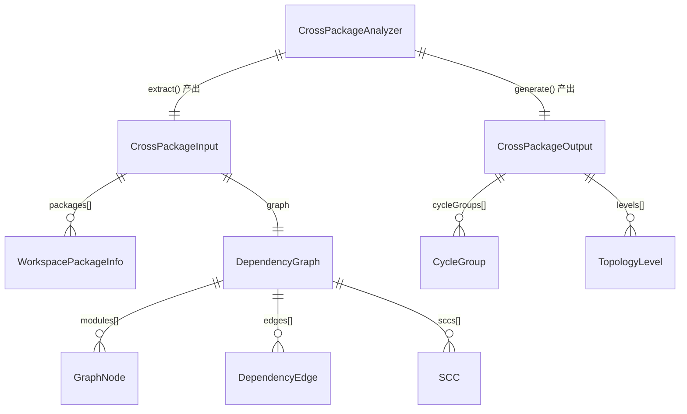
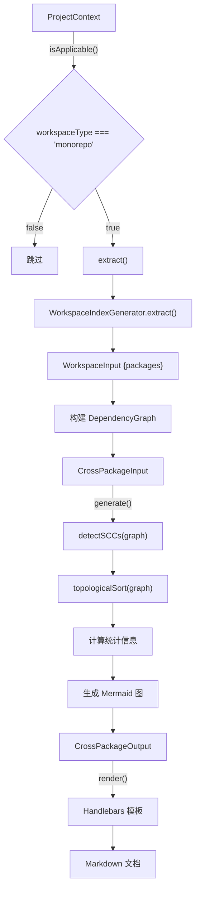

# Feature 041 数据模型

**Feature**: 跨包依赖分析 (cross-package-deps)
**日期**: 2026-03-19

---

## 1. 实体关系总览



---

## 2. 新增类型定义

### 2.1 CrossPackageInput

`extract()` 步骤的输出，`generate()` 步骤的输入。

```typescript
/**
 * CrossPackageAnalyzer extract() 产出
 * 包含项目元信息、子包列表和构建好的包级 DependencyGraph
 */
export interface CrossPackageInput {
  /** 项目名称 */
  projectName: string;

  /** workspace 管理器类型 */
  workspaceType: 'npm' | 'pnpm' | 'uv';

  /** 所有子包元信息列表（复用 WorkspacePackageInfo） */
  packages: WorkspacePackageInfo[];

  /** 包级依赖关系图（复用现有 DependencyGraph 类型） */
  graph: DependencyGraph;
}
```

| 字段 | 类型 | 来源 | 说明 |
|------|------|------|------|
| `projectName` | `string` | `WorkspaceInput.projectName` | 从 040 extract() 转发 |
| `workspaceType` | `'npm' \| 'pnpm' \| 'uv'` | `WorkspaceInput.workspaceType` | 从 040 extract() 转发 |
| `packages` | `WorkspacePackageInfo[]` | `WorkspaceInput.packages` | 从 040 extract() 转发 |
| `graph` | `DependencyGraph` | 041 自行构建 | 由 packages 的 dependencies 字段转换而来 |

### 2.2 CrossPackageOutput

`generate()` 步骤的输出，`render()` 步骤的输入。

```typescript
/**
 * CrossPackageAnalyzer generate() 产出
 * 包含渲染 Markdown 文档所需的全部结构化数据
 */
export interface CrossPackageOutput {
  /** 文档标题 */
  title: string;

  /** 生成日期（YYYY-MM-DD） */
  generatedAt: string;

  /** 项目名称 */
  projectName: string;

  /** workspace 管理器类型 */
  workspaceType: 'npm' | 'pnpm' | 'uv';

  /** Mermaid graph TD 依赖拓扑图源代码（含循环标注） */
  mermaidDiagram: string;

  /** 拓扑排序结果（按 level 分组） */
  levels: TopologyLevel[];

  /** 拓扑排序线性顺序（叶子优先） */
  topologicalOrder: string[];

  /** 是否存在循环依赖 */
  hasCycles: boolean;

  /** 循环依赖组列表（每组为参与循环的包名数组） */
  cycleGroups: CycleGroup[];

  /** 统计摘要 */
  stats: DependencyStats;
}
```

### 2.3 辅助类型

```typescript
/**
 * 拓扑排序层级
 */
export interface TopologyLevel {
  /** 层级编号（0 为最底层，无出度） */
  level: number;

  /** 该层级的子包名列表 */
  packages: string[];
}

/**
 * 循环依赖组
 */
export interface CycleGroup {
  /** 参与循环的子包名列表 */
  packages: string[];

  /** 循环路径的人类可读表示（如 "A -> B -> C -> A"） */
  cyclePath: string;
}

/**
 * 依赖统计摘要
 */
export interface DependencyStats {
  /** 子包总数 */
  totalPackages: number;

  /** 总依赖边数（不含自依赖和无效依赖） */
  totalEdges: number;

  /** Root 包列表（入度为 0，不被任何包依赖） */
  rootPackages: string[];

  /** Leaf 包列表（出度为 0，不依赖任何包） */
  leafPackages: string[];
}
```

---

## 3. 复用的现有类型

以下类型已在代码库中定义，041 直接复用，不做修改。

### 3.1 WorkspacePackageInfo

定义位置: `src/panoramic/workspace-index-generator.ts`

```typescript
export interface WorkspacePackageInfo {
  name: string;
  path: string;
  description: string;
  language: string;
  dependencies: string[];  // workspace 内部依赖名称列表
}
```

### 3.2 DependencyGraph

定义位置: `src/models/dependency-graph.ts`

```typescript
export type DependencyGraph = {
  projectRoot: string;
  modules: GraphNode[];
  edges: DependencyEdge[];
  topologicalOrder: string[];
  sccs: SCC[];
  totalModules: number;
  totalEdges: number;
  analyzedAt: string;    // ISO datetime
  mermaidSource: string;
};
```

### 3.3 GraphNode

定义位置: `src/models/dependency-graph.ts`

```typescript
export type GraphNode = {
  source: string;       // 此处为子包名称
  isOrphan: boolean;    // 无依赖且不被依赖 = true
  inDegree: number;     // 被其他包依赖的次数
  outDegree: number;    // 依赖其他包的次数
  level: number;        // 拓扑层级
  language?: string;    // 子包语言
};
```

### 3.4 DependencyEdge

定义位置: `src/models/dependency-graph.ts`

```typescript
export type DependencyEdge = {
  from: string;         // 依赖方包名
  to: string;           // 被依赖方包名
  isCircular: boolean;  // 是否属于 SCC 内部的循环边
  importType: 'static' | 'dynamic' | 'type-only';
};
```

### 3.5 SCC

定义位置: `src/models/dependency-graph.ts`

```typescript
export type SCC = {
  id: number;
  modules: string[];    // 强连通分量内的包名列表
};
```

### 3.6 TopologicalResult

定义位置: `src/graph/topological-sort.ts`

```typescript
export interface TopologicalResult {
  order: string[];
  levels: Map<string, number>;
  hasCycles: boolean;
  cycleGroups: string[][];
}
```

---

## 4. 数据流转图



---

## 5. DependencyGraph 构建规则

将 `WorkspacePackageInfo[]` 转换为 `DependencyGraph` 的映射规则：

| 源数据 | 目标字段 | 转换逻辑 |
|--------|----------|----------|
| `pkg.name` | `GraphNode.source` | 直接映射 |
| `pkg.dependencies.length` | `GraphNode.outDegree` | 出度 = 内部依赖数量 |
| 被其他包依赖的次数 | `GraphNode.inDegree` | 需遍历所有包的 dependencies 统计 |
| 出入度均为 0 | `GraphNode.isOrphan` | `inDegree === 0 && outDegree === 0` |
| `pkg.language` | `GraphNode.language` | 直接映射 |
| 0（初始值） | `GraphNode.level` | 由 topologicalSort() 填充 |
| `(pkg.name, dep)` | `DependencyEdge` | `from = pkg.name, to = dep` |
| -- | `DependencyEdge.isCircular` | 初始 false，detectSCCs() 后更新 |
| -- | `DependencyEdge.importType` | 固定 `'static'`（包级依赖均为静态引用） |

**过滤规则**:
- `dep === pkg.name` -> 忽略（自依赖）
- `!packageNameSet.has(dep)` -> 忽略（不存在的内部依赖）
