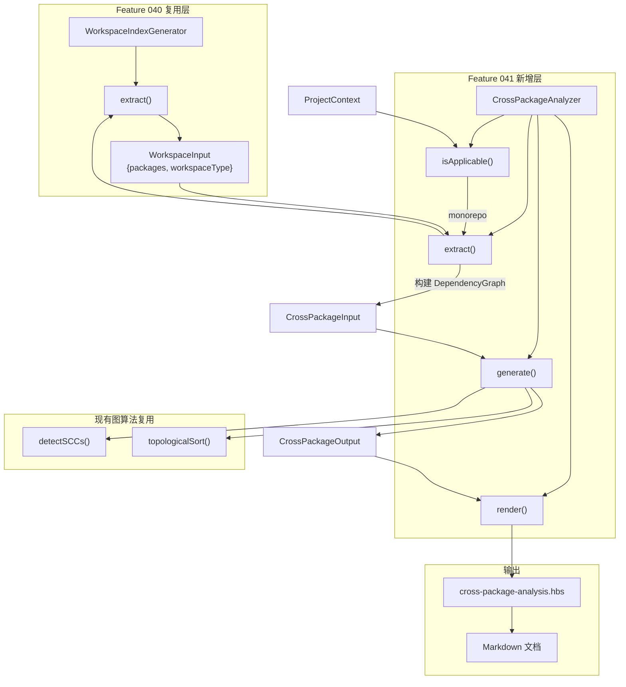
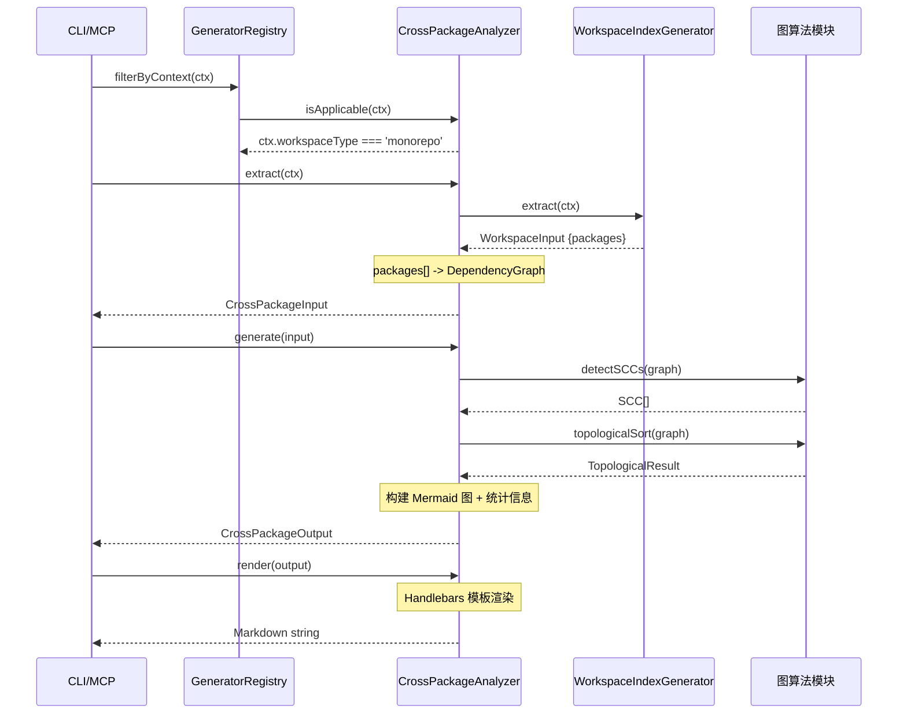

# Implementation Plan: 跨包依赖分析

**Branch**: `041-cross-package-deps` | **Date**: 2026-03-19 | **Spec**: `specs/041-cross-package-deps/spec.md`
**Input**: Feature specification from `specs/041-cross-package-deps/spec.md`

---

## Summary

实现 `CrossPackageAnalyzer`（`DocumentGenerator<CrossPackageInput, CrossPackageOutput>` 接口），为 Monorepo 项目提供跨包依赖分析能力：自动检测子包间的循环依赖（复用 Tarjan SCC）、计算拓扑排序与层级、生成带循环标注的 Mermaid 依赖拓扑图和统计信息。

技术方案以"最大复用、最小新增"为原则：复用 Feature 040 的 `WorkspaceIndexGenerator.extract()` 获取子包列表，复用现有 `detectSCCs()` / `topologicalSort()` 图算法，仅新增包级 `DependencyGraph` 构建、循环标注 Mermaid 生成和 Handlebars 模板渲染三块增量代码。通过 `GeneratorRegistry` 注册后，可被 `reverse-spec batch` 自动发现和调用。

---

## Technical Context

**Language/Version**: TypeScript 5.7.3, Node.js LTS (>=20.x)
**Primary Dependencies**: `handlebars`（模板渲染）、`zod`（类型验证）-- 均为现有依赖，无新增
**Storage**: 文件系统（`specs/` 目录写入 Markdown 文档）
**Testing**: `vitest`（项目现有测试框架），`npm test`
**Target Platform**: Node.js CLI / Claude Code 沙箱
**Performance Goals**: O(V+E) 时间复杂度（Tarjan SCC + Kahn 拓扑排序），50+ 子包无性能瓶颈
**Constraints**: 不引入任何新运行时依赖；所有图算法复用现有实现
**Scale/Scope**: 典型 Monorepo 3-50 子包，极端情况 50+ 子包

---

## Constitution Check

*GATE: Must pass before Phase 0 research. Re-check after Phase 1 design.*

| 原则 | 适用性 | 评估 | 说明 |
|------|--------|------|------|
| **I. 双语文档规范** | 适用 | PASS | 文档中文散文 + 英文代码标识符，Handlebars 模板中文标题 |
| **II. Spec-Driven Development** | 适用 | PASS | 完整制品链：spec.md -> research.md -> data-model.md -> plan.md -> tasks.md |
| **III. 诚实标注不确定性** | 适用 | PASS | 无推断性内容，所有数据来自 AST/文件系统确定性提取 |
| **IV. AST 精确性优先** | 适用 | PASS | 依赖关系从 package.json / pyproject.toml 文件确定性解析，不依赖 LLM 推断 |
| **V. 混合分析流水线** | 部分适用 | PASS | 本 Feature 不涉及 LLM 分析，纯 AST/文件解析流水线 |
| **VI. 只读安全性** | 适用 | PASS | 仅读取源项目文件（package.json/pyproject.toml），写操作限于 specs/ 目录 |
| **VII. 纯 Node.js 生态** | 适用 | PASS | 无新增依赖，复用 handlebars + zod |

**结论**: 全部通过，无 VIOLATION，无豁免项。

---

## Architecture

### 整体架构图



### 核心处理流程



---

## Project Structure

### Documentation (this feature)

```text
specs/041-cross-package-deps/
├── spec.md              # 需求规范
├── plan.md              # 本文件（技术规划）
├── research.md          # 技术决策研究
├── data-model.md        # 数据模型定义
└── research/
    └── tech-research.md # 前期技术调研
```

### Source Code (repository root)

```text
src/
├── panoramic/
│   ├── cross-package-analyzer.ts   # [新增] CrossPackageAnalyzer 实现
│   ├── generator-registry.ts       # [修改] bootstrapGenerators() 注册 CrossPackageAnalyzer
│   ├── index.ts                    # [修改] 导出新增类型和类
│   ├── workspace-index-generator.ts # [复用] extract() 获取子包列表
│   └── interfaces.ts               # [复用] DocumentGenerator 接口
├── graph/
│   └── topological-sort.ts          # [复用] detectSCCs() + topologicalSort()
└── models/
    └── dependency-graph.ts          # [复用] DependencyGraph 类型

templates/
└── cross-package-analysis.hbs       # [新增] Handlebars 模板

tests/
└── panoramic/
    └── cross-package-analyzer.test.ts # [新增] 单元测试
```

**Structure Decision**: 单文件模块结构（Single project），新增 1 个源文件 + 1 个模板 + 1 个测试文件，修改 2 个现有文件（注册和导出）。

---

## Implementation Details

### Phase 1: CrossPackageAnalyzer 类实现

#### 1.1 文件: `src/panoramic/cross-package-analyzer.ts`

**新增类 `CrossPackageAnalyzer`**:

- `readonly id = 'cross-package-deps'`
- `readonly name = '跨包依赖分析器'`
- `readonly description = '分析 Monorepo 子包间的依赖关系，检测循环依赖并生成拓扑图'`

**`isApplicable(context: ProjectContext): boolean`**:
- 返回 `context.workspaceType === 'monorepo'`

**`extract(context: ProjectContext): Promise<CrossPackageInput>`**:
1. 实例化 `WorkspaceIndexGenerator`，调用 `extract(context)` 获取 `WorkspaceInput`
2. 构建 `DependencyGraph`:
   - 收集所有包名到 `Set<string>`
   - 遍历 `packages`，为每个包创建 `GraphNode`
   - 遍历 `packages` 的 `dependencies`，为每条有效依赖创建 `DependencyEdge`
   - 过滤规则：跳过自依赖（`dep === pkg.name`）和不存在的依赖（`!packageNameSet.has(dep)`）
   - 计算每个节点的 `inDegree` 和 `outDegree`
3. 返回 `CrossPackageInput`

**`generate(input: CrossPackageInput, options?: GenerateOptions): Promise<CrossPackageOutput>`**:
1. 调用 `detectSCCs(input.graph)` 获取 SCC 列表
2. 调用 `topologicalSort(input.graph)` 获取拓扑结果
3. 构建 SCC 内部节点/边集合
4. 更新 `DependencyEdge.isCircular` 标记
5. 生成带循环标注的 Mermaid 图（`buildCrossPackageMermaid()`）
6. 计算统计信息（root/leaf 包、总依赖数）
7. 按 level 分组拓扑排序结果
8. 构造 `CycleGroup[]`（循环路径人类可读表示）
9. 返回 `CrossPackageOutput`

**`render(output: CrossPackageOutput): string`**:
1. 加载并编译 `templates/cross-package-analysis.hbs`
2. 调用 Handlebars 模板渲染
3. 返回 Markdown 字符串

#### 1.2 辅助函数: `buildCrossPackageMermaid()`

位于 `cross-package-analyzer.ts` 内部（private 或 module-level）。

逻辑:
1. 生成 `graph TD` 头部
2. 为每个包添加节点，复用 `sanitizeMermaidId()`
3. SCC 内部节点添加 `:::cycle` 样式类
4. 正常依赖边使用 `-->` 实线箭头
5. SCC 内部依赖边使用 `-.->` 虚线箭头 + `|cycle|` 标签
6. 添加 `classDef cycle fill:#ffcccc,stroke:red,stroke-width:2px` 样式定义
7. 添加 `linkStyle` 指令为循环边设置红色

### Phase 2: Handlebars 模板

#### 2.1 文件: `templates/cross-package-analysis.hbs`

模板结构:
```
---
type: cross-package-analysis
generatedBy: cross-package-deps
generatedAt: {{generatedAt}}
---
# 跨包依赖分析: {{projectName}}

> 自动生成于 {{generatedAt}} | workspace 类型: {{workspaceType}}

## 依赖拓扑图

```mermaid
{{{mermaidDiagram}}}
```

## 循环依赖检测

{{#if hasCycles}}
> [!WARNING] 检测到循环依赖

{{#each cycleGroups}}
- **循环 {{@index}}**: {{cyclePath}}
{{/each}}
{{else}}
未检测到循环依赖。
{{/if}}

## 拓扑排序 & 层级

| 层级 | 子包 |
|------|------|
{{#each levels}}
| Level {{level}} | {{#each packages}}{{this}}{{#unless @last}}, {{/unless}}{{/each}} |
{{/each}}

## 统计摘要

| 指标 | 值 |
|------|------|
| 子包总数 | {{stats.totalPackages}} |
| 依赖边总数 | {{stats.totalEdges}} |
| Root 包（无入度） | {{#each stats.rootPackages}}{{this}}{{#unless @last}}, {{/unless}}{{/each}} |
| Leaf 包（无出度） | {{#each stats.leafPackages}}{{this}}{{#unless @last}}, {{/unless}}{{/each}} |
```

### Phase 3: 注册与导出

#### 3.1 修改: `src/panoramic/generator-registry.ts`

- 在 `bootstrapGenerators()` 中添加 `registry.register(new CrossPackageAnalyzer())`
- 新增 import: `import { CrossPackageAnalyzer } from './cross-package-analyzer.js'`

#### 3.2 修改: `src/panoramic/index.ts`

- 导出 `CrossPackageAnalyzer` 类
- 导出 `CrossPackageInput`、`CrossPackageOutput`、`TopologyLevel`、`CycleGroup`、`DependencyStats` 类型

### Phase 4: 测试

#### 4.1 文件: `tests/panoramic/cross-package-analyzer.test.ts`

测试场景:

1. **正常依赖图**: 3 个包 A->B->C（线性依赖），验证拓扑图节点/边正确、统计信息正确、无循环检测
2. **循环依赖图**: 3 个包 A->B->C->A，验证循环路径被正确检测、Mermaid 图中包含红色虚线标注
3. **多组独立循环**: A<->B 和 C<->D，验证两组循环分别列出
4. **无依赖图**: 3 个独立包，验证所有包同时为 root 和 leaf，总依赖数 0
5. **单包图**: 仅 1 个子包，验证正常运行，0 条依赖
6. **自依赖**: 包 A 的 dependencies 包含 A 自身，验证被静默过滤
7. **isApplicable**: monorepo -> true, single -> false
8. **GeneratorRegistry**: bootstrapGenerators() 后可通过 `get('cross-package-deps')` 获取实例

---

## Complexity Tracking

> 本 Feature 无 Constitution 违规项，无需复杂度偏差论证。

| 决策 | 选择的方案 | 更简单的替代方案 | 选择理由 |
|------|-----------|-----------------|----------|
| 复用 040 extract() | 内部实例化 WorkspaceIndexGenerator | 直接复制解析逻辑 | 避免代码重复，保持一致性（research.md Decision 2） |
| 独立 Handlebars 模板 | 新建 cross-package-analysis.hbs | 扩展 workspace-index.hbs | Output 类型不同，关注点分离（research.md Decision 5） |
| Mermaid 循环标注 | 虚线 + classDef 红色样式 | 仅边标签文字标注 | 视觉区分度更高，满足 FR-008（research.md Decision 3） |
