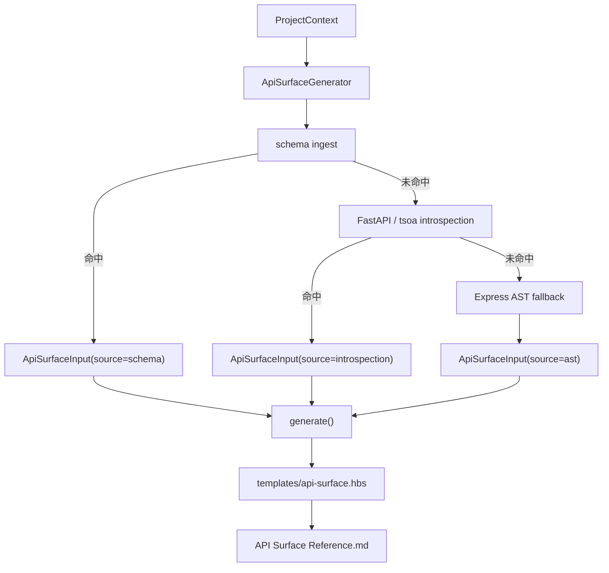

# Implementation Plan: API Surface Reference

**Branch**: `codex/042-api-surface-reference` | **Date**: 2026-03-20 | **Spec**: `specs/042-api-surface-reference/spec.md`
**Input**: Feature specification from `specs/042-api-surface-reference/spec.md`

---

## Summary

实现 `ApiSurfaceGenerator`，沿用 panoramic 现有 `DocumentGenerator` / `GeneratorRegistry` / Handlebars 模板架构，在不执行用户应用的前提下产出 API Surface Reference。抽取链固定为：

1. 读取已有 OpenAPI / Swagger 产物
2. 静态解析 FastAPI / tsoa 原生元数据
3. 对 Express 项目执行 AST fallback

最终输出统一的端点结构和 Markdown 文档，并通过 registry 自动发现。

---

## Technical Context

**Language/Version**: TypeScript 5.7.x, Node.js >= 20
**Primary Dependencies**: `ts-morph`（Express/tsoa 静态 AST）、`handlebars`（模板渲染）
**Storage**: 文件系统静态扫描
**Testing**: `vitest`, `npm run lint`, `npm run build`
**Target Platform**: Node.js CLI / Codex / Claude Code 双端兼容
**Constraints**:
- 不执行用户应用，不启动 FastAPI 服务
- 不引入必须依赖运行时服务的重依赖
- 不扩展到 043/045/046 的共享模型范围

---

## Constitution Check

| 原则 | 适用性 | 评估 | 说明 |
|------|--------|------|------|
| 双语文档规范 | 适用 | PASS | 规格文档中文，代码符号英文 |
| Spec-Driven Development | 适用 | PASS | 先 research/spec/plan/tasks，再实现 |
| 诚实标注不确定性 | 适用 | PASS | AST fallback 的未知响应类型显式标记为 `unknown` |
| AST 精确性优先 | 适用 | PASS | Express/tsoa 走 AST，FastAPI 走静态元数据解析 |
| 混合分析流水线 | 适用 | PASS | 042 的三层抽取链本身就是分层静态流水线 |
| 只读安全性 | 适用 | PASS | 仅读取项目文件，写入限定在 `specs/042-*` 和本 Feature 代码/测试文件 |
| 纯 Node.js 生态 | 适用 | PASS | 复用现有依赖，不引入服务型依赖 |

---

## Architecture

### 抽取链路



### 代码组织

```text
src/panoramic/
├── api-surface-generator.ts     # [新增] 042 主实现
├── generator-registry.ts        # [修改] 注册 ApiSurfaceGenerator
├── index.ts                     # [修改] 导出类型和类
├── interfaces.ts                # [复用] DocumentGenerator 契约
└── utils/template-loader.ts     # [复用] 模板加载

templates/
└── api-surface.hbs              # [新增] Markdown 模板

tests/panoramic/
└── api-surface-generator.test.ts # [新增] schema/introspection/ast/registry 测试

specs/042-api-surface-reference/
├── research.md
├── spec.md
├── plan.md
└── tasks.md
```

---

## Implementation Details

### Phase 1: 数据模型与来源选择

在 `src/panoramic/api-surface-generator.ts` 中定义以下结构：

- `ApiSource = 'schema' | 'introspection' | 'ast'`
- `ApiParameter`
- `ApiResponse`
- `ApiEndpoint`
- `ApiSurfaceInput`
- `ApiSurfaceOutput`

`extract()` 负责：

1. 识别项目名
2. 依次执行 `extractFromSchema()`、`extractFromFrameworkIntrospection()`、`extractFromExpressAst()`
3. 返回第一个非空端点集

### Phase 2: Schema ingest

实现 OpenAPI / Swagger schema 读取：

- 发现常见 schema 文件（`openapi.*` / `swagger.*`）
- 解析 `paths`
- 合并 path-level 和 operation-level parameters
- 提取 request body 为 body 参数
- 从 responses 中提取主响应类型
- 从 `security` / `tags` 中提取认证和标签

### Phase 3: FastAPI / tsoa introspection

FastAPI：

- 识别 `FastAPI(...)`、`APIRouter(...)`
- 提取 `prefix`、`tags`、`dependencies`
- 识别 `@app.get()` / `@router.post()` 装饰器
- 合并 `include_router()` 的 prefix、标签和认证提示

tsoa：

- 识别 `@Route()` class decorator
- 识别 `@Get/@Post/...` method decorators
- 从参数装饰器提取 `Path/Query/Body/Header`
- 从 `@Security()` / `@Tags()` 提取认证与标签

### Phase 4: Express AST fallback

基于 `ts-morph`：

- 建立 router/app 定义索引
- 识别直接路由：`router.get('/x')`
- 识别链式路由：`router.route('/x').get().patch()`
- 识别挂载：`app.use('/api', usersRouter)`、`router.use('/admin', childRouter)`
- 解析跨文件 import 的 router 引用
- 生成完整挂载后的路径
- 至少稳定输出方法、路径、path params；其他字段按静态可得信息补齐

### Phase 5: 输出与接入

- `generate()` 排序端点并生成统计摘要
- `render()` 使用 `templates/api-surface.hbs`
- 修改 `generator-registry.ts` 注册 `api-surface`
- 修改 `index.ts` 导出新增类与类型
- bump `plugins/reverse-spec/.claude-plugin/plugin.json` minor 版本

---

## Testing Strategy

### 单元 / 集成覆盖

1. **schema ingest**:
   - `openapi.json` 解析
   - 验证优先级高于 introspection / AST
2. **FastAPI introspection**:
   - `APIRouter + include_router()` 合并路径和标签
3. **Express AST fallback**:
   - 10+ routes
   - 多文件挂载
   - `router.route()` 链式调用
4. **registry/render**:
   - `bootstrapGenerators()` 可发现 `api-surface`
   - Markdown 模板渲染成功

### 验证命令

- `vitest run tests/panoramic/api-surface-generator.test.ts`
- `npm run lint`
- `npm run build`

---

## Risks

- OpenAPI 文档格式差异较大，若项目仅提供极度动态或非标准 schema，可能需要后续补强解析兼容性。
- FastAPI 静态解析不执行应用，因此无法覆盖运行时动态注册路由。
- Express fallback 只保证静态可见路由；对运行时拼接路径或动态 require 的场景会保守跳过。
