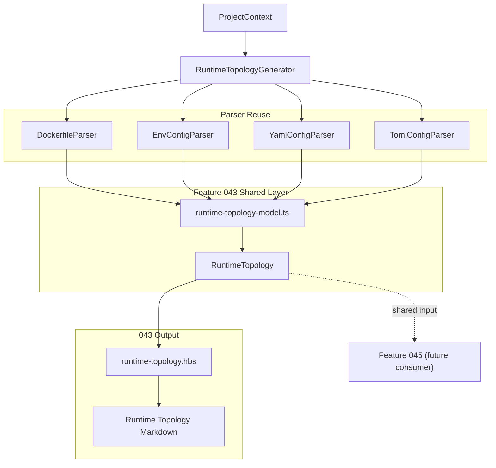

# Implementation Plan: 运行时拓扑与运维抽取

**Branch**: `feature/043-runtime-topology-ops` | **Date**: 2026-03-20 | **Spec**: `specs/043-runtime-topology-ops/spec.md`
**Input**: Feature specification from `specs/043-runtime-topology-ops/spec.md`

---

## Summary

实现 `RuntimeTopologyGenerator`，从 Compose、Dockerfile、`.env` 与运行时配置提示中抽取统一的 `RuntimeTopology` 共享模型，并渲染为 043 专属运行时拓扑文档。实现范围严格限定在 043：交付共享中间模型、文档生成器、模板、注册与测试，但不提前实现 045 的综合架构视图。

技术策略遵循“最大复用、最小新增”：

- 复用 `DockerfileParser` 获取 stage / instruction 基础信息
- 复用 `EnvConfigParser`、`YamlConfigParser`、`TomlConfigParser` 获取环境变量和配置提示
- 在 `src/panoramic/runtime-topology-model.ts` 中集中维护 043/045 共享模型与归一化 helper
- 在 `RuntimeTopologyGenerator` 中完成 Compose 语义抽取、来源归并和文档渲染

---

## Technical Context

**Language/Version**: TypeScript 5.7.3, Node.js >= 20  
**Primary Dependencies**: `handlebars`, `zod`（均为现有依赖）  
**Storage**: 文件系统（`specs/` 文档、模板、测试 fixture）  
**Testing**: `vitest`, `npm run lint`, `npm run build`  
**Target Platform**: Node.js CLI / MCP panoramic pipeline  
**Constraints**:

- 不新增 parser registry 基础设施
- 不新增 045 的视图渲染
- 与蓝图保持一致：043/045 共享同一份 runtime model
- 只在流程允许范围内写入 `specs/043-runtime-topology-ops/`、`src/panoramic/`、`templates/`、`tests/`

---

## Constitution Check

*GATE: Must pass before implementation. Re-check before commit.*

| 原则 | 适用性 | 评估 | 说明 |
|------|--------|------|------|
| **I. 双语文档规范** | 适用 | PASS | 文档中文说明 + 英文代码标识符 |
| **II. Spec-Driven Development** | 适用 | PASS | 先补 spec/research/plan/tasks，再实现与验证 |
| **III. 诚实标注不确定性** | 适用 | PASS | Compose 复杂 YAML 特性按受限子集处理并在 spec 中标注 |
| **IV. AST / 静态提取优先** | 适用 | PASS | 仅依赖 Dockerfile / Compose / env / config 静态文件，不引入 LLM |
| **V. 混合分析流水线** | 部分适用 | PASS | 本 Feature 完全是静态运行时拓扑抽取，无 LLM |
| **VI. 只读安全性** | 适用 | PASS | 只读取项目文件，写入限定在 Feature 043 产物与源代码路径 |
| **VII. 纯 Node.js 生态** | 适用 | PASS | 无新增运行时依赖 |

**结论**: 当前方案通过，无需豁免。

---

## Architecture

### High-Level Flow



### Processing Steps

1. `isApplicable()`:
   - 检查根目录 compose / Dockerfile / `.env` / 运行时配置文件
2. `extract()`:
   - 发现 compose 文件
   - 解析 Compose 服务结构
   - 根据 `build.context` / `build.dockerfile` 补充 Dockerfile
   - 根据 `env_file` / `.env*` 补充环境变量文件
   - 收集 YAML/TOML 运行时配置提示
3. `generate()`:
   - 将所有来源归一化为共享 `RuntimeTopology`
   - 计算统计字段（服务数、镜像数、容器数、stages 数等）
4. `render()`:
   - 使用 `templates/runtime-topology.hbs` 渲染 043 文档

---

## Project Structure

### Documentation

```text
specs/043-runtime-topology-ops/
├── spec.md
├── research.md
├── plan.md
└── tasks.md
```

### Source Code

```text
src/panoramic/
├── runtime-topology-generator.ts   # [新增] 043 生成器
├── runtime-topology-model.ts       # [新增] 043/045 共享运行时模型与 helper
├── generator-registry.ts           # [修改] 注册 runtime-topology
├── index.ts                        # [修改] 导出 generator + shared model
└── parsers/
    └── yaml-config-parser.ts       # [可选修改] 复用/补充 YAML 辅助解析

templates/
└── runtime-topology.hbs            # [新增] 043 文档模板

tests/panoramic/
└── runtime-topology-generator.test.ts  # [新增] 单元/集成测试
```

---

## Implementation Details

### Phase 1: Shared Runtime Model

**文件**: `src/panoramic/runtime-topology-model.ts`

新增共享实体：

- `RuntimeTopology`
- `RuntimeService`
- `RuntimeImage`
- `RuntimeContainer`
- `RuntimeBuildStage`
- `RuntimeEnvironmentVariable`
- `RuntimePortBinding`
- `RuntimeVolumeMount`
- `RuntimeDependency`
- `RuntimeConfigHint`

新增 helper：

- Dockerfile stage -> runtime stage 归一化
- 环境变量来源合并
- Compose `ports` / `volumes` / `depends_on` / `command` 统一归一化

**Design Rule**: 共享模型不包含 Markdown、模板字段、标题等渲染细节。

### Phase 2: RuntimeTopologyGenerator

**文件**: `src/panoramic/runtime-topology-generator.ts`

实现：

- `id = 'runtime-topology'`
- `isApplicable(context)`
- `extract(context)`
- `generate(input)`
- `render(output)`

`extract()` 关键点：

- 根目录发现 compose 文件：`docker-compose.yml` / `docker-compose.yaml` / `compose.yml` / `compose.yaml`
- 解析 compose 服务定义
- 解析被引用 Dockerfile（根 Dockerfile + `build.dockerfile`）
- 解析 `.env` 与 `env_file`
- 扫描 YAML/TOML 配置提示

`generate()` 关键点：

- 构造共享 `RuntimeTopology`
- 归并服务 -> 镜像 -> 容器 -> stage 关系
- 按 Compose 规则合并环境变量
- 统计摘要供模板渲染

### Phase 3: Template / Registry / Export

**文件**:

- `templates/runtime-topology.hbs`
- `src/panoramic/generator-registry.ts`
- `src/panoramic/index.ts`

模板聚焦：

- 元信息 frontmatter
- 运行时摘要
- 服务表
- 镜像 / stages 表
- 容器与卷/端口/依赖摘要
- 运行时配置提示

不包含：

- 系统上下文视图
- 跨 Generator 复合架构图
- 045 的组合式渲染

### Phase 4: Tests

**文件**: `tests/panoramic/runtime-topology-generator.test.ts`

至少覆盖：

- Compose + Dockerfile + `.env` 联合解析
- Multi-stage Dockerfile
- `bootstrapGenerators()` 注册发现
- `filterByContext()` 适用性
- 缺失引用文件时的降级

---

## Verification Strategy

1. 运行定向测试：
   - `vitest run tests/panoramic/runtime-topology-generator.test.ts`
2. 回归相关 panoramic 测试：
   - `vitest run tests/panoramic/dockerfile-parser.test.ts tests/panoramic/env-config-parser.test.ts tests/panoramic/yaml-config-parser.test.ts tests/panoramic/generator-registry.test.ts`
3. 类型与构建：
   - `npm run lint`
   - `npm run build`
4. 提交前同步主线：
   - `git fetch origin && git rebase origin/master`

---

## Risks & Mitigations

- **风险**: Compose YAML 语法覆盖不全  
  **缓解**: 当前仅支持 043 所需常见子集（map/list/short syntax/long syntax），并在缺失时降级为空结构而非抛错。

- **风险**: 共享模型和文档输出耦合过紧，影响 045 复用  
  **缓解**: 单独抽出 `runtime-topology-model.ts`，输出中显式区分 `topology` 与文档元信息。

- **风险**: 只依赖根目录 `ProjectContext.configFiles` 无法发现服务目录 Dockerfile  
  **缓解**: `extract()` 按 Compose `build.context` / `build.dockerfile` 二次发现实际 Dockerfile。
