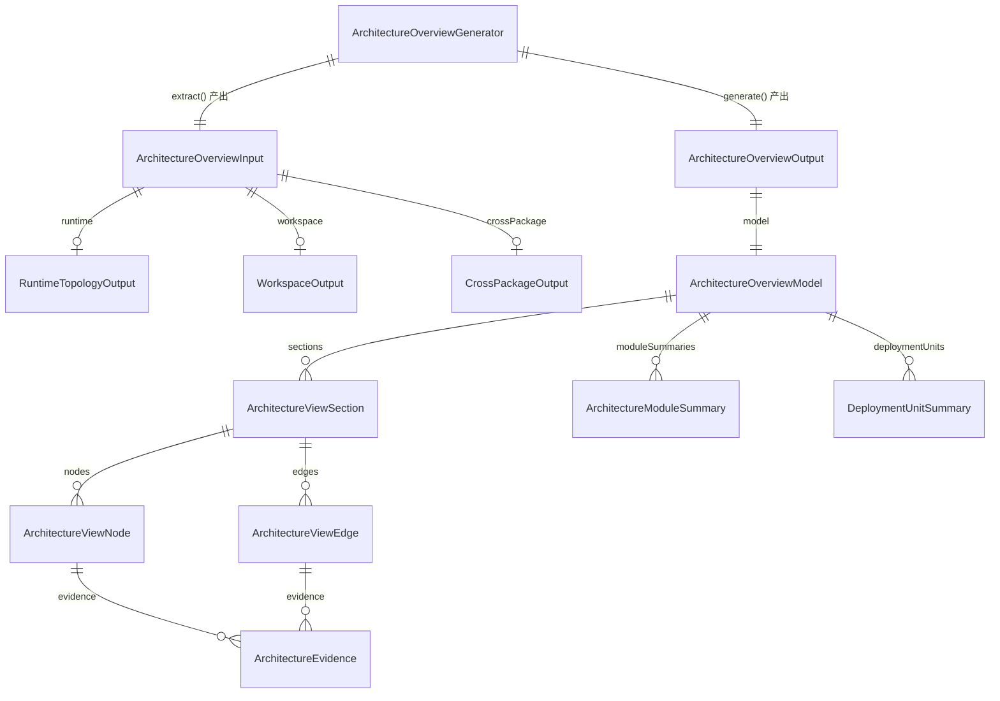

# Data Model: 架构概览与系统上下文视图

## 1. 实体关系总览



## 2. 核心类型

### 2.1 ArchitectureOverviewInput

```ts
interface ArchitectureOverviewInput {
  projectName: string;
  runtime?: RuntimeTopologyOutput;
  workspace?: WorkspaceOutput;
  crossPackage?: CrossPackageOutput;
  warnings: string[];
}
```

| 字段 | 类型 | 说明 |
|------|------|------|
| `projectName` | `string` | 项目名 |
| `runtime` | `RuntimeTopologyOutput \| undefined` | 来自 043 的结构化运行时拓扑输出 |
| `workspace` | `WorkspaceOutput \| undefined` | 来自 040 的 workspace 索引输出 |
| `crossPackage` | `CrossPackageOutput \| undefined` | 来自 041 的跨包依赖输出 |
| `warnings` | `string[]` | extract 阶段收集的降级或缺失提示 |

### 2.2 ArchitectureOverviewModel

```ts
interface ArchitectureOverviewModel {
  projectName: string;
  sections: ArchitectureViewSection[];
  moduleSummaries: ArchitectureModuleSummary[];
  deploymentUnits: DeploymentUnitSummary[];
  warnings: string[];
  stats: ArchitectureOverviewStats;
}
```

### 2.3 ArchitectureViewSection

```ts
interface ArchitectureViewSection {
  kind: 'system-context' | 'deployment' | 'layered';
  title: string;
  available: boolean;
  description?: string;
  nodes: ArchitectureViewNode[];
  edges: ArchitectureViewEdge[];
  mermaidDiagram?: string;
  missingReason?: string;
}
```

### 2.4 ArchitectureViewNode

```ts
interface ArchitectureViewNode {
  id: string;
  label: string;
  kind: 'project' | 'service' | 'container' | 'image' | 'module-group' | 'package' | 'external';
  description?: string;
  evidence: ArchitectureEvidence[];
}
```

### 2.5 ArchitectureViewEdge

```ts
interface ArchitectureViewEdge {
  from: string;
  to: string;
  relation: 'depends-on' | 'contains' | 'deploys' | 'calls' | 'groups';
  evidence: ArchitectureEvidence[];
}
```

### 2.6 ArchitectureEvidence

```ts
interface ArchitectureEvidence {
  source: 'runtime-topology' | 'workspace-index' | 'cross-package';
  ref: string;
  note?: string;
}
```

### 2.7 ArchitectureModuleSummary

```ts
interface ArchitectureModuleSummary {
  groupName: string;
  packageName: string;
  path: string;
  language: string;
  responsibility: string;
  dependencies: string[];
}
```

### 2.8 DeploymentUnitSummary

```ts
interface DeploymentUnitSummary {
  serviceName: string;
  containerName?: string;
  imageName?: string;
  targetStage?: string;
  dependsOn: string[];
  ports: string[];
}
```

### 2.9 ArchitectureOverviewOutput

```ts
interface ArchitectureOverviewOutput {
  title: string;
  generatedAt: string;
  model: ArchitectureOverviewModel;
  warnings: string[];
}
```

## 3. 复用的现有类型

- `RuntimeTopologyOutput` from `src/panoramic/runtime-topology-generator.ts`
- `RuntimeTopology` from `src/panoramic/runtime-topology-model.ts`
- `WorkspaceOutput` from `src/panoramic/workspace-index-generator.ts`
- `CrossPackageOutput` from `src/panoramic/cross-package-analyzer.ts`

## 4. 设计边界

- `ArchitectureOverviewModel` 是 045/050 共享边界
- `ArchitectureOverviewOutput` 是 045 渲染层边界
- Markdown / Handlebars / Mermaid fenced block 仅存在于 template / render 层
