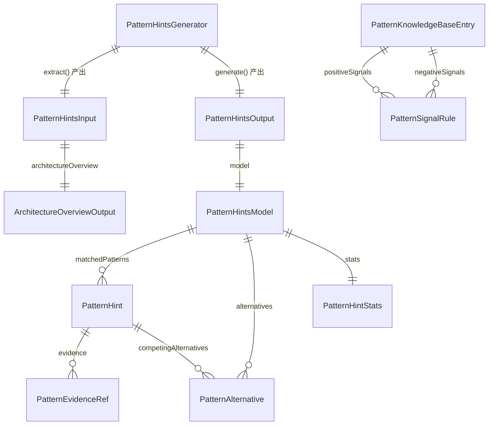

# Data Model: 架构模式提示与解释

## 1. 实体关系总览



## 2. 核心类型

### 2.1 PatternHintsInput

```ts
interface PatternHintsInput {
  architectureOverview: ArchitectureOverviewOutput;
  warnings: string[];
  weakSignals?: {
    runtimeAvailable: boolean;
    docGraphAvailable: boolean;
  };
}
```

| 字段 | 类型 | 说明 |
|------|------|------|
| `architectureOverview` | `ArchitectureOverviewOutput` | 来自 045 的主输入边界 |
| `warnings` | `string[]` | extract 阶段收集的降级 / 缺失提示 |
| `weakSignals` | `{ runtimeAvailable: boolean; docGraphAvailable: boolean } \| undefined` | 可选的弱依赖可用性元信息 |

### 2.2 PatternHintsModel

```ts
interface PatternHintsModel {
  projectName: string;
  matchedPatterns: PatternHint[];
  noHighConfidenceMatch: boolean;
  alternatives: PatternAlternative[];
  warnings: string[];
  stats: PatternHintStats;
}
```

### 2.3 PatternHint

```ts
interface PatternHint {
  patternId: string;
  patternName: string;
  summary: string;
  confidence: number;
  matchLevel: 'high' | 'medium' | 'low';
  explanation: string;
  evidence: PatternEvidenceRef[];
  matchedSignals: string[];
  missingSignals: string[];
  competingAlternatives: PatternAlternative[];
  inferred: boolean;
}
```

### 2.4 PatternAlternative

```ts
interface PatternAlternative {
  patternId: string;
  patternName: string;
  reason: string;
  confidenceGap?: number;
}
```

### 2.5 PatternEvidenceRef

```ts
interface PatternEvidenceRef {
  source: 'architecture-overview' | 'runtime-topology' | 'cross-package' | 'doc-graph';
  sectionKind?: 'system-context' | 'deployment' | 'layered';
  nodeId?: string;
  edgeRef?: string;
  ref: string;
  note?: string;
  inferred?: boolean;
}
```

### 2.6 PatternKnowledgeBaseEntry

```ts
interface PatternKnowledgeBaseEntry {
  id: string;
  name: string;
  summary: string;
  positiveSignals: PatternSignalRule[];
  negativeSignals: PatternSignalRule[];
  competingPatternIds: string[];
  explanationSeed: string;
}
```

### 2.7 PatternSignalRule

```ts
interface PatternSignalRule {
  id: string;
  description: string;
  sectionKind?: 'system-context' | 'deployment' | 'layered';
  weight: number;
}
```

### 2.8 PatternHintStats

```ts
interface PatternHintStats {
  totalPatternsEvaluated: number;
  matchedPatterns: number;
  highConfidencePatterns: number;
  warningCount: number;
}
```

### 2.9 PatternHintsOutput

```ts
interface PatternHintsOutput {
  title: string;
  generatedAt: string;
  architectureOverview: ArchitectureOverviewOutput;
  model: PatternHintsModel;
  warnings: string[];
}
```

## 3. 复用的现有类型

- `ArchitectureOverviewOutput` from `src/panoramic/architecture-overview-generator.ts`
- `ArchitectureOverviewModel` from `src/panoramic/architecture-overview-model.ts`
- `ArchitectureViewSection` / `ArchitectureViewNode` / `ArchitectureViewEdge` from `src/panoramic/architecture-overview-model.ts`

## 4. 设计边界

- `PatternHintsModel` 是 050 的共享结构化结果边界
- `PatternHintsOutput` 同时保留 `architectureOverview` 和 `model`，以便 render 阶段拼接正文与附录
- Markdown / Handlebars / appendix 标题仅存在于 `render()` / `templates/pattern-hints.hbs`
- 结构化 facts、confidence 和 evidence 必须可在无 LLM 条件下独立生成
