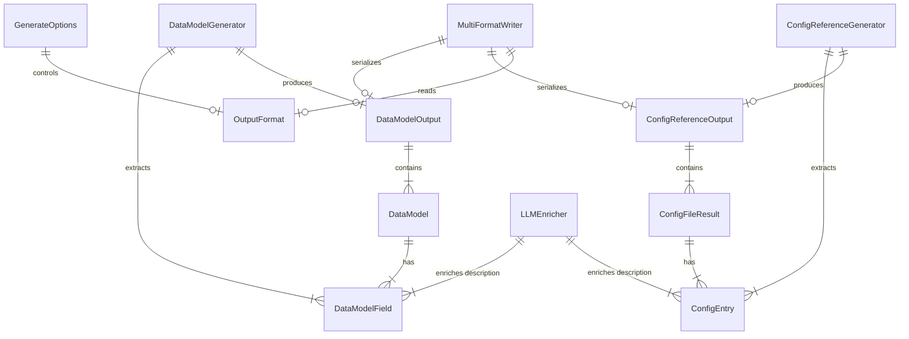

# Feature 051 数据模型

**Feature**: 语义增强 + 多格式输出
**Date**: 2026-03-19

---

## 实体概览

本 Feature 不引入全新的数据模型实体，而是**扩展现有实体**并新增**工具函数的输入/输出类型**。

---

## 1. OutputFormat（扩展）

**来源**: `src/panoramic/interfaces.ts`
**变更**: 从 `'markdown'` 扩展为 `'markdown' | 'json' | 'all'`

| 枚举值 | 说明 | 输出文件 |
|--------|------|----------|
| `'markdown'` | 默认值，仅 Markdown 输出 | `{name}.md` |
| `'json'` | 仅 JSON 结构化数据输出 | `{name}.json` |
| `'all'` | 全格式输出 | `{name}.md` + `{name}.json` + `{name}.mmd`（如适用） |

**Zod Schema 变更**:

```typescript
// Before
export const OutputFormatSchema = z.enum(['markdown']);

// After
export const OutputFormatSchema = z.enum(['markdown', 'json', 'all']);
```

---

## 2. GenerateOptions（不变，仅行为扩展）

**来源**: `src/panoramic/interfaces.ts`

| 属性 | 类型 | 默认值 | 说明 |
|------|------|--------|------|
| `useLLM` | `boolean` | `false` | 是否启用 LLM 语义增强 |
| `templateOverride` | `string?` | `undefined` | 自定义模板路径 |
| `outputFormat` | `OutputFormat` | `'markdown'` | 输出格式 |

Schema 定义不变，但 `useLLM=true` 在本 Feature 中获得实际实现（此前已定义但未被任何 Generator 使用）。

---

## 3. DataModelField（现有，语义增强目标）

**来源**: `src/panoramic/data-model-generator.ts`

| 属性 | 类型 | 语义增强影响 |
|------|------|-------------|
| `name` | `string` | 不变 |
| `typeStr` | `string` | 不变 |
| `optional` | `boolean` | 不变 |
| `defaultValue` | `string \| null` | 不变 |
| `description` | `string \| null` | **LLM 增强目标**：null → `[AI] ...` |

当 `useLLM=true` 且 `description === null` 时，enricher 函数为该字段调用 LLM 推断说明，填充为 `[AI] {推断说明}` 格式。

---

## 4. ConfigEntry（现有，语义增强目标）

**来源**: `src/panoramic/parsers/types.ts`

| 属性 | 类型 | 语义增强影响 |
|------|------|-------------|
| `keyPath` | `string` | 不变 |
| `type` | `ConfigValueType` | 不变 |
| `defaultValue` | `string` | 不变 |
| `description` | `string` | **LLM 增强目标**：`''` → `[AI] ...` |

当 `useLLM=true` 且 `description === ''`（空字符串）时，enricher 函数为该配置项调用 LLM 推断说明。

---

## 5. EnrichFieldResult（新增，内部类型）

**来源**: `src/panoramic/utils/llm-enricher.ts`（新文件）

enricher 函数 LLM 调用返回的 JSON 数组元素类型。

| 属性 | 类型 | 说明 |
|------|------|------|
| `name` | `string` | 字段/配置项名称（用于匹配回原数据） |
| `description` | `string` | LLM 推断的说明文本（不含 `[AI]` 前缀，由 enricher 统一添加） |

**Zod Schema**:

```typescript
const EnrichFieldResultSchema = z.object({
  name: z.string(),
  description: z.string(),
});
const EnrichBatchResultSchema = z.array(EnrichFieldResultSchema);
```

---

## 6. WriteMultiFormatOptions（新增，工具函数参数类型）

**来源**: `src/panoramic/utils/multi-format-writer.ts`（新文件）

| 属性 | 类型 | 说明 |
|------|------|------|
| `outputDir` | `string` | 输出目录绝对路径 |
| `baseName` | `string` | 基础文件名（如 `data-model`、`config-reference`） |
| `outputFormat` | `OutputFormat` | 输出格式控制 |
| `markdown` | `string` | render() 返回的 Markdown 字符串 |
| `structuredData` | `unknown` | generate() 返回的 TOutput 结构化数据 |
| `mermaidSource?` | `string` | 可选的 Mermaid 图源码（从 TOutput 提取） |

---

## 7. DataModelOutput（现有，多格式输出数据源）

**来源**: `src/panoramic/data-model-generator.ts`

| 属性 | 类型 | 多格式输出关系 |
|------|------|---------------|
| `models` | `DataModel[]` | JSON 输出核心 |
| `relations` | `ModelRelation[]` | JSON 输出核心 |
| `erDiagram` | `string` | `.mmd` 文件来源 |
| `summary` | `Summary` | JSON 输出核心 |

---

## 8. ConfigReferenceOutput（现有，多格式输出数据源）

**来源**: `src/panoramic/config-reference-generator.ts`

| 属性 | 类型 | 多格式输出关系 |
|------|------|---------------|
| `title` | `string` | JSON 输出核心 |
| `projectName` | `string` | JSON 输出核心 |
| `generatedAt` | `string` | JSON 输出核心 |
| `files` | `ConfigFileResult[]` | JSON 输出核心 |
| `totalEntries` | `number` | JSON 输出核心 |

注意：ConfigReferenceOutput 不包含 Mermaid 图字段，因此 `outputFormat='all'` 时不输出 `.mmd` 文件。

---

## 实体关系图


