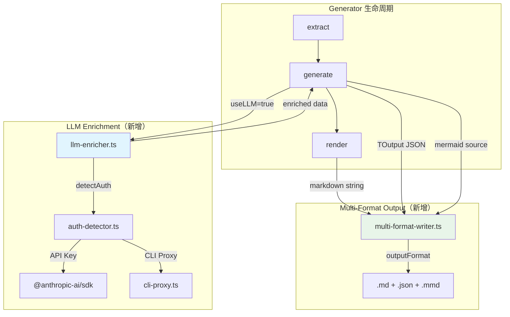
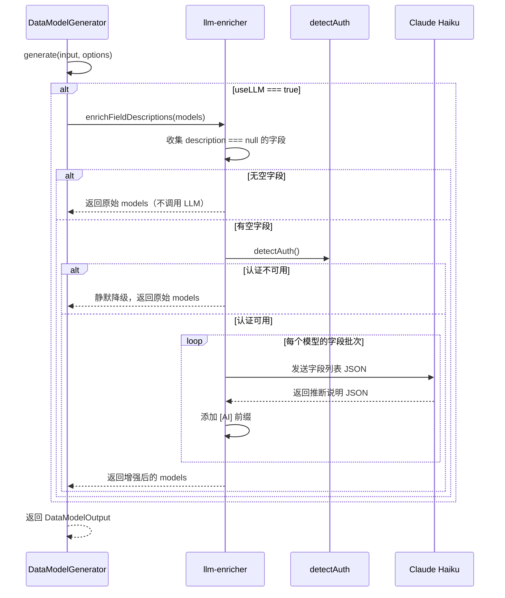
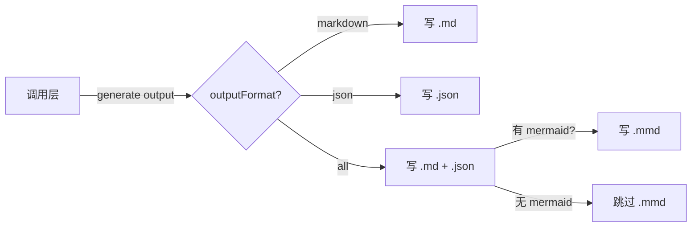

# Implementation Plan: 语义增强 + 多格式输出

**Branch**: `051-semantic-enrichment-multiformat` | **Date**: 2026-03-19 | **Spec**: `specs/051-semantic-enrichment-multiformat/spec.md`
**Input**: Feature specification from `specs/051-semantic-enrichment-multiformat/spec.md`

## Summary

为 Phase 1 全景文档化 Generator 增加两项核心能力：(1) LLM 语义增强——当 `useLLM=true` 时，自动为空 description 的数据模型字段和配置项批量调用 LLM 推断说明并以 `[AI]` 前缀标注；(2) 多格式输出——扩展 `OutputFormat` 支持 `'json'` 和 `'all'`，在调用层输出 `.md` + `.json` + `.mmd` 多种格式文件。实现策略为新增两个工具函数模块（`llm-enricher.ts`、`multi-format-writer.ts`），在 Generator 的 `generate()` 内部调用 enricher，在调用层调用 writer，**不修改 DocumentGenerator 接口签名**。

## Technical Context

**Language/Version**: TypeScript 5.7.3, Node.js LTS (>=20.x)
**Primary Dependencies**: `@anthropic-ai/sdk`（LLM 调用，现有）、`zod`（Schema 验证，现有）——无新增运行时依赖
**Storage**: 文件系统（输出 `.md`、`.json`、`.mmd` 文件到项目目录）
**Testing**: vitest（单元测试 + 集成测试）
**Target Platform**: Node.js CLI / Claude Code MCP
**Performance Goals**: 单个 Generator 的 LLM enrichment 在 30s 内完成（25 个模型 * Haiku 调用）
**Constraints**: LLM 不可用时必须静默降级；默认配置下零回归
**Scale/Scope**: 面向中型项目（25-50 个数据模型、50-100 个配置项）

## Constitution Check

*GATE: Must pass before Phase 0 research. Re-check after Phase 1 design.*

| 原则 | 适用性 | 评估 | 说明 |
|------|--------|------|------|
| **I. 双语文档规范** | 适用 | PASS | 所有生成的 `[AI]` 说明使用中文；JSON 输出中保留中文 description；代码标识符保持英文 |
| **II. Spec-Driven Development** | 适用 | PASS | 本 Feature 遵循完整的 spec -> plan -> tasks 流程 |
| **III. 诚实标注不确定性** | 高度适用 | PASS | LLM 推断的所有 description 以 `[AI]` 前缀标注，与人工注释明确区分（FR-003）。这是本 Feature 的核心设计之一 |
| **IV. AST 精确性优先** | 高度适用 | PASS | LLM 仅填充自然语言 description，不产生或修改任何结构化数据（字段名、类型、签名）。所有结构化信息仍来自 AST |
| **V. 混合分析流水线** | 适用 | PASS | LLM enrichment 遵循"AST 提取在先、LLM 增强在后"的顺序——先 extract() 获取 AST 数据，再在 generate() 中调用 LLM 补充 description |
| **VI. 只读安全性** | 适用 | PASS | 多格式输出写入项目的文档输出目录（非源代码目录），不修改目标源码 |
| **VII. 纯 Node.js 生态** | 适用 | PASS | 无新增运行时依赖。LLM 调用使用现有的 `@anthropic-ai/sdk`，认证复用 `detectAuth()` |
| **XII. 向后兼容** | 高度适用 | PASS | `useLLM` 默认 false，`outputFormat` 默认 `'markdown'`——未配置时行为完全不变（FR-014、FR-015） |

**Constitution Check 结果**: 全部 PASS，无 VIOLATION。

---

## Project Structure

### Documentation (this feature)

```text
specs/051-semantic-enrichment-multiformat/
├── spec.md              # 需求规范
├── plan.md              # 本文件
├── research.md          # 技术决策研究
├── data-model.md        # 数据模型文档
├── research/
│   └── tech-research.md # 前序技术调研
└── tasks.md             # 任务分解（后续生成）
```

### Source Code (repository root)

```text
src/panoramic/
├── interfaces.ts                    # [修改] OutputFormatSchema 扩展
├── data-model-generator.ts          # [修改] generate() 集成 LLM enrichment
├── config-reference-generator.ts    # [修改] generate() 集成 LLM enrichment
└── utils/
    ├── llm-enricher.ts              # [新增] LLM 语义增强工具函数
    ├── multi-format-writer.ts       # [新增] 多格式输出工具函数
    ├── template-loader.ts           # [不变]
    └── mermaid-helpers.ts           # [不变]

tests/panoramic/
├── utils/
│   ├── llm-enricher.test.ts         # [新增] enricher 单元测试
│   └── multi-format-writer.test.ts  # [新增] writer 单元测试
├── data-model-generator.test.ts     # [修改] 新增 useLLM 集成测试
└── config-reference-generator.test.ts # [修改] 新增 useLLM 集成测试
```

**Structure Decision**: 遵循现有 `src/panoramic/utils/` 工具函数模式，新增两个独立工具模块。修改范围限制在 panoramic 子系统内，不影响 `src/core/` 和其他子系统。

---

## Architecture

### 架构总览



### LLM Enrichment 详细流程



### 多格式输出流程



---

## 详细设计

### 1. OutputFormat 扩展（interfaces.ts）

**修改范围**: 1 行

```typescript
// Before
export const OutputFormatSchema = z.enum(['markdown']);

// After
export const OutputFormatSchema = z.enum(['markdown', 'json', 'all']);
```

影响分析：
- `GenerateOptions` 类型自动扩展，无需额外修改
- 所有 `GenerateOptionsSchema.parse()` 调用自动支持新值
- 默认值 `'markdown'` 保持不变，零回归

---

### 2. LLM Enricher（src/panoramic/utils/llm-enricher.ts）

新文件，导出两个公共函数 + 内部 LLM 调用辅助函数。

#### 2.1 enrichFieldDescriptions

```typescript
/**
 * 批量为空 description 的数据模型字段调用 LLM 推断说明
 *
 * @param models - DataModel 数组（含待增强的字段）
 * @returns 增强后的 DataModel 数组（深拷贝，不修改原数组）
 */
export async function enrichFieldDescriptions(
  models: DataModel[],
): Promise<DataModel[]>
```

处理逻辑：
1. 深拷贝 models 数组（不修改原数据）
2. 遍历每个 model，收集 `field.description === null` 且不以 `[AI]` 开头的字段
3. 若无空字段，直接返回
4. 调用 `detectAuth()` 检查 LLM 可用性。不可用则静默返回原数据
5. 按模型分组，每个模型发一次 LLM 调用
6. 构造 prompt：system = "你是 Python/TypeScript 代码分析专家..."，user = JSON 数组（字段名、类型、所属模型、源文件路径）
7. 解析 LLM JSON 响应，匹配回字段，添加 `[AI] ` 前缀
8. 单个模型调用失败时 catch 并跳过，不中断其他模型

#### 2.2 enrichConfigDescriptions

```typescript
/**
 * 批量为空 description 的配置项调用 LLM 推断说明
 *
 * @param files - ConfigFileResult 数组
 * @returns 增强后的 ConfigFileResult 数组（深拷贝）
 */
export async function enrichConfigDescriptions(
  files: ConfigFileResult[],
): Promise<ConfigFileResult[]>
```

处理逻辑与 `enrichFieldDescriptions` 类似，按配置文件分组，每个文件一次 LLM 调用。

#### 2.3 内部函数 callLLMSimple

```typescript
/**
 * 轻量级 LLM 调用（不依赖 AssembledContext）
 * 内部使用，不导出
 */
async function callLLMSimple(
  systemPrompt: string,
  userPrompt: string,
): Promise<string>
```

- 使用 `detectAuth()` 获取认证方式
- API Key 可用时直接使用 Anthropic SDK
- CLI 代理可用时调用 `callLLMviaCli`
- 默认模型：`claude-3-5-haiku-20241022`（可通过 `PANORAMIC_LLM_MODEL` 环境变量覆盖）
- 超时：60 秒（Haiku 足够快）
- 不含重试逻辑（enrichment 是可选增强，单次失败直接降级）

#### 2.4 LLM Prompt 设计

**System Prompt**（字段增强）：

```
你是一个代码分析专家。根据提供的数据模型字段信息（字段名、类型、所属模型名、源文件路径），
为每个字段推断一条简洁的中文说明（10-30 字）。

要求：
1. 说明应描述字段的业务含义，而非重复类型信息
2. 基于字段名称和上下文推断语义
3. 不确定时使用保守的描述

输出 JSON 数组，每个元素包含 name 和 description 字段。
```

**User Prompt**：

```json
{
  "model": "ConversationTurn",
  "file": "src/types/conversation.py",
  "fields": [
    {"name": "role", "type": "str"},
    {"name": "content", "type": "str"},
    {"name": "timestamp", "type": "Optional[datetime]"}
  ]
}
```

**Expected LLM Response**：

```json
[
  {"name": "role", "description": "对话参与者角色（如 user、assistant）"},
  {"name": "content", "description": "对话消息的文本内容"},
  {"name": "timestamp", "description": "消息发送时间戳"}
]
```

---

### 3. Multi-Format Writer（src/panoramic/utils/multi-format-writer.ts）

新文件，导出一个公共函数。

```typescript
import * as fs from 'node:fs';
import * as path from 'node:path';
import type { OutputFormat } from '../interfaces.js';

export interface WriteMultiFormatOptions {
  /** 输出目录绝对路径 */
  outputDir: string;
  /** 基础文件名（不含扩展名，如 'data-model'） */
  baseName: string;
  /** 输出格式控制 */
  outputFormat: OutputFormat;
  /** render() 返回的 Markdown 字符串 */
  markdown: string;
  /** generate() 返回的 TOutput 结构化数据 */
  structuredData: unknown;
  /** 可选的 Mermaid 图源码 */
  mermaidSource?: string;
}

/**
 * 根据 outputFormat 写出多格式文件
 *
 * @returns 实际写出的文件绝对路径列表
 */
export function writeMultiFormat(options: WriteMultiFormatOptions): string[]
```

处理逻辑：

1. `outputFormat === 'markdown'` → 仅写 `{baseName}.md`
2. `outputFormat === 'json'` → 仅写 `{baseName}.json`（`JSON.stringify(structuredData, null, 2)`）
3. `outputFormat === 'all'` → 写 `.md` + `.json`；若 `mermaidSource` 非空且非空字符串，还写 `{baseName}.mmd`
4. 创建输出目录（`fs.mkdirSync(outputDir, { recursive: true })`）
5. 返回实际写出的文件路径列表

Mermaid 源码提取约定：调用方从 TOutput 中提取已知字段名：
- `DataModelOutput.erDiagram` → mermaidSource
- 未来其他 Generator 可按此模式扩展

---

### 4. DataModelGenerator.generate() 集成

**修改范围**: `src/panoramic/data-model-generator.ts` 的 `generate()` 方法

```typescript
// Before（行 608-644）
async generate(
  input: DataModelInput,
  _options?: GenerateOptions,
): Promise<DataModelOutput> {
  // ... 排序、统计、生成 ER 图
}

// After
async generate(
  input: DataModelInput,
  options?: GenerateOptions,
): Promise<DataModelOutput> {
  // 排序
  let sortedModels = [...input.models].sort(/* ... */);

  // LLM 语义增强（新增）
  if (options?.useLLM) {
    sortedModels = await enrichFieldDescriptions(sortedModels);
  }

  // 统计、生成 ER 图（原有逻辑不变）
  // ...
}
```

变更要点：
- `_options` 改为 `options`（去掉下划线前缀，实际使用参数）
- 在排序后、统计前插入 enrichment 调用
- 新增 `import { enrichFieldDescriptions } from './utils/llm-enricher.js'`

---

### 5. ConfigReferenceGenerator.generate() 集成

**修改范围**: `src/panoramic/config-reference-generator.ts` 的 `generate()` 方法

```typescript
// Before（行 169-190）
async generate(
  input: ConfigReferenceInput,
  _options?: GenerateOptions,
): Promise<ConfigReferenceOutput> {
  const sortedFiles = [...input.files].sort(/* ... */);
  // ...
}

// After
async generate(
  input: ConfigReferenceInput,
  options?: GenerateOptions,
): Promise<ConfigReferenceOutput> {
  let sortedFiles = [...input.files].sort(/* ... */);

  // LLM 语义增强（新增）
  if (options?.useLLM) {
    sortedFiles = await enrichConfigDescriptions(sortedFiles);
  }

  // 计算 totalEntries（原有逻辑不变）
  // ...
}
```

变更要点同上。

---

### 6. 调用层集成（多格式输出）

目前项目尚无统一的 batch/MCP 调用入口（在后续 Feature 中实现）。本 Feature 仅提供 `writeMultiFormat` 工具函数，调用层集成代码示例：

```typescript
// 未来的 batch 入口伪代码
const output = await generator.generate(input, options);
const markdown = await generator.render(output);

// 提取 Mermaid 源码（按 Generator 类型）
const mermaidSource = 'erDiagram' in output ? (output as any).erDiagram : undefined;

writeMultiFormat({
  outputDir: '/path/to/output',
  baseName: generator.id,
  outputFormat: options.outputFormat ?? 'markdown',
  markdown,
  structuredData: output,
  mermaidSource,
});
```

---

## 测试策略

### 单元测试

| 测试文件 | 覆盖范围 |
|----------|----------|
| `tests/panoramic/utils/llm-enricher.test.ts` | enrichFieldDescriptions、enrichConfigDescriptions 的纯逻辑测试（mock LLM 调用） |
| `tests/panoramic/utils/multi-format-writer.test.ts` | writeMultiFormat 的文件输出测试（使用临时目录） |

#### llm-enricher 测试用例：

1. **正常增强**: mock LLM 返回 JSON → 验证 `[AI]` 前缀、字段匹配
2. **保留人工注释**: description 非 null 的字段不被覆盖
3. **空数据**: models=[] 时不调用 LLM
4. **LLM 不可用**: detectAuth 返回无认证 → 静默降级，返回原始数据
5. **LLM 调用失败**: mock LLM 抛出异常 → 静默降级
6. **部分批次失败**: 多个模型中一个失败 → 其余正常增强
7. **`[AI]` 前缀不叠加**: 已有 `[AI]` 前缀的字段跳过
8. **大批量分片**: 50+ 字段的模型分批处理

#### multi-format-writer 测试用例：

1. **markdown 格式**: 仅生成 `.md`
2. **json 格式**: 仅生成 `.json`，验证 `JSON.parse()` 成功
3. **all 格式含 mermaid**: 生成 `.md` + `.json` + `.mmd`
4. **all 格式不含 mermaid**: 生成 `.md` + `.json`，不生成空 `.mmd`
5. **JSON 特殊字符**: 包含 Unicode、反斜杠的数据正确序列化
6. **输出目录自动创建**: 目录不存在时 mkdirSync recursive

### 集成测试

| 测试文件 | 覆盖范围 |
|----------|----------|
| `tests/panoramic/data-model-generator.test.ts` | generate(input, {useLLM: true}) 集成（mock LLM） |
| `tests/panoramic/config-reference-generator.test.ts` | generate(input, {useLLM: true}) 集成（mock LLM） |

### 回归测试

- 所有现有测试在 `useLLM=false`、`outputFormat='markdown'` 下必须全部通过
- 新增回归 snapshot：现有 Generator 的 generate() 输出在默认选项下与变更前一致

---

## 风险与缓解

| 风险 | 可能性 | 影响 | 缓解措施 |
|------|--------|------|----------|
| LLM 返回非 JSON 格式 | 中 | 低 | Zod 验证 LLM 输出，解析失败则降级 |
| LLM 推断说明质量低 | 低 | 中 | `[AI]` 前缀清晰标注，用户可识别并修正 |
| Haiku 模型不支持或被淘汰 | 低 | 低 | `PANORAMIC_LLM_MODEL` 环境变量允许用户覆盖 |
| 大项目 LLM 调用耗时过长 | 中 | 中 | 按模型分批、并发调用（`Promise.allSettled`）；超时 60s |

---

## Complexity Tracking

> 本 Feature Constitution Check 全部 PASS，无 Violation 需要追踪。

| 决策 | 复杂度偏离 | 理由 |
|------|-----------|------|
| 新建 `callLLMSimple` 而非复用 `callLLM` | 新增约 60 行代码 | `callLLM` 要求 `AssembledContext` 类型，强行适配比新建更复杂且脆弱（见 research.md Decision 1） |
| 默认使用 Haiku 而非共享模型配置 | 独立模型选择逻辑 | 语义增强是轻量级任务，使用 Opus/Sonnet 浪费 10 倍成本（见 research.md Decision 8） |
