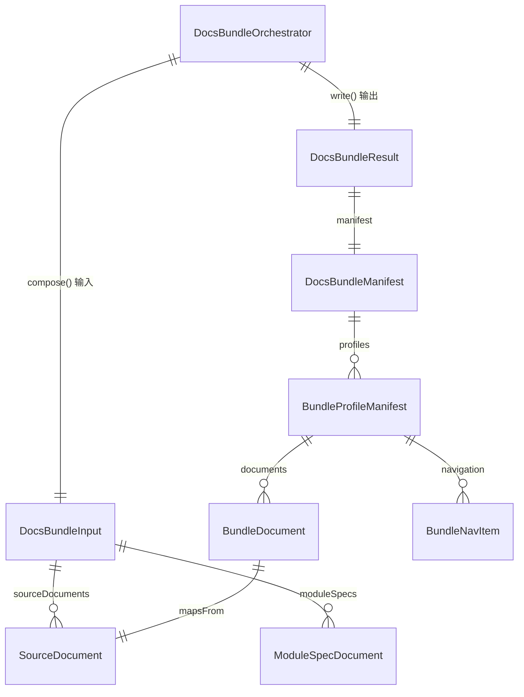

# Data Model: 文档 Bundle 与发布编排

## 1. 实体关系总览



## 2. 核心类型

### 2.1 DocsBundleInput

```ts
interface DocsBundleInput {
  projectRoot: string;
  outputDir: string;
  projectDocs: SourceDocument[];
  moduleSpecs: ModuleSpecDocument[];
  indexSpecPath?: string;
}
```

| 字段 | 类型 | 说明 |
|------|------|------|
| `projectRoot` | `string` | batch 目标项目根目录 |
| `outputDir` | `string` | batch 输出目录绝对路径 |
| `projectDocs` | `SourceDocument[]` | 053 及相关项目级文档清单 |
| `moduleSpecs` | `ModuleSpecDocument[]` | 已生成模块 spec 文档清单 |
| `indexSpecPath` | `string \| undefined` | `_index.spec.md` 的绝对路径 |

### 2.2 SourceDocument

```ts
interface SourceDocument {
  id: string;
  title: string;
  kind: 'project-doc' | 'index-spec';
  generatorId?: string;
  sourcePath: string;
  relativePath: string;
}
```

### 2.3 ModuleSpecDocument

```ts
interface ModuleSpecDocument {
  moduleName: string;
  sourcePath: string;
  relativePath: string;
  bundlePath: string;
}
```

### 2.4 BundleProfileId

```ts
type BundleProfileId =
  | 'developer-onboarding'
  | 'architecture-review'
  | 'api-consumer'
  | 'ops-handover';
```

### 2.5 BundleProfileDefinition

```ts
interface BundleProfileDefinition {
  id: BundleProfileId;
  title: string;
  description: string;
  coreDocumentIds: string[];
  includeModuleSpecs: boolean;
  moduleSpecsSectionTitle?: string;
}
```

### 2.6 BundleDocument

```ts
interface BundleDocument {
  sourceId: string;
  title: string;
  sourcePath: string;
  outputPath: string;
  navPath: string;
  order: number;
  kind: 'landing' | 'project-doc' | 'index-spec' | 'module-spec';
  optional: boolean;
}
```

### 2.7 BundleNavItem

```ts
interface BundleNavItem {
  title: string;
  path: string;
  children?: BundleNavItem[];
}
```

### 2.8 BundleProfileManifest

```ts
interface BundleProfileManifest {
  id: BundleProfileId;
  title: string;
  description: string;
  rootDir: string;
  docsRoot: string;
  mkdocsConfigPath: string;
  landingPagePath: string;
  documents: BundleDocument[];
  navigation: BundleNavItem[];
  warnings: string[];
}
```

### 2.9 DocsBundleManifest

```ts
interface DocsBundleManifest {
  version: 1;
  generatedAt: string;
  outputDir: string;
  profiles: BundleProfileManifest[];
  sourceInventory: SourceDocument[];
  moduleSpecCount: number;
}
```

### 2.10 DocsBundleResult

```ts
interface DocsBundleResult {
  manifestPath: string;
  manifest: DocsBundleManifest;
  profileRoots: string[];
  warnings: string[];
}
```

## 3. 预期文档 ID

055 直接复用 053 已产出的项目级文档命名，不新增事实抽取器。核心可选文档 ID 包括：

- `architecture-narrative`
- `architecture-overview`
- `runtime-topology`
- `workspace-index`
- `cross-package-analysis`
- `api-surface`
- `config-reference`
- `data-model`
- `pattern-hints`
- `event-surface`
- `troubleshooting`
- `_index.spec`

## 4. Profile 阅读路径

### 4.1 developer-onboarding

`index -> architecture-narrative -> architecture-overview -> runtime-topology -> workspace-index -> config-reference -> module specs`

### 4.2 architecture-review

`index -> architecture-overview -> pattern-hints -> architecture-narrative -> cross-package-analysis -> runtime-topology -> event-surface -> module specs`

### 4.3 api-consumer

`index -> api-surface -> config-reference -> data-model -> event-surface -> troubleshooting`

### 4.4 ops-handover

`index -> runtime-topology -> troubleshooting -> config-reference -> architecture-overview -> event-surface`

## 5. 设计边界

- `DocsBundleManifest` / `BundleProfileManifest` 是 055 的共享交付层模型，未来可被 056/057/059 复用，但本次不实现这些 feature。
- MkDocs `nav`、TechDocs skeleton、landing page 文案只属于 render / write 阶段，不应反向污染共享模型。
- bundle 只复制和组织既有文档，不负责生成新的项目事实。
- profile 选文规则必须显式编码，不能通过简单的“全量文档复制 + 文件名排序”冒充差异化 bundle。
