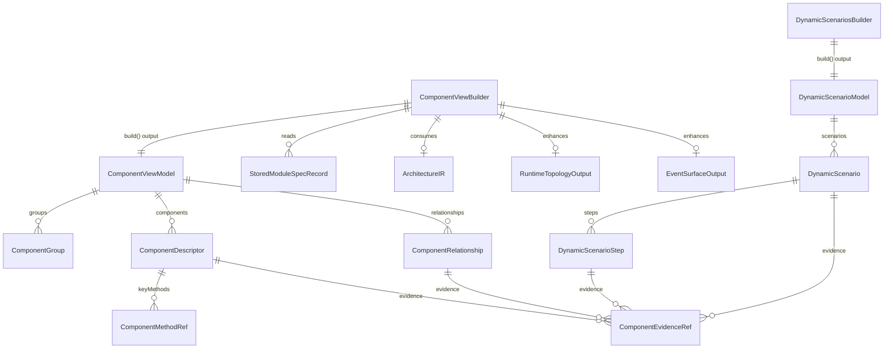

# Data Model: 组件视图与动态链路文档

## 1. 实体关系总览



## 2. 核心类型

### 2.1 StoredModuleSpecRecord

```ts
interface StoredModuleSpecRecord {
  sourceTarget: string;
  relatedFiles: string[];
  confidence: 'high' | 'medium' | 'low';
  intentSummary: string;
  businessSummary: string;
  dependencySummary: string;
  baselineSkeleton?: CodeSkeleton;
}
```

| 字段 | 类型 | 说明 |
|------|------|------|
| `sourceTarget` | `string` | module spec 对应的逻辑模块标识 |
| `relatedFiles` | `string[]` | 该模块关联源码文件 |
| `confidence` | `'high' \| 'medium' \| 'low'` | spec 自身信心等级 |
| `intentSummary` | `string` | 模块职责摘要 |
| `businessSummary` | `string` | 关键业务/技术逻辑摘要 |
| `dependencySummary` | `string` | 依赖摘要 |
| `baselineSkeleton` | `CodeSkeleton \| undefined` | 从 spec 中提取的结构骨架 |

### 2.2 ComponentEvidenceRef

```ts
interface ComponentEvidenceRef {
  sourceType:
    | 'architecture-ir'
    | 'module-spec'
    | 'baseline-skeleton'
    | 'architecture-narrative'
    | 'runtime-topology'
    | 'event-surface'
    | 'test-file';
  ref: string;
  note?: string;
  inferred?: boolean;
}
```

### 2.3 ComponentMethodRef

```ts
interface ComponentMethodRef {
  ownerName?: string;
  name: string;
  kind: 'entrypoint' | 'transport' | 'parser' | 'session' | 'event-handler' | 'supporting';
  signature?: string;
  evidence: ComponentEvidenceRef[];
}
```

### 2.4 ComponentDescriptor

```ts
interface ComponentDescriptor {
  id: string;
  name: string;
  category:
    | 'client'
    | 'query'
    | 'transport'
    | 'parser'
    | 'session'
    | 'store'
    | 'adapter'
    | 'service'
    | 'module'
    | 'external';
  subsystem: string;
  summary: string;
  responsibilities: string[];
  relatedFiles: string[];
  keyMethods: ComponentMethodRef[];
  upstreamIds: string[];
  downstreamIds: string[];
  confidence: 'high' | 'medium' | 'low';
  inferred: boolean;
  evidence: ComponentEvidenceRef[];
}
```

### 2.5 ComponentRelationship

```ts
interface ComponentRelationship {
  fromId: string;
  toId: string;
  kind:
    | 'depends-on'
    | 'calls'
    | 'uses-transport'
    | 'parses'
    | 'publishes'
    | 'subscribes'
    | 'manages-session'
    | 'hosts';
  label: string;
  confidence: 'high' | 'medium' | 'low';
  evidence: ComponentEvidenceRef[];
}
```

### 2.6 ComponentGroup

```ts
interface ComponentGroup {
  id: string;
  name: string;
  componentIds: string[];
  summary?: string;
}
```

### 2.7 ComponentViewModel

```ts
interface ComponentViewModel {
  projectName: string;
  generatedAt: string;
  summary: string[];
  groups: ComponentGroup[];
  components: ComponentDescriptor[];
  relationships: ComponentRelationship[];
  mermaidDiagram?: string;
  warnings: string[];
  stats: {
    totalComponents: number;
    totalRelationships: number;
    highConfidenceComponents: number;
    sourceCount: number;
  };
}
```

### 2.8 DynamicScenarioStep

```ts
interface DynamicScenarioStep {
  index: number;
  actorId?: string;
  actor: string;
  action: string;
  targetId?: string;
  target?: string;
  detail: string;
  confidence: 'high' | 'medium' | 'low';
  inferred: boolean;
  evidence: ComponentEvidenceRef[];
}
```

### 2.9 DynamicScenario

```ts
interface DynamicScenario {
  id: string;
  title: string;
  category: 'request-flow' | 'control-flow' | 'event-flow' | 'session-flow';
  trigger: string;
  participants: string[];
  summary: string;
  steps: DynamicScenarioStep[];
  outcome?: string;
  confidence: 'high' | 'medium' | 'low';
  inferred: boolean;
  evidence: ComponentEvidenceRef[];
}
```

### 2.10 DynamicScenarioModel

```ts
interface DynamicScenarioModel {
  projectName: string;
  generatedAt: string;
  scenarios: DynamicScenario[];
  warnings: string[];
  stats: {
    totalScenarios: number;
    highConfidenceScenarios: number;
    totalSteps: number;
  };
}
```

## 3. 复用的现有类型

- `ArchitectureIR` from `src/panoramic/architecture-ir-model.ts`
- `ArchitectureNarrativeOutput` from `src/panoramic/architecture-narrative.ts`
- `RuntimeTopologyOutput` from `src/panoramic/runtime-topology-generator.ts`
- `EventSurfaceOutput` from `src/panoramic/event-surface-generator.ts`
- `CodeSkeleton` from `src/models/code-skeleton.ts`

## 4. 设计边界

- `StoredModuleSpecRecord` 是 stored module spec 的共享读取结果，由 057 与 `architecture-narrative` 共用
- `ComponentViewModel` / `DynamicScenarioModel` 是 057 与 059 的共享结构边界
- Markdown、Mermaid fenced block、landing 文案属于 render 层，不进入共享模型
