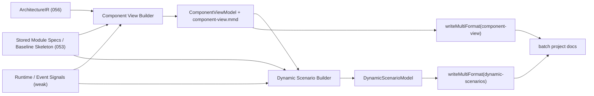

# Implementation Plan: 组件视图与动态链路文档

**Branch**: `057-component-view-dynamic-scenarios` | **Date**: 2026-03-21 | **Spec**: [spec.md](./spec.md)  
**Input**: Feature specification from `/specs/057-component-view-dynamic-scenarios/spec.md`

---

## Summary

实现 057 的目标，是在现有 batch 项目级文档套件之上新增两类“架构深描”输出：

1. `component-view`：把 056 `ArchitectureIR` 的 component 层继续下钻成可读的关键组件视图
2. `dynamic-scenarios`：基于确定性证据构建关键请求流 / 控制流 / 事件流 / session 流说明

057 不新增新的 canonical fact extractor。结构边界继续来自 056 `ArchitectureIR`，组件粒度与职责细节来自 053 已生成的 module specs / baseline skeleton，动态链路则由这些静态证据叠加 runtime/event 弱信号构建。

本 Feature 的技术重点有三点：

1. 将 stored module spec 解析能力从 `architecture-narrative` 中抽出为共享 helper，避免重复解析 frontmatter / baseline skeleton
2. 建立模板无关的 `ComponentViewModel` / `DynamicScenarioModel`，为 059 预留 `evidence` / `confidence`
3. 在 `generateBatchProjectDocs()` 中接入 057 输出，保持现有 batch / ADR / 其他 panoramic 文档链路不回归

---

## Technical Context

**Language/Version**: TypeScript 5.7.3, Node.js >= 20  
**Primary Dependencies**: 现有 panoramic builders/generators、`handlebars`、`zod`、Node.js built-ins、`vitest`  
**Storage**: 文件系统（`specs/`、`src/panoramic/`、`templates/`、`tests/`）  
**Testing**: `vitest`, `npm run lint`, `npm run build`  
**Target Platform**: Node.js CLI / MCP batch pipeline  
**Project Type**: 单仓库 TypeScript project  
**Performance Goals**: 057 的增量开销应主要来自复用既有 `architecture-ir` + stored module specs 的组合与排序逻辑，不引入重型静态调用图或额外全仓深扫描  
**Constraints**:

- 不重做 runtime/workspace/import/project 级事实抽取
- 不要求用户额外启动 tracing、coverage、运行时 agent 或语言特定后台
- 不把 057 实现为必须经 `GeneratorRegistry` 发现的普通 generator；其主接入点是 batch 项目级文档编排
- 只为 059 预留 `evidence` / `confidence` 结构，不提前做 provenance 冲突检测或质量门
- 保持 Codex / Claude 双端兼容
- 所有写操作限于 `specs/057-component-view-dynamic-scenarios/`、`src/panoramic/`、`templates/`、`tests/`

**Scale/Scope**: 1 组共享模型、1 个 stored-module helper、2 个 builder、2 个模板、batch 集成、若干单测与集成测试

---

## Constitution Check

| 原则 | 适用性 | 评估 | 说明 |
|------|--------|------|------|
| **I. 双语文档规范** | 适用 | PASS | 文档和说明使用中文，代码标识符与路径保持英文 |
| **II. Spec-Driven Development** | 适用 | PASS | 已完成 research/spec/checklists，当前进入 plan/tasks |
| **III. 诚实标注不确定性** | 适用 | PASS | 动态步骤与组件候选会保留 `confidence` 与 warning，而不是伪装成确定事实 |
| **IV. AST / 静态提取优先** | 适用 | PASS | 057 仅消费已生成的静态结构输出与 stored module specs，不引入运行时采样 |
| **V. 混合分析流水线** | 部分适用 | PASS | 本 Feature 保持 deterministic facts 为主，不新增 LLM 事实判定 |
| **VI. 只读安全性** | 适用 | PASS | 修改范围限于 panoramic、模板、测试和 feature 制品 |
| **VII. 纯 Node.js 生态** | 适用 | PASS | 无新增外部运行时依赖 |
| **X. 质量门控不可绕过** | 适用 | PASS | 将继续执行 tasks/verify 门禁 |
| **XI. 验证铁律** | 适用 | PASS | 后续实现必须附带 tests/lint/build 和真实或准真实样例验证 |

**结论**: 当前设计通过，无需豁免。

---

## Project Structure

### Documentation (this feature)

```text
specs/057-component-view-dynamic-scenarios/
├── spec.md
├── research/
│   └── tech-research.md
├── research.md
├── plan.md
├── data-model.md
├── quickstart.md
├── contracts/
│   └── component-dynamic-output.md
├── checklists/
│   ├── requirements.md
│   └── architecture.md
└── tasks.md
```

### Source Code (repository root)

```text
src/panoramic/
├── component-view-model.ts            # [新增] 057 共享结构模型与 evidence 类型
├── component-view-builder.ts          # [新增] 关键组件视图构建
├── dynamic-scenarios-builder.ts       # [新增] 动态场景推断与步骤构建
├── stored-module-specs.ts             # [新增] 复用 module spec / baseline skeleton 读取
├── architecture-narrative.ts          # [修改] 改为复用 stored-module-specs helper
├── batch-project-docs.ts              # [修改] 在 architecture-narrative 后接入 057 输出
└── index.ts                           # [修改] 导出 057 共享模型与 builder

templates/
├── component-view.hbs                 # [新增] 组件视图模板
└── dynamic-scenarios.hbs              # [新增] 动态场景模板

tests/panoramic/
├── component-view-builder.test.ts     # [新增] 组件识别 / 排序 / 关系测试
├── dynamic-scenarios-builder.test.ts  # [新增] 链路步骤 / 降级测试
└── architecture-narrative.test.ts     # [修改] 共享 helper 回归验证

tests/integration/
└── batch-panoramic-doc-suite.test.ts  # [修改] 验证 batch 产出 component/dynamic 文档
```

**Structure Decision**: 057 以 batch 项目级编排为主接入点，而不是新增 registry generator，避免重复建立 `ProjectContext -> facts` 的平行通路。

---

## Phase 0: Research Decisions

### 决策 1: 057 放在 batch 项目级文档编排层实现

- **Decision**: 在 `generateBatchProjectDocs()` 中，在 `architecture-narrative` 之后、ADR pipeline 之前生成 057 文档
- **Rationale**: 057 依赖 056 的结构输出与已写出的 module specs；batch 层天然持有 `outputDir`
- **Alternatives considered**:
  - 新增普通 project generator：无法自然读取 stored module specs，容易回到源码重复扫描

### 决策 2: `ArchitectureIR` + stored module specs 双输入

- **Decision**: 结构关系由 `ArchitectureIR` 提供，组件粒度和职责由 stored module specs / baseline skeleton 提供
- **Rationale**: 保持统一结构事实，同时满足“关键类 / 关键方法 / adapter 边界”的可读要求
- **Alternatives considered**:
  - 只依赖 `ArchitectureIR`
  - 只依赖 narrative / module specs

### 决策 3: 动态场景采用确定性启发式构建

- **Decision**: 动态场景步骤由入口点、组件关系、imports、命名模式、runtime/event/test 证据组合生成
- **Rationale**: 057 的 canonical steps 必须可追溯、可复核，不能由 LLM 自由发挥
- **Alternatives considered**:
  - 让 LLM 直接根据仓库摘要生成场景
  - 等待完整调用图成熟后再做 057

### 决策 4: 为 059 预留共享 evidence/confidence 字段

- **Decision**: 在共享模型中引入 `ComponentEvidenceRef`、`confidence`、`inferred`
- **Rationale**: 059 强依赖 057，需要稳定结构输入
- **Alternatives considered**:
  - 完全不保留来源字段
  - 在 057 阶段直接实现 paragraph-level provenance gate

---

## Phase 1: Design & Contracts

### 1. Shared Stored Module Helper

新增 `src/panoramic/stored-module-specs.ts`，负责：

- 递归发现 batch 已生成的 `*.spec.md`
- 解析 frontmatter 的 `sourceTarget` / `relatedFiles` / `confidence`
- 提取 baseline skeleton
- 提取关键章节摘要（intent / business / dependency）

设计规则：

- 该 helper 只读取 stored module specs，不回到源码重新分析
- `architecture-narrative` 与 057 复用同一 helper，避免重复 frontmatter 解析逻辑

### 2. Shared Output Models

新增 `src/panoramic/component-view-model.ts`，定义至少以下共享实体：

- `ComponentEvidenceRef`
- `ComponentDescriptor`
- `ComponentRelationship`
- `ComponentGroup`
- `ComponentViewModel`
- `DynamicScenarioStep`
- `DynamicScenario`
- `DynamicScenarioModel`

设计规则：

- 模型必须模板无关
- `evidence` / `confidence` / `inferred` 为 059 预留
- Markdown 标题、fenced block 和 Handlebars 字段只存在于 render 层

### 3. Component View Builder

新增 `src/panoramic/component-view-builder.ts`：

- 输入：`ArchitectureIR`、stored module specs、可选 `ArchitectureNarrativeOutput`、`RuntimeTopologyOutput`、`EventSurfaceOutput`
- 输出：`ComponentViewModel` + Mermaid 源码

构建职责：

1. 从 `ArchitectureIR` 的 component/system/deployment views 聚合候选组件边界
2. 从 stored module specs 中提取关键 exported class/function、成员方法、职责摘要
3. 对候选组件做 role-based ranking，压制测试噪音
4. 生成 groups、components、relationships、warnings、stats

### 4. Dynamic Scenario Builder

新增 `src/panoramic/dynamic-scenarios-builder.ts`：

- 输入：`ComponentViewModel`、stored module specs、可选 runtime/event 信号
- 输出：`DynamicScenarioModel`

构建职责：

1. 识别高信号入口点：`query`、`connect`、`stream`、`request`、`publish`、`parse`
2. 结合组件关系、imports、runtime transport、event occurrence 推断 hand-off
3. 形成 ordered steps、participants、outcome、warnings、confidence
4. 对证据不足场景保守降级，而不是伪造完整链路

### 5. Batch Integration

修改 `src/panoramic/batch-project-docs.ts`：

1. 运行 registry generators，保留 `structuredOutputs`
2. 生成 `architecture-narrative`
3. 读取 `architecture-ir` + stored module specs，构建并写出：
   - `component-view.md/.json/.mmd`
   - `dynamic-scenarios.md/.json`
4. 继续运行 ADR pipeline

写盘策略：

- 复用 `writeMultiFormat()`
- `component-view` 提供 Markdown + JSON + Mermaid
- `dynamic-scenarios` 提供 Markdown + JSON
- 057 失败只生成 warning，不阻断后续 ADR 或其他项目文档

### 6. Future 059 Handoff

`src/panoramic/index.ts` 需要导出：

- 057 共享模型类型
- component / scenario builder helper

这样 059 可以直接消费 057 的结构化结果，不需要再次读取 Markdown。

### 7. Architecture Flow



---

## Verification Strategy

1. 定向单测：
   - `npx vitest run tests/panoramic/component-view-builder.test.ts`
   - `npx vitest run tests/panoramic/dynamic-scenarios-builder.test.ts`
2. 回归相关能力：
   - `tests/panoramic/architecture-narrative.test.ts`
   - `tests/panoramic/architecture-ir-generator.test.ts`
   - `tests/panoramic/event-surface-generator.test.ts`
3. batch 集成验证：
   - `npx vitest run tests/integration/batch-panoramic-doc-suite.test.ts`
4. 静态校验：
   - `npm run lint`
   - `npm run build`
5. 真实 / 准真实样例：
   - 优先在 `claude-agent-sdk-python` 或等价 fixture 上验证关键组件与 `query -> transport -> parser` 场景
6. 提交前主线同步：
   - `git fetch origin && git rebase origin/master`

---

## Risks & Mitigations

- **风险**: 组件候选被测试符号或目录噪音主导  
  **缓解**: 引入 role-based ranking 与 test-symbol 降权

- **风险**: dynamic scenario 只有方法名单，没有 hand-off 语义  
  **缓解**: 强制 step 模型包含 actor/action/target/evidence/confidence

- **风险**: 单包 Python 项目缺少强静态调用证据  
  **缓解**: 优先复用 stored summaries、imports、runtime/event 弱信号，保守降级

- **风险**: 057 接入 batch 后影响其他项目级文档  
  **缓解**: 在 batch 中将 057 视为独立后置 builder，异常只落 warning，不中断全流程

- **风险**: 057 和 059 的职责边界混淆  
  **缓解**: 057 只预留共享字段，不做 quality scoring、conflict detection 或 provenance gate

---

## Complexity Tracking

| Violation | Why Needed | Simpler Alternative Rejected Because |
|-----------|------------|-------------------------------------|
| batch 层新增 057 builder，而非注册成普通 generator | 057 需要复用已写出的 module specs 与 outputDir | 普通 generator 难以自然获取 stored specs，容易回到重复扫描源码 |
