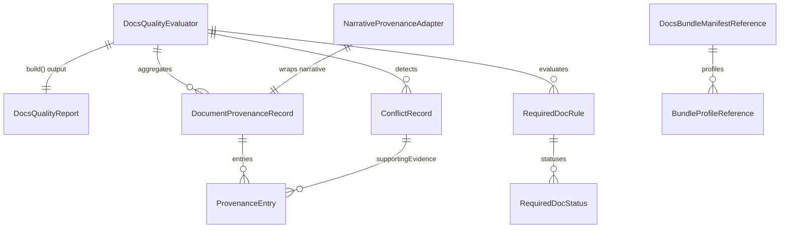

# Data Model: Provenance 与文档质量门

## 1. 实体关系总览



## 2. 核心类型

### 2.1 ProvenanceSourceType

```ts
type ProvenanceSourceType =
  | 'code'
  | 'config'
  | 'test'
  | 'spec'
  | 'blueprint'
  | 'current-spec'
  | 'readme'
  | 'commit'
  | 'architecture-overview'
  | 'pattern-hints'
  | 'component-view'
  | 'dynamic-scenarios'
  | 'adr'
  | 'inference'
  | 'docs-bundle';
```

### 2.2 ProvenanceEntry

```ts
interface ProvenanceEntry {
  sourceType: ProvenanceSourceType;
  ref: string;
  path?: string;
  note?: string;
  excerpt?: string;
  confidence: 'high' | 'medium' | 'low';
  inferred: boolean;
}
```

| 字段 | 类型 | 说明 |
|------|------|------|
| `sourceType` | `ProvenanceSourceType` | 来源类别 |
| `ref` | `string` | 引用标识，如 section id / file topic / doc ref |
| `path` | `string \| undefined` | 来源文件路径 |
| `note` | `string \| undefined` | 简短说明 |
| `excerpt` | `string \| undefined` | 证据摘录 |
| `confidence` | `'high' \| 'medium' \| 'low'` | 该来源条目的可信度 |
| `inferred` | `boolean` | 是否带推断性质 |

### 2.3 DocumentProvenanceRecord

```ts
interface DocumentProvenanceRecord {
  documentId: string;
  title: string;
  kind:
    | 'architecture-narrative'
    | 'component-view'
    | 'dynamic-scenarios'
    | 'adr-index'
    | 'adr-draft';
  available: boolean;
  coverage: 'full' | 'partial' | 'missing';
  warnings: string[];
  sections: Array<{
    sectionId: string;
    label: string;
    summary: string;
    confidence: 'high' | 'medium' | 'low';
    inferred: boolean;
    evidence: ProvenanceEntry[];
  }>;
}
```

### 2.4 ConflictSeverity

```ts
type ConflictSeverity = 'critical' | 'high' | 'medium' | 'low';
```

### 2.5 ConflictRecord

```ts
interface ConflictRecord {
  id: string;
  topic:
    | 'product-positioning'
    | 'runtime-hosting'
    | 'protocol-boundary'
    | 'extensibility-boundary'
    | 'degradation-strategy';
  severity: ConflictSeverity;
  summary: string;
  sources: ProvenanceEntry[];
  resolutionHint?: string;
}
```

### 2.6 RequiredDocRule

```ts
interface RequiredDocRule {
  id: string;
  profile:
    | 'runtime-project'
    | 'monorepo'
    | 'library-sdk'
    | 'architecture-heavy';
  description: string;
  requiredDocIds: string[];
  dependsOnBundleManifest: boolean;
}
```

### 2.7 RequiredDocStatus

```ts
interface RequiredDocStatus {
  docId: string;
  required: boolean;
  available: boolean;
  source: 'project-docs' | 'bundle-manifest' | 'inferred';
  reason?: string;
}
```

### 2.8 DocsBundleManifestReference

```ts
interface DocsBundleManifestReference {
  path: string;
  profiles: BundleProfileReference[];
  warnings: string[];
}

interface BundleProfileReference {
  id: string;
  title: string;
  navDocIds: string[];
}
```

### 2.9 DocsQualityStats

```ts
interface DocsQualityStats {
  totalDocuments: number;
  provenanceCoveredDocuments: number;
  totalConflicts: number;
  criticalConflicts: number;
  totalRequiredDocs: number;
  availableRequiredDocs: number;
  warningCount: number;
}
```

### 2.10 DocsQualityReport

```ts
interface DocsQualityReport {
  projectName: string;
  generatedAt: string;
  status: 'pass' | 'warn' | 'fail' | 'partial';
  summary: string[];
  provenanceRecords: DocumentProvenanceRecord[];
  conflicts: ConflictRecord[];
  requiredDocStatuses: RequiredDocStatus[];
  bundleManifest?: DocsBundleManifestReference;
  warnings: string[];
  stats: DocsQualityStats;
}
```

## 3. 复用的现有类型

- `ArchitectureOverviewOutput` from `src/panoramic/architecture-overview-generator.ts`
- `PatternHintsOutput` from `src/panoramic/pattern-hints-model.ts`
- `ComponentViewOutput` from `src/panoramic/component-view-model.ts`
- `DynamicScenariosOutput` from `src/panoramic/component-view-model.ts`
- `ArchitectureNarrativeOutput` from `src/panoramic/architecture-narrative.ts`
- `AdrIndexOutput` / `AdrDraft` from `src/panoramic/adr-decision-pipeline.ts`

## 4. 设计边界

- `DocsQualityReport` 是 059 与 060 的共享治理边界
- `DocumentProvenanceRecord` 应只保存结构化 provenance，不保存 Markdown 渲染片段
- `ConflictRecord` 只记录 deterministic evaluator 已确认的主题冲突；“证据不足”应走 warning，不应伪装成 conflict
- `DocsBundleManifestReference` 是 055 缺失时可选输入，允许为 `undefined`
