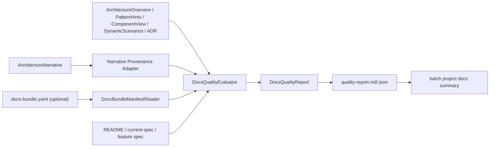

# Implementation Plan: Provenance 与文档质量门

**Branch**: `059-provenance-quality-gates` | **Date**: 2026-03-21 | **Spec**: [spec.md](./spec.md)  
**Input**: Feature specification from `/specs/059-provenance-quality-gates/spec.md`

---

## Summary

059 的目标是在现有 batch / panoramic 文档链路之上补一层“治理视图”，把 explanation 型文档从“可读”推进到“可追溯、可审计、可判定覆盖度”。

本 Feature 不新增新的事实抽取器，也不改变 045/050/057/058 的 canonical outputs。它做的事情只有三类：

1. **Provenance 聚合**: 收敛现有 `evidence` / `confidence` / `inferred` 字段，并为 `architecture-narrative` 补一层可消费的 provenance wrapper
2. **Quality 评估**: 基于确定性规则输出 conflict records、required-doc coverage、dependency warnings 和总状态
3. **Batch 交付接入**: 在项目级文档主链路末尾新增 `quality-report.md/.json`，但不阻断已有 batch 产出

059 的一个现实前提是：蓝图将 055 标记为强依赖，但当前代码线未包含 055 的 bundle orchestrator。实现上必须把“读取 `docs-bundle.yaml` 或等价 manifest”设计为首选路径，同时在 manifest 缺失时输出 partial report / dependency warning，而不是假装 055 已就位。

---

## Technical Context

**Language/Version**: TypeScript 5.7.3, Node.js >= 20  
**Primary Dependencies**: 现有 panoramic shared models、`handlebars`、`zod`、Node.js built-ins、`vitest`  
**Storage**: 文件系统（`specs/`、`src/panoramic/`、`templates/`、`tests/`）  
**Testing**: `vitest`, `npm run lint`, `npm run build`  
**Target Platform**: Node.js CLI / batch project docs pipeline  
**Project Type**: 单仓库 TypeScript project  
**Performance Goals**: 059 只组合和评估既有结构化结果；不应引入新的全仓重扫描或重型解析  
**Constraints**:

- 不重做源码 / 配置 / runtime / workspace 事实抽取
- conflict / required-doc / score 结论必须 deterministic
- LLM 如参与，只能用于 explanation 文案，不能决定 canonical conflict
- 055 manifest 缺失时必须降级为 partial report
- 不提前实现 060 的 Issue/PR/设计稿多源接入
- 保持 Codex / Claude 双端兼容
- 修改范围限于 `specs/059-provenance-quality-gates/`、`src/panoramic/`、`templates/`、`tests/`、必要的 `src/batch/`

**Scale/Scope**: 1 组共享 provenance / quality 模型、1 个 quality evaluator、1 个 narrative provenance adapter、1 个 batch 集成点、若干模板和测试

---

## Constitution Check

| 原则 | 适用性 | 评估 | 说明 |
|------|--------|------|------|
| **I. 双语文档规范** | 适用 | PASS | 文档与说明使用中文，代码路径与标识符保持英文 |
| **II. Spec-Driven Development** | 适用 | PASS | 已完成 tech research、spec、checklists，当前进入 plan/tasks |
| **III. 诚实标注不确定性** | 适用 | PASS | 059 本身就是 provenance / confidence / conflict 显式化层 |
| **IV. AST / 静态提取优先** | 适用 | PASS | 059 只复用既有静态输出，不引入新的运行时探针 |
| **V. 混合分析流水线** | 适用 | PASS | 规则层负责 canonical 结论，可选 explanation 只在渲染层出现 |
| **VI. 只读安全性** | 适用 | PASS | 仅扩展文档和治理输出，不影响原始事实生成 |
| **VII. 纯 Node.js 生态** | 适用 | PASS | 无新增外部服务进程或平台依赖 |
| **X. 质量门控不可绕过** | 适用 | PASS | 059 将把 quality gate 显式产品化为 report，但不反向阻断既有 batch |
| **XI. 验证铁律** | 适用 | PASS | 将补单测、集成测试、lint、build、全量测试 |

**结论**: 当前设计通过，无需豁免。

---

## Project Structure

### Documentation (this feature)

```text
specs/059-provenance-quality-gates/
├── spec.md
├── research/
│   └── tech-research.md
├── research.md
├── plan.md
├── data-model.md
├── quickstart.md
├── contracts/
│   └── provenance-quality-output.md
├── checklists/
│   ├── requirements.md
│   └── architecture.md
└── tasks.md
```

### Source Code (repository root)

```text
src/panoramic/
├── docs-quality-model.ts              # [新增] provenance / conflict / required-doc / report 共享模型
├── docs-quality-evaluator.ts          # [新增] deterministic evaluator
├── narrative-provenance-adapter.ts    # [新增] architecture-narrative -> provenance wrapper
├── docs-bundle-manifest-reader.ts     # [新增] 可选读取 055 manifest，缺失时降级
├── batch-project-docs.ts              # [修改] 接入 quality report 生成
├── index.ts                           # [修改] 导出 059 共享模型与 evaluator
└── ...                                # 复用 045/050/057/058 的 shared outputs

templates/
├── quality-report.hbs                 # [新增] 质量报告模板
└── quality-report-section.hbs         # [可选新增] provenance / conflict 局部渲染模板

tests/panoramic/
├── docs-quality-evaluator.test.ts     # [新增] provenance / conflict / required-doc 单测
├── narrative-provenance-adapter.test.ts # [新增] narrative provenance 包装测试
└── fixtures/
    └── quality/                       # [新增] README/current-spec 冲突 fixture

tests/integration/
└── batch-panoramic-doc-suite.test.ts  # [修改] 验证新增 quality-report 输出和降级行为
```

**Structure Decision**: 059 继续沿用 batch project docs 编排层实现，不注册为独立 generator。原因是它需要同时读取多个已有 structured outputs 和输出目录中的文档制品，本质上是“治理后置层”。

---

## Phase 0: Research Decisions

### 决策 1: 059 站在既有 structured outputs 之上，不回头解析 Markdown

- **Decision**: provenance / quality 的 canonical 输入优先来自 045/050/057/058 的 shared models，Markdown 仅作为补充 evidence carrier
- **Rationale**: 保持事实边界稳定，避免把治理层退化成字符串后处理器
- **Alternatives considered**:
  - 直接扫 Markdown 章节和 bullet 回填 provenance

### 决策 2: `architecture-narrative` 通过 adapter 包装进入 059

- **Decision**: 为 `architecture-narrative` 新增 provenance adapter，以模块、summary、observations 为粒度补结构化来源
- **Rationale**: narrative 当前没有 059 可直接消费的 provenance block，但其来源已可从 stored module specs / architecture overview 推导
- **Alternatives considered**:
  - 修改 narrative Markdown 模板直接嵌 provenance 文本
  - 在 059 中对 narrative Markdown 做正则分析

### 决策 3: conflict detector 只覆盖高价值主题

- **Decision**: 第一版只覆盖产品定位、运行时宿主、协议边界、扩展机制、降级策略等高价值主题
- **Rationale**: 这些主题跨 README/current-spec/spec/generated docs 最容易产生实际冲突，也最容易被 deterministic rules 可靠识别
- **Alternatives considered**:
  - 尝试对任意句子做通用语义冲突判断

### 决策 4: 055 manifest 是首选输入，但必须有 missing-manifest 降级路径

- **Decision**: 实现轻量 `docs-bundle-manifest-reader`，有 manifest 就消费；没有就只基于 `projectDocs` 做 partial required-doc report
- **Rationale**: 当前分支未带 055 代码，059 仍需可推进
- **Alternatives considered**:
  - 直接阻塞 059，等待 055 合入当前主线
  - 在 059 中顺手重做 055 代码

---

## Phase 1: Design & Contracts

### 1. Shared Quality Model

新增 `src/panoramic/docs-quality-model.ts`，定义至少以下实体：

- `ProvenanceSourceType`
- `ProvenanceEntry`
- `DocumentProvenanceRecord`
- `ConflictSeverity`
- `ConflictRecord`
- `RequiredDocRule`
- `RequiredDocStatus`
- `DocsQualityStats`
- `DocsQualityReport`

设计规则：

- 模型只承载共享结构，不承载 Markdown / Handlebars 细节
- `evidence`、`confidence`、`inferred` 统一在此层归一化
- report 必须允许 `status = pass | warn | fail | partial`

### 2. Narrative Provenance Adapter

新增 `src/panoramic/narrative-provenance-adapter.ts`：

- 输入：`ArchitectureNarrativeOutput`
- 可选输入：`ArchitectureOverviewOutput`、stored module summaries
- 输出：`DocumentProvenanceRecord`

职责：

1. 把 executive summary、observations、key modules 映射为 provenance sections
2. 将 narrative 内已有的模块 confidence / inferred 透传到 provenance entry
3. 对无法细化到段落级的内容，保守降级到 section-level provenance

### 3. Docs Bundle Manifest Reader

新增 `src/panoramic/docs-bundle-manifest-reader.ts`：

- 输入：`outputDir`
- 输出：轻量 `DocsBundleManifestReference | undefined`

职责：

1. 读取 `docs-bundle.yaml` 或等价 manifest（若存在）
2. 提取 profile、导航和 bundle 输出路径的最小信息
3. manifest 缺失或解析失败时返回 warning，不抛 fatal error

注意：

- 这不是重做 055，而是 059 的 optional reader
- 若未来 055 合入主线，可切换为直接复用 055 shared types

### 4. Deterministic Quality Evaluator

新增 `src/panoramic/docs-quality-evaluator.ts`：

- 输入：
  - `architectureOverview?`
  - `patternHints?`
  - `componentView?`
  - `dynamicScenarios?`
  - `adrIndex?`
  - `architectureNarrative`
  - `projectDocs`
  - `docsBundleManifest?`
  - `projectRoot` / `outputDir`
- 输出：`DocsQualityReport`

评估职责：

1. 聚合 explanation docs 的 provenance coverage
2. 执行 conflict detector
3. 执行 required-doc rule set
4. 生成总体 warning / score / status

### 5. Conflict Detector

第一版规则主题：

1. `product-positioning`
2. `runtime-hosting`
3. `protocol-boundary`
4. `extensibility-boundary`
5. `degradation-strategy`

规则来源：

- README / `current-spec.md`
- feature spec / blueprint
- `architecture-narrative`
- `pattern-hints`
- ADR drafts

设计规则：

- 只在多个来源对同一主题给出不同 canonical 描述时生成 conflict
- 没有足够来源时输出 “insufficient evidence”，不是 conflict

### 6. Required-Doc Rule Set

规则由项目类型和可见事实决定：

- **runtime project**: `runtime-topology`, `architecture-overview`, `component-view`, `dynamic-scenarios`
- **architecture-heavy project**: `architecture-narrative`, `architecture-overview`, `pattern-hints`, `docs/adr/index`
- **library / sdk project**: `api-surface`, `data-model`, `architecture-narrative`
- **monorepo**: 追加 `workspace-index`, `cross-package-analysis`

若 bundle manifest 可用：

- 额外检查 profile 是否覆盖关键 required docs

若 manifest 缺失：

- report 标记 `bundleCoverage = partial`

### 7. Batch Integration

修改 `src/panoramic/batch-project-docs.ts`：

1. 保留现有 registry generators、narrative、component/dynamic、ADR pipeline
2. 在其后收集现有 structured outputs
3. 调用 `evaluateDocsQuality(...)`
4. 写出：
   - `quality-report.md`
   - `quality-report.json`
5. quality 失败只产出 warnings，不阻断 batch 返回成功

必要时修改 `src/batch/batch-orchestrator.ts`：

- 把 `quality-report.md` 纳入 `BatchResult.projectDocs`

### 8. Future 060 Handoff

`src/panoramic/index.ts` 需要导出：

- 059 shared quality model
- evaluator / narrative adapter / manifest reader

这样 060 可以在不重新治理 059 逻辑的前提下扩展 product facts sources。

### 9. Architecture Flow



---

## Verification Strategy

### Unit Tests

1. `docs-quality-evaluator.test.ts`
   - provenance coverage 聚合
   - README vs current-spec conflict
   - required-doc rule set 差异化
   - missing manifest 降级
2. `narrative-provenance-adapter.test.ts`
   - narrative key modules / observations -> provenance sections

### Integration Tests

1. 修改 `tests/integration/batch-panoramic-doc-suite.test.ts`
   - 断言新增 `quality-report.md` / `.json`
   - 验证原有 project docs 保持可用
2. 如需要，新增专门 conflict fixture 集成测试

### Native Toolchain

- `npm run lint`
- `npm run build`
- `npm test`

### Verification Report

`verification/verification-report.md` 必须记录：

- 055 manifest 缺失时的实际降级行为
- 至少 1 个真实 conflict fixture
- 全量测试与 batch 集成结论

---

## Complexity Tracking

| 风险/复杂点 | 为什么需要 | 拒绝的更简单方案 |
|------------|-----------|------------------|
| narrative provenance adapter | narrative 目前不自带可复用 provenance block | 直接扫 Markdown 太脆弱 |
| manifest optional reader | 055 未在当前代码线可用，但 059 不能完全忽略 bundle 层 | 阻塞 059 等待 055 合入会破坏当前推进节奏 |
