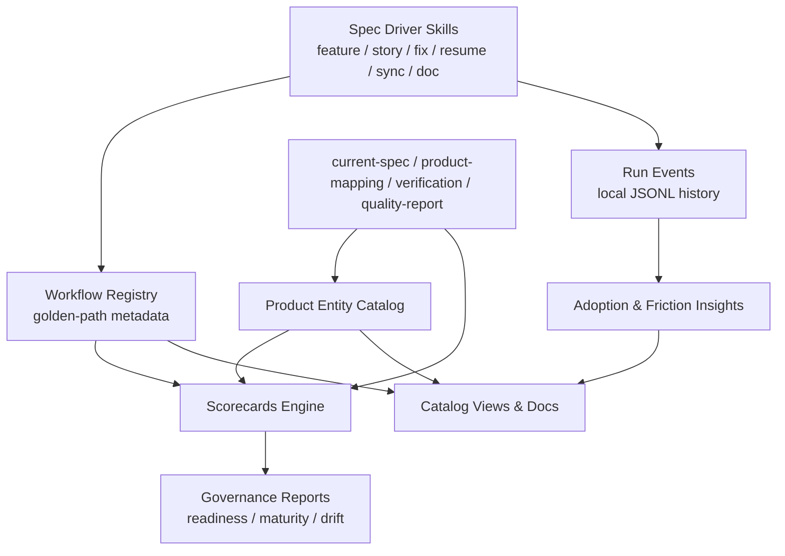

# Catalog-Driven Spec Driver Milestone 蓝图

**版本**: 1.0.0
**创建日期**: 2026-04-04
**最后更新**: 2026-04-05
**状态**: Implemented

---

## 1. 概览与目标

### 愿景

在现有 `Spec Driver` 六类技能与 `Reverse Spec` 多源文档系统能力之上，将本仓库从“**会编排研发流程、会生成文档**”推进到“**以 Catalog 为事实核心的研发操作系统**”。

本 Milestone 不追求复刻 Backstage / Harness IDP / Cortex / Port / OpsLevel 的完整产品面，而是以最小闭环补齐 4 个当前真正缺失的层：

1. **实体目录层**：让产品、仓库、技能工作流成为稳定、机器可读的实体
2. **Golden Path 层**：让 `feature/story/fix/resume/sync/doc` 从命令集合升级为可运营的工作流注册表
3. **持续治理层**：让质量从“单次门禁”升级为“可持续评分与可解释治理”
4. **反馈闭环层**：让技能使用、卡点、rerun 与失败模式可聚合分析

### 为什么现在做

当前主线已经具备：

- `Spec Driver` 的编排、门禁、聚合、文档派生能力，见 [`specs/products/spec-driver/current-spec.md`](/Users/connorlu/.codex/worktrees/b92c/cc-plugin-market/specs/products/spec-driver/current-spec.md)
- `Reverse Spec` 的项目级文档套件、Architecture IR、ADR、质量门和产品 / UX 文档，见 [`specs/products/reverse-spec/current-spec.md`](/Users/connorlu/.codex/worktrees/b92c/cc-plugin-market/specs/products/reverse-spec/current-spec.md)
- 文档治理与事实层，见 [`src/panoramic/docs-quality-evaluator.ts`](/Users/connorlu/.codex/worktrees/b92c/cc-plugin-market/src/panoramic/docs-quality-evaluator.ts)

但仍缺少 Harness / Cortex / Port / OpsLevel 一类平台里最关键的产品层能力：

- `Catalog` 事实层
- `Golden Path / Workflow Library`
- `Scorecards / 持续治理`
- `Adoption / Friction Insights`

这使得我们当前更像一个强大的“研发编排器 + 文档引擎”，而不是可持续运营的工程平台。

### 范围

本蓝图自身占用 `062` 编号，后续规划 **4 个 Feature**（`063-066`），划分为 **3 个 Phase**：

| Phase | 名称 | Feature 数量 | 定位 |
|-------|------|-------------|------|
| Phase 0 | 事实与入口层 | 2 | 先补 Catalog 与 Workflow Registry，让后续治理与反馈不再悬空 |
| Phase 1 | 治理层 | 1 | 建立 Scorecards 与轻量规则治理 |
| Phase 2 | 反馈层 | 1 | 建立 Adoption / Friction 分析，形成闭环 |

---

## 2. 零基架构原则

这轮里程碑必须避免“为了看起来像平台而搭一堆平台壳子”。统一遵循以下原则：

### 2.1 Git-native 优先

- canonical facts 优先落在 Git 中的 Markdown / YAML / JSON 文件
- 不引入数据库、常驻后端服务或专用 portal 存储
- 产物必须能被 PR review、diff、版本回滚

### 2.2 复用现有事实，不重复建模

- 产品事实继续以 `current-spec.md` 为主
- 文档质量、coverage、provenance 继续复用 `Reverse Spec` 现有产物
- 不新造第二套“产品真相库”

### 2.3 报表先于 UI

- 先生成机器可读清单和 Markdown 报表
- 不在本 Milestone 中做 Portal UI、Catalog 页面或 Dashboard 前端
- 若未来需要，可对接 Backstage / TechDocs / 外部前端

### 2.4 评分先于策略

- 先做 Scorecards 与报告
- 只在少量关键场景中把评分转成 block / warn
- 不在本 Milestone 中直接引入 OPA/Rego 或复杂审批引擎

### 2.5 本地反馈优先

- 先采集本地可得到的技能运行事件与流程卡点
- 不做远程遥测平台
- 分析结果面向 repo / product / workflow 三个维度即可

### 2.6 不改变既有业务语义

- `feature/story/fix/resume/sync/doc` 六个入口保持不变
- 新增层只做“注册、评分、分析、推荐”
- 不重写 Spec Driver 核心编排流程

---

## 3. 开源参考与 Adopt / Borrow / Build 策略

| 能力域 | 参考对象 | 策略 | 本 Milestone 做法 |
|--------|----------|------|-------------------|
| 实体目录模型 | Backstage Catalog, Port Blueprints, OpsLevel `opslevel.yml` | Borrow | 借鉴“实体 + 元数据 + source link + lifecycle/owner”的合同，但不引入完整平台 |
| Golden Path / Workflow Library | Harness IDP Workflows, HSF Template Library | Borrow | 借鉴“推荐路径、模板版本、工作流分组、persona”模型 |
| Scorecards | Harness Scorecards, Cortex, OpsLevel | Borrow | 借鉴“持续评分而非单次检查”的设计，先做本地 scorecards DSL |
| Adoption / Usage | Harness Adoption Dashboard, SEI | Borrow | 借鉴指标体系，先做本地 run history + friction report |
| Policy as Code | Harness OPA | Defer | 只预留挂接点，不在本 Milestone 中实现 Rego/OPA |
| Portal / UI | Backstage / Harness IDP / Port | Defer | 仅输出 machine-readable registry 和 Markdown 报表 |

---

## 4. 目标架构

### 4.1 总体分层

### 4.2 核心数据契约

本 Milestone 只新增 4 类核心契约：

1. **Product Entity**
   - 表示产品/仓库级实体
   - 由 `current-spec.md`、`product-mapping.yaml`、repo 元信息、quality report 聚合而来
2. **Workflow Definition**
   - 表示一个可执行 golden path
   - 包含 persona、适用场景、前置条件、关键门禁、产物、模板版本
3. **Scorecard Definition**
   - 表示一组持续规则
   - 从现有验证、文档、spec freshness 和 branch hygiene 读取信号
4. **Run Event**
   - 表示一次 skill 运行
   - 只记录可本地获得的执行元数据，不记录敏感 prompt 正文

### 4.3 推荐落盘位置

为减少目录爆炸，这轮只引入最小目录：

- `specs/products/<product>/entity.yaml`
- `plugins/spec-driver/workflows/*.yaml`
- `.specify/workflows/*.yaml`（项目级覆盖，可选）
- `.specify/scorecards/*.yaml`
- `.specify/runs/*.jsonl`

说明：

- `entity.yaml` 与 `current-spec.md` 同目录，避免产品事实分裂
- 工作流定义区分“插件内置”与“项目覆盖”
- 运行事件只落本地 `.specify/`，不默认进入 Git

---

## 5. 编号映射表

| 编号 | 类型 | 名称 | 所属 Phase |
|------|------|------|-----------|
| 062 | BLUEPRINT | Catalog-Driven Spec Driver Milestone 蓝图 | Blueprint |
| 063 | FEATURE | 产品实体目录与 Catalog 生成 | Phase 0 |
| 064 | FEATURE | Workflow Registry 与 Golden Paths | Phase 0 |
| 065 | FEATURE | Scorecards 与持续治理报告 | Phase 1 |
| 066 | FEATURE | Adoption / Friction Insights | Phase 2 |

---

## 6. Feature 详情

### 6.1 Phase 0: 事实与入口层

#### Feature 063: 产品实体目录与 Catalog 生成

**描述**: 在现有 `spec-driver-sync` 和 `current-spec.md` 基础上，为每个产品生成一份机器可读的 `entity.yaml`，形成最小 Catalog。

**前置依赖**: 012、016、022、054-060（强）
**预估工作量**: 1.5-2.5 天

**交付物**:

- `specs/products/<product>/entity.yaml`
- `specs/products/catalog-index.yaml` 或等价索引文件
- entity schema（最小字段集）

**最小字段集**:

- `id`
- `name`
- `kind`（如 `product` / `plugin` / `library-tooling`）
- `owner`
- `lifecycle`
- `repo`
- `docs`
- `quality`
- `workflowRefs`
- `sourceRefs`

**设计约束**:

- `current-spec.md` 仍是产品事实正文；`entity.yaml` 只是索引与元数据壳
- 不允许把 entity.yaml 做成第二份 README
- quality / docs / workflowRefs 必须引用现有产物路径，而不是复制正文

**验收标准**:

1. `reverse-spec` 与 `spec-driver` 两个产品都能稳定生成 `entity.yaml`
2. `entity.yaml` 可从 `product-mapping.yaml + current-spec + repo metadata + quality-report` 重建
3. 缺失 owner / lifecycle 等字段时必须显式标记 `unknown` 或 `inferred`

#### Feature 064: Workflow Registry 与 Golden Paths

**描述**: 将 `feature/story/fix/resume/sync/doc` 六个入口注册成正式的 Workflow Definition，并建立 persona、推荐路径、前置条件和模板版本信息。

**前置依赖**: 011-022、032（强），063（弱）
**预估工作量**: 2-3 天

**交付物**:

- `plugins/spec-driver/workflows/*.yaml`
- `.specify/workflows/*.yaml` 覆盖机制
- `workflow-index.md/.json`
- 推荐路径（golden paths）定义

**最小字段集**:

- `id`
- `title`
- `persona`
- `useCases`
- `entryCommand`
- `requiredInputs`
- `keyGates`
- `artifacts`
- `recommendedWhen`
- `templateVersion`

**设计约束**:

- 不改变六个 skill 的业务逻辑
- Golden path 只做“定义与推荐”，不新造第七个编排器
- 项目级覆盖只允许改 metadata / 模板版本 / 推荐说明，不允许悄悄改核心语义

**验收标准**:

1. 六个入口都生成 machine-readable workflow definition
2. 能输出至少 3 条 golden paths：
   - 新功能研发
   - 快速修复
   - 产品事实与文档更新
3. `spec-driver-doc` 或后续文档入口能消费 workflow registry 生成“如何选择技能”的说明

### 6.2 Phase 1: 治理层

#### Feature 065: Scorecards 与持续治理报告

**描述**: 基于现有门禁、验证、quality report 和 product catalog，增加持续评分模型，而不只是在单次流程里做 pause/continue。

**前置依赖**: 059、061、063、064（强）
**预估工作量**: 2-3.5 天

**交付物**:

- `.specify/scorecards/*.yaml`
- `scorecard-report.md/.json`
- score aggregation engine
- 最小 rule DSL

**首批 Scorecard 维度**:

- `spec-freshness`
- `verification-freshness`
- `docs-coverage`
- `docs-conflicts`
- `branch-hygiene`
- `workflow-readiness`

**设计约束**:

- 本轮不引入 OPA/Rego
- 评分与阻断解耦：默认先生成报告，不自动 block
- 只允许少量规则升级为 gate 输入，如 `release-readiness`

**验收标准**:

1. `reverse-spec` 与 `spec-driver` 产品都可输出 scorecard report
2. scorecard 能解释分数来源，而不是只给总分
3. 至少 1 条规则能直接复用现有 `quality-report` 和 `verification-report` 结果

### 6.3 Phase 2: 反馈层

#### Feature 066: Adoption / Friction Insights

**描述**: 为六个 skill 增加本地运行事件记录与聚合分析，形成 adoption / friction 闭环。

**前置依赖**: 064、065（强）
**预估工作量**: 2-3 天

**交付物**:

- `.specify/runs/*.jsonl`
- `adoption-report.md/.json`
- friction hotspots 报告
- 可选的 anonymized summary schema

**首批指标**:

- workflow 使用次数
- 成功率 / 失败率
- rerun 率
- 平均阶段耗时
- gate pause 热点
- verification 失败热点

**设计约束**:

- 默认本地记录，且不采集完整 prompt 正文
- 不做远程上报
- 仅记录 workflow、phase、decision、duration、result、artifact paths 等最小必要字段

**验收标准**:

1. 对本仓库连续运行若干次 `feature/fix/sync/doc` 后，可生成 adoption-report
2. 报告能指出最常见 rerun phase 与 gate 卡点
3. 运行日志损坏或缺失时，聚合器应降级但不阻断主流程

---

## 7. 推荐实施顺序

### 7.1 主顺序

1. **063** 先做，确定 Catalog contract
2. **064** 随后做，把六个 skill 注册成 workflow library
3. **065** 基于 Catalog 和现有报告做持续评分
4. **066** 最后做反馈闭环

### 7.2 并行建议

- 线 A：`063 -> 065`
- 线 B：`064 -> 066`

说明：

- `065` 需要 `063` 先落 Catalog contract
- `066` 依赖 `064` 的 workflow identity，否则 run event 无法稳定归类

---

## 8. 非目标（本 Milestone 明确不做）

以下内容全部明确排除，避免过度设计：

1. 不做 Backstage / IDP 风格的 Portal UI
2. 不做远程数据库或 SaaS telemetry 服务
3. 不做完整 OPA / Rego policy engine
4. 不做复杂审批流 / RBAC 系统
5. 不做 repo 外部服务发现或自动同步三方平台
6. 不做新的第七个、第八个 skill 模式

---

## 9. 验证计划

### 验证目标

| 目标 | 用途 |
|------|------|
| `cc-plugin-market`（本仓库） | 验证双产品 catalog、workflow registry、scorecard 和 adoption 闭环 |
| 至少一个纯 library / SDK 项目 | 验证 product entity 与 workflow 说明不依赖 web app 假设 |

### 阶段性验证

#### Phase 0 验证

- `entity.yaml` 与 `current-spec.md` 事实一致
- workflow definitions 覆盖全部六个入口
- golden path 文档能指导用户选择 skill

#### Phase 1 验证

- scorecard 能稳定输出解释性报告
- 至少识别 1 条真实 docs conflict 与 1 条 verification freshness 问题

#### Phase 2 验证

- adoption-report 能指出真实的高频 rerun phase
- friction report 能指出 gate 热点
- 不泄露敏感 prompt 内容

---

## 10. 风险与缓解

| 风险 | 概率 | 影响 | 缓解措施 |
|------|------|------|---------|
| Catalog 与 current-spec 重复建模，事实源漂移 | 中 | 高 | 明确 `current-spec` 为正文事实层，`entity.yaml` 仅保留索引元数据 |
| Workflow registry 演变成第二套命令系统 | 中 | 中 | 只做注册、推荐、模板版本，不改变 skill 执行语义 |
| Scorecards 过早变成阻断器，引发流程噪声 | 中 | 高 | 默认 report-only，只把少量成熟规则接入 gate |
| Adoption 记录被视为遥测，带来隐私顾虑 | 中 | 中 | 本地优先、最小字段、默认不上传 |
| 为了追求“平台感”引入太多目录和 DSL | 中 | 高 | 每层只引入一个最小合同文件族，先验证价值再扩展 |

---

## 11. 成功标准

| ID | 成功标准 |
|----|----------|
| SC-001 | `spec-driver` 和 `reverse-spec` 至少各拥有 1 份稳定的 `entity.yaml` |
| SC-002 | 六个 skill 都有 machine-readable workflow definition，且能产出推荐路径 |
| SC-003 | scorecard report 能解释至少 5 个维度，并复用现有 quality / verification 事实 |
| SC-004 | adoption-report 能识别真实 rerun 热点与 gate friction |
| SC-005 | 整个 Milestone 完成后，`Spec Driver` 仍然保持 Git-native、无 portal 依赖、无额外后端服务 |

---

## 12. 参考实践

- Harness IDP Adoption Playbook: https://developer.harness.io/docs/internal-developer-portal/adoption/adoption-playbook/
- Harness IDP Release Notes: https://developer.harness.io/release-notes/internal-developer-portal/
- Harness Solutions Factory Workflows: https://developer.harness.io/docs/harness-solutions-factory/use-hsf/workflows/
- Harness OPA using Scorecards: https://developer.harness.io/docs/internal-developer-portal/scorecards/tutorials/opa-implementation
- Backstage Documentation: https://backstage.io/docs/landing-page/doc-landing-page/
- Port Docs: https://docs.port.io/
- Cortex Docs: https://docs.cortex.io/
- OpsLevel Config as Code: https://docs.opslevel.com/docs/opslevel-yml

---

## 13. 当前结论

这轮里程碑不是“再加几个 skill”，也不是“做一个小 Backstage”。  
它的最小产品目标是：

> 在现有 `Spec Driver + Reverse Spec` 基础上，补齐 **Catalog、Golden Path、Scorecards、Adoption Feedback** 四个层级，让系统从单次编排工具升级为可持续运营的研发平台雏形。

若本 Milestone 成功，下一轮才有意义讨论：

- OPA / Policy-as-Code
- scoped approvals / workflow RBAC
- portal UI
- 外部平台同步与 team-level rollup

---

## 14. 结案验证

### 已完成项

- **063**: 产品实体目录与 Catalog 生成已落地，输出 `entity.yaml` 与 `catalog-index.yaml`
- **064**: Workflow Registry 与 Golden Paths 已落地，输出 `workflow-index.md/.json`
- **065**: Scorecards 与持续治理报告已落地，输出 `scorecard-report.md/.json` 与 `scorecard-index.yaml`
- **066**: Adoption / Friction Insights 已落地，输出本地 `.specify/runs/*.jsonl` 合同与 `adoption-report.md/.json`

### 当前仓库验证结论

- `cc-plugin-market` 已验证：
  - 双产品 Catalog 可稳定生成
  - 六个 workflow definition 与 3 条 golden paths 可稳定生成
  - scorecard 与 adoption report 均可生成，并能回写产品级事实索引
- 066 当前采用本地 run summary 模式，已经能对 `feature` 与 `sync` 运行样本输出 adoption / friction 报告

### 已知边界

- 066 的 adoption 数据当前仅依赖 repo 本地 `.specify/runs/*.jsonl`，不做远程 telemetry、团队级 rollup 或外部平台同步
- scorecards 仍维持 report-first，不会自动阻断流程，也尚未引入 OPA / Rego
- `spec-driver` 当前 scorecard 仍为 `fail`，反映的是真实治理缺口（verification / quality 事实不足），不是链路 bug
