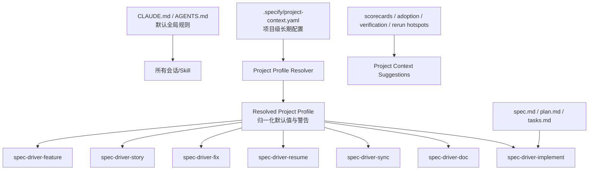

# Project Context 与 Implement Skill 解耦蓝图

**版本**: 1.0.0
**创建日期**: 2026-04-05
**最后更新**: 2026-04-05
**状态**: Implemented

---

## 1. 目标

这轮蓝图的目标不是继续扩 `Spec Driver` 的产品面，而是修正一个已经暴露出来的架构问题：

- **`Project Context` 是 Project 级长期机制**
- **Spec / Plan 已成熟时的执行聚焦，应该由新的 Spec 级 Skill 承担**

也就是说，不能再把“这个项目长期怎么做”和“这个具体 Feature 现在怎么落地”混放在同一个机制里。

本蓝图因此明确拆分两层职责：

1. **Project Context 层**
   - 项目级、长期稳定、可持续优化
   - 负责约束、偏好、参考资料、默认验证与调研策略
2. **Implement Skill 层**
   - Spec 级、一次执行、面向成熟 Spec/Plan
   - 负责 `plan review -> task refinement -> implementation -> verification -> closure`

---

## 2. 为什么现在做

当前仓库已经有：

- `feature/story/fix/resume/sync/doc` 六类主 Skill
- `Catalog / workflow registry / scorecards / adoption` 的治理闭环
- `.specify/project-context.yaml|md` 的文档约定

但实际问题也已经很明确：

1. `.specify/project-context.*` 目前更像写在 Skill 文档里的软约定，不是可验证的共享机制
2. 用户已经明确提出：当 `Spec`、`Plan` 足够成熟时，系统应该直接聚焦实施，而不是再回到项目级上下文做过度推断
3. 仓库里已经存在一个技术侧的 [`ProjectContext`](/Users/connorlu/.codex/worktrees/b92c/cc-plugin-market/src/panoramic/project-context.ts)，如果继续把流程侧也都塞进 `Project Context`，概念冲突会继续扩大

所以这轮不追求“再让 Project Context 更强”，而是：

- **把 Project Context 变窄、变稳**
- **把成熟 Spec 的实施能力独立成新的 Skill**

---

## 3. 设计原则

### 3.1 Project 级与 Spec 级必须解耦

- `Project Context` 只描述项目长期事实、约束和偏好
- `Implement Skill` 只描述某个 Feature 的执行流程
- 不允许把 `phase_focus=implementation-only` 之类的 Spec 级语义继续塞进 `Project Context`

### 3.2 复用现有流程，不重造编排器

- `spec-driver-implement` 复用现有 Spec Driver 的门禁、模板、验证与收口模式
- 只是在入口与阶段裁剪上区别于 `spec-driver-feature`
- 不重新定义 Spec Driver 产物目录，不改变 `specs/<feature>/...` 合同

### 3.3 Project Context 只做默认值，不做命令式控制

- 它可以表达“默认验证偏好”“默认调研策略”“默认 golden path”
- 它不直接决定某个具体 Feature 一定跳过或一定执行哪些阶段
- 具体执行选择应由 Skill 决定，并允许用户显式覆盖

### 3.4 反馈建议可写出，不自动回写

- adoption / scorecard / verification / rerun 热点只能产出“建议”
- 不能自动重写 `.specify/project-context.yaml`
- 所有长期配置更新必须可 review

### 3.5 命名避免与 panoramic 冲突

- 对外文件名仍保留 `.specify/project-context.yaml`，避免破坏既有约定
- 但实现层内部类型、resolver、脚本命名应避免继续直接叫 `ProjectContext`
- 推荐内部命名为 `ProjectProfile` / `ResolvedProjectProfile`

### 3.6 上下文加载层级必须显式分层

- `CLAUDE.md` / `AGENTS.md` 只放**默认会进入上下文**且跨任务稳定的规则
- `Project Context` 只放**项目级长期偏好与约束**，不能承载“默认必须执行”的关键流程规则
- Spec 级执行语义（如成熟 `spec/plan` 直接进入 implementation）必须放在具体 Skill 或 feature 制品中
- 若某条规则在不使用 Spec Driver Skill 时也必须生效，它就不应只存在于 `Project Context`

### 3.7 上下文优先级必须确定

- 冲突时采用固定优先级：**用户显式输入 > Skill 执行合同 > `AGENTS.md` / `CLAUDE.md` > `Project Context` 默认值**
- `Project Context` 只提供默认值与补充参考，不得覆盖更高层的显式执行语义
- resolver 必须把冲突来源显式写入 warning / diagnostics，而不是静默取最后一个值

---

## 4. 目标架构

### 4.1 Project Context 的职责边界

它应该只回答这些问题：

- 这个项目是什么产品 / 仓库 / 插件
- 默认验证策略是什么
- 默认调研策略是什么
- 有哪些长期约束、禁区、参考资料
- 推荐哪些 workflow / golden path

它不应该回答这些问题：

- 这个 Feature 现在是不是该跳过调研
- 这个 Plan 是否合理
- 这个 Tasks 应该怎么拆
- 现在先写测试还是先写代码

这些都属于 `spec-driver-implement` 或其他具体 Skill 的执行语义。

### 4.1.1 `CLAUDE.md / AGENTS.md` 与 `Project Context` 的分工

**应放入 `CLAUDE.md / AGENTS.md` 的内容**：

- 仓库级目录结构约定
- 提交 / rebase / 验证的全局工程规范
- 默认语言、命名、兼容性、门禁不变性
- 任何“即使不走 Spec Driver Skill 也必须成立”的规则

**应放入 `Project Context` 的内容**：

- 项目背景、长期目标、术语、参考资料
- 默认 research / verification 偏好
- 领域约束、架构禁区、默认 workflow 偏好
- 会随着项目演进而调整，但不应成为硬性的全局入口规则

**不应放入 `Project Context` 的内容**：

- “若 `spec/plan` 已成熟则进入 implementation” 这类 Spec 级流程裁剪
- 当前具体 feature 的阶段编排
- 需要默认总是生效的仓库治理规则

### 4.1.2 上下文冲突的固定优先级

当多个层级同时给出配置时，统一按以下顺序生效：

1. 用户在当前会话中的显式要求或命令参数
2. 当前 Skill 的执行合同与 feature 制品中的明确要求
3. `AGENTS.md` / `CLAUDE.md` 中的仓库级稳定规则
4. `.specify/project-context.yaml` 中的项目级默认值

要求：

- resolver 输出必须保留每个值的来源层级
- 一旦发生冲突，低优先级值不得静默覆盖高优先级值
- diagnostics 中必须能说明“为什么这次没有采用 project-context 的默认值”

### 4.2 Implement Skill 的职责边界

`spec-driver-implement` 只面向“Spec 与 Plan 已经足够成熟”的场景。

它应该负责：

1. 检查 `spec.md / plan.md / tasks.md` 是否齐备
2. 评审 `plan` 是否可执行，指出缺口
3. 补齐或重排 `tasks`
4. 落实代码实施
5. 做验证与收口

它不应该重新做：

- 需求澄清
- 产品调研
- 大范围技术调研
- 全量重写 `spec.md`

除非产物缺失或明显失真，才允许降级回更完整流程。

---

## 5. 编号映射

| 编号 | 类型 | 名称 | 说明 |
|------|------|------|------|
| 070 | BLUEPRINT | Project Context 与 Implement Skill 解耦蓝图 | 当前文档 |
| 071 | FEATURE | 目录结构历史债修正 | 先拆分产品事实源与生成产物，统一目录合同 |
| 072 | FEATURE | `spec-driver-implement` Skill | 新的 Spec 级执行入口 |
| 073 | FEATURE | Project Context Schema + Resolver | 将软约定变成共享机制 |
| 074 | FEATURE | Feedback to Context Suggestions | 将 adoption / scorecard / verification 信号转成建议 |
| 075 | FEATURE | Init / Template / Tests / Docs 收口 | 模板、初始化、回归测试、文档同步 |

---

## 6. Feature 详情

### 6.1 Feature 071: 目录结构历史债修正

**目标**: 先解决当前最明显的结构债，让后续 `implement skill` 与 `project-context resolver` 建在更清晰的目录合同上。

**当前债务**:

- `specs/products/` 混放人工事实源与脚本生成产物
- `catalog-index / scorecard-index / quality-report-index` 与 `current-spec.md` 同层，目录语义不清
- `entity / workflow-index / scorecard-report / quality-report / adoption-report` 的路径硬编码散落在多个脚本、workflow 定义和测试中

**交付物**:

- `specs/products/<product>/current-spec.md` 保持为人工维护事实源
- `specs/products/<product>/_generated/*` 承载产品级生成产物
- `specs/products/_generated/*` 承载跨产品索引
- 统一的路径 helper / 目录合同
- AGENTS 中的精简目录规范

**设计约束**:

- 只做结构清债，不改变 scorecard / adoption / workflow / quality 的业务语义
- 允许读取旧路径作为兼容回退，但新写入必须统一走新目录
- 不在本 Feature 处理 `.codex/.claude/.specify` 的全面去跟踪，只先明确目录规则

**验收标准**:

1. `specs/products/` 根目录不再混放生成索引与人工事实正文
2. 五条生成链路统一使用共享路径 helper
3. 相关 workflow、tests、文档引用同步到新目录合同

### 6.2 Feature 072: `spec-driver-implement` Skill

**目标**: 为已具备高质量 `Spec / Plan` 的场景提供新的执行 Skill，避免继续走全量 `feature` 流程。

**适用场景**:

- 用户已有完整 `spec.md`
- 用户已有高质量 `plan.md`
- 用户希望系统聚焦：
  - plan 合理性
  - 任务拆分
  - 代码实施
  - 结果验证

**建议阶段**:

1. `intake`
   - 确认 feature 目录、读取 `spec.md / plan.md / tasks.md`
2. `plan-review`
   - 审查计划是否可执行，补充 gap
3. `task-refinement`
   - 细化、重排、标注并行性
4. `implementation`
   - 编码与必要迁移
5. `verification`
   - 测试、lint、build、真实验证
6. `closure`
   - 更新 verification / status / change summary

**设计约束**:

- 复用现有 `specs/<feature>/...` 目录合同
- 复用现有 gates，不弱化 `GATE_VERIFY`
- 若检测到 `spec`/`plan` 缺失或质量不足，必须显式提示“应回退到 `spec-driver-feature` 或 `story`”
- 必须定义与 `spec-driver-resume` 的关系：
  - `resume` 负责“从中断流程恢复”
  - `implement` 负责“针对成熟 `spec/plan` 的聚焦实施”
  - 当目录已存在且用户目标明确为实施时，允许 `resume` 建议切换到 `implement`，但不隐式替换用户入口

**验收标准**:

1. 新增 `plugins/spec-driver/skills/spec-driver-implement/SKILL.md`
2. Codex/Claude 双端都能安装对应包装
3. 至少支持从现有 feature 目录恢复并直接进入实施
4. 对成熟 `spec/plan` 场景不再强制重复调研 / 重写 spec
5. `resume` 与 `implement` 的路由边界在文档和提示中都有明确说明

### 6.3 Feature 073: Project Context Schema + Resolver

**目标**: 把 `.specify/project-context.yaml|md` 从文档约定升级成共享解析机制。

**交付物**:

- `.specify/project-context.yaml` 推荐 schema
- `resolve-project-context` 脚本 / helper
- `ResolvedProjectProfile` 中间结构
- Skill 共享注入逻辑

**建议字段**:

- `product`
- `owner`
- `references`
- `architecture_constraints`
- `verification_policy`
- `research_policy`
- `workflow_preferences`
- `forbidden_changes`
- `notes`

**明确排除字段**:

- `phase_focus`
- `skip_spec`
- `implementation_only`
- `task_strategy`

这些执行语义不再属于 Project Context。

**设计约束**:

- 内部命名与 panoramic `ProjectContext` 区分开
- 解析失败时要给 warning，不静默忽略
- 所有 Skill 都通过同一个 resolver 获取注入内容
- `.specify/project-context.yaml` 是 canonical source；`.specify/project-context.md` 仅作为 legacy 兼容输入
- 若 `.yaml` 与 `.md` 同时存在，resolver 只读取 `.yaml`，并对 `.md` 输出迁移 warning
- 075 完成后，新初始化项目不再创建 `.md` 版本模板

**验收标准**:

1. 不再在 6 个以上 Skill 里复制粘贴 `project-context` 规则
2. README 与 Skill 里对 `project-context` 的承诺都有实际实现支撑
3. 缺失文件时行为稳定、可解释
4. `.yaml` 与 `.md` 并存时行为是确定性的，并有清晰迁移提示

### 6.4 Feature 074: Feedback to Context Suggestions

**目标**: 让 Project Context 成为“反思与优化”的中心，但只通过建议机制演进。

**输入**:

- adoption report
- scorecard report
- verification freshness
- rerun / friction hotspots

**输出**:

- `.specify/project-context.suggestions.md`
- 或等价 machine-readable suggestions 文件

**建议类型**:

- 补充参考资料
- 调整验证偏好
- 固定推荐 workflow
- 标注高风险目录 / 禁区
- 补充默认 reviewer / owner 信息

**设计约束**:

- 只产出建议，不自动改用户配置
- 建议必须附 evidence
- 允许用户忽略

**验收标准**:

1. adoption / scorecard 信号能够生成 context 优化建议
2. 建议与原始 project-context 分离存放
3. 生成结果可 review、可 diff

### 6.5 Feature 075: Init / Template / Tests / Docs 收口

**目标**: 把前 3 个 Feature 的资产真正落入初始化、模板、测试和文档链路。

**交付物**:

- `init-project.sh` 创建 `project-context` 模板
- README / skill docs 更新
- integration tests
- migration notes
- `AGENTS.md` / `CLAUDE.md` 的共享上下文归属片段
- `.codex/.claude/.specify` 源/包装/运行态边界说明与最小收口

**设计约束**:

- 不破坏现有项目的空目录初始化体验
- 默认模板必须简洁，避免吓退用户
- 对存量 `.specify/project-context.md` 给出兼容迁移策略
- 若 `AGENTS.md` 与 `CLAUDE.md` 需要共享新增规则，必须走 `docs/shared/* + docs:sync:agents` 机制，不再手工双写
- 不要求在本 milestone 中把 `.codex/.claude/.specify` 全部去跟踪，但要明确 source-of-truth 与再生成方式

**验收标准**:

1. `init` 后能直接看到最小 `project-context` 模板
2. 关键 Skill 的文档全部引用统一 resolver
3. 有专门测试覆盖：
   - context 解析
   - implement skill 入口
   - suggestions 输出
4. `AGENTS.md` / `CLAUDE.md` 的上下文归属规则来自共享片段，避免手工漂移
5. `.yaml/.md` 迁移规则与 `.codex/.claude/.specify` 的 source-of-truth 都有明确文档

---

## 7. 推荐实施顺序

### Phase 0: 先清结构债，再做执行入口

`071 -> 072`

原因：

- 先把目录和产物边界收干净，后续 `implement skill` 与 resolver 才不会继续写进历史混乱结构
- `072` 是用户价值最大的入口，但应建立在清晰目录合同之上

### Phase 1: 再把 Project Context 机制化

`073 -> 075`

原因：

- 先把 resolver 建起来，再统一模板和文档
- 避免先铺模板，后面又改字段

### Phase 2: 最后做反馈建议

`074`

原因：

- 没有稳定 schema 和 resolver，反馈建议无处落脚
- adoption / scorecard 已经具备，放在最后接入最自然

---

## 8. 非目标

这轮明确不做：

- 不重命名已有 `.specify/project-context.yaml` 文件名
- 不替换 `spec-driver-feature`
- 不做自动重写用户 project-context
- 不做 portal / UI / dashboard
- 不做新的数据库或远程配置中心
- 不改变 panoramic 技术侧 `ProjectContext` 的业务语义

---

## 9. 完成定义

本蓝图可视为完成，当且仅当：

1. `spec-driver-implement` 成为正式 Skill，并能稳定处理成熟 `spec/plan` 场景
2. `Project Context` 有统一 schema + resolver，而不再只是文档约定
3. adoption / scorecard / verification 信号可以产出 context 建议
4. `Project Context` 与 Spec 级执行语义之间的边界在代码、文档和模板层都被明确固化

---

## 10. 结案验证

### 已完成项

- **071**: 已完成产品事实源与机器生成产物目录分层，`specs/products/<product>/_generated/` 与 `specs/products/_generated/` 成为统一生成路径
- **072**: `spec-driver-implement` 已作为正式 Skill 落地，并接入 workflow registry、Catalog、adoption 与产品活文档
- **073**: `.specify/project-context.yaml` 已成为 canonical source，共享 resolver 已接入主 Skill，`.md` 仅保留 legacy fallback
- **074**: `quality / scorecard / adoption` 信号已可生成 `.specify/project-context.suggestions.yaml|md`，并以 advisory-only 方式供流程读取
- **075**: `init-project.sh` 已默认创建最小 `project-context.yaml`，legacy Markdown 迁移说明、集成测试和共享文档同步也已收口

### 当前仓库验证结论

- `cc-plugin-market` 已验证：
  - `spec-driver-implement` 可通过 Codex / Claude 双端安装链路落地
  - Project Context resolver、suggestions、Catalog、workflow、quality、scorecard、adoption 能共同工作
  - `spec-driver` 产品级治理信号已回到 `PASS / 100`
- 当前仓库的 `spec-driver` 活文档已纳入 `070–075` 全部内容，`Project Context` 也已经在仓库根目录完成了一次 dogfooding

### 已知边界

- 当前 milestone 只完成了 `Project Context` 与 `implement skill` 的分层与机制化，不包含新的 portal / UI / 审批系统
- `.specify/project-context.md` 仍作为 legacy fallback 保留，后续是否彻底移除仍需单独版本决策
- `.codex/`、`.claude/`、`.specify/runs/` 仍然保留运行态 / 分发态角色，本 milestone 只明确了 source-of-truth 与再生成方式，没有彻底改变其仓库存在形式

## 11. 一句话总结

这轮里程碑的核心不是“让 Project Context 更强”，而是：

> 让 `Project Context` 回到它该在的位置，成为项目级长期配置层；再新增 `spec-driver-implement`，把成熟 Spec 的执行能力做成真正独立、清晰、可复用的 Skill。
