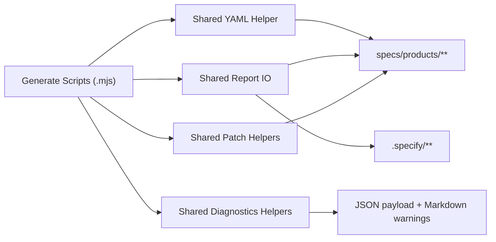

# Implementation Plan: Script Platform 共享层收敛

**Branch**: `078-script-platform-shared-layer` | **Date**: 2026-04-05 | **Spec**: [spec.md](./spec.md)  
**Input**: Feature specification from `/specs/078-script-platform-shared-layer/spec.md`

---

## Summary

078 的目标是把 `plugins/spec-driver/scripts/*.mjs` 中已经重复出现的基础设施逻辑收回到可测试共享层，优先覆盖 `entity / workflow / quality / scorecard / adoption / suggestions` 六条主链。

本次不做整批 `.mjs -> .ts` 迁移，也不尝试统一所有报告模板。实现重点只有四类共享 primitive：

1. **YAML**: 把 `parseYamlDocument` / `stringifyYaml` 收拢到同一个 shared module
2. **Report IO**: 统一 JSON / Markdown / YAML 写入和常见读取
3. **Artifact Patch**: 统一 `entity.yaml` / `catalog-index.yaml` 回写骨架
4. **Diagnostics Helpers**: 统一 warnings 去重、warning section 渲染和轻量 Markdown helper

交付完成后，六条主链脚本继续保留原入口和产物合同，但其内部共享逻辑不再散落在各自脚本尾部。

---

## Technical Context

**Language/Version**: Node.js >= 20, JavaScript ESM (`.mjs`)  
**Primary Dependencies**: Node.js built-ins only (`fs`, `path`, `process`, `child_process`)，不新增 npm 依赖  
**Storage**: 文件系统（`plugins/spec-driver/scripts/lib/`、`specs/products/**`、`.specify/**`）  
**Testing**: `vitest`, integration tests via `execFileSync('node', [script...])`, `npm run lint`, `npm run build`  
**Target Platform**: 本地 Node.js CLI / Codex / Claude 兼容脚本运行环境  
**Project Type**: 单仓库 Node.js + TypeScript 项目，其中 spec-driver 共享层位于 `plugins/spec-driver/scripts/lib/`  
**Performance Goals**: 不引入额外进程或重扫描；共享层重构不应显著增加单脚本执行时间  
**Constraints**:

- 不改变现有脚本入口、`--project-root` / `--json` 参数和主要输出路径
- 不引入新的运行时依赖、守护进程或只兼容单一端的流程
- 不把所有业务 Markdown renderer 强行统一成一个 mega-template
- 优先兼容当前 preferred/legacy artifact path 语义
- 共享层必须可直接被 `.mjs` 脚本消费，无需先 build

**Scale/Scope**: 4 个共享 lib 模块以内，6 条主链脚本迁移，若干 unit/integration tests

---

## Constitution Check

| 原则 | 适用性 | 评估 | 说明 |
|------|--------|------|------|
| **I. 双语文档规范** | 适用 | PASS | 设计制品使用中文，代码标识符与路径保持英文 |
| **II. Spec-Driven Development** | 适用 | PASS | 已完成 research/spec/checklists，当前进入 plan/tasks |
| **III. 诚实标注不确定性** | 适用 | PASS | 计划明确标注 078 不统一所有模板、不做整批迁移 |
| **VIII. Prompt 工程优先** | 间接适用 | PASS | 本次不改 agents/skills/prompts，只收敛脚本共享层 |
| **IX. 零运行时依赖** | 适用 | PASS | 仅复用 Node built-ins 与现有 `.mjs` 共享 lib，不新增依赖 |
| **X. 质量门控不可绕过** | 适用 | PASS | 按 feature 流程保留 GATE_DESIGN、GATE_TASKS、GATE_VERIFY |
| **XI. 验证铁律** | 适用 | PASS | 将补共享层单测、脚本集成测试、lint、build、test 的真实证据 |
| **XII. 向后兼容** | 适用 | PASS | 078 的核心目标就是在不改对外合同的前提下收敛内部共享层 |

**结论**: 当前方案通过 Constitution Check，无需豁免。

---

## Project Structure

### Documentation (this feature)

```text
specs/078-script-platform-shared-layer/
├── spec.md
├── research.md
├── research/
│   └── tech-research.md
├── plan.md
├── data-model.md
├── quickstart.md
├── contracts/
│   └── script-platform-shared-contract.md
├── checklists/
│   ├── requirements.md
│   └── architecture.md
└── tasks.md
```

### Source Code (repository root)

```text
plugins/spec-driver/scripts/
├── generate-product-entity-catalog.mjs
├── generate-workflow-registry.mjs
├── generate-product-quality-reports.mjs
├── generate-product-scorecards.mjs
├── generate-adoption-insights.mjs
├── generate-project-context-suggestions.mjs
└── lib/
    ├── simple-yaml.mjs
    ├── product-artifact-paths.mjs
    ├── project-profile-resolver.mjs
    ├── script-report-io.mjs              # [新增]
    ├── product-artifact-patchers.mjs     # [新增]
    └── script-diagnostics.mjs            # [新增]

tests/
├── unit/
│   └── spec-driver-script-platform.test.ts
└── integration/
    ├── spec-driver-product-entity-catalog.test.ts
    ├── spec-driver-workflow-registry.test.ts
    ├── spec-driver-product-quality-reports.test.ts
    ├── spec-driver-product-scorecards.test.ts
    ├── spec-driver-adoption-insights.test.ts
    └── spec-driver-project-context-suggestions.test.ts
```

**Structure Decision**: 078 继续沿用 `plugins/spec-driver/scripts/lib/` 作为脚本共享层，而不是把逻辑迁入 `src/**`。原因是这些脚本需要在不经 build 的情况下直接运行，并保持 Codex / Claude 双端兼容与零新增运行时依赖。

---

## Architecture

### Design Overview

共享层的目标不是隐藏所有业务差异，而是让 `.mjs` 入口脚本只负责：

1. 参数解析
2. 业务编排
3. 调用共享 primitives 读写和回写产物

基础规则：

- **共享层只承载 primitives**，不承载整份报告业务 schema
- **每条主链保留自己的 report shape 和 markdown 主体结构**
- **回写逻辑通过 descriptor/callback 驱动**，不把 `quality` 与 `scorecard` 字段硬编码成同一个模型

### Mermaid Diagram



### Shared Primitive Breakdown

#### 1. `simple-yaml.mjs`

- 保留现有 `parseYamlDocument`
- 新增共享 `stringifyYaml`
- 固定当前仓库依赖的 YAML 子集，不扩展复杂 YAML 特性

#### 2. `script-report-io.mjs`

- `ensureArtifactDir(filePath)`
- `writeJsonArtifact(filePath, value)`
- `writeMarkdownArtifact(filePath, content)`
- `writeYamlArtifact(filePath, value)`
- `readJsonArtifact(filePath)`

#### 3. `product-artifact-patchers.mjs`

- `patchYamlArtifact(filePath, mutateFn)`
- `patchProductCatalogIndex(projectRoot, mutateProductFn)`
- `patchProductEntity(projectRoot, productId, preferredPath, legacyPath, mutateFn)`

说明：
- 共享“读取 -> mutate -> 写回”骨架
- 具体字段映射由调用脚本自己提供

#### 4. `script-diagnostics.mjs`

- `dedupeStringValues(items)`
- `appendWarningsSection(lines, warnings, options?)`
- `escapeMarkdownTableCell(value)` 或等价轻量 helper

### Migration Strategy

#### 第一批迁移

- `generate-workflow-registry.mjs`
- `generate-product-quality-reports.mjs`
- `generate-product-scorecards.mjs`
- `generate-product-entity-catalog.mjs`
- `generate-project-context-suggestions.mjs`
- `generate-adoption-insights.mjs`

#### 明确保留不动

- `record-workflow-run.mjs`
- `resolve-project-context.mjs`
- `validate-wrapper-sources.mjs`

原因：这些脚本不在蓝图 078 点名的六条主链内，且当前重复收益较低。

---

## Complexity Tracking

| Violation | Why Needed | Simpler Alternative Rejected Because |
|-----------|------------|-------------------------------------|
| 无 | N/A | 当前方案未偏离 Constitution 的简化路线 |
