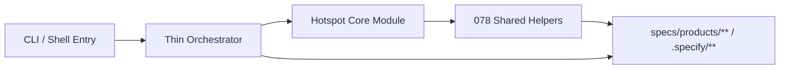

# Implementation Plan: 可读性与维护性热点重构

**Branch**: `081-maintainability-hotspot-refactors` | **Date**: 2026-04-05 | **Spec**: [spec.md](./spec.md)  
**Input**: Feature specification from `/specs/081-maintainability-hotspot-refactors/spec.md`

---

## Summary

081 的目标不是新增用户能力，而是把当前最膨胀、最容易继续长胖的四个热点入口做薄：

1. `plugins/spec-driver/scripts/generate-product-scorecards.mjs`
2. `plugins/spec-driver/scripts/generate-product-quality-reports.mjs`
3. `plugins/spec-driver/scripts/generate-workflow-registry.mjs`
4. `plugins/spec-driver/scripts/init-project.sh`

实现策略建立在 078 共享层之上：

- **入口文件保留**，继续作为 CLI 壳
- **领域逻辑下沉** 到 `plugins/spec-driver/scripts/lib/` 的 core modules
- **shared primitives 继续复用** `simple-yaml`、artifact IO、patch、diagnostics
- **测试切分** 为 targeted unit tests + 现有 integration regression

本次不做：

- 整批 `.mjs -> .ts` 迁移
- Bash 全量改写为 Node
- 079 的 reverse-spec skill 分发收敛
- 080 的版本/发布合同统一

---

## Technical Context

**Language/Version**: Node.js >= 20, JavaScript ESM (`.mjs`) + Bash  
**Primary Dependencies**: Node.js built-ins，现有 `plugins/spec-driver/scripts/lib/*.mjs` shared helpers，Bash built-ins  
**Storage**: 文件系统（`plugins/spec-driver/scripts/**`、`specs/products/**`、`.specify/**`）  
**Testing**: `vitest`, Node CLI integration tests via `execFileSync`, shell integration via `bash script --json`, `npm run lint`, `npm run build`  
**Target Platform**: 本地 Node.js CLI / Codex / Claude 兼容运行环境  
**Project Type**: 单仓库 Node.js + TypeScript 项目，spec-driver 热点脚本位于 `plugins/spec-driver/scripts/`  
**Performance Goals**: 不增加额外进程常驻开销；热点重构不应增加脚本主路径的可感知延迟  
**Constraints**:

- 不改变热点脚本现有 CLI 入口、参数名、输出路径和关键 JSON payload 字段
- 必须直接复用 078 已新增 shared helpers，不新增等价 helper 分叉
- `init-project.sh` 继续保留 shell 入口，不要求迁出 Bash
- 新增模块应保持 `.mjs` 或 `.sh` 直跑，不要求先 build
- 继续兼容 Codex / Claude 双端工作流

**Scale/Scope**: 4 个热点入口、3 个以上 core modules、若干 targeted unit tests 和既有 integration regression

---

## Constitution Check

| 原则 | 适用性 | 评估 | 说明 |
|------|--------|------|------|
| **I. 双语文档规范** | 适用 | PASS | 设计制品保持中文叙述，代码/路径保持英文 |
| **II. Spec-Driven Development** | 适用 | PASS | 已完成 research/spec/checklists，当前进入 plan/tasks |
| **III. 诚实标注不确定性** | 适用 | PASS | 明确标注 081 不做大迁移、不推进 079/080 |
| **VIII. Prompt 工程优先** | 间接适用 | PASS | 本次不改 agents/skills/prompts，只重构脚本与实现结构 |
| **IX. 零运行时依赖** | 适用 | PASS | 不新增 npm 依赖，仅重构已有脚本与共享模块 |
| **X. 质量门控不可绕过** | 适用 | PASS | 保留 feature 流程的 GATE_TASKS / GATE_VERIFY |
| **XI. 验证铁律** | 适用 | PASS | 将补 targeted unit tests + integration regressions + lint/build/test |
| **XII. 向后兼容** | 适用 | PASS | 081 以“薄入口 + 稳定合同”为首要边界 |

**结论**: 当前方案通过 Constitution Check，无需豁免。

---

## Project Structure

### Documentation (this feature)

```text
specs/081-maintainability-hotspot-refactors/
├── spec.md
├── research.md
├── research/
│   └── tech-research.md
├── plan.md
├── data-model.md
├── quickstart.md
├── contracts/
│   └── hotspot-refactor-contract.md
├── checklists/
│   ├── requirements.md
│   └── architecture.md
└── tasks.md
```

### Source Code (repository root)

```text
plugins/spec-driver/scripts/
├── generate-product-scorecards.mjs
├── generate-product-quality-reports.mjs
├── generate-workflow-registry.mjs
├── init-project.sh
└── lib/
    ├── simple-yaml.mjs
    ├── script-report-io.mjs
    ├── product-artifact-patchers.mjs
    ├── script-diagnostics.mjs
    ├── product-scorecard-core.mjs        # [新增]
    ├── product-quality-core.mjs          # [新增]
    ├── workflow-registry-core.mjs        # [新增]
    └── init-project-output.sh            # [可选新增，视实现而定]

tests/
├── unit/
│   ├── product-scorecard-core.test.ts    # [新增]
│   ├── product-quality-core.test.ts      # [新增]
│   └── workflow-registry-core.test.ts    # [新增]
└── integration/
    ├── spec-driver-product-scorecards.test.ts
    ├── spec-driver-product-quality-reports.test.ts
    ├── spec-driver-workflow-registry.test.ts
    ├── spec-driver-init-project.test.ts
    └── init-e2e.test.ts
```

**Structure Decision**: 081 继续沿用 `plugins/spec-driver/scripts/` + `scripts/lib/` 的双层结构。`.mjs` 与 `.sh` 入口文件保留为外部合同，复杂领域逻辑迁入 `scripts/lib/` 下的 core modules 或 shell helper。原因是这些脚本需要继续支持不经 build 的直接运行和双端兼容。

---

## Architecture

### Design Overview

081 的核心判断标准不是“目录更漂亮”，而是：

1. 热点入口文件变薄，主流程更可扫描
2. 领域逻辑切到单一职责模块，便于 targeted tests
3. 078 共享层继续作为下层 primitive，不再重复实现

### Layering Strategy

#### 1. Thin Entry Layer

入口文件只负责：

- 参数解析
- 调用 core module
- 用 shared IO / patch helpers 落盘
- 统一返回 CLI / JSON payload

#### 2. Hotspot Core Modules

新增的 core modules 负责：

- `product-scorecard-core.mjs`
  - ruleset loading / normalization
  - product context assembly
  - rule evaluation
  - report assembly
  - markdown rendering

- `product-quality-core.mjs`
  - document reference collection
  - required-doc / conflict / stats calculation
  - report assembly
  - markdown rendering

- `workflow-registry-core.mjs`
  - workflow definition loading
  - override application
  - golden path loading
  - registry JSON assembly
  - markdown rendering

#### 3. Init Project Phase Split

`init-project.sh` 保持 Bash 入口，但明确阶段化：

- parse args
- init dirs
- sync templates
- sync scorecards
- detect state
- render output
- main

如输出逻辑仍过重，可抽 `init-project-output.sh`，但不强制新增第二个 shell 文件。

### Mermaid Diagram



### Complexity Reduction Strategy

#### `generate-product-scorecards.mjs`

优先切分：

- `loadScorecardRules`
- `build/evaluate product context`
- `build scorecard report`
- `render scorecard markdown`

保留在入口：

- `parseArgs`
- `generateProductScorecards`
- CLI `if (import.meta.url === ...)`

#### `generate-product-quality-reports.mjs`

优先切分：

- `collectDocumentRefs`
- `detectProductConflicts`
- `summarizeDocsQualityStats`
- `buildSummaryLines`
- `renderQualityMarkdown`

保留在入口：

- `parseArgs`
- `generateProductQualityReports`
- CLI output

#### `generate-workflow-registry.mjs`

优先切分：

- `readWorkflowDefinitions`
- `readWorkflowOverrides`
- `applyWorkflowOverride`
- `readGoldenPaths`
- `renderWorkflowIndexMarkdown`

保留在入口：

- `parseArgs`
- `generateWorkflowRegistry`
- `printResult`

#### `init-project.sh`

优先重排：

- 将状态探测与输出渲染完全拆开
- 让 `main` 只做 phase sequencing
- 让 JSON / text 输出函数独立，不穿插在状态检测逻辑中

### Test Strategy

#### New Targeted Tests

- `tests/unit/product-scorecard-core.test.ts`
- `tests/unit/product-quality-core.test.ts`
- `tests/unit/workflow-registry-core.test.ts`

#### Existing Regressions to Keep

- `tests/integration/spec-driver-product-scorecards.test.ts`
- `tests/integration/spec-driver-product-quality-reports.test.ts`
- `tests/integration/spec-driver-workflow-registry.test.ts`
- `tests/integration/spec-driver-init-project.test.ts`
- `tests/unit/init-command.test.ts`
- `tests/integration/init-e2e.test.ts`

#### Verification Metrics

verification report 需要至少记录：

- 重构前后热点文件行数
- 新增 targeted tests 列表
- 相关 integration regressions 结果

---

## Complexity Tracking

| Violation | Why Needed | Simpler Alternative Rejected Because |
|-----------|------------|-------------------------------------|
| 保留 `init-project.sh` 为 Bash 入口 | feature 流程、项目初始化与现有测试/调用路径都依赖它 | 全量改写为 Node/TS 会越过 081 的“小范围热点重构”边界 |
