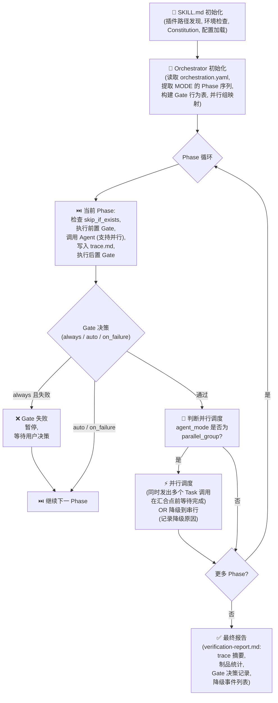

# Feature 089: SKILL.md 编排拆分与 orchestration.yaml 提取

## 意图

当前 spec-driver-feature/SKILL.md 超过 1,000 行，包含：
- Phase 定义（10 个阶段的条件判断、并行调度）
- 门禁策略（5 种门禁的执行规则、回退逻辑）
- 上下文注入（project-context 解析、suggestions 合并）
- 错误处理（重试、降级、日志）
- 输出格式（trace.md、verification-report 的模板）

这种混合导致：
1. **可维护性下降**：修改一个门禁行为需要在万行 Markdown 中精确定位
2. **代码重复**：7 种模式（feature/story/implement/fix/resume/sync/doc）的 Phase 定义、门禁表、并行组重复度 60%+
3. **扩展困难**：Feature 093 (refactor 模式) 需要定义新的 Phase 序列，但无统一抽象可复用
4. **契约缺失**：Phase、Gate、并行组的名称、行为取决于 SKILL.md 的解析实现，无 canonical source

**核心方案**：
- 将 Phase 定义、Gate 配置、并行组、降级策略提取到 `orchestration.yaml`
- SKILL.md 瘦身到 <3,000 行（仅保留 Prompt 指令、上下文注入、错误处理逻辑）
- 提供统一的 Orchestrator 加载器，被 7 种现有模式和新模式（093）复用
- orchestration.yaml 成为编排行为的 canonical source，enable 配置驱动的编排变更

## 接口定义

### 1. orchestration.yaml 的数据模式

新建 `plugins/spec-driver/config/orchestration.yaml`，定义所有编排运行时元数据。7 种模式各有对应的 orchestration mode 配置块。

```yaml
version: "1.0"

# 全局并行调度配置
parallel_scheduling:
  max_concurrent_tasks: 3
  fallback_to_serial_on_failure: true
  fallback_reason_log: true

# 门禁全局配置
gates:
  GATE_RESEARCH:
    type: research_checkpoint
    applicable_modes: [feature]
    description: "调研完整性门禁"
    default_behavior: auto
    severity: non_critical

  GATE_DESIGN:
    type: design_checkpoint
    applicable_modes: [feature, story, implement, fix, resume, sync, doc]
    description: "规范质量门禁"
    default_behavior: always
    severity: critical
    hard_gate_modes: [feature]  # feature 模式下此门禁不可覆盖

  GATE_ANALYSIS:
    type: quality_analysis
    applicable_modes: [feature, implement]
    description: "设计分析门禁"
    default_behavior: on_failure
    severity: non_critical

  GATE_TASKS:
    type: task_generation
    applicable_modes: [feature, story, implement, fix, resume, sync, doc]
    description: "任务生成门禁"
    default_behavior: always
    severity: critical

  GATE_IMPLEMENT_MID:
    type: implementation_checkpoint
    applicable_modes: [implement]
    description: "实现中期检查门禁（Feature 090）"
    default_behavior: on_failure
    severity: non_critical
    insertion_point: "after_task_50_percent"

  GATE_VERIFY:
    type: verification_checkpoint
    applicable_modes: [feature, story, implement, fix, resume, sync, doc]
    description: "最终验证门禁"
    default_behavior: always
    severity: critical

# Phase 定义（各模式的 Phase 序列）
modes:
  feature:
    name: "Spec-Driven Development（完整 10 阶段）"
    description: "包含完整的调研、规范、规划、实现、验证流程"
    phases:
      - id: 1
        name: constitution_check
        display_name: 检查项目宪法
        agent: null  # 内联快速检查 + 条件 Agent 调用
        gates_before: []
        gates_after: []
        is_critical: false

      - id: 2
        name: research_mode_determination
        display_name: 确定调研模式
        agent: null  # 编排器内联逻辑
        gates_before: []
        gates_after: []
        is_critical: false

      - id: 3
        name: product_research
        display_name: 产品调研
        agent: product-research
        gates_before: []
        gates_after: [GATE_RESEARCH]
        is_critical: false
        conditional: "research_mode in [full, product-only]"

      - id: 4
        name: tech_research
        display_name: 技术调研
        agent: tech-research
        gates_before: []
        gates_after: [GATE_RESEARCH]
        is_critical: false
        conditional: "research_mode in [full, tech-only, codebase-scan]"

      - id: 5
        name: research_summary
        display_name: 产研汇总
        agent: null  # 如需可指定 agent
        gates_before: [GATE_RESEARCH]
        gates_after: []
        is_critical: false
        conditional: "research_mode == full"

      - id: 6
        name: specify
        display_name: 需求规范
        agent: specify
        gates_before: []
        gates_after: [GATE_DESIGN]
        is_critical: true
        skip_if_exists: "spec.md"

      - id: 7
        name: clarify_and_checklist
        display_name: 需求澄清与检查列表
        agent: [clarify, checklist]
        agent_mode: parallel_group
        gates_before: [GATE_DESIGN]
        gates_after: []
        is_critical: true

      - id: 8
        name: plan
        display_name: 实现规划
        agent: plan
        gates_before: []
        gates_after: [GATE_ANALYSIS]
        is_critical: true
        skip_if_exists: "plan.md"

      - id: 9
        name: tasks
        display_name: 任务生成
        agent: tasks
        gates_before: [GATE_ANALYSIS]
        gates_after: [GATE_TASKS]
        is_critical: true
        skip_if_exists: "tasks.md"

      - id: 10
        name: implement
        display_name: 自动实现
        agent: implement
        gates_before: [GATE_TASKS]
        gates_after: []
        is_critical: true

      - id: 11
        name: verify
        display_name: 结果验证
        agent: [spec-review, quality-review, verify]
        agent_mode: parallel_group_with_convergence
        gates_before: []
        gates_after: [GATE_VERIFY]
        is_critical: true

    gate_policy_defaults:
      strict: "全部 always"
      balanced:
        GATE_RESEARCH: auto
        GATE_DESIGN: always
        GATE_ANALYSIS: on_failure
        GATE_TASKS: always
        GATE_VERIFY: always
      autonomous: "全部 on_failure"

    parallel_groups:
      RESEARCH_GROUP:
        description: "产品调研 + 技术调研并行"
        members: [product_research, tech_research]
        convergence: research_summary
        applicable_condition: "research_mode == full"

      DESIGN_PREP_GROUP:
        description: "需求澄清 + 检查列表并行"
        members: [clarify, checklist]
        convergence: plan

      VERIFY_GROUP:
        description: "Spec 检查 + 质量检查 → 最终验证"
        members: [spec-review, quality-review]
        convergence: verify

  story:
    name: "快速需求实现（5 阶段，无调研）"
    description: "跳过调研，直接从规范开始，适合增量需求"
    phases:
      - id: 1
        name: constitution_check
        display_name: 检查项目宪法
        agent: null
        gates_before: []
        gates_after: []
        is_critical: false

      - id: 2
        name: specify
        display_name: 需求规范
        agent: specify
        gates_before: []
        gates_after: [GATE_DESIGN]
        is_critical: true
        skip_if_exists: "spec.md"

      - id: 3
        name: plan_and_tasks
        display_name: 规划与任务生成
        agent: [plan, tasks]
        agent_mode: parallel_call
        gates_before: [GATE_DESIGN]
        gates_after: [GATE_TASKS]
        is_critical: true
        skip_if_exists: ["plan.md", "tasks.md"]

      - id: 4
        name: implement
        display_name: 自动实现
        agent: implement
        gates_before: [GATE_TASKS]
        gates_after: []
        is_critical: true

      - id: 5
        name: verify
        display_name: 结果验证
        agent: [spec-review, quality-review, verify]
        agent_mode: parallel_group_with_convergence
        gates_before: []
        gates_after: [GATE_VERIFY]
        is_critical: true

    gate_policy_defaults:
      strict: "全部 always"
      balanced:
        GATE_DESIGN: always
        GATE_TASKS: always
        GATE_VERIFY: always
      autonomous: "全部 on_failure"

    parallel_groups:
      PLAN_TASKS_GROUP:
        description: "规划 + 任务在单次 Agent 调用中并行生成"
        members: [plan, tasks]
        convergence: implement

      VERIFY_GROUP:
        description: "Spec 检查 + 质量检查 → 最终验证"
        members: [spec-review, quality-review]
        convergence: verify

  implement:
    name: "功能实现（基于已有 Spec 和 Plan）"
    description: "当 spec.md 和 plan.md 已存在时，跳过规范和规划，直接执行任务"
    phases:
      - id: 1
        name: constitution_check
        display_name: 检查项目宪法
        agent: null
        gates_before: []
        gates_after: []
        is_critical: false

      - id: 2
        name: tasks
        display_name: 任务生成
        agent: tasks
        gates_before: []
        gates_after: [GATE_TASKS]
        is_critical: true
        skip_if_exists: "tasks.md"

      - id: 3
        name: implement
        display_name: 自动实现
        agent: implement
        gates_before: [GATE_TASKS]
        gates_after: []
        is_critical: true

      - id: 4
        name: implement_mid_gate
        display_name: 实现中期检查（Feature 090）
        agent: null
        gates_before: []
        gates_after: [GATE_IMPLEMENT_MID]
        is_critical: false
        conditional: "task_count > 50"

      - id: 5
        name: verify
        display_name: 结果验证
        agent: [spec-review, quality-review, verify]
        agent_mode: parallel_group_with_convergence
        gates_before: []
        gates_after: [GATE_VERIFY]
        is_critical: true

    gate_policy_defaults:
      strict: "全部 always"
      balanced:
        GATE_TASKS: always
        GATE_IMPLEMENT_MID: on_failure
        GATE_VERIFY: always
      autonomous: "全部 on_failure"

    parallel_groups:
      VERIFY_GROUP:
        description: "Spec 检查 + 质量检查 → 最终验证"
        members: [spec-review, quality-review]
        convergence: verify

  fix:
    name: "快速问题修复（3-4 阶段）"
    description: "针对已有 Spec 的问题修复，跳过调研和规划"
    phases:
      - id: 1
        name: constitution_check
        display_name: 检查项目宪法
        agent: null
        gates_before: []
        gates_after: []
        is_critical: false

      - id: 2
        name: specify_fix
        display_name: 修复规范
        agent: specify
        gates_before: []
        gates_after: [GATE_DESIGN]
        is_critical: true

      - id: 3
        name: tasks
        display_name: 任务生成
        agent: tasks
        gates_before: [GATE_DESIGN]
        gates_after: [GATE_TASKS]
        is_critical: true

      - id: 4
        name: implement
        display_name: 自动修复
        agent: implement
        gates_before: [GATE_TASKS]
        gates_after: []
        is_critical: true

      - id: 5
        name: verify
        display_name: 结果验证
        agent: [spec-review, quality-review, verify]
        agent_mode: parallel_group_with_convergence
        gates_before: []
        gates_after: [GATE_VERIFY]
        is_critical: true

    gate_policy_defaults:
      strict: "全部 always"
      balanced:
        GATE_DESIGN: always
        GATE_TASKS: always
        GATE_VERIFY: always
      autonomous: "全部 on_failure"

  resume:
    name: "恢复执行（续接中断的 Feature）"
    description: "从指定 Phase 重新启动，适合解决门禁失败"
    phases: "继承 feature 的完整 Phase 序列"

  sync:
    name: "产品文档同步（聚合 Spec 为 Catalog）"
    description: "将 specs/ 目录增量合并为产品级 current-spec.md"
    phases:
      - id: 1
        name: aggregate_specs
        display_name: 聚合增量 Spec
        agent: null
        gates_before: []
        gates_after: []
        is_critical: true

      - id: 2
        name: generate_catalog
        display_name: 生成产品 Catalog
        agent: sync
        gates_before: []
        gates_after: []
        is_critical: true

      - id: 3
        name: verify_sync
        display_name: 同步验证
        agent: verify
        gates_before: []
        gates_after: []
        is_critical: true

  doc:
    name: "开源文档生成（README / CONTRIBUTING / API 文档）"
    description: "生成标准开源项目文档"
    phases:
      - id: 1
        name: constitution_check
        display_name: 检查项目宪法
        agent: null
        gates_before: []
        gates_after: []
        is_critical: false

      - id: 2
        name: doc_generation
        display_name: 文档生成
        agent: doc
        gates_before: []
        gates_after: [GATE_DESIGN]
        is_critical: true

      - id: 3
        name: verify_doc
        display_name: 文档验证
        agent: verify
        gates_before: [GATE_DESIGN]
        gates_after: []
        is_critical: true

# 未来 Feature 093 refactor 模式配置示例（作为扩展说明）
  refactor:
    name: "代码重构（新增模式示例，Feature 093）"
    description: "大规模重构工作的编排，包含架构分析和影响范围评估"
    phases:
      - id: 1
        name: architecture_analysis
        display_name: 架构分析
        agent: architecture-analyzer
        gates_before: []
        gates_after: [GATE_DESIGN]
        is_critical: true

      - id: 2
        name: impact_assessment
        display_name: 影响范围评估
        agent: impact-assessor
        gates_before: [GATE_DESIGN]
        gates_after: []
        is_critical: true

      - id: 3
        name: refactor_plan
        display_name: 重构规划
        agent: plan
        gates_before: []
        gates_after: [GATE_TASKS]
        is_critical: true

      - id: 4
        name: refactor_execute
        display_name: 逐步重构执行
        agent: implement
        gates_before: [GATE_TASKS]
        gates_after: []
        is_critical: true

      - id: 5
        name: regression_test
        display_name: 回归测试
        agent: verify
        gates_before: []
        gates_after: [GATE_VERIFY]
        is_critical: true
```

### 2. SKILL.md 的新界面

每种模式的 SKILL.md 替换为：

1. **简化的初始化流程**（~200 行）：
   - 参数解析
   - 项目环境检查
   - Constitution 宪法检查
   - 配置加载（包括 gate_policy）
   - Prompt 来源映射

2. **统一的编排器加载与执行**（~300 行）：
   ```bash
   # 伪代码
   ORCHESTRATION_FILE="$PLUGIN_DIR/config/orchestration.yaml"
   MODE_CONFIG=$(yq ".modes.${MODE}" "$ORCHESTRATION_FILE")

   for PHASE in $(yq ".modes.${MODE}.phases[] | .name" "$ORCHESTRATION_FILE"); do
     execute_phase "$MODE" "$PHASE"
   done
   ```

3. **核心逻辑模块**（~2,200 行，可复用）：
   - Gate 执行逻辑（读取 orchestration.yaml 中的 gate_policy_defaults）
   - 并行调度（读取 orchestration.yaml 中的 parallel_groups）
   - 上下文注入（project-context 解析、suggestions 合并）
   - Trace 日志（写入 trace.md）
   - 错误处理与重试

每种模式的总行数预期：
- spec-driver-feature: 1,058 行 → ~1,200 行（+编排加载逻辑）
- spec-driver-story: 590 行 → ~700 行
- spec-driver-implement: 535 行 → ~650 行
- 其他 4 种：总和 ~1,600 行 → ~1,900 行

**预期效果**：
- 通过提取 orchestration.yaml，减少 SKILL.md 的编排定义重复
- 新增模式（如 Feature 093 refactor）无需复制粘贴编排逻辑，只需新增 mode 配置块
- 门禁行为、并行组配置的修改可在 orchestration.yaml 一处完成，7 种模式自动生效

## 功能需求

### FR-1: orchestration.yaml 的创建和维护（MUST）
orchestration.yaml 必须在 `plugins/spec-driver/config/` 目录中存在，包含 version、gates、modes 三大块，覆盖 7 种现有模式和 refactor 模式的完整编排定义。

### FR-2: Phase 定义提取（MUST）
从 SKILL.md 中提取 Phase 定义、条件判断、并行调度配置到 orchestration.yaml，各 SKILL.md 通过读取 orchestration.yaml 的 Mode 配置块来获取 Phase 序列，而非硬编码。

### FR-3: Gate 配置提取（MUST）
将 5 个核心 Gate（GATE_RESEARCH、GATE_DESIGN、GATE_ANALYSIS、GATE_TASKS、GATE_VERIFY）和 GATE_IMPLEMENT_MID（Feature 090）的定义、适用模式、默认行为、hard_gate_modes 属性统一集中到 orchestration.yaml，支持 gate_policy 的 strict/balanced/autonomous 三种模式的默认值映射。

### FR-4: 并行组定义提取（MUST）
将现有的 RESEARCH_GROUP、DESIGN_PREP_GROUP、VERIFY_GROUP 以及新增的并行组定义（members、convergence、applicable_condition）集中到 orchestration.yaml，SKILL.md 通过查询 orchestration.yaml 完成并行调度的决策。

### FR-5: 统一的 Orchestrator 加载器（MUST）
提供标准的编排器初始化和执行流程（~ 300-400 行可复用代码），被 7 种模式的 SKILL.md 共享，包含：
- orchestration.yaml 的 YAML 解析与 Schema 校验
- Phase 循环执行（skip_if_exists、conditional 条件判断）
- Gate 优先级决策（user_config > hard_gate_modes > gate_policy）
- 并行调度与降级逻辑
- Trace 日志写入

### FR-6: 向后兼容的配置覆盖（MUST）
用户的 spec-driver.config.yaml 中的 gate_policy 和 gates 配置必须继续有效，覆盖 orchestration.yaml 中的默认值，覆盖优先级为：user_config > hard_gate_modes > gate_policy > 全局默认。

### FR-7: 条件执行与制品跳过（MUST）
支持 Phase 的条件执行（conditional 表达式）和制品跳过（skip_if_exists 属性），使得 feature/story/implement 等模式能根据已有制品自动调整 Phase 序列。

### FR-8: Trace 日志记录（SHOULD）
在 orchestration.yaml 的基础上，编排器继续维护 trace.md，记录 Phase 启停、Gate 决策、并行降级、制品跳过等事件，使用统一的时间戳和事件格式。

### FR-9: Feature 093 (refactor 模式) 的扩展就绪（SHOULD）
orchestration.yaml 必须预留 refactor 模式的配置块（可作为模板注释），Feature 093 仅需在此块中定义 Phase 序列，无需修改 SKILL.md 编排器代码。

## 非功能需求

### NFR-1: 可维护性（MUST）
修改编排行为（Phase 顺序、Gate 默认值、并行组成员）时，优先修改 orchestration.yaml，而非修改多个 SKILL.md，避免行为不一致。

### NFR-2: 向后兼容性（MUST）
7 种现有模式的执行行为不改变。若 orchestration.yaml 缺失或格式错误，自动降级到内置默认配置并记录警告，保证流程仍能完成。

### NFR-3: 可测试性（SHOULD）
orchestration.yaml 的 Schema 能被独立校验，Phase 加载、Gate 优先级、并行组查询等逻辑能单独测试，支持 smoke test 和 unit test 的独立执行。

### NFR-4: 文件行数优化（SHOULD）
orchestration.yaml ~350 行，7 种 SKILL.md 总行数不增长，单个 SKILL.md 不超过 1,200 行，实现代码清晰、易于定位问题的目标。

### NFR-5: 配置驱动（SHOULD）
新增 Gate（如 Feature 090 的 GATE_IMPLEMENT_MID）、新增 Mode（Feature 093 的 refactor）、修改并行组成员等工作，优先通过修改 orchestration.yaml 完成，体现"配置驱动"的设计哲学。

## 业务逻辑

### 1. 编排流程执行流程（Mermaid 流程图）



### 2. 配置驱动的 Gate 解析

当 SKILL.md 加载 orchestration.yaml 时，Gate 行为通过以下优先级确定：

```
优先级 1: 用户配置的 spec-driver.config.yaml gates.{GATE}.pause
  （最高优先级，用户显式覆盖）

优先级 2: hard_gate_modes 检查
  （如果 current_mode 在 hard_gate_modes 中，GATE 不可覆盖，使用 default）

优先级 3: 模式特定的 gate_policy_defaults
  （基于 gate_policy: strict/balanced/autonomous）

优先级 4: 全局默认值
  （balanced 模式的默认表，见 orchestration.yaml）
```

示例：feature 模式下的 GATE_DESIGN
```yaml
# orchestration.yaml 定义
GATE_DESIGN:
  hard_gate_modes: [feature]
  default_behavior: always

# 执行时：
# 即使 spec-driver.config.yaml 配置了 gates.GATE_DESIGN.pause = auto
# feature 模式仍使用 always（因为在 hard_gate_modes 中）
```

### 3. 并行组的解析与调度

并行组定义了哪些 Agent 可以在同一消息中并行调用：

```yaml
parallel_groups:
  RESEARCH_GROUP:
    members: [product_research, tech_research]
    convergence: research_summary
    applicable_condition: "research_mode == full"
```

SKILL.md 的编排器：
1. 读取 Phase 的 `agent_mode: parallel_group`
2. 查找 parallel_groups 中的同名组（如 RESEARCH_GROUP）
3. 检查 `applicable_condition` 是否满足
4. 如果满足，同时发出多个 Task 调用（function calling）
5. 在 convergence phase 前汇合所有结果

## 数据结构

### 1. orchestration.yaml 的全局模式

```
orchestration.yaml
├─ version: "1.0"
├─ parallel_scheduling
│  ├─ max_concurrent_tasks: 3
│  ├─ fallback_to_serial_on_failure: true
│  └─ fallback_reason_log: true
├─ gates
│  ├─ GATE_RESEARCH: {type, applicable_modes, ...}
│  ├─ GATE_DESIGN: {type, applicable_modes, hard_gate_modes, ...}
│  └─ ... (5 个 Gate)
└─ modes
   ├─ feature: {name, phases: [...], gate_policy_defaults, parallel_groups}
   ├─ story: {...}
   ├─ implement: {...}
   ├─ fix: {...}
   ├─ resume: {...}
   ├─ sync: {...}
   ├─ doc: {...}
   └─ refactor: {...}  # Feature 093 模板
```

### 2. Phase 对象模型

```yaml
phase:
  id: 1                          # 序号（用于并行依赖解析）
  name: constitution_check       # 唯一标识符
  display_name: 检查项目宪法      # 用户界面显示名
  agent: null | string | [string] # Agent 名称或列表
  agent_mode: null | parallel_group | parallel_call | parallel_group_with_convergence
  gates_before: [GATE_NAME]      # 前置门禁
  gates_after: [GATE_NAME]       # 后置门禁
  is_critical: true/false        # 是否关键路径
  skip_if_exists: null | string | [string]  # 条件跳过（制品路径）
  conditional: null | string     # 条件表达式（如 research_mode == full）
```

### 3. Gate 对象模型

```yaml
gate:
  type: string                   # Gate 类型（research_checkpoint, design_checkpoint）
  applicable_modes: [string]     # 适用的模式列表
  description: string            # 人可读描述
  default_behavior: string       # always | auto | on_failure
  severity: string               # critical | non_critical
  hard_gate_modes: [string]     # 此 Gate 不可覆盖的模式
  insertion_point: string        # （可选）动态插入点（如 after_task_50_percent）
```

### 4. 并行组对象模型

```yaml
parallel_group:
  description: string
  members: [string]              # Phase 名称列表
  convergence: string            # 汇合点 Phase 名称
  applicable_condition: string   # 条件表达式
```

## 约束条件

### 1. 向后兼容性（MUST）
- 7 种现有模式的执行行为不改变
- 若 orchestration.yaml 缺失或格式错误，自动降级到内置默认配置
- 用户现有的 spec-driver.config.yaml 配置继续有效
- Phase 名称、Gate 名称、并行组名称保持不变

### 2. 完整性（MUST）
- orchestration.yaml 必须覆盖 7 种模式的全部 Phase 定义
- 所有 5 个 Gate（GATE_RESEARCH、GATE_DESIGN、GATE_ANALYSIS、GATE_TASKS、GATE_VERIFY）必须在 orchestration.yaml 中定义
- GATE_IMPLEMENT_MID（Feature 090）必须支持

### 3. 一致性（MUST）
- orchestration.yaml 是 Phase、Gate、并行组行为的 canonical source
- SKILL.md 中不再嵌入这些定义，仅作为加载器和执行器
- 7 种模式的共同逻辑（上下文注入、错误处理）必须统一

### 4. 扩展性（MUST）
- Feature 093 (refactor 模式) 的 Phase 序列必须能通过在 orchestration.yaml 中新增 mode 块完成，无需修改 SKILL.md
- 新 Gate（如 GATE_IMPLEMENT_MID）的增加只需修改 orchestration.yaml，7 种模式自动生效

### 5. 配置驱动（SHOULD）
- 修改门禁行为、并行组成员优先通过 orchestration.yaml，而非修改 SKILL.md
- 用户的 spec-driver.config.yaml 配置覆盖 orchestration.yaml 中的默认值

## 边界条件

### 1. orchestration.yaml 缺失时的降级策略（MUST）
```
if ! [ -f "$PLUGIN_DIR/config/orchestration.yaml" ]; then
  ERROR: "orchestration.yaml 配置文件缺失"
  输出使用指引，提示运行 npm run repo:sync
  EXIT 1
end
```

### 2. orchestration.yaml 格式错误时的降级策略（MUST）
```
if ! yq -e '.version' "$ORCHESTRATION_FILE" 2>/dev/null; then
  WARN: "[config] orchestration.yaml 格式非法，使用编排器内置默认值"
  加载内置 DEFAULT_PHASES, DEFAULT_GATES, DEFAULT_PARALLEL_GROUPS
  继续执行（非阻断）
  记录到 trace.md
end
```

### 3. Mode 配置块缺失时的降级策略（MUST）
```
if ! yq -e ".modes.${MODE}" "$ORCHESTRATION_FILE" 2>/dev/null; then
  ERROR: "orchestration.yaml 中不存在 mode '${MODE}' 的配置"
  列出可用的 mode 列表
  EXIT 1
end
```

### 4. Phase 条件不满足时的跳过策略（SHOULD）
```
if [ -n "$conditional" ] && ! eval "$conditional"; then
  输出: "[跳过] Phase '{phase_name}' 条件不满足（条件: $conditional）"
  记录到 trace.md
  继续下一个 Phase
end
```

### 5. 制品已存在时的跳过策略（SHOULD）
```
if [ "$skip_if_exists" = "spec.md" ] && [ -f "specs/${feature}/spec.md" ]; then
  输出: "[自适应] 检测到已有 spec.md，跳过 specify 阶段"
  记录到 trace.md
  继续下一个 Phase（Gate 仍然执行）
end
```

## 技术债务

### 1. 当前 SKILL.md 中的重复代码问题

| 重复内容 | 出现次数 | 行数占比 |
|---------|---------|---------|
| 项目环境检查（init-project.sh 调用） | 7 | 15% |
| 配置加载（gate_policy、gates 解析） | 7 | 18% |
| Prompt 来源映射 | 7 | 12% |
| 门禁执行逻辑 | 7 | 20% |
| 并行调度逻辑 | 3 | 8% |
| 上下文注入模板 | 7 | 10% |
| Trace 日志格式 | 7 | 12% |

**总重复度**：约 60%（4,086 行中约 2,450 行为重复或相似逻辑）

### 2. 长度超限问题

- spec-driver-feature/SKILL.md: 1,058 行（超过推荐 800 行）
- spec-driver-doc/SKILL.md: 729 行（临界）
- 其他 5 种模式总和: 2,299 行

**拆分后目标**：
- orchestration.yaml: ~350 行
- 各 SKILL.md: 600-900 行（均不超 1,000 行）

### 3. 契约缺失问题

当前无 canonical source 定义：
- Phase 的执行顺序和条件
- Gate 的默认行为和 hard gate 模式
- 并行组的成员和汇合点
- 降级策略的触发条件

结果：修改编排行为需要在多个 SKILL.md 中同步修改，易出错。

**解决方案**：orchestration.yaml 成为 canonical source，所有 SKILL.md 通过加载和解析 orchestration.yaml 实现行为一致。

## 测试覆盖

### 1. Orchestration.yaml 结构验证

```bash
# smoke test: orchestration.yaml 格式合法性
npm run test:orchestration-schema
  检查: JSON Schema 校验
  检查: 所有 phase.agent 指向的 Agent 存在
  检查: 所有 gate 名称一致
  检查: 循环依赖检测（phase 依赖关系）
```

### 2. 7 种模式的行为一致性验证

```bash
# smoke test: 各模式的 Phase 序列正确加载
for mode in feature story implement fix resume sync doc; do
  /spec-driver:spec-driver-${mode} --dry-run  # 解析配置但不执行
  检查: 输出包含所有预期 Phase
  检查: Gate 行为表正确构建
  检查: 并行组成员完整
done
```

### 3. Gate 行为验证

```bash
# unit test: Gate 优先级解析
test_case: "hard_gate_modes 覆盖检查"
  input: GATE_DESIGN, mode=feature, user_config={pause: auto}
  expected: behavior = always（因为 feature 在 hard_gate_modes）

test_case: "gate_policy 默认值应用"
  input: mode=story, gate_policy=balanced, GATE_DESIGN
  expected: behavior = always

test_case: "用户配置覆盖"
  input: gates.GATE_DESIGN.pause = on_failure, hard_gate_modes=[story]
  expected: behavior = on_failure（因为 story 不在 hard_gate_modes）
```

### 4. 并行调度验证

```bash
# integration test: 并行组的并行调度和降级
test_case: "RESEARCH_GROUP 正常并行"
  input: research_mode=full, 并行调度支持
  expected: product_research 和 tech_research 在同一消息中被调用

test_case: "RESEARCH_GROUP 降级到串行"
  input: research_mode=full, 并行调度不支持（模拟）
  expected:
    - 输出降级日志（"PARALLEL_FALLBACK: RESEARCH_GROUP"）
    - 依次调用 product_research 和 tech_research
    - 记录到 trace.md
```

### 5. 条件跳过验证

```bash
# smoke test: skip_if_exists 和 conditional 的跳过逻辑
test_case: "spec.md 存在时跳过 specify"
  input: specs/001-feature/spec.md 存在
  expected: specify Phase 被跳过，输出 [自适应] 日志

test_case: "conditional 不满足时跳过"
  input: research_mode=skip, Phase.conditional="research_mode == full"
  expected: Phase 被跳过
```

### 6. 降级与日志验证

```bash
# integration test: 降级路径和日志记录
test_case: "orchestration.yaml 格式错误的降级"
  input: orchestration.yaml 包含非法 YAML
  expected:
    - 输出 WARN 日志
    - 加载内置默认配置
    - trace.md 记录降级事件
    - 继续执行（非中断）

test_case: "并行调度失败的自动降级"
  input: 并行调度发生错误（rate limit）
  expected:
    - 自动切换到串行
    - trace.md 记录降级原因
    - 完成报告标注 "[回退:串行]"
```

### 7. Feature 093 (refactor 模式) 复用验证

```bash
# smoke test: 新模式的 orchestration.yaml 配置是否完整
# (此 test 在 Feature 093 spec 中补充详细 cases)
test_case: "refactor 模式的 Phase 序列加载"
  input: mode=refactor（需在 orchestration.yaml 中已定义）
  expected:
    - 加载 architecture_analysis → impact_assessment → ... 的序列
    - 所有 Gate 行为表正确应用
    - 无需修改 SKILL.md 或编排器代码
```

## 依赖关系

### 1. 与 Feature 090 (GATE_IMPLEMENT_MID) 的关系

Feature 090 在 spec-driver-implement/SKILL.md 中插入了 GATE_IMPLEMENT_MID 逻辑。本 Feature 089 的 orchestration.yaml 提供了统一的 Gate 定义框架，使得：
- GATE_IMPLEMENT_MID 作为一个独立的 Gate 类型定义
- implement 模式的 Phase 序列中包含 GATE_IMPLEMENT_MID 的前置和后置关系
- 新增 Gate 时无需修改 7 种 SKILL.md

### 2. 与 Feature 091 (sync-deterministic-merge) 的关系

Feature 091 优化了脚本提取和事实源层级。本 Feature 089 的 orchestration.yaml 可以：
- 将脚本调用（如 entity-catalog 生成）抽象为 Phase，集成到编排流程中
- 通过 conditional 表达式控制脚本执行条件
- 提供统一的脚本可观测性（trace.md 中记录脚本耗时和结果）

### 3. 与 Feature 092 (config-ux-and-cross-feature-guard) 的关系

Feature 092 增强了配置 UX 和跨 Feature 防护。本 Feature 089 的 orchestration.yaml：
- 可被 Feature 092 的跨 Feature 防护机制用来验证配置合法性
- gate_policy 和 gates 的覆盖逻辑可以基于 orchestration.yaml 的 Schema 做 validation

### 4. 与 Feature 093 (refactor 模式) 的关系

Feature 093 需要定义新的编排模式。本 Feature 089 的 orchestration.yaml 提供：
- 统一的 Mode 定义框架（见 refactor 模式的模板）
- 新模式无需修改 SKILL.md 编排器代码，只需在 orchestration.yaml 中新增 mode 块
- 复用所有共同的 Gate、并行组、上下文注入逻辑

### 5. 与 spec-driver 核心架构的关系

本 Feature 089 是 M-088 (Orchestration Deepening) 的关键一步：
- Phase 1: Feature 087 (Trace、Agent Schema、自适应入口检测、Constitution 内联检查) ✓
- **Phase 2: Feature 089 (SKILL.md 拆分、orchestration.yaml 提取)** ← 当前
- Phase 3: Feature 093 (refactor 模式、新 Gate 集成)
- Phase 4: 可维护性验证和文档完善

## 验收标准

### 1. orchestration.yaml 存在且完整（MUST）
- 文件路径：`plugins/spec-driver/config/orchestration.yaml`
- 包含 7 种模式的完整 Phase 定义（feature, story, implement, fix, resume, sync, doc）
- 包含 5 个核心 Gate（GATE_RESEARCH, GATE_DESIGN, GATE_ANALYSIS, GATE_TASKS, GATE_VERIFY）
- 包含 GATE_IMPLEMENT_MID（Feature 090）
- 包含至少 3 个并行组的定义
- refactor 模式的模板配置（Feature 093 指引）

### 2. SKILL.md 正确加载 orchestration.yaml（MUST）
- 7 种模式的 SKILL.md 均包含 orchestration.yaml 的加载逻辑
- Phase 序列通过 orchestration.yaml 读取，而非硬编码
- Gate 行为表通过 orchestration.yaml 构建
- 并行组映射通过 orchestration.yaml 查询

### 3. 行为一致性验证（MUST）
- 运行 `/spec-driver:spec-driver-feature <描述>` 的 Trace 日志与运行 `/spec-driver:spec-driver-story <描述>` 的日志在 Phase 定义和 Gate 行为上一致
- 7 种模式的 smoke test 全部通过（见测试覆盖）

### 4. 向后兼容性验证（MUST）
- 现有的 spec-driver.config.yaml 配置继续有效
- gates 覆盖、gate_policy 配置继续生效
- 用户现有的 Feature 执行结果不改变
- 若 orchestration.yaml 缺失或损坏，SKILL.md 能自动降级到内置默认配置

### 5. 文件行数减少（SHOULD）
- orchestration.yaml: ~350 行
- spec-driver-feature/SKILL.md: 从 1,058 行 → <1,200 行
- spec-driver-story/SKILL.md: 从 590 行 → <700 行
- 其他 5 种模式：无显著增长（相比目前）

### 6. 文档与示例（SHOULD）
- docs/contributor-guide.md 中更新：修改 Gate 行为时优先修改 orchestration.yaml
- orchestration.yaml 顶部包含示例注释，说明如何添加新模式（指向 Feature 093）

### 7. 测试覆盖（SHOULD）
- orchestration.yaml Schema 校验 test 存在
- 至少 2 种模式的 smoke test 完整通过（feature、story）
- Gate 优先级和 hard_gate_modes 的 unit test 存在
- 并行调度降级的 integration test 存在

